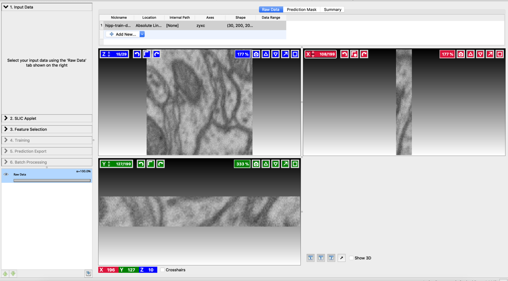
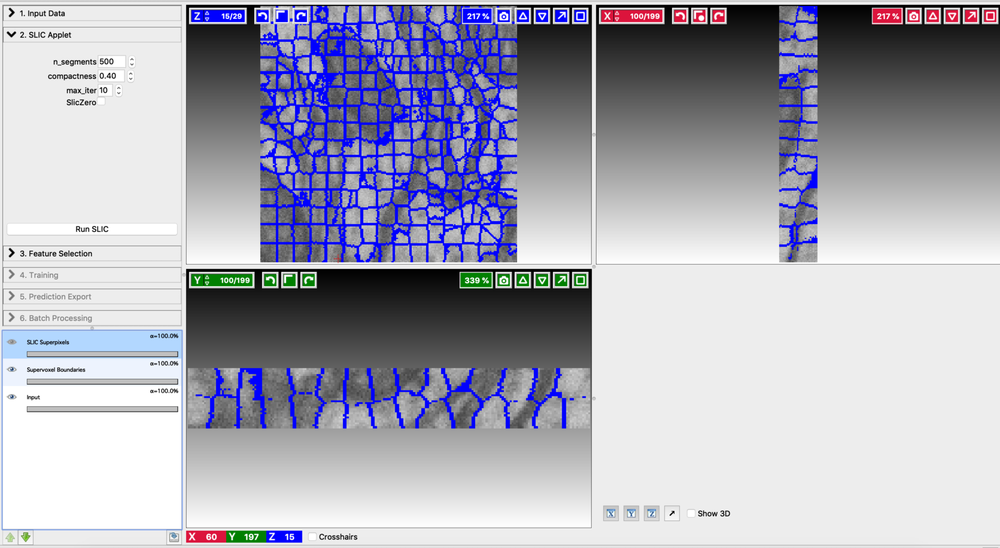
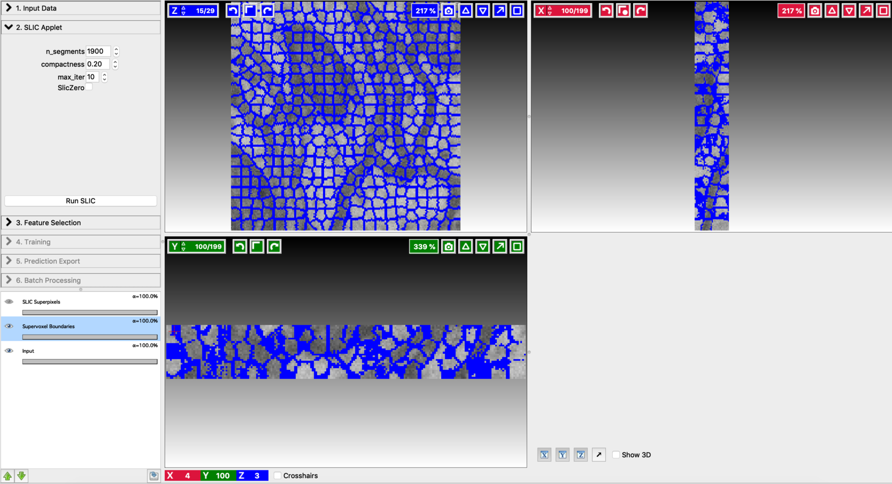
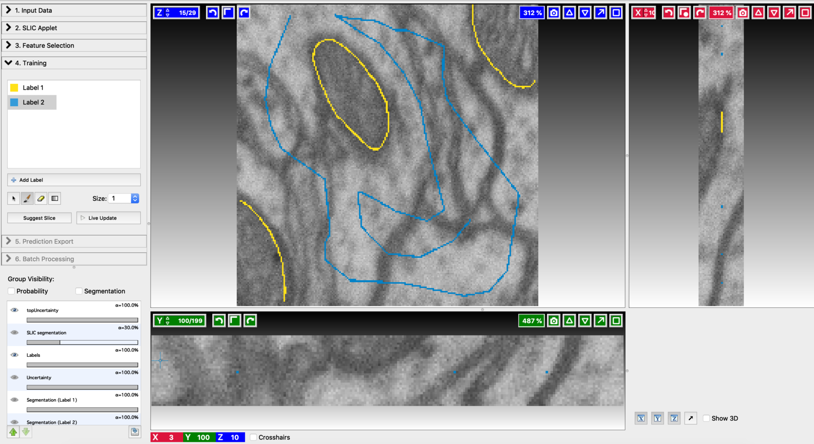
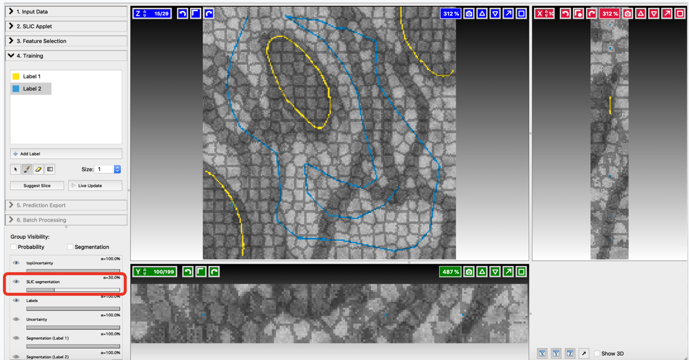
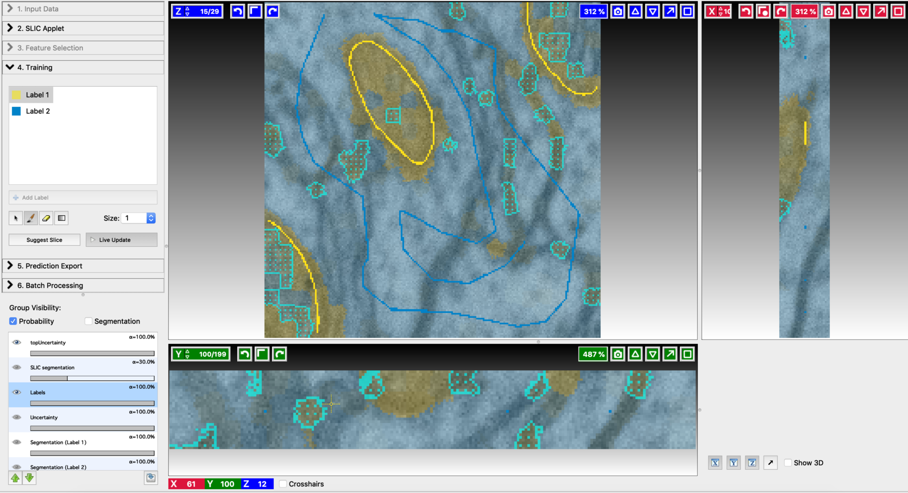
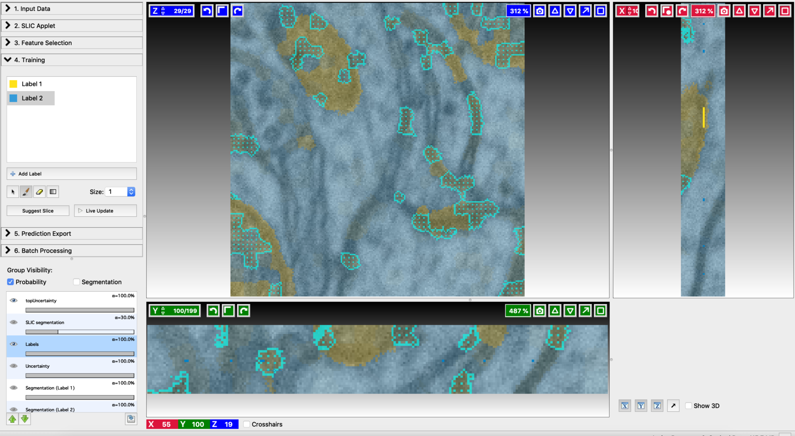
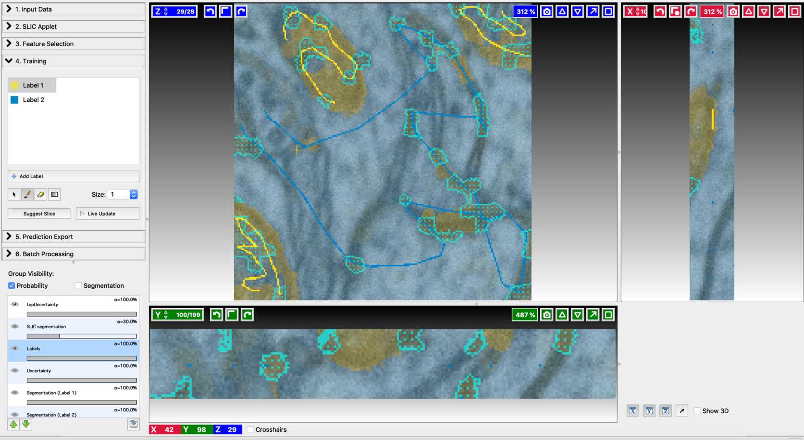
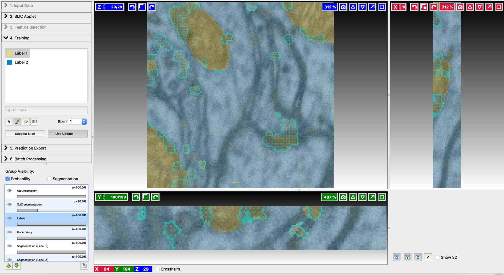
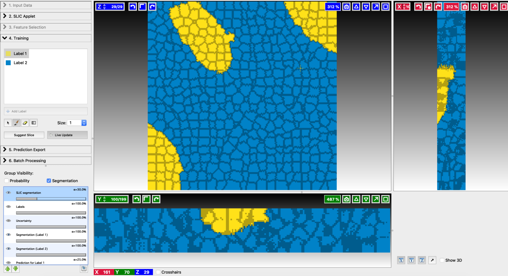

# Voxel Segmentation Workflow

## What it is and why you need it

This workflow allows you to segment structures like cells or synapses in 3D image volumes (or 2D images) with a minimal amount of annotations. 
This workflow introduces an interactive labeling pipeline, where the labels produced by the annotator are immediately and seamlessly used to improve the predictor, which is then used to speed up further annotation. The main algorithm, known as Active Learning, was presented in [this paper](http://openaccess.thecvf.com/content_iccv_2015/papers/Konyushkova_Introducing_Geometry_in_ICCV_2015_paper.pdf) by K. Ksenia.
This workflow can facilitate the reconstruction of complex 3D structures from any type of [image stacks](https://arxiv.org/abs/1606.09029), ranging from electron microscopy, through light microscopy, to MRI and CT scans.

## How it works

The first stage of this workflow computes an over-segmentation of the input volume using supervoxels. The user can then annotate a small number of voxels in randomly chosen slices of the input volume, with labels covering all the desired classes. These annotations are then used to train an initial classifier. The imperfect results of the classification are displayed to the user. The active learning algorithm proposes the slices requiring annotation and guides the user through the labeling process by pinpointing a small number of voxels to be annotated. The selection of the slice and the voxels to be annotated is done in such a manner as to optimise the performance gain of the classifier and minimise the user intervention. The user then labels the indicated voxels. The classifier is updated using the new annotations, and an improved segmentation is presented to the user. This process of annotation and re-segmentation is repeated until the segmentation results become satisfactory.

## How to use it

To demonstrate the usage of this workflow, segmentation of mitochondria is presented as an application. The input is a small portion of the electron microscopy volume of rat neural tissue (data from Pascal Fua’s CV lab, EPFL). Segmentation of the given input volume involves the following steps,

#### Load the data:
Start the Voxel Segmentation Workflow and load the input volume. You may need to reinterpret the axes in the beginning. Ilastik, by default, recognizes volumes as a time series. To change this interpretation, double click on the row in the table that shows the loaded data, and make sure that the axes say "zyx" and not "tyx". The user can move across the volume using the arrow buttons associated with x,y, and z-axes. After loading the data with correct settings, the user interface will look like this:

#### Compute supervoxels:
Use the [SLIC](https://infoscience.epfl.ch/record/149300) (Simple Linear Iterative Clustering) applet to break the input volume into supervoxels. SLIC generates supervoxel based over-segmentation by clustering voxels based on their color similarity and proximity. The user can fine-tune the resulting divisions by varying the hyper-parameters involved. Let’s go through the controls of this applet from top to bottom:

- n_segments: Number of supervoxels that the input volume will be divided into. Higher value results in finer partitioning of the input volume.

- Compactness: Control the compactness of a supervoxel. A higher value emphasizes more spatial proximity resulting in more compact clusters.

- max_iter: Number of iterations used to compute the supervoxel clusters. The algorithm typically converges in 4 to 10 iterations.

Fine-tune the values of n_segments and Compactness to yield a near-perfect over-segmentation of the input volume. Here are the examples to supervoxel-based over-segmentation results with different values of hyper-parameters.

By choosing the options at the left bottom corner, the user can view the input, super-pixel boundaries, and the over-segmentation output. The best way to fine-tune supervoxel generation is to view the super-pixel boundaries by overlaying on the input and then adjust parameters to ensure that the supervoxel boundary is well aligned with respect to the boundaries of the objects that we would like to segment out.

#### Feature selection:
This step is similar to the Pixel Classification Workflow. The details can be found [here](https://www.ilastik.org/documentation/pixelclassification/pixelclassification.html).

#### Interactive labeling and training:

- Annotate a small number of voxels in randomly chosen slices of the input volume, with labels covering all the desired classes. The labeling can be done in a similar way, as explained in [Pixel Classification Workflow](https://www.ilastik.org/documentation/pixelclassification/pixelclassification.html). Since the input is a volume, the labeling can be repeated on a few randomly chosen slices as well. Here is an example of annotation.

- After annotating a few voxels, switch the Live update on (using the Live Update button). This trains an initial classifier and results in a first prediction. The imperfect results of this prediction can be inspected by the options shown at the bottom left panel. Training and label update follows similar steps to the ones mentioned in [Pixel Classification Workflow](https://www.ilastik.org/documentation/pixelclassification/pixelclassification.html). The differences come in the following aspects. After each live update, some regions in the segmentation outputs will be highlighted with topUncertainty. These are the regions that are most uncertain as per the classifier decision, and therefore should be given more emphasis in the next step of labeling. By clicking on “suggest slice,” the user can access the slices with maximum uncertainty. In each of these slices, regions with maximum uncertainty will also be highlighted. Add new labels so as to cover the most uncertain regions. Alongside this, the regions that got misclassified should also be labeled. After modifying the labels turn on the live update again to generate improved segmentation results. The process of annotation and re-segmentation can be repeated until the segmentation results become satisfactory. Examples to first prediction, topUncertainty regions, label update on suggested slices, and the final segmentation results are shown below.
1. First prediction

2. Annotation on the first suggested slice

3. Find the next suggested slice

4. Annotation on the second suggested slice

5. Second prediction

6. Final segmentation

#### Exporting results:
To export the results, follow the standard Ilastik procedure demonstrated [here](https://www.ilastik.org/documentation/basics/export.html).

References:

Konyushkova K, Sznitman R, Fua P., Introducing Geometry in Active Learning for Image Segmentation. international conference in Computer Vision, December 2015.

Konyushkova K, Sznitman R, Fua P., Geometry in Active Learning for Binary and Multi-class Image Segmentation, Computer Vision And Image Understanding (CVIU), 182, 1-16, May 2019.
