<a href="./fig/trackingLogoWhiteBackgroundSmall.png" data-toggle="lightbox">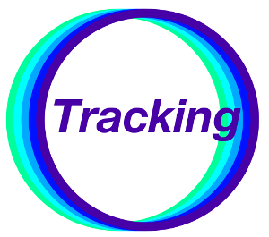</a>

# Setting Up a Pipeline to Track Lab Animals

The `Animal Tracking Workflow` allows you to "track" lab animals (eg: flies, larvae, or mice), also called objects, in 2D+t or 3D+t videos. 
With minimal effort, you only have to provide sparse labels and define a few parameters, and Ilastik will automatically assign IDs to each object on the video. 
These labels and parameters will also be stored in a `.ilp` project file, which can later be re-used to setup a tracking pipeline in order to process multiple videos.  

This tracking workflow can account for appearances or disappearances, over-segmentation and mergers (clusters of objects), and has already been used successfully to track flies, mice, larvae, and zebrafish. 
Some examples of the results can be observed in the following videos:







The following tutorial shows a step-by-step guide to setup a tracking pipeline for your experiments. 
To follow the tutorial, you can download the sample files `flyBowlMovie200.h5` and `flyBowlMovie200_Probabilties.h5` [here]({{site.baseurl}}/download.html) (scroll down to the Example Data and Projects section).
Alternatively, you can also use the files `larvaeBowlMove200.h5` and  `larvaeBowlMove200_Probabilites.h5` to use larvae data instead of flies data. 

This tutorial will cover the following topics:

* Pixel Foreground/Background Segmentation (Using the Pixel Classification Workflow)
* Automatic Tracking (Using the Animal Tracking Workflow)
* Exporting the Results
* Setting Up a Tracking Pipeline (Batch Processing)
* Running Tracking on the Cluster (For Janelia use only)
* Tracking With Head Location (Experimental)

## Pixel Foreground/Background Segmentation (Using the Pixel Classification Workflow)

On the `startup screen` create a new pixel classification project by selecting `Pixel Classification` and choosing a destination and a name for your `.ilp` project file. 
This file will store all the project parameters, including the labels and a trained foreground/background classfiier, and can be used later to setup a segmentation and tracking pipeline. 

<a href="./fig/startupSegmentation.png" data-toggle="lightbox">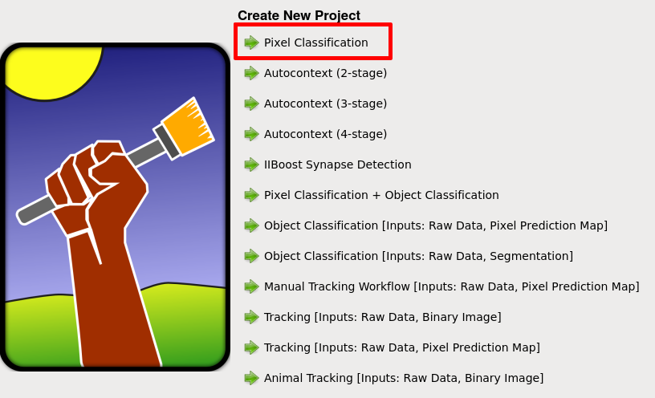</a>

Once you create the `.ilp` pixel classification project, you will see multiple options on a bar located on the left side of the GUI.
On this bar, click on the `Input Data` section.
Then click on the `Add New...` button located on the `Raw Image` section, and load your file.
For this tutorial, the the purpose of this tutorial, we will use the file `flyBowlMovie200.h5`.

<a href="./fig/addNewSegmentation.png" data-toggle="lightbox">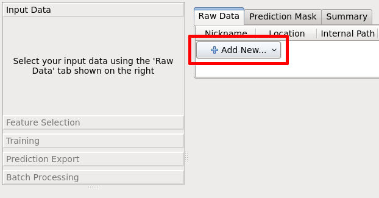</a>

**Note:** *You can load videos in multiple formats that include `.ufmf`, `.mmf`, and `.h5`. You will also be able to load avi and mpg videos in the next release.*

After you select your file, your GUI should display the video (shown in the screenshot below). 
You can use the time slider, highlighted in red, to navigate the frames of your video. 
You can also use `Shift` + `Mouse-Wheel` to scroll through frames, and `Ctrl` + `Mouse-Wheel` to zoom in/out. 

<a href="./fig/loadVideoSegmentation.png" data-toggle="lightbox">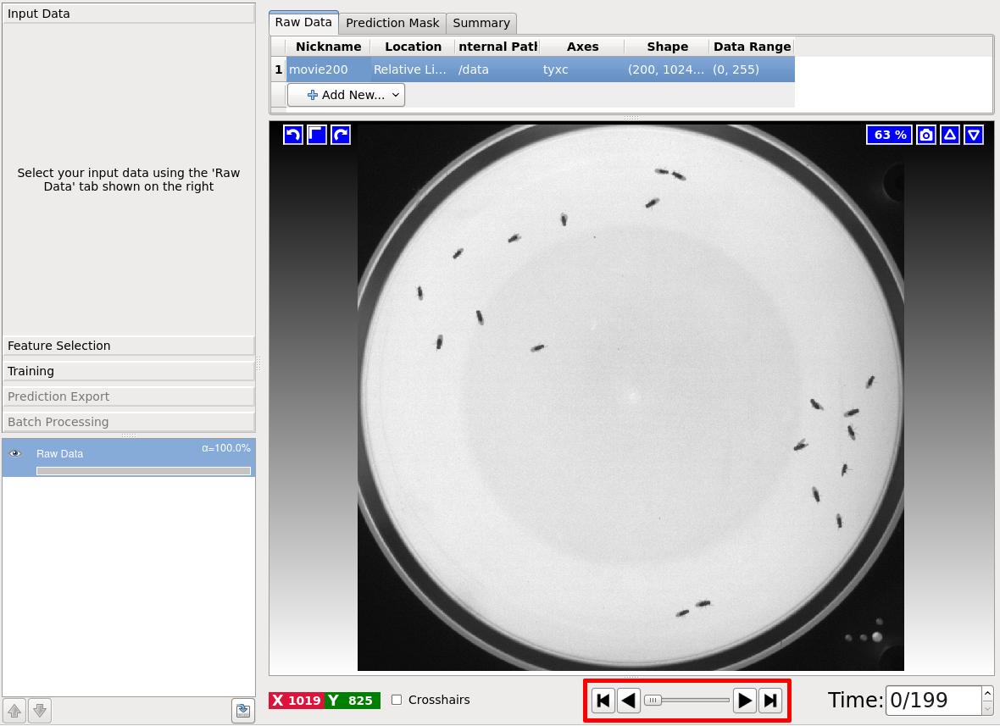</a>

Now that you loaded your data, got to the `Feature Selection` section (on the left bar), and click on `Select Features...` to display the feature selection dialog. 
This dialog lists color, edge and, texture features that can be used to train the foreground/background classifier.
For now select all of the features (as shown on the screesnhot below) to get the best quality possible, but keep in mind that the more features you select, the longer it will take to run.

<a href="./fig/featuresSegmentation.png" data-toggle="lightbox">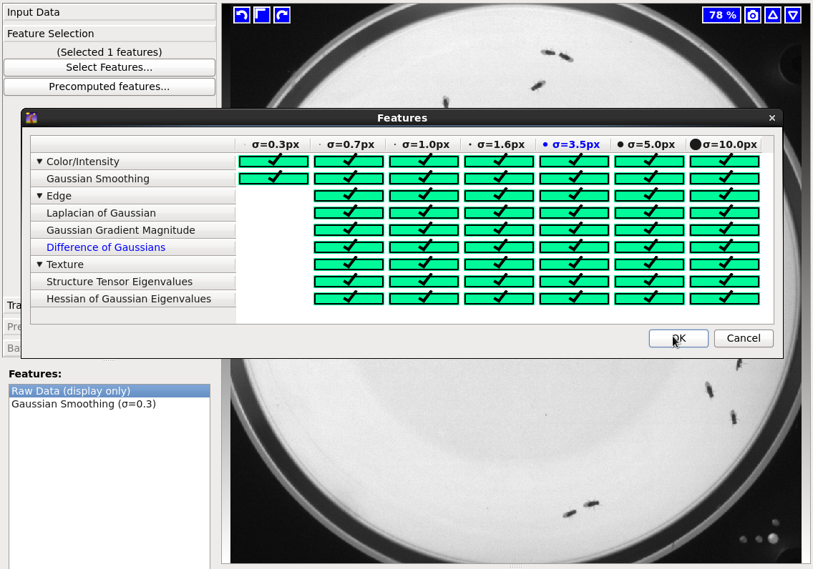</a>

**Note:** *Selecting the right features depends on the data that you're processing. You can get information on the feature importance using the `variable Importance Table` on the menu `Advanced>Variable Importance Table` or by using the `Suggest Features` button in the `Training` applet.*

Now go to the `Training` section on the left bar, and then click on `Add Label` 2 times, in order to add 2 labels for the foreground and the background. 
After you add both labels, click on the `Brush` button , and paint a few foreground and background labels (usually red or Label 1 for foreground and green or Label 2 for background).
You can click on the `Live Update` button to get live feedback on your results as you draw labels. 
It's also recommended to draw a few labels on multiple frames, and maybe even multiple videos to make the classifier more robust for videos with varying lighting conditions for example. 

Now that you trained the foreground/background classifier, click on `Prediction Export`, and then click on the `Export All` button to export the foreground/background segmentation probabilities (per pixel). 
A file named `flyBowlMovie200_Probabilities.h5` will be exported to the same location of your video. This file contains a 2D+t or 3D+t volume with the foreground/background probabilities.
This file will be used in the tracking workflow, as described on the next section. 

**Note:** *You can change the export settings by clicking on the button `Choose Export Image Settings...`. Yo could export only the foreground channel, for example, in order to reduce the size of the probabilities file.*

Finally, make sure to save your project on `Project>Save project` in the top menu, since you will be using this project later to process other videos.

More detailed information on the pixel classification workflow can be found [here]({{site.baseurl}}/documentation/pixelclassification/pixelclassification.html).

## Automatic Tracking (Using the Animal Tracking Workflow)

To use the Animal Tracking Workflow, you will need 2 files: the original video `flyBowlMovie200.h5`, and the segmentation probabilities `flyBowlMovie200_Probabilties.h5` that you exported with the pixel classification workflow. 

Open Ilastik again, and click on `Animal Tracking [Inputs: Raw Data, Pixel Prediction Map]` to create a new `.ilp` project.

<a href="./fig/startupTracking.png" data-toggle="lightbox">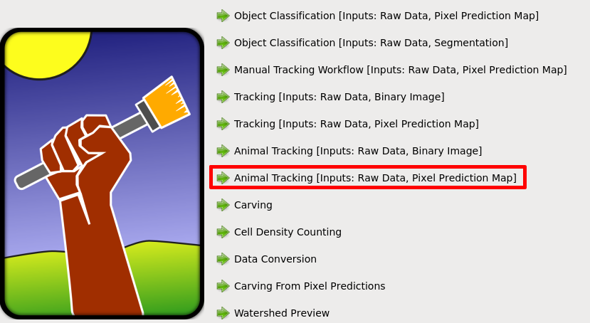</a>
 
The first step is to click on `Input Data` on the left bar, and then click on `Add New` in the `Raw Data` tab to load the raw video `flyBowlMovie200.h5`.
After you load the raw video, you will also load the foreground/background probabilities by clicking on the `Add` button (NOT on `Add New...` again) on the `Prediction Maps` tab.
If everything is working correctly, the `Raw Data` tab should display the video while the `Prediction Maps` should display colors for the foreground background probabilities.

<a href="./fig/inputTracking.png" data-toggle="lightbox">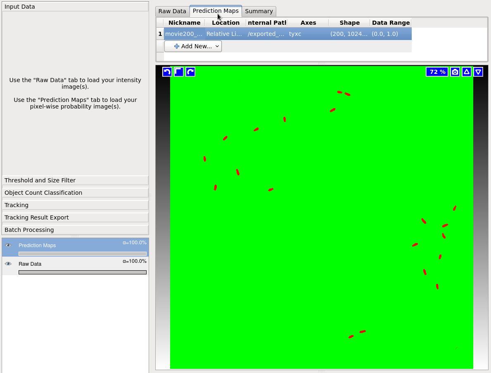</a>
 
After you loaded the raw data and the segmentation probabilities, click on `Threshold and Size Filter` on the left bar. 
This section will apply a threshold to the foreground probabilities in order to generate `objects` based on connected components.
For now you can leave all the parameters on default, and just click on `Apply`. 
For this project you could also set the threshold to 0.50 and the min size filter to 0px.

Now click on `Object Count Classification` on the right bar. 
In this section you will label clusters of objects (eg: clusters of flies or larvae).
First click on the button `Add Label` to add as many labels as you need for different number of objects. 
The first label (in red) is always going to be used for `False Detections` (0 objects) followed by `1 Object`, `2 Objects` etc.
Then click on the `Brush` button , and label the clusters on the video. 
Unlike the pixel classification workflow, you will not draw labels will the brush, you will be clicking on the object clusters instead (remember that these are connected components). 

Try to find and label a few of these objects on your video. You can also check the `Live Update` option to get live feedback of the object predictions. Here's a few examples of labelled objects:

{:.table.table-striped}
| Object Label    | Screenshot                                                                                                    |
|-----------------|---------------------------------------------------------------------------------------------------------------|
| False Detection | <a href="./fig/0merger.png" data-toggle="lightbox">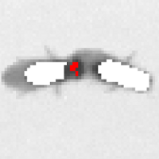</a> |
| 1 Object        | <a href="./fig/1merger.png" data-toggle="lightbox">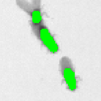</a> |
| 2 Objects       | <a href="./fig/2merger.png" data-toggle="lightbox">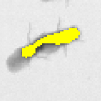</a> |
| 3 Objects       | <a href="./fig/3merger.png" data-toggle="lightbox">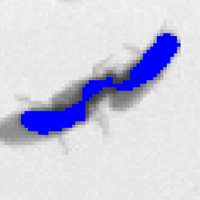</a> |
  
Sometimes it's difficult to find clusters of 2 or more objects, since these can be very sparse. 
For these cases, click on the `Label Assist` button, and then click on the `Compute Object Info` button which will display a table where you can sort frames by maximum and minimum object area.
Finding the frames that contain the largest objects will help you to find these clusters. The table also displays the frames that contain labels. Keep in mind that computing the object info might take some time.

After you trained the object count classifier, click on the `Tracking` section on the left bar. 
This is the main section of the tracking workflow, where the object IDs will be assigned. 
Here's a list of relevant parameters with a brief explanation:    

{:.table.table-striped}
| Parameter             | Description                                                                                                                                                                                                             |
|-----------------------|-------------------------------------------------------------------------------------------------------------------------------------------------------------------------------------------------------------------------|
| Max Distance          | Maximum distance to consider when finding nearest neighbors (for frame-to-frame transitions).                                                                                                                           |
| Max Object per Merger | Maximum number of objects allowed on a cluster (this value is set automatically, don't change it if you don't have to)                                                                                                  |
| Transition Weight     | Weight based on the distance between objects (for frame-to-frame transitions).                                                                                                                                          |
| Appearance Cost       | Costs to allow object IDs to appear (to start a new track). High values (>5000) forbid objects appearances, and could be helpful with a high-quality segmentation and the same number of objects in all frames.         |
| Disappearance Cost    | Cost to allow object Ids to dissapear (to terminate an existing track). High values (>5000) will forbid object disappearances.                                                                                          |
| Transition Neighbours | Number of neighbors to be considered as potential transition candiadates. Less neighbors speed up running-time, but the results might be of a lesser quality.                                                           |
| Frames per Split      | When the videos have too many frames (eg. > 10000), it is heplful to split the video in parts in order to improve the running-time. The recommended value would be ~1000 frames. Use 0 if you don't want to use splits. |
| With Tracklets        | Compress stable tracks to improve the running-time (objects with only one transition possiblity)                                                                                                                        |
| Filters               | Range filters for time, X, Y, and Z axes, and for size. Objects outside of these ranges will be ignored.                                                                                                                |

<a href="./fig/trackingTracking.png" data-toggle="lightbox">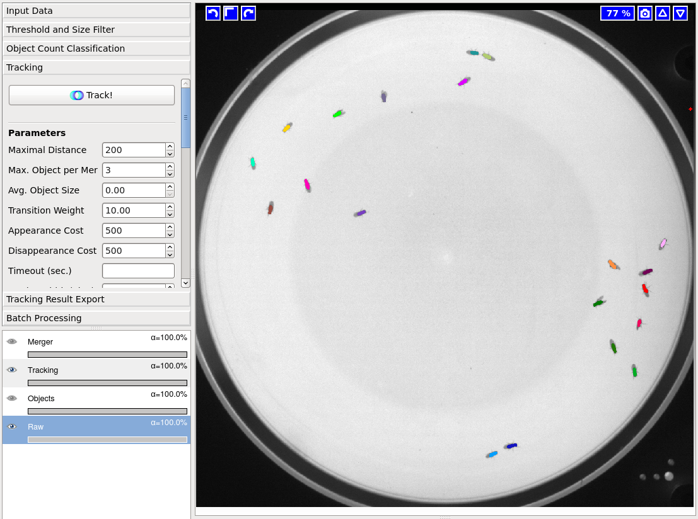</a>

**If you're processing a video with many frames, it is suggested to set the `Time` filter to only a few frames (eg: from 0 to 100) while you're experimenting with different parameters.**   
 
You could start with the default parameter values, or experiment with different values for difficult cases with multiple appearances, disappearances, and mergers.
Here is a table with the values that are recommended for this example (most are left with their default values):

{:.table.table-striped}
| Parameter             | Value               |
|-----------------------|---------------------|
| Max Distance          | 200 (default)       |
| Max Object per Merger | 3 (automatic)       |
| Transition Weight     | 10.0 (default)      |
| Appearance Cost       | 500 (default)       |
| Disappearance Cost    | 500 (default)       |
| Transition Neighbours | 1 (default)         |
| Frames per Split      | 0 (default)         |
| With Tracklets        | False               |
| Filters>Time          | 0 to 100            |
| Filters>X             | 0 to 1023 (default) |
| Filters>Y             | 0 to 1023 (default) |
| Filters>Z             | 0 to 0 (default)    |
| Filters>Size          | 15 to 10000         |
  
The video will be running optimization based on the transition, appearance, and disappearance costs across frames in order to assign the correct IDs for each object. 

Once you set the parameters click on the `Track!` button <a href="./fig/trackButtonTracking.png" data-toggle="lightbox">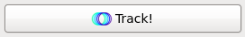</a>. It's very important to save your project after you run tracking, since the parameters will not be saved otherwise.

## Exporting the Results

From the `Tracking Result Export` section, you can export the tracking results in different formats. The most useful data products can be accessed by choosing the `Plugin` option on the drop-down `source` menu.
Here is a list of the main formats:

* `CSV-Table:` A table with a row for each object on the video, and the corresponding properties that include the time (frame number), track ID, center, area, major/minor axes, bounding box, etc. 
* `Contours:` Object contours (.outline files used by Zlatic's lab).
* `Multi-Worm-Tracker:` Exports `.blobs` and `.summary` files in the MWT format.

<a href="./fig/exportTracking.png" data-toggle="lightbox">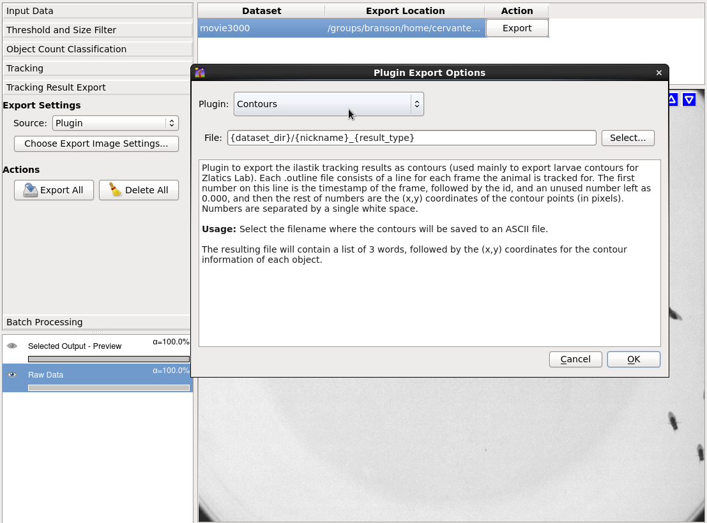</a>

## Setting Up a Tracking Pipeline (Batch Processing)

There are 2 ways to process multiple videos on the tracking workflow: processing multiple videos on the command line with ilastik's `headless` mode, or using the `Batch Processing` section on the left bar of the GUI.
To process files on the terminal, you need two commands (one for segmentation and one for tracking):

~~~
./run_ilastik.sh --headless --project=<your-pixel-classification-project>.ilp --raw_data=<your-movie-file> --output_format="compressed hdf5"

./run_ilastik.sh --headless --project=<your-tracking-file>.ilp --raw_data=<your-movie-file> --prediction_maps=<your-movie-file>_Probabilities.h5 --export_source="Plugin" --export_plugin="CSV-Table"
~~~

The first line is the intermediate segmentation step to generate the `<your-movie>_Probabilities.h5` volume with the foreground/background probabilities.
The second line will use the raw video and the foreground/background probabilities to run tracking.

**Note:** *The `export_plugin` argument should be the format of the file that you want to export (eg:`CSV-Table`, `Contours`, or 'Multi-Worm-Tracker').*
  
For long videos, it is recommended to use the `Animal Tracking [Inputs: Raw Data, Binary Image]` workflow. This workflow works in exactly the same way, but you will be using a foreground/background Simple binary segmnetation instead of using probabilities.
This will allow you to skip the thresholding step, and will run faster. 
Here are the 2 commands that you need to use the simple segmentation.  

~~~
./run_ilastik.sh --headless --project=<your-pixel-classification-project>.ilp --raw_data=<your-movie-file> --output_format="compressed hdf5"

./run_ilastik.sh --headless --project=<your-tracking-file>.ilp --raw_data=<your-movie-file> --segmentation_image=<your-movie-file>_Simple Segmentation.h5" --export_source="Plugin" --export_plugin="CSV-Table"
~~~

**Note:** *The argument `--output_format="compressed hdf5"` will compress the segmentation volume (for Probabilties or Simple Segmentation) in order to reduce the size of the file, but this option will also make processing slower, since the pipeline would have to compress and decompress these volumes.*  

**Note:** *For large videos, the segmentation file could use a lot of memory in your hardrive. Since this is just an intermediate step required for tracking, you could remove the segmentation file after tracking is done (using `>>>rm <your-movie>_Probabilites.h5` or `>>>rm <your-movie>_Simple Segmentation.h5`).*

## Running Tracking on the Cluster (For Janelia use only)

To run tracking on the cluster, create a executable bash script `.sh` file with the following commands:

~~~
>>>touch <your-bash-script>.sh
>>>chmod u+x <your-bash-script>.sh
~~~

Add The segmentation and tracking commands described in the previous section, with the number of threads specified in the parameter `LAZYFLOW_THREADS` to your file `<your-bash-script>.sh`. Here's an example:

~~~
./run_ilastik.sh --headless --project=<your-pixel-classification-project>.ilp --raw_data=<your-movie-file> --output_format="compressed hdf5"
./run_ilastik.sh --headless --project=<your-tracking-file>.ilp --raw_data=<your-movie-file> --segmentation_image=<your-movie-file>_Simple Segmentation.h5" --export_source="Plugin" --export_plugin="CSV-Table"
rm <your-movie-file>_Simple Segmentation.h5"
~~~

Finally, use the following command to run tracking on the cluster with 32 threads:  

~~~
>>>qsub -pe batch 32 -b y -cwd ./<your-bash-script>.sh
~~~

You can use the same command to run tracking on multiple videos.

## Tracking With Head Location (Experimental)

When tracking lab animals, it is often necessary to export the location of the head, in order to determine the body direction and improve behavior classification. 
Ilastik has an experimental feature that allows you to export object contours with the correspoding head index (index in the contour array).  

To use this feature you have to follow almost all the steps described in the previous sections, but now you will add an extra probability for the head, and do some changes to the threshold.  

In the pixel classification project, you need to add an extra label for the head, and assign labels in the following order: Label 1 (red) for background, Label 2 (green) for body, and Label 3 (yellow) for the head. 
Proceed to label the background, body, and head on your video.

<a href="./fig/trainingSegmentationWithHead.png" data-toggle="lightbox">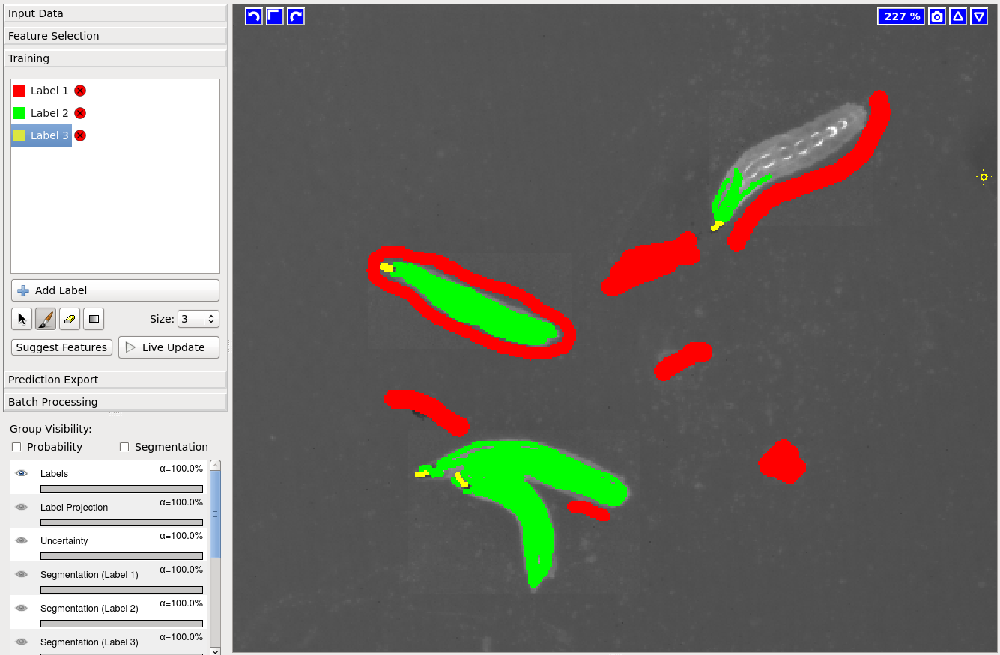</a>

In the animal tracking workflow, you will use the method `Hysterisis` and choose 1 for Core and 2 for Final. 
This change will allow ilastik to merge the body and the head probabilities as foreground.

<a href="./fig/thresholdTrackingWithHead.png" data-toggle="lightbox">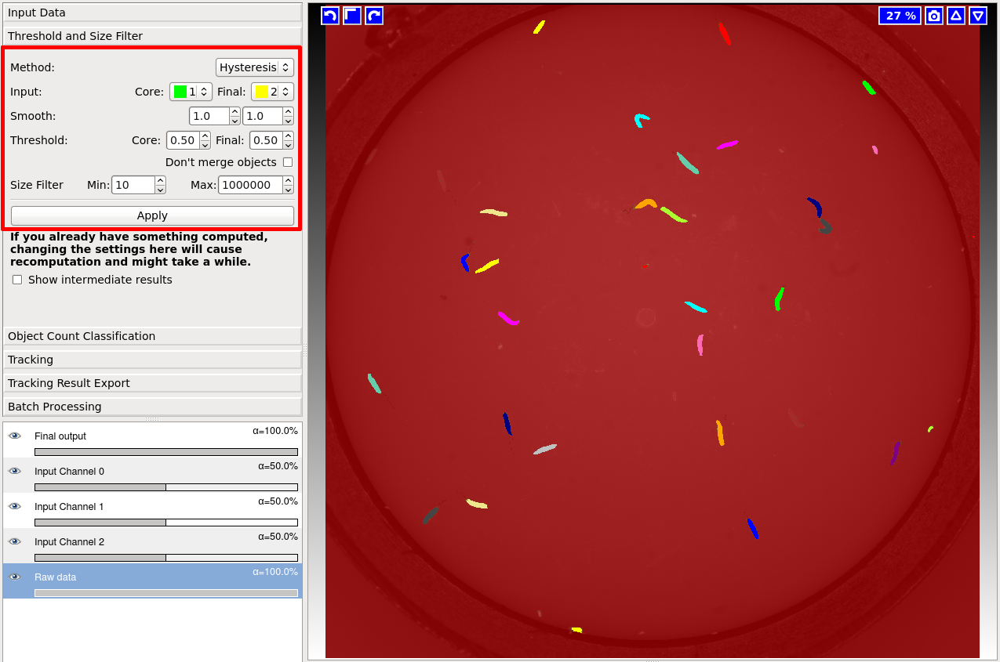</a>

VERY IMPORTANT: When you run tracking on the terminal, you need to use the `_Probabilities` file as input for BOTH the `raw_data` and the `prediction_maps`, and you also need to specify the plugin `--export_plugin="Contours-With-Head"` instead of exporting the csv table:

~~~
./run_ilastik.sh --headless --project=<your-pixel-classification-project>.ilp --raw_data=<your-movie-file> --output_format="compressed hdf5"
./run_ilastik.sh --headless --project=<your-tracking-file>.ilp --raw_data=<your-movie-file>_Probabilities.h5 --prediction_maps=<your-movie-file>_Probabilities.h5 --export_source="Plugin" --export_plugin="Contours-With-Head"
~~~

**If you have any questions about this workflow contact Jaime I. Cervantes on [GitHub](https://github.com/JaimeIvanCervantes) or [Twitter](https://twitter.com/jaimeicervantes).** 

