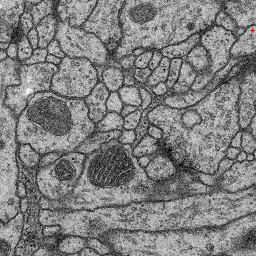
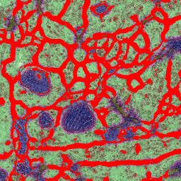
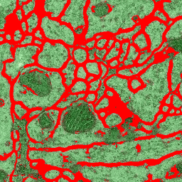

# Autocontext -- cascaded pixel classification

## What it is and why you need it
This workflow improves the [Pixel Classification workflow]({{site.baseurl}}/documentation/pixelclassification/pixelclassification.html) by running it in multiple stages and showing each pixel the results of the previous stage. If you are not yet familiar with pixel classification, we recommend reading about that workflow first.

The core algorithm of autocontext has been introduced by [Tu and Bai](https://www.ncbi.nlm.nih.gov/pubmed/20724753). Briefly, the first stage of autocontext is simply pixel classification. The output of this stage is added as new channels to the raw data and then used as input to the second stage. If more than two stages are used the procedure is repeated. We have additionally modified the algorithm to not only use the results of the previous stage at prediction, but to also compute features on these results. 

We find this workflow to be particularly efficient in cases where the image data shows multiple distinct classes. In the following we will illustrate this use case by the problem of membrane classification in electron microscopy images of neural tissue. The images below show an example of two-stage autocontext. The data has been taken from the ISBI2012 segmentation challenge, but only a few interactively added annotations have been used. First we define many classes: membrane (red), cytoplasm (green), synapse (yellow), mitochondrion (blue), mitochondrial membrane (magenta), vesicles (dark yellow). The output of this stage is shown in the second image. For the second stage we only define two classes: membranes and the rest. The output of the second stage is shown in the third image. While the classifier could certainly benefit from more labeling than we provided in this toy example, note that membrane predictions become visibly cleaner in the second stage. 

 

## How to use it
As simple as pixel classification: define features, label, predict. If your data has multiple classes, we recommend to label them separately in the first stage and then in the second stage to concentrate on the class of interest vs. background. The workflow, however, is not limited to such data and is also very well suited for forebackground/background segmentation.

## Limitations
This workflow is particularly RAM-hungry. Even though the processing is still lazy like in pixel classification, live update in the second stage can become quite slow, if many features are selected and the data is 3D. 

