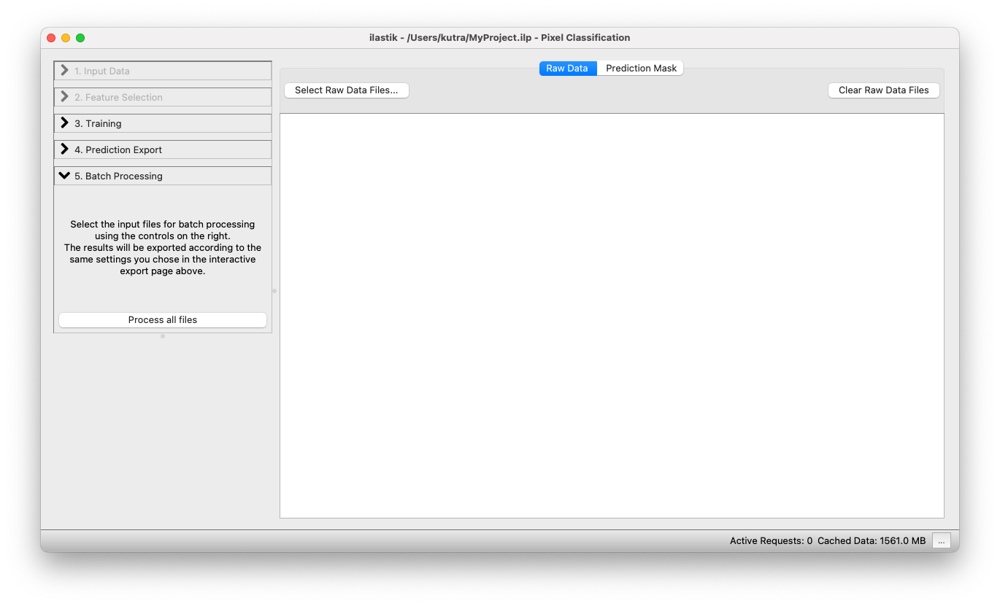
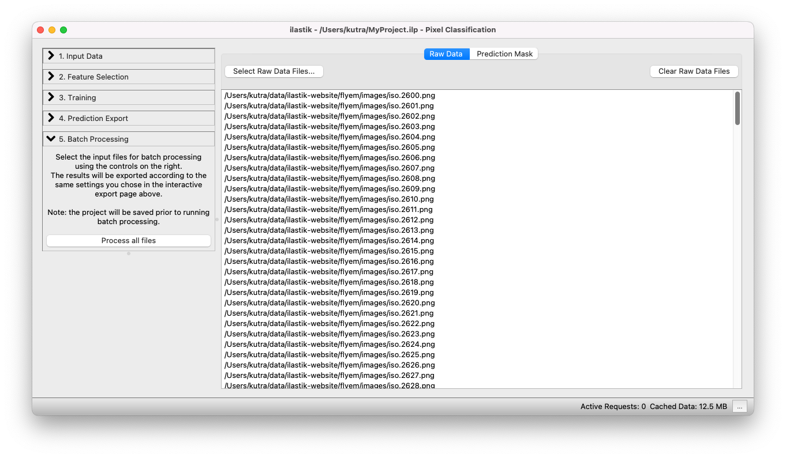

# Batch Processing

In the machine learning based ilastik workflows such as the [Pixel Classification Workflow][pixelclass], the user interactively trains a classifier on a representative set of images.
After that training step, the generated classifier can be applied to more data by using batch processing.

## Example Usage (Pixel Classification)

The following tutorial demonstrates the batch prediction for the [pixel classification workflow][pixelclass].
The procedure is the same in the other workflows (with the exception of Carving, where there is no batch processing available).

### Configuring Output File Names

Before getting to the batch processing part, you first have to set up the file export settings.
Batch processing uses the same settings as in the [Prediction Export][export] step.
Here, it is crucial to use the _"magic" placeholders_, denoted by curly braces (e.g. `{nickname}`): this ensures a unique export filename for each file.
Also make sure to configure the export source, file format, and other properties.

### Selecting files

You can add files either by drag-and-drop from your file browser, or use the **Select Raw Data Files...** button.

When clicking on the **Select Raw Data Files...** button, you can choose between adding single or multiple files from the File selection dialog.

### Running batch processing

The next step is the actual batch processing itself.

After clicking on the **Process all files** button, ilastik begins batch processing all images, and writes the resulting classification result to the specified output files.
With default export settings, the output files are stored as hdf5 files in the same directory where the input file is located.
Their file names will be the same as the original files, plus one or two words indicating the export source (e.g. "Probabilities") and the file extension `.h5`.

The exported `.h5` files, contain the resulting prediction as a multidimensional dataset inside the file.
Further details on this versatile file format (that is easily accessible from Matlab and Python) can be found [here](http://docs.h5py.org/).

### Batch Processing FAQ

#### I have multiple image stacks I want to process, is it possible to load those in batch?
Image stacks are currently not supported in batch: Whenever your image is spread across multiple files, use the [headless mode][headless], or the [Fiji plugin][fijiplugin] to process those.
Alternatively you could also convert your stack to a single file and use the batch processing graphical user interface in ilastik.

#### How do I specify the internal dataset in a `.hdf5`/`.z5`-file?
It is currently not possible to specify the internal dataset with the graphical user interface, use the [headless mode][headless], or [Fiji plugin](https://github.com/ilastik/ilastik4ij#ilastik-imagej-modules) to process that data.
Alternatively you could create `hdf5` files with only single virtual dataset each, that point to the file that has multiple ones.

#### Batch processing is slow, how to make it faster?
In batch processing, ilastik processes only one file at a time.
If you have the resources in your machine (number of cores >> 8), you could run multiple instances of ilastik in [headless mode][headless] which work on parts of the full set of images.

[pixelclass]: {{site.baseurl}}/documentation/objects/objects.html
[export]: {{site.baseurl}}/documentation/basics/export#settings
[headless]: {{site.baseurl}}/documentation/basics/headless
[fijiplugin]: https://github.com/ilastik/ilastik4ij#ilastik-imagej-modules
