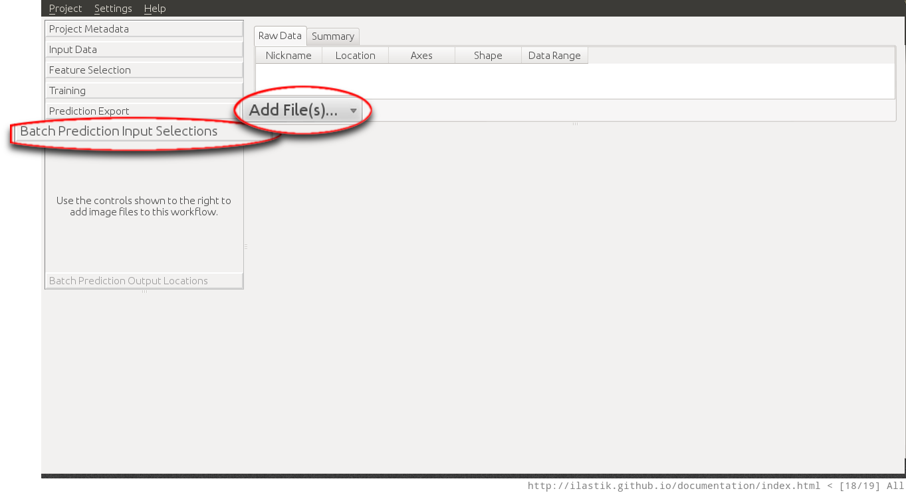

# Batch Processing

In the machine learning based ilastik workflows such as the
[pixel classification workflow]({{site.baseurl}}/documentation/objects/objects.html) and the [density counting workflow]({{site.baseurl}}/documentation/counting/counting.html), the user interactively trains a classifier on a representative set of images. After that training step, the generated classifier can be used for batch processing.

<!-- The following documentation applies to the [Density Counting workflow]({{site.baseurl}}/documentation/counting/counting.html) and to the [Pixel Classification workflow]({{site.baseurl}}/documentation/objects/objects.html). -->

## Example Usage (Pixel Classification)

The following tutorial demonstrates the batch prediction for the [pixel classification workflow]({{site.baseurl}}/documentation/objects/objects.html) the same procedure applies also to the [density counting workflow]({{site.baseurl}}/documentation/counting/counting.html).

The first step in batch prediction is the selection of the input files. This uses the same mechanism as [data selection]({{baseurl}}/documentation/basics/dataselection.html).

When clicking on the **Add files** button, the user can choose between adding
single or multiple files from the File selection dialog, or adding files matching a pattern from a directory (last option). This is especially useful when large amounts of images have to be processed.

The next step is the actual batch processing itself. In the **Batch Prediction Output Locations** applet, the user can configure the output format using the **Choose Settings** button. This allow for example to save the results of the workflow as `.png` images rather than `.tiff` or `.h5` files. For novice users the default settings should be fine, however the results of some workflows such as the [density counting workflow]({{site.baseurl}}/documentation/counting/counting.html) cannot be exported in some of these formats (**hdf5 file format is supported by all workflows**).

After clicking on the **Export All** button, ilastik begins batch processing all images, and writes the resulting classification result to the specified output files. When the default settings are used, the output files are stored as hdf5 files in the same directory where the input file is located.
The exported files have the same name with a `export.h5` suffix.

The exported `.h5` files, contain the resulting prediction as a multidimensional dataset inside the file. Further details on this versatile file format (that is easily accessible from Matlab and Python) can be found [here](http://docs.h5py.org/).
