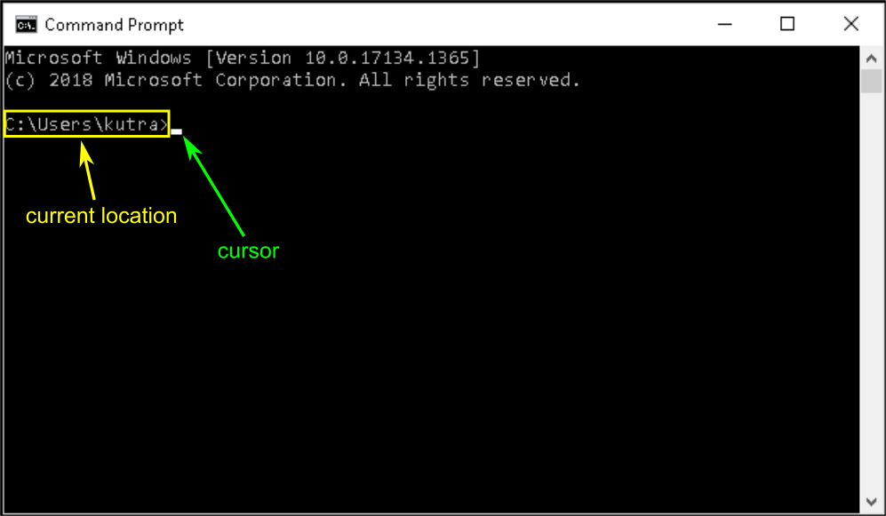
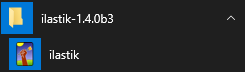
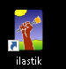
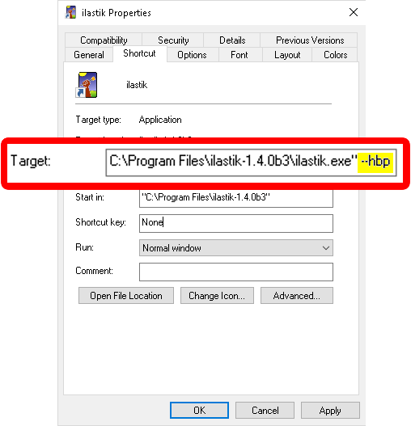

# Command-line flags on windows

The behavior of ilastik can be influenced by supplying options upon start-up.
You have to supply these options as command-line arguments when ilastik is started.

We'll go through two methods of starting ilastik with additional options:

1) Starting ilastik form the _Command Prompt_: Especially useful for running ilastik in [headless mode]({{site.baseurl}}/documentation/headless.html).
2) Creating a link on the desktop with command line options: This is a more permanent way for options you always want to supply.

## Start ilastik via the terminal/command-line

The command line is just another interface to interact with your computer (as, e.g. opposed to using the mouse).
It is a special window, where you type in commands that are executed when you press "Enter".
Using the command line interface is especially useful for running ilastik in [headless mode]({{site.baseurl}}/documentation/headless.html), where you often supply changing options, depending on what project/data you wish to process.

1) __Start the command prompt (`cmd.exe`)__: type `cmd` into the search field, click on "Command Prompt" to start a terminal window. (A new window should pop up):

<a href="screenshots/cmdflags_win-01.png" alt="Screenshot of command line window with annotations indicating location and cursor" data-toggle="lightbox"></a>

Note that there is a blinking indicator (the cursor) where text commands will appear whe you type.
To the left of the cursor, the current location is shown (here: `C:\Users\kutra`).
Per default the command prompt starts in your user home folder.

2) __Navigate to your ilastik installation__: in this terminal window you have to navigate to the ilastik installation folder to start ilastik.
If you didn't change ilastik install location this should be "C:\Program Files\ilastik-1.X.Y" (where `X.Y` are placeholders that you should replace with your installed version - we'll stick with `1.3.3post2` for this example).
So in the command prompt, type (including the quote marks) and press enter:
 ```cmd
cd "C:\Program Files\ilastik-1.3.3post2"
```
you should now see `C:\Program Files\ilastik-1.3.3post2>` left of the cursor.

3) __start ilastik__: here you can start ilastik and supply the `--headless` flag by typing
```cmd
ilastik.exe --headless
```
You will get a message back that you have to supply at least the `--project` argument as an additional option.
Read more in the [headles mode documentation]({{site.baseurl}}/documentation/headless.html)!


## Create a shortcut with the command line flag

The second method is for a more permanent setup.
You will create a shortcut to ilastik on your desktop that will always supply the `--hbp` flag, that you can then simply double-click.
This currently (ilastik `1.4.0b3`) enables the [Voxel Segmentation Workflow]({{site.baseurl}}/documentation/VoxelSegmentation/VoxelSegmentation.html), which is hidden, otherwise.

1) __locate ilastik in your start menu__:



2) __create a link on the desktop__: click on it with the left mouse button and hold the button while dragging it to the desktop.
You have created a link (visible by the little curved arrow in the lower-left corner):



* __Add the command line option__: edit the properties (right click - Properties) of the link to include the command line flag (highlighted in yellow in the following screenshot):

<a href="screenshots/cmdflags_win-04.png" alt="Screenshot of properties dialog for ilastik link" data-toggle="lightbox"></a>