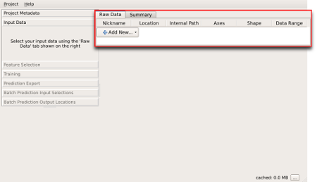
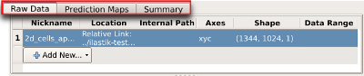
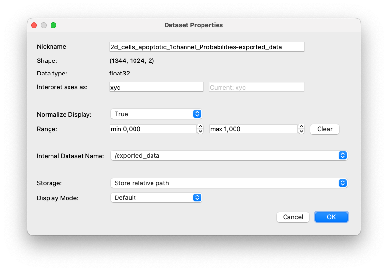

# Data Selection Applet

The first step in any ilastik workflow is to load the data into the
project. ilastik supports importing data in [various formats](#formats), from
a single file or a stack of files which form a new dimension.

After creating a new project, you will be presented with the main ilastik
window. The left panel of this window is populated with steps of the
workflow and the overlay selection box. The right panel contains different
data views based on the active workflow step selected on the left.

Data can be added to a project in the "Input Data" step visible on the left
panel. When this step is active, the data selection box on the right panel
can be used to import new data files or [modify properties](#properties) of
selected files.

New data can be imported in a project with the "Add New..." button.
Clicking this will present two options,
 * Add separate image(s)...
 * Add a single 3D/4D Volume from Stack...

These can be used to [load a 2D/3D/4D image from a single file](#single_file) or [load
a single 2D/3D/4D image from a stack of 2D images](#image_stack) respectively.

Some workflows require matching datasets that correspond to an input. For
example, the
[object classification from prediction maps workflow]({{baseurl}}/documentation/objects/objects.html) needs a separate
file to specify the background pixels in the input data. In this case, tabs
visible at the top of the data selection box can be used to import
additional data corresponding to an input.

## Loading data from a single file {#single_file}

You can use the "Add separate image(s)..." option to add new data
files to a project. This will present a standard file open dialog, where
the desired input file can be selected. This dialog also allows selecting
multiple files. Note that multiple files will be added as if the dialog was
used once for each of these. See the following section for instructions on
how to interpret multiple files as a new dimension in the data.

## Loading image stacks {#image_stack}

If one dimension of the data is separated into different files, such as a
stack of 2D images to form a 3D image or a sequence of 2D images for each
frame in a movie, this option can be used to form a new dimension based on
a list of files.

Selecting this option will open a new dialog to select the files that will
be included in the stack. The selection can be specified in three ways:
 * selecting multiple files using the standard system file open dialog,
 * selecting all files in a directory
 * using a filename pattern (with [Unix style patterns](http://docs.python.org/2/library/glob.html))

Once a selection has been made, the `File List` box can be used to review
the names of the files that will be imported as an image stack.

## Supported File Formats {#formats}

The main file format used by ilastik is [HDF5](http://www.hdfgroup.org/HDF5/whatishdf5.html). Files with extensions `h5`, `hdf5`, `ilp` (ilastik project files) will be recognized as HDF5.

Widely used image formats such as
 * Microsoft Windows bitmap image file (`bmp`),
 * OpenEXR high dynamic range image format (`exr`) (requires `libopenexr` support in VIGRA) ,
 * CompuServe graphics interchange format; 8-bit color (`gif`),
 * Joint Photographic Experts Group JFIF format; compressed 24-bit color (`jpeg` or `jpg`) (requires `libjpeg` support in VIGRA)
 * Tagged Image File Format (`tif` or `tiff`) (requires `libtiff` support in VIGRA)
 * SUN Rasterfile (`ras`)
 * Portable Network Graphic (`png`) (requires `libpng` support in VIGRA)
 * Portable bitmap format (black and white) (`pbm`)
 * Portable graymap format (gray scale) (`pgm`)
 * Portable pixmap format (color) (`ppm`)
 * Portable anymap (`pnm`)
 * Radiance RGBE high dynamic range image format (`hdr`)
 * Khoros Visualization image file (`xv`)

can be imported directly into a project, as well as NumPy binary array
files with extension `npy`.

## Dataset Properties Editor {#properties}

You can review and/or change the way ilastik interprets your dataset using the Dataset Properties Editor.
For example, to specify that a stack of images should be interpreted as having a t-axis (for time) instead of a z-axis, use this editor.
To open the editor, double-click an item in the dataset list or right-click the item and select "Edit Properties".
Read on for a description of each field in this window.

- **Nickname:** short name used to identify the data
- **Shape:** specifies the sizes of each dimension
- **Data type:** data type used to interpret the binary data in the file. This is selected automatically based on the file type.
- **Axes:** Axes tags indicating how each dimension should be interpreted.
The letters `t` and `c` correspond to time and color dimensions
respectively. ilastik differentiates 2D + time data from 3D data, computing
temporal features for the former. Marking a dimension as time changes
ilastik behavior.
- **Range:** If you know your data's minimum and maximum pixel values, you can use this field to help ilastik interpret and display your data.
- **Normalize:** If you would like your data to be displayed with a contrast adjustment using the minimum and maximum pixel values, set this to 'True'.
- **Internal Dataset Name:** Several volumes may exist within a single HDF5 file.  Use this field to choose which internal volume ilastik should load from your file. 
- **Storage:** Specifies how ilastik should locate your data the next time your project is opened.
  - Absolute Link: Your data always resides in the same place on disk, even if you moved your project file since it was last opened.
  - Relative Link: Your data is in the same parent directory tree as your project file.  You may move your project file and data files simultaneously, but their relative locations must be fixed.
  - Copied to Project File: If you select this, your data will be copied to the project file the next time your project is saved.  Pro: Your project file will always be valid, even if you move your data.  Con: This creates a copy of your data.
- **Channel Display:** If your raw data has multiple channels, use this setting to tell ilastik whether it should be displayed as a composite RGB image or as separate grayscale channels.
