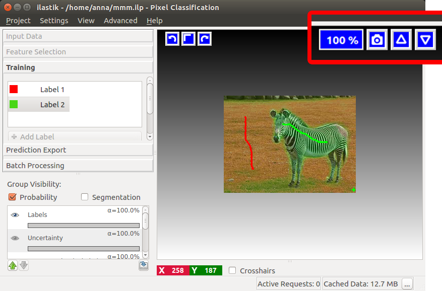
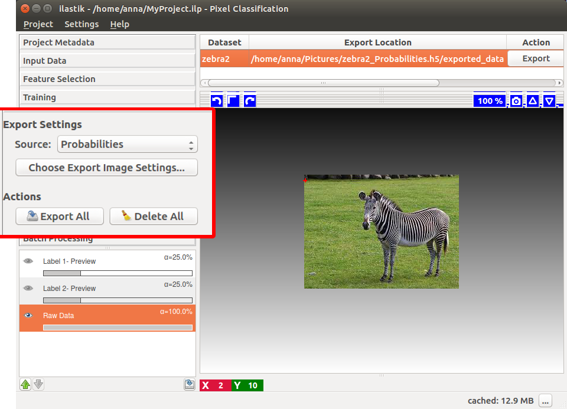
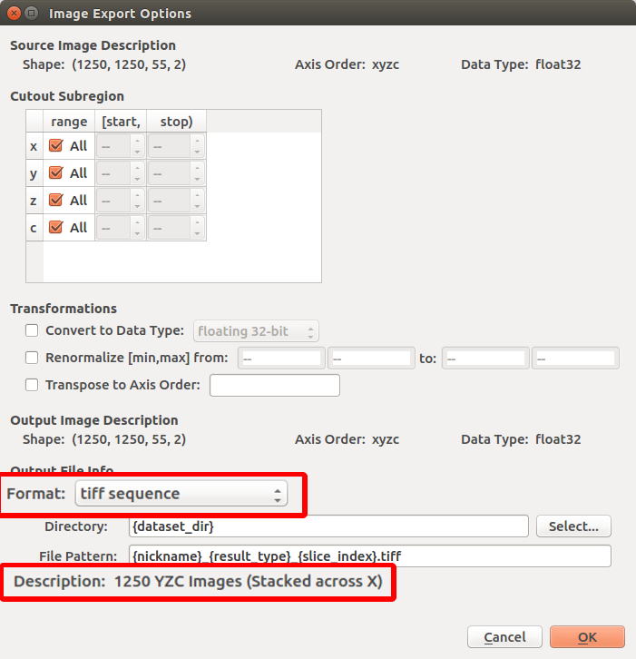
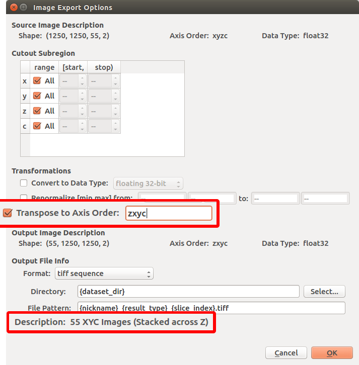

# Exporting the Current View

The current composite view, exactly as shown in the ilastik viewer, can be exported using the "camera" button in the upper right corner of the image viewer.

You can control exactly which layers are visible and their respective opacity in the layer widget in the lower left corner. This feature is especially useful to produce
videos of tracking or 3D segmentation results, overlayed with raw data. You can use the camera button in any applet of ilastik and export any view that is displayed.

# Exporting Output

Results of various ilastik workflows can be exported for later use by

* other ilastik workflows such as using pixel classification outputs in object classification or tracking workflows or

* analysis software such as [Fiji](https://fiji.sc/Fiji).

In all workflows, there is a designated applet to export results (see, for example the "Prediction Export" step in [pixel classification]({{baseurl}}/documentation/pixelclassification/pixelclassification.html) or "Density Export" step in [counting]({{baseurl}}/documentation/counting/counting.html)). Besides, individual layers in the layerstack can be exported by right-clicking on them and choosing the "Export..." item from the context menu. This page is a general introduction to the options of the export interface.

## Data Export Applet

The export step is handled through the data export applet in ilastik. In [pixel classification]({{baseurl}}/documentation/pixelclassification/pixelclassification.html), for example, the applet is called "Prediction Export".
The GUI can be used to change export settings as well as to bulk export all of the data. The following controls are available in the panel:

* **Source:** offers a drop-down menu of layers which can be exported. For example, in [pixel classification]({{baseurl}}/documentation/pixelclassification/pixelclassification.html) you can export label probabilities or segmentations.

* **Choose Settings:** opens [the export settings dialog](#settings) explained below. Here you can control all the necessary parameters to export what you need, where you need.

* **Export All:** runs the export for all input files based on the settings, including output file names and locations, specified in [the export settings dialog](#settings).

* **Delete All:** removes all output files.

On the right you can see all your datasets listed by their nickname, as defined in the [data selection applet]({{baseurl}}/documentation/basics/dataselection.html). The nickname is usually the name of the input file or, for stacks, a combination of the names of the files in the stack. Besides, you can see the location of the output file, where the results for this dataset will be exported. To change the location, open [the export settings dialog](#settings) by clicking the **Choose Settings** button on the left. The **Export** button generates individual output files corresponding to the selected dataset.

## Export Settings {#settings}

- **Source Image Description:** This is a description (shape, data type, and axis order) of the full image volume you can export with this interface. (Non-editable.)
- **Cutout Subregion:** This can be used to select a specific region-of-interest to export.  Results outside of the specified region will not be exported, and *may not be computed* during the export process (ilastik internally computes the results blockwise. It may happen that parts of the dataset outside the crop you selected are presented in the blocks). Each dimension of the region's bounding box can be edited with separate start, stop controls. **Note:** The 'stop' field is non-inclusive! e.g. to export the first 100 z-slices in a dataset, set the z range to \[0, 100\).
- **Transformations:** These controls provide fine-grained control over the output result format.
  - *Convert to Data Type:* If unchecked, the results will be exported with whatever pixel type is shown in the "Source Image Description" fields. Use this setting to save your results with an alternative pixel type.
  - *Renormalize \[min,max\] from:* Use this setting to scale the range of your results.  For example, prediction data is typically given a range of \[0.0,1.0\], but you can scale it to the range of \[0,255\] for easy viewing with other software.
  - *Transpose to Axis Order:* This setting sets "outermost" and "innermost" axes (and so on). For some formats, this doesn't matter so much (e.g. hdf5).  For others, you may care.  For example, when exporting a stack of pngs across the Z dimension, make sure 'z' appears on the left (the outer dimension). If you aren't sure, tzyxc is typically a good choice.

**Note:** if you export probability maps (pixelwise prediction results) and want to view them in other software, **convert them to data type "integer 8-bit"** and check the "Renormalize" check box to change the range.

- **Output File Info:** Use these controls to select an output file format and location.  A few _"magic" placeholders_ can be used in these settings.  These are useful when you are exporting multiple datasets:
  - `{dataset_dir}` - the directory containing the original raw dataset
  - `{nickname}` - the ilastik nickname of the raw dataset (usually the input file name for single file datasets and a combination of input file names for stacks)
  - `{result_type}` - the selected ilastik result source
  - `{roi}` - The region-of-interest as specified in the "Cutout Subregion" settings.
  - `{x_start}`, `{x_stop}`, `{y_start}`, `{y_stop}`, etc - Specific axis start/stop boundaries for the region-of-interest
  - `{slice_index}` - The index of each slice in an exported image sequence (required for all image sequence formats, not allowed with any other format).

- **Exporting sequences:** When a 3D, 4D or 5D dataset is exported as a sequence, ilastik chooses the first axis as the slicing one. For example, if your dataset is 1001x1002x1003 pixels and you choose to export it as an image sequence, it will export 1001 images, 1002x1003 pixels each. This information is displayed in the dialogue if you select a "sequence" output format. To change the slicing axis, use the "Transpose to Axis Order" control to bring the axis you need to the front. Continuing on the 1001x1002x1003 example, assume it had "xyz" as axis order. Now if you want to slice on the z axis (of size 1003), type "zxy" in the "Transpose to Axis Order" control. Now ilastik will export 1003 images, 1001x1002 pixels each.

 

## Previewing export results

Your export results can be previewed in the viewer.  Typically, three layers are shown:
- **Raw Data**: The raw dataset associated with the selected export results
- **Live Preview**: A preview of your export results.
  Note that the data for this preview is computed on-the-fly and therefore may be slow to generate!

## Exporting tracks and objects

Besides exporting the images you see in the viewer, ilastik allows to save the results of [tracking]({{site.baseurl}}/documentation/tracking/tracking#sec_Plugin) and [object classification]({{site.baseurl}}/documentation/objects/objects#export) in the form of csv tables or hdf5 files.

## Scaling and metadata carryover in OME-Zarr

Since version 1.4.1, ilastik can export to the OME-Zarr format, and since version 1.4.2b1, ilastik can scale exports to produce multiscale OME-Zarr datasets.

### Multiscale

When choosing the multiscale export option, the export dialog previews the sizes of the individual scales that will be generated.
Note that the preview applies to the dataset that was currently selected when you open the export settings dialog.
If you export several datasets to multi-scale OME-Zarr at once (using Export All), the scales are independently determined for each dataset by the rules explained below - essentially, 2x downscaling or matching the respective source scales.

For the default 2x downscaling, the scale shapes depend on the input dataset and the data type.
Generally, ilastik will generate downscales by a factor of 2 along x, y and z.
The smallest scale is aimed to be roughly 1 MB in size before compression (i.e. the entire image fits into one zarr chunk file, with a chunk size aimed at being roughly 1 MB).
As a consequence, the smallest scale for data types with fewer bits per value (e.g. 8-bit integer) will have a larger shape than for data types with more bits.

If the export is derived from a multiscale dataset (raw data or segmentation were already multiscale), ilastik will match the input as described below.

### Input-matching and metadata carryover

When exporting to OME-Zarr, ilastik will carry over all metadata from the source dataset to the exported dataset.

ilastik will do its best to maintain compatibility with multiscale workflows by matching properties of the exported dataset to the source dataset where possible.

If the source dataset was multiscale (Neuroglancer Precomputed or OME-Zarr), behind the scenes ilastik will match the internal names of the exported scales to the names of the corresponding scales in the input dataset.
This means that if you continue using the exported data in other workflows, the scale names and proportions will remain consistent across all exports.
When you take these results into other tools, they may be able to match the data from ilastik to the corresponding scale(s) of the source dataset.

Additionally, if the source dataset was OME-Zarr, ilastik will carry over all pixel resolution metadata from the source dataset to the exported dataset.

The exported scale levels/factors will match the input if the input was also multiscale, even if you export only a subregion of the whole dataset.
However, ilastik will only downscale, not upscale the exported data.
Example: If the input raw data was downscaled to a total of 5 levels (called e.g. 1, 2, 3, 4 and 5, with level 1 being the raw data), you run Pixel Classification on level 3, and then export in "multi-scale OME-Zarr", the exported multiscale will contain scale levels 3, 4 and 5.

### Interpolation

By default, downscaling is done using linear interpolation.
For certain export types where the exact pixel values need to be maintained, nearest-neighbor interpolation is used instead (e.g. for segmentations and labels).
