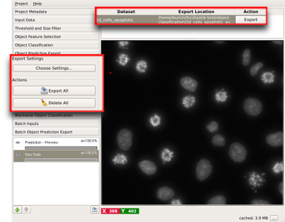
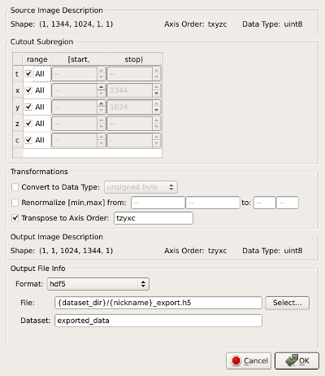

# Exporting Output

Results of various ilastik workflows can be exported for later use by

* other ilastik workflows such as using pixel classification outputs in object classification or tracking workflows or

* analysis software such as [Fiji](http://fiji.sc/Fiji).

In all workflows, there is a designated applet to export results (see, for example the "Prediction Export" step in [pixel classification]({{baseurl}}/documentation/pixelclassification/pixelclassification.html) or "Density Export" step in [counting]({{baseurl}}/documentation/counting/counting.html)). Besides, individual layers in the layerstack can be exported by right-clicking on them and choosing the "Export..." item from the context menu. This page is a general introduction to the options of the export interface.

## Data Export Applet

The export step is handled through the data export applet in ilastik. In [pixel classification]({{baseurl}}/documentation/pixelclassification/pixelclassification.html), for example, the applet is called "Prediction Export". 
The GUI can be used to change export settings as well as to bulk export all of the data. The following controls are available in the panel:

* **Source:** offers a drop-down menu of layers which can be exported. 
* **Choose Settings:** opens [the export settings dialog](#settings) explained below
* **Export All:** exports output for all input files based on the settings, including output file names and locations, specified in [the export settings dialog](#settings)
* **Delete All:** removes all output files

The box on the top right lists the input files using their nicknames defined in [data selection applet]({{baseurl}}/documentation/basics/dataselection.html) along with the location of the output file. The location can only be changed through [the export settings dialog](#settings) which can be opened with the **Choose Settings** button on the left. The **Export** button generates individual output files corresponding to the selected dataset.

## Export Settings {#settings}

- **Source Image Description:** This is a description (shape, data type, and axis order) of the full image volume you can export with this interface. (Non-editable.)
- **Cutout Subregion:** This can be used to select a specific region-of-interest to export.  Results outside of the specified region will not be exported, and *may not be computed* during the export process. Each dimension of the region's bounding box is edited with separate start, stop controls. **Note:** The 'stop' field is non-inclusive! e.g. to export the first 100 z-slices in a dataset, set the z range to \[0, 100\).
- **Transformations:** These controls provide fine-grained control over the output result format.
  - *Convert to Data Type:* If unchecked, the results will be exported with whatever pixel type is shown in the "Source Image Description" fields. Use this setting to save your results with an alternative pixel type.
  - *Renormalize \[min,max\] from:* Use this setting to scale the range of your results.  For example, prediction data is typically given a range of \[0.0,1.0\], but you can scale it to the range of \[0,255\] for easy viewing with other software.
  - *Transpose to Axis Order:* This setting sets "outermost" and "innermost" axes (and so on). For some formats, this doesn't matter so much (e.g. hdf5).  For others, you may care.  For example, when exporting a stack of pngs across the Z dimension, make sure 'z' appears on the left (the outer dimension). If you aren't sure, tzyxc is typically a good choice.
- **Output File Info:** Use these controls to select an output file format and save location.  A few "magic" placeholders can be used in these settings.  These are useful when you are exporting multiple datasets:
  - *{dataset_dir}* - the directory containing the original raw dataset corresponding these export results
  - *{nickname}* - the ilastik nickname of the raw dataset corresponding to these export results
  - *{roi}* - The region-of-interest as specified in the "Cutout Subregion" settings.
  - *{x_start}*, *{x_stop}*, *{y_start}*, *{y_stop}*, etc - Specific axis start/stop boundaries for the region-of-interest
  - *{slice_index}* - The index of each slice in an exported image sequence (required for all image sequence formats, not allowed with any other format).

## Export Display Layers

Your export results can be previewed in the viewer.  Typically, three layers are shown:
- **Raw Data**: The raw dataset associated with the selected export results
- **Live Preview**: A preview of your export results.  Note that the data for this preview is computed on-the-fly and therefore may be slow to generate!
- **Exported Image (from disk)**: Once you have exported your results to disk, they are shown in this layer.  Navigation will be as fast as the data format allows. **Note:** Some formats (e.g. stack output) cannot be viewed in this window.
