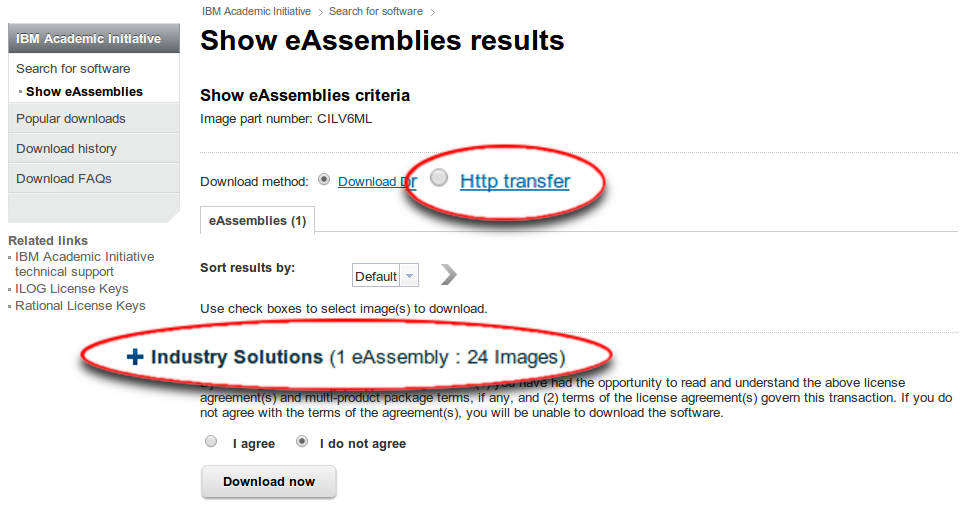
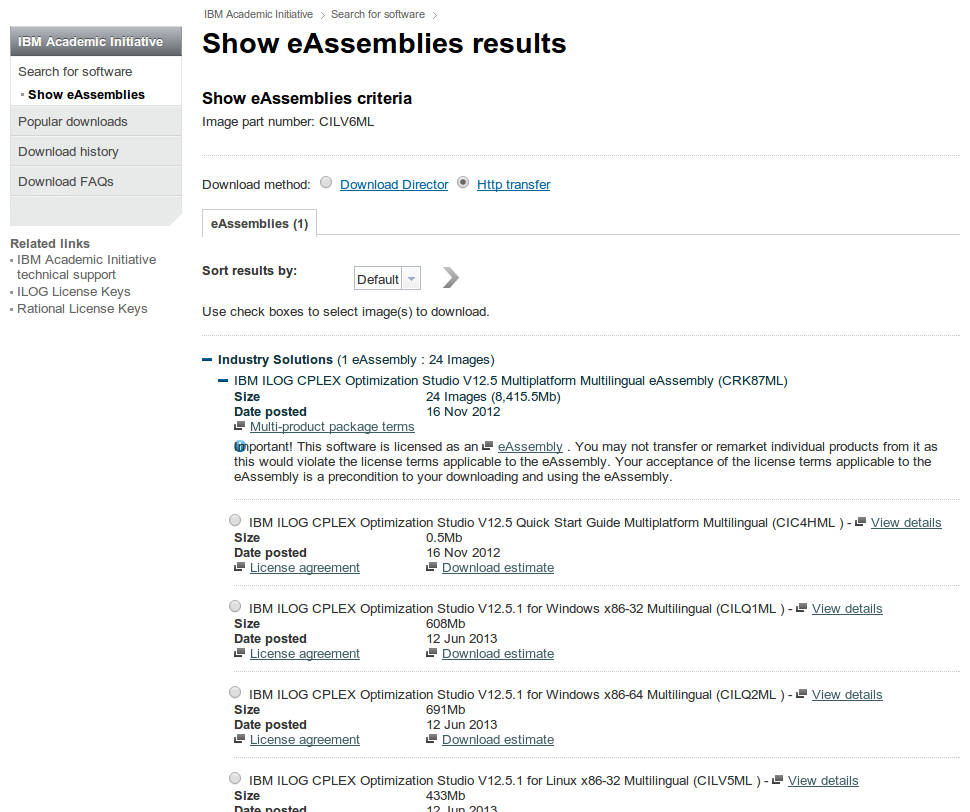

# Basic Installation

Most workflows do not require any special install instructions.  Follow these steps to get started right away.

To use the [Automated Tracking Workflow]({{baseurl}}/documentation/tracking/tracking.html), you will need to 
install CPLEX separately, and then follow a special procedure to enable ilastik to use it.  
See the special instructions below for details.

**Note: ilastik requires a 64-bit machine.  We do not provide 32-bit binaries.**

### Mac

[Download]({{site.baseurl}}/download.html) the `.zip` file for your version of OSX and extract its contents with a simple double-click.  
Copy ilastik.app to the folder of your choice (usually your `Applications` folder), and double-click to begin. 

### Linux

[Download]({{site.baseurl}}/download.html) the Linux `.tar.gz` bundle and extract its contents:

    tar xzf ilastik-1.0-Linux.tar.gz

To run ilastik, use the included `run_ilastik.sh` script:

    cd ilastik-1.0-Linux
    ./run_ilastik.sh

### Windows

[Download]({{site.baseurl}}/download.html) the Windows self-extracting installer and run it.
The installer will guide you through the installation process.

Note: Some special releases of ilastik are provided as a `.zip` file.  In that case, extract the 
`.zip` file to the location of your choice and run the enclosed `ilastik.bat` script to launch the program.

-----------------

-----------------

## Automated Tracking Workflow Setup: CPLEX Installation and Setup

To use the *Automatic Tracking* Workflow, it is required to install the commercial solver IBM CPLEX. 

**Note that ilastik will run even without IBM CPLEX installed, it is only a requirement for the [Automatic Tracking]({{baseurl}}/documentation/tracking/tracking.html) workflow.
To enable additional functionality, it is also recommended for the [Density Counting]({{baseurl}}/documentation/counting/counting.html) workflow.**

### Application for Academic License at IBM

IBM CPLEX is a commercial solver which is free for academic use.
To apply for an academic license, the user first needs to apply for an 
academic membership at IBM. Details may be found on
[the IBM Academic Initiative website](http://www-03.ibm.com/ibm/university/academic/pub/page/membership).
Please note that it might take some days until the application gets approved by IBM.

### Download IBM CPLEX

After the academic membership has been approved, the user can download IBM CPLEX. To do so, 
the steps on [this IBM website](http://www-03.ibm.com/ibm/university/academic/pub/jsps/assetredirector.jsp?asset_id=1070)
may be followed. 
The search result in the IBM software catalogue should look similar to this:

We recommend to use *Http transfer*, then clicking on the CPLEX instance in *Industry Solutions* should open
a list of CPLEX versions available for different platforms:

The current version of ilastik works with 
**IBM ILOG CPLEX Optimization Studio V12.5.1**.
After choosing the appropriate platform, the user has to agree with the IBM license. 
Finally, CPLEX may be downloaded and is ready to install.

**Important note: It is not sufficient to download the Trial version of CPLEX since its solver can only handle
very small problem sizes. Please make sure, the correct version is downloaded as described here.**

###Windows

On Windows, there are typically no further modifications needed after installing CPLEX. 
After successful installation, the *Automatic Tracking Workflow* is displayed on the Start-Screen of ilastik.

If this workflow is not present, something went wrong with the CPLEX installation. To track down the problem, proceed like this:
* Make sure that the environment variable `CPLEX_STUDIO_DIR1251` is set and points to the proper location. You can check this by typing `echo %CPLEX_STUDIO_DIR1251%` at the DOS command prompt. The output should be something like `C:\Program Files\IBM\ILOG\CPLEX_Studio1251`.
* Make sure that `cplex` is in the PATH. Type `where cplex` at a DOS prompt. It should produce something like `C:\Program Files\ibm\ILOG\CPLEX_Studio1251\cplex\bin\x64_win64\cplex.exe` (the path prefix should match the contents of the `CPLEX_STUDIO_DIR1251` variable).
* Make sure that the directory containing `cplex.exe` also contains `cplex1251.dll`, `ILOG.CPLEX.dll`, and `ILOG.Concert.dll`. 

The *Automatic Tracking Workflow* should now be displayed on the start screen. If it doesn't, you may copy the files `cplex1251.dll`, `ILOG.CPLEX.dll`, and `ILOG.Concert.dll` (if you can locate them somewhere) to the *binary* folder of the ilastik installation, usually located at `C:\Program Files\ilastik\bin`. If it still doesn't work, please contact us.

###Linux and Mac

CPLEX packages for Linux and Mac do not provide shared versions of all required libraries, but only static variants.

Before you can convert your static CPLEX libraries into shared library versions, you need to have a compiler installed on your machine.

You can check whether you already have a compiler installed by running the following command in a terminal (open the Terminal app!).
    
    gcc --version

If no compiler is installed, choose what to do depending on your OS version:

- For Linux, use your OS package manager (e.g. `apt-get`) to install the `gcc` package.
- For all OSX < 10.9, so up to Mountain Lion, you need to install XCode from the AppStore. Then you need to go to XCode's Preferences, to the Downloads tab, and install the command line tools.
- For OSX 10.9 Mavericks it suffices to install the command line tools using the following command without installing XCode.

      xcode-select --install

  Then you need to accept the XCode licence by running "sudo gcc" once.

Now you can download and execute a [script][] that will convert your CPLEX static libraries into shared libraries, and install them into the appropriate directory of your ilastik directory.

    # Download
    # (Starting with ilastik-1.1.7, this script can be found in ilastik-1.1.7/ilastik-meta/ilastik/scripts)
    wget https://raw.githubusercontent.com/ilastik/ilastik/master/scripts/install-cplex-shared-libs.sh
    
    # Linux:
    bash install-cplex-shared-libs.sh <cplex-root-dir> <path/to/ilastik-1.X.Y-Linux>
    # Mac:
    bash install-cplex-shared-libs.sh <cplex-root-dir> <path/to/ilastik-1.X.Y-OSX.app>

In the command above, `<cplex-root-dir>` is the location of your cplex studio installation.  It should contain directories named `concert` and `cplex`, among others.

**Note:** The above script installs CPLEX directly into your ilastik installation.  Once you've done that, you should not distribute your copy of ilastik to others, unless you have a license to distribute CPLEX.

[script]: https://github.com/ilastik/ilastik/blob/master/scripts/install-cplex-shared-libs.sh

After a successful installation, the *Automatic Tracking Workflow* will appear on the Start-Screen of ilastik.
