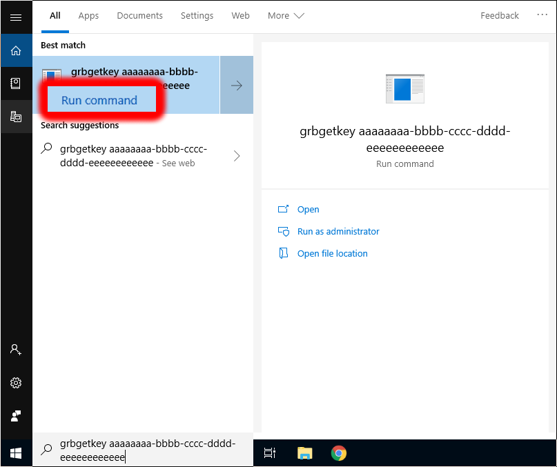

# Installation

## Requirements

ilastik binaries are provided for Windows, Linux, and Mac at our [download page]({{site.baseurl}}/download.html).

**Note:** ilastik requires a 64-bit machine. We do not provide 32-bit binaries.

We recommend using ilastik only on systems with **at least 8 GB of RAM**.
For using the Autocontext Workflow —our most memory-intensive workflow— on large 3D data your system should have at least 32 GB of RAM for smooth interaction.

On *Mac*, *Linux*, and *Windows* learning the weights in the Tracking with Learning Workflow *requires* a commercial solver (CPLEX or Gurobi).
In order to enable this the Tracking with Leaning Workflow, please follow the instructions in the section about [commercial solver installation](#solver-setup).


## Basic Installation

### Installation on Windows

[Download]({{site.baseurl}}/download.html) the Windows self-extracting installer and run it.
The installer will guide you through the installation process.
You can find an entry for ilastik in the start menu and click it to launch the program.


### Installation on Mac

[Download]({{site.baseurl}}/download.html) the `.tar.bz2` file for your version of OSX and extract its contents with a simple double-click.
Copy ilastik.app to the folder of your choice (usually your `Applications` folder), Control-click the app icon and choose "Open" to begin (for more info, see https://support.apple.com/guide/mac-help/open-a-mac-app-from-an-unidentified-developer-mh40616/mac).

### Installation on Linux

[Download]({{site.baseurl}}/download.html) the Linux `.tar.bz2` bundle and extract its contents from the terminal:

    tar xjf ilastik-1.*-Linux.tar.bz2

To run ilastik, use the included `run_ilastik.sh` script:

    cd ilastik-1.*-Linux
    ./run_ilastik.sh


## Controlling CPU and RAM resources

By default, ilastik will use all available CPU cores (as detected by Python's "multiprocessing" module), including "virtual" cores if your CPU supports hyperthreading (like most modern Intel processors).

If you want to explicitly specify the number of parallel threads ilastik should use, you can do so either by

* setting special environment variables, or
* creating a configuration file for ilastik.

### Using environment variables to control resources

ilastik will check for two environment variables on startup that control resource usage: `LAZYFLOW_THREADS`, and `LAZYFLOW_TOTAL_RAM_MB`.
Note, these environment variables overrule any settings made in a config file (see below).

On linux and OSX you can specify the environment variables when starting ilastik from the command line:

    LAZYFLOW_THREADS=4 run_ilastik.sh [...options]
    
There's an additional environment variable for specifying how much RAM to use during headless execution:

    LAZYFLOW_THREADS=4 LAZYFLOW_TOTAL_RAM_MB=4000 run_ilastik.sh [...options]
    
The RAM limit is not perfectly respected in all cases, so you may want to leave some buffer if your RAM budget is strict.

### Using a configuration file to control resources

ilastik will check on each startup whether it can find its configuration file `.ilastikrc` in the home folder.
In order to control RAM and CPU resources, use a text-editor to create the file at
* `C:\Users\<YourUserName>\.ilastikrc` on windows,
* `/Users/<YourUserName>/.ilastikrc` on OSX, and
* `/home/<YourUserName>/.ilastikrc` on linux.

In order to limit ilastik to use `4000` megabytes of RAM and `4` threads, the file should have the following content:

```
[lazyflow]
total_ram_mb=4000
threads=4
```


-----------------

-----------------

## Commercial Solver Installation {#solver-setup}

In order to learn the tracking parameters in the [Tracking With Learning Workflow][tracking with learning], installation of a commercial solver is required.

History of supported solver versions

{:.table.table-striped}
| ilastik version | GUROBI version | CPLEX version |
|:----------------|:---------------|:--------------|
| 1.4.0 (planned) | 9.1.0 | not supported |
| 1.3.3 | 8.1.1 | 1290 |
| 1.3.2 | 8.0.1 | 1280 |
| 1.3.0 | 7.5.2 | 1260 |

We'll go through the installation in the following sections.

[tracking with learning]: {{site.baseurl}}/documentation/tracking/tracking#sec_structured_learning

### GUROBI Installation and Setup

#### Application for a free Academic License at GUROBI

Application for an academic license is available after registration with your institution email address at the [GUROBI website][gurobi-info].
Details can be found [here](https://www.gurobi.com/academia/academic-program-and-licenses/).
The easiest way is to obtain a free named-user academic license.
Instructions are provided on [this page][gurobi-info].
At the end of the process, you will be provided with your license key.
Note that this license is only valid for a limited amount of time (currently this period is two months, but this could be subject to change).
You will need the license key to activate your GUROBI installation.

Download the appropriate package for your operating system from the [GUROBI download page][gurobi-download].
Visit our [download-page][ilastik-download] to find information about compatibility of the different GUROBI versions with ilastik.

The following sections contain platform-specific instructions for GUROBI installation on [Windows](#gurobi-setup-windows) as well as on [Linux and MacOSX](#gurobi-setup-linux-mac).

#### Installation on Windows {#gurobi-setup-windows}

Double click the `Gurobi-9.0.3-win64.msi` installer to go through the installation process.
Restart your computer to complete the installation.
Once the installation is complete, you need to activate the license.
You can review all your current licenses [here][gurobi-licenses].
Licenses without an entry in the `Host Name` column have not been assigned a computer yet.
Click on one of those to get to a new page with instructions.
On the bottom of this page you will find a line like:

```
grbgetkey aaaaaaaa-bbbb-cccc-dddd-eeeeeeeeeeee
```

copy the whole line and paste it into the windows search bar and click on run command in the search bar.

<a href="screenshots/gurobi-activate-win.png" data-toggle="lightbox"></a>

This will pop up a terminal window and ask you for the location to store the license.
The default location is usually fine - press enter to finish the process.

With that you should be able to use the "Calculate Tracking Weights" functionality in [Tracking with Learning][tracking-with-learning].

In case of problems, please take a look at the [GUROBI installation documentation][gurobi-install-win].

Note: Due to a bug in ilastik `1.3.3` the solver library is not recognized.
If you absolutely have to use this version then a solution is to manually copy `C:\gurobi811\win64\bin\gurobi811.dll` to your ilastik installation folder, e.g. `C:\Program Files\ilastik-1.3.3post3\Library\bin`.

#### Installation on MacOSX and Linux {#gurobi-setup-linux-mac}

On MacOSX you can start the installation process by clicking on the downloaded file `gurobi9.0.3_mac64.pkg`.

On linux you have to unpack the downloaded archive:

```bash
tar -xvf gurobi9.0.3_linux64.tar.gz -C /your/target/directory
```


Activate your installation by invoking `grbgetkey` with your license.
You can review all your current licenses [here][gurobi-licenses].
Licenses without an entry in the `Host Name` column have not been assigned a computer yet.
Click on one of those to get to a new page with instructions.
On the bottom of this page you will find a line like:

```
grbgetkey aaaaaaaa-bbbb-cccc-dddd-eeeeeeeeeeee
```

For the activation you'll have to open a terminal and follow this sequence of commands:


```bash
# Linux
cd /your/target/directory/gurobi903/linux64/bin
# OSX
# on OSX gurobi is installed to /Library/ per default.
cd /Libary/gurobi903/mac64/bin

 # use the obtained license key here
./grbgetkey aaaaaaaa-bbbb-cccc-dddd-eeeeeeeeeeee
# Follow the instructions and take note of the license path.
```

In the next step you have to execute a script that will link your GUROBI libraries to your ilastik installation.
The script can be found in `your-ilastik-installation-folder/ilastik-meta/ilastik/scripts`.

Navigate to the script directory and run it:

``` bash
# the following line is _only necessary_ if you have used a custom location for the
# license file when invoking `grbgetkey`
export GRB_LICENSE_FILE=/path/to/license/gurobi.lic

# navigate to the script location,
# on Linux this could be /path/to/ilastik-1.*-Linux/ilastik-meta/ilastik/scripts
# on OSX this could be /Applications/ilastik-1.*-OSX/Contents/ilastik-release/ilastik-meta/ilastik
cd /path/to/script
# Linux:
bash install-gurobi-symlinks.sh /your/target/directoy/gurobi903/linux64 /path/to/ilastik-1.*-Linux
# Mac:
bash install-gurobi-symlinks.sh /your/target/directoy/gurobi903/mac64/ /path/to/ilastik-1.*-OSX.app
```


In order to run ilastik with GUROBI support, make sure to always set the path to the license file (in case of a non-standard location):

```bash
# set-up environment
export GRB_LICENSE_FILE=/path/to/license/gurobi.lic

# run ilastik
cd /path/to/ilastik-1.*-Linux
./run_ilastik.sh
```


After a successful installation, learning the weights in the *Tracking with Learning Workflow* will be enabled.

Note: With versions prior to ilastik-1.1.7, this [script](https://raw.githubusercontent.com/ilastik/ilastik/master/scripts/install-gurobi-symlinks.sh) is not included and has to be downloaded manually:

    wget https://raw.githubusercontent.com/ilastik/ilastik/master/scripts/install-gurobi-symlinks.sh

Should you run into any problems, please [contact us]({{site.baseurl}}/community.html).

[gurobi-info]: https://www.gurobi.com/academia/for-universities
[gurobi-download]: https://www.gurobi.com/downloads/gurobi-optimizer
[gurobi-licenses]: https://www.gurobi.com/downloads/licenses/
[gurobi-install-win]: https://www.gurobi.com/documentation/9.0/quickstart_windows/software_installation_guid.html
[ilastik-download]: {{site.baseurl}}/download.html

--------

### CPLEX Installation and Setup

#### Application for Academic License at IBM

IBM CPLEX is a commercial solver which is free for academic use.
Details on the application for an academic license, may be found on
[the IBM Academic Initiative website](https://developer.ibm.com/academic/).
Please note that it might take some days until the application gets approved by IBM.

#### Download IBM CPLEX

Once the license has been approved by IBM, instructions for download will be provided.

The current version of ilastik works with
**IBM ILOG CPLEX Optimization Studio V12.9**.
After choosing the appropriate platform, you have to agree with the IBM license.
Finally, CPLEX may be downloaded and is ready to install.

**Important note: It is not sufficient to download the Trial version of CPLEX since its solver can only handle
very small problem sizes. Please make sure, the correct version is downloaded as described here.**

The following sections contain platform-specific instructions for CPLEX installation on [Windows](#cplex-setup-windows) as well as on [Linux and Mac](#cplex-setup-linux-mac).

#### Setup on Windows {#cplex-setup-windows}

Run the installer by double clicking the executable that you've downloaded.

On Windows, there are typically no further modifications needed after installing CPLEX.
After a successful installation, learning the weights in the *Tracking with Learning Workflow* will be enabled.
If it isn't, something went wrong with the CPLEX installation.
To track down the problem, proceed like this:

* Make sure that the environment variable `CPLEX_STUDIO_DIR129` is set and points to the proper location.
  You can check this by typing `echo %CPLEX_STUDIO_DIR129%` at the DOS command prompt.
  The output should be something like `C:\Program Files\IBM\ILOG\CPLEX_Studio129`.
* Make sure that `cplex` is in the PATH.
  Type `where cplex` at a DOS prompt.
  It should produce something like `C:\Program Files\ibm\ILOG\CPLEX_Studio129\cplex\bin\x64_win64\cplex.exe` (the path prefix should match the contents of the `CPLEX_STUDIO_DIR129` variable).
* Make sure that the directory containing `cplex.exe` also contains `cplex129.dll`, `ILOG.CPLEX.dll`, and `ILOG.Concert.dll`.

Learning the weights in the *Tracking with Learning Workflow* should now be enabled.
If it isn't, you may copy the files `cplex129.dll`, `ILOG.CPLEX.dll`, and `ILOG.Concert.dll` (if you can locate them somewhere) to the *binary* folder of the ilastik installation, usually located at `C:\Program Files\ilastik\bin`.
If it still doesn't work, please [contact us]({{site.baseurl}}/community.html).


#### Setup on Linux and Mac {#cplex-setup-linux-mac}

On Linux and Mac, the CPLEX installer comes as a commandline executable (`cplex-someversion.sh` on Linux and `cplex-someversion.bin` on Mac).
To install it, open a terminal and run `bash /path/to/your/cplex-someversion.sh` (or `bash /path/to/your/cplex-someversion.bin` on Mac).

**Hint:** on Mac and most Linux distributions you can drag and drop the installer file into the terminal to get the full path appended to your command line.

CPLEX packages for Linux and Mac do not provide shared versions of all required libraries, but only static variants.
In order to enable CPLEX with ilastik, the static libraries have to be converted.
Before you can convert your static CPLEX libraries into shared library versions, you need to have a compiler installed on your machine.
You can check whether you already have a compiler installed by running the following command in a terminal (open the Terminal app!).

    gcc --version

If no compiler is installed, choose what to do depending on your OS version:

- For Linux, use your OS package manager (e.g. `apt-get`) to install the `gcc` package.
- For all OSX < 10.9, so up to Mountain Lion, you need to install XCode from the AppStore.
  Then you need to go to XCode's Preferences, to the Downloads tab, and install the command line tools.
- For OSX 10.9 Mavericks it suffices to install the command line tools using the following command without installing XCode.

      xcode-select --install

  Then you need to accept the XCode licence by running "sudo gcc" once.

Now you can run a script, that will convert your CPLEX static libraries into shared libraries, and install them into the appropriate directory of your ilastik directory.
Starting with ilastik-1.1.7, this script can be found in ilastik-1.\*.\*/ilastik-meta/ilastik/scripts.
Prior to that version the [script](https://github.com/ilastik/ilastik/blob/master/scripts/install-cplex-shared-libs.sh) needs to be downloaded manually in the terminal:

    wget https://raw.githubusercontent.com/ilastik/ilastik/master/scripts/install-cplex-shared-libs.sh

Navigate to the directory containing the script and execute it:

    # navigate to the script location, e.g. /path/to/ilastik-1.*-Linux/ilastik-meta/ilastik/scripts
    cd /path/to/script
    # Linux:
    bash install-cplex-shared-libs.sh /path/to/your/cplex-root-dir /path/to/ilastik-1.*-Linux
    # Mac:
    bash install-cplex-shared-libs.sh /path/to/your/cplex-root-dir /path/to/ilastik-1.*-OSX.app

In the command above, `/path/to/your/cplex-root-dir` is the location of your cplex studio installation. It should contain directories named `concert` and `cplex`, among others.

**Note:** The above script installs CPLEX directly into your ilastik installation.
Once you've done that, you should not distribute your copy of ilastik to others, unless you have a license to distribute CPLEX.

After a successful installation, learning the weights in the *Tracking with Learning Workflow* will be enabled.

----------
