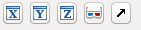

# Navigation 

## Viewer layout 
Most applets include a data viewer component in the lower right corner
of ilastik's main window, like the one shown below:

The data is shown using three orthogonal slicing planes. The
x-view (red) shows y,z-slices, the
y-view (green) shows x,z slices and the
z-view (blue) shows x,y-slices.

The red, green and blue lines indicate the current position
(given by the slicing position of the three planes). These lines
can be hidden with the _Position_ checkbox in the lower right.

In the lower left, the current coordinate _under the mouse_
are shown.

## Navigation Overlay
In each of the three slice views, there is an overlay dedicated
to navigation at the top. The
_x_-view has a red color, 
_y_-view has a green color and the
_z_-view has a blue color.

* 
  Navigate to a particular slice number.
  Click into the spin box and type in a new slice
  position.
  
* 
  The arrows rotate this view by 90 degrees left or right.
  The button in the middle swaps the two axes.
  
* 
  Indicates the current zoom percentage.

* 
  Zoom to fit (show the entire slice) and reset the zoom level to
  100%.
  
* 
  Dock the slice view out of the application window. The view
  becomes its own window, which can be moved to a second monitor for example.
  To dock the view back into ilastik's main window, click the arrow again.
  
* 
  Maximize the slice view. The other two slice views will be hidden.
  Clicking this button again restores the original layout.
  
## Mouse & Keyboard

* Use the _Mouse wheel_ to scroll forward/backward through the stack
  represented by the slice view
* Hold _Ctrl_ ( _Cmd_ on Mac OS X) while using the mouse wheel to zoom in/out (if the cursor is over one 2D slicing plane,
  the respective plane is zoomed, otherwise all 3 slicing planes are zoomed simultaneously)
* Hold _Shift_ while using the mouse wheel to browse a time sequence
* Pan the view by dragging the mouse while pressing _shift_ OR the _middle mouse button_
  pressed
* jump to a new 3D position by _double clicking_

## 3D view

*  toggle the visibility of 
  x, y or z slicing planes. Often, because the planes are draggable,
  they hinder the interaction with the data or make it difficult to rotate
  the view.

*  
  Toggle anaglyph (needs red/blue glasses) rendering.

*  
  Dock the 3D view out of ilastik's main window (for example to move it to
  another screen). Another click docks the window back.
