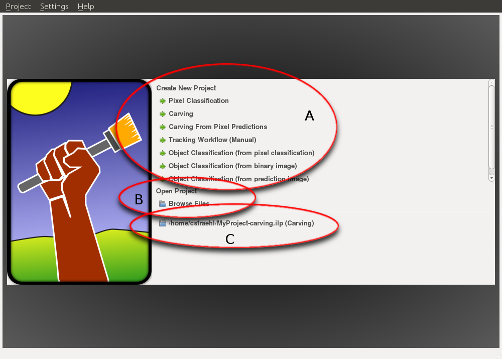

# The Startup Screen
The first thing you see when starting ilastik is the startup screen.
It allows to

* Create a new project (A)
* Open an existing project (B)
* Open a recently used project (C)
      

When creating a new project (A) the user can choose from several different
project types:

- **Pixel Classification** can be used to interactively label images and to obtain a pixel prediction on unlabeled images. 

- **Carving** is useful for segmenting objects in images which cannot be discriminated from each other by appearance but which have a visible boundary.

  - **Carving from pixel predictions** is a workflow where a pixel prediction of an object boundary is used to segment objects.

- **Tracking Workflow** allows tracking of a large and unknown number of (possible divisible) objects with similar appearance in 2d+t and 3d+t 

- **Object classification** allows to train and classify already segmented objects in an image using object level features such as size, orientation, average color etc.
  - **from pixel classification** use a pixel level classifier as first stage to obtain objects
  - **from binary image** use a binary object mask image as object input
  - **from prediction image** use a probability map as object input

