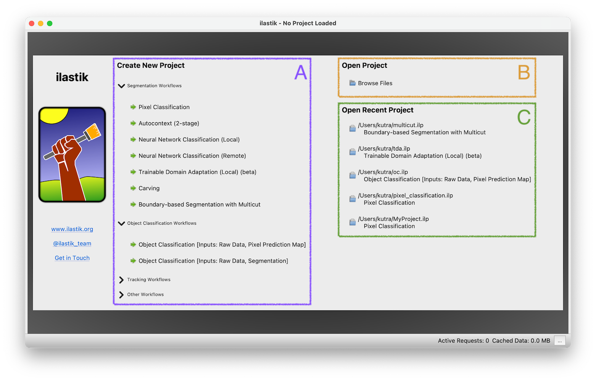

# The Startup Screen
The first thing you see when starting ilastik is the startup screen.
It allows to

* Create a new project (A)
* Open an existing project (B)
* Open a recently used project (C)
      

When creating a new project (A) the user can choose from several different
project types:

##### Segmentation Workflows

- [**Pixel Classification**][pc] can be used to interactively label images and to obtain a pixel prediction on unlabeled images. 
- [**Autocontext**][autocontext] improves Pixel Classification by running it two stages, where the second stage uses the probabilities from the first as additional information.
- [**Neural Network Classification**][nn] allows to run inference with  pre-trained convolutional neural networks (CNNs).
- [**Trainable Domain Adaptation**][tda] combines Pixel Classification with pre-trained convolutional neural networks.
- In [**Carving**][carving] you can semi-automatically segment objects that are visually similar but have a visible boundary between them.
- [**Boundary-based Segmentation**][mc] is useful for automatic segmentation of objects in images which cannot be discriminated from each other by appearance but which have a visible boundary.

##### Object Classification Workflows

- [**Object classification**][oc] allows to train and classify already segmented objects in an image using object level features such as size, orientation, average color etc.
  - **from binary image** use a _binary object mask_ or _label image_ (e.g. from Cellpose, Stardist) as object input
  - **from prediction image** use a probability map (generated e.g. with Pixel Classification) as object input

##### Tracking Workflows

- [**Tracking Workflow**][track] allows tracking of a large and unknown number of (possible divisible) objects with similar appearance in 2d+t and 3d+t
  - **Animal Tracking** for objects that don't divide
  - **Tracking** for objects that divide
  - **Tracking with Learning**, like Tracking, but allows to optimize tracking parameters

[autocontext]: {{site.baseurl}}/documentation/autocontext/autocontext.html
[carving]: {{site.baseurl}}/documentation/carving/carving.html
[mc]: {{site.baseurl}}/documentation/multicut/multicut.html
[nn]: {{site.baseurl}}/documentation/nn/nn.html
[oc]: {{site.baseurl}}/documentation/objects/objects.html
[pc]: {{site.baseurl}}/documentation/pixelclassification/pixelclassification.html
[tda]: {{site.baseurl}}/documentation/tda/tda.html
[track]: {{site.baseurl}}/documentation/tracking/tracking.html
