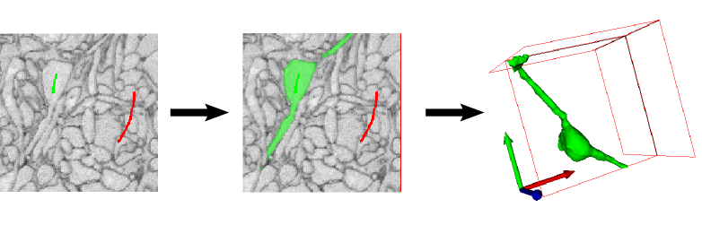
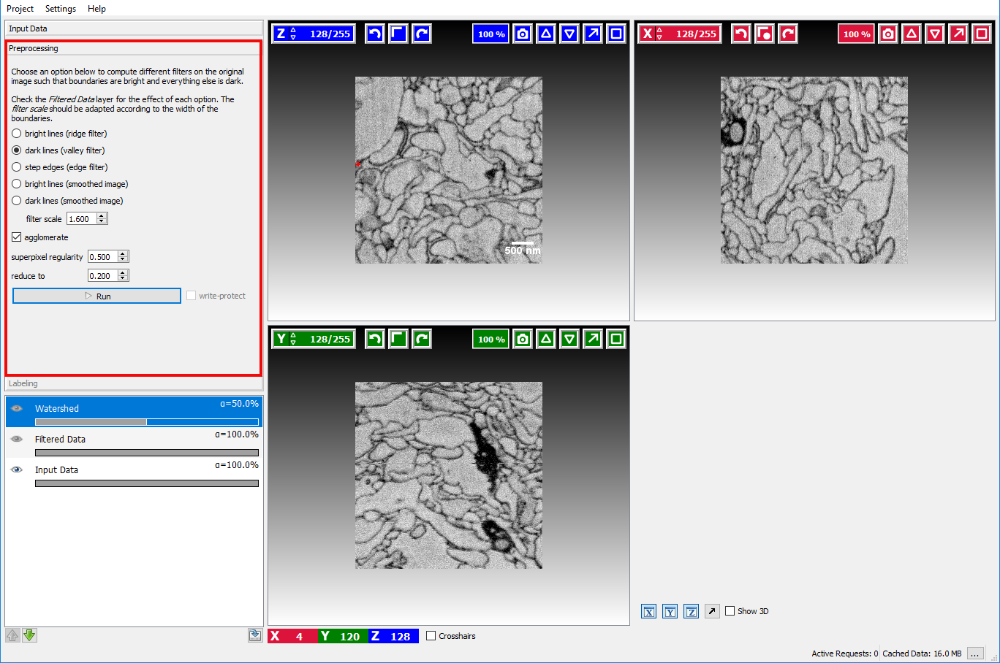
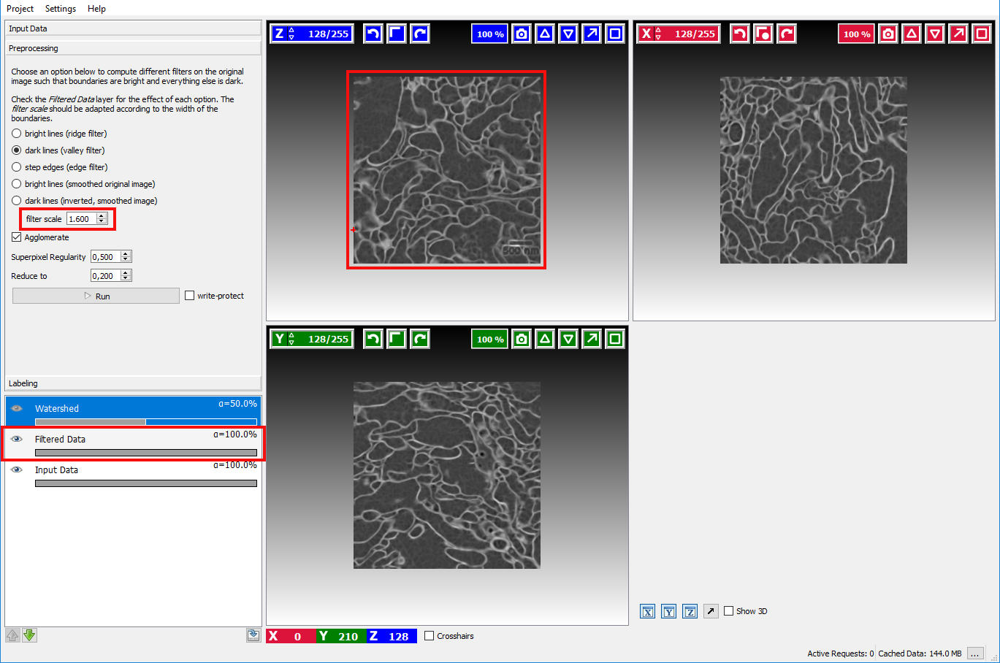
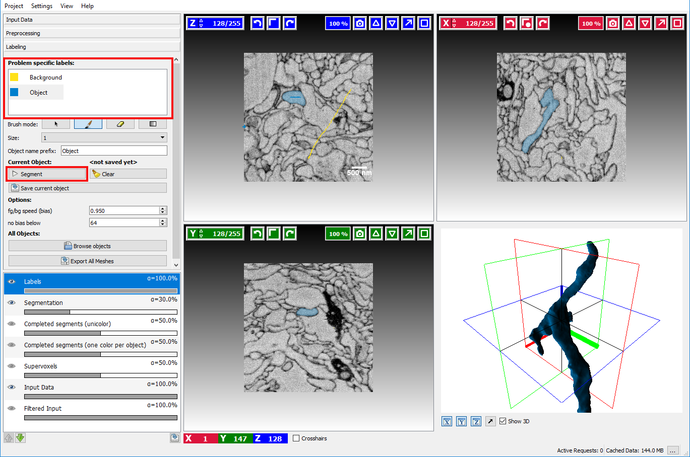
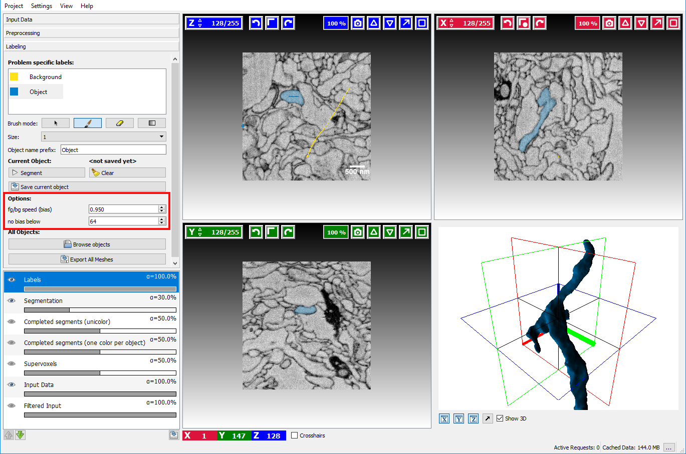
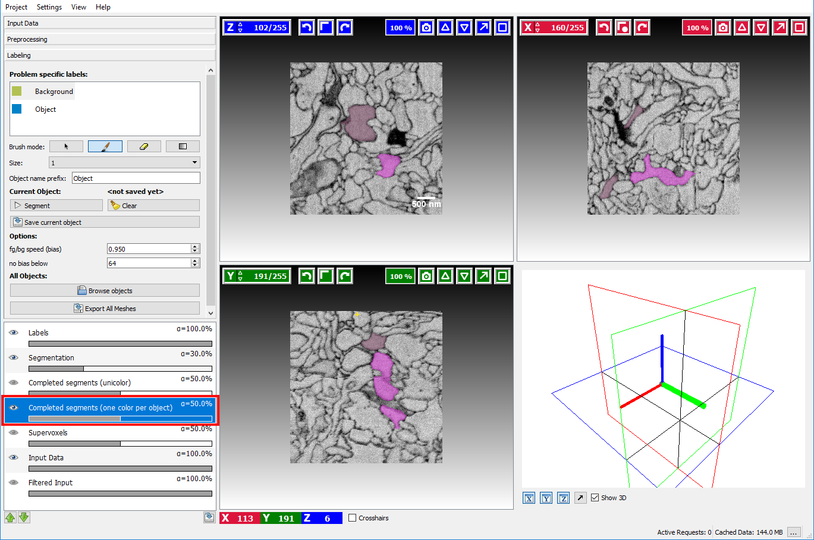
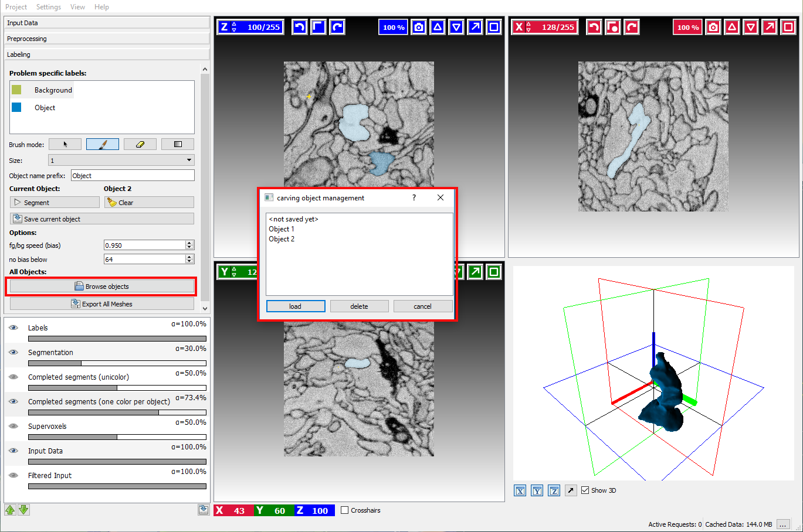
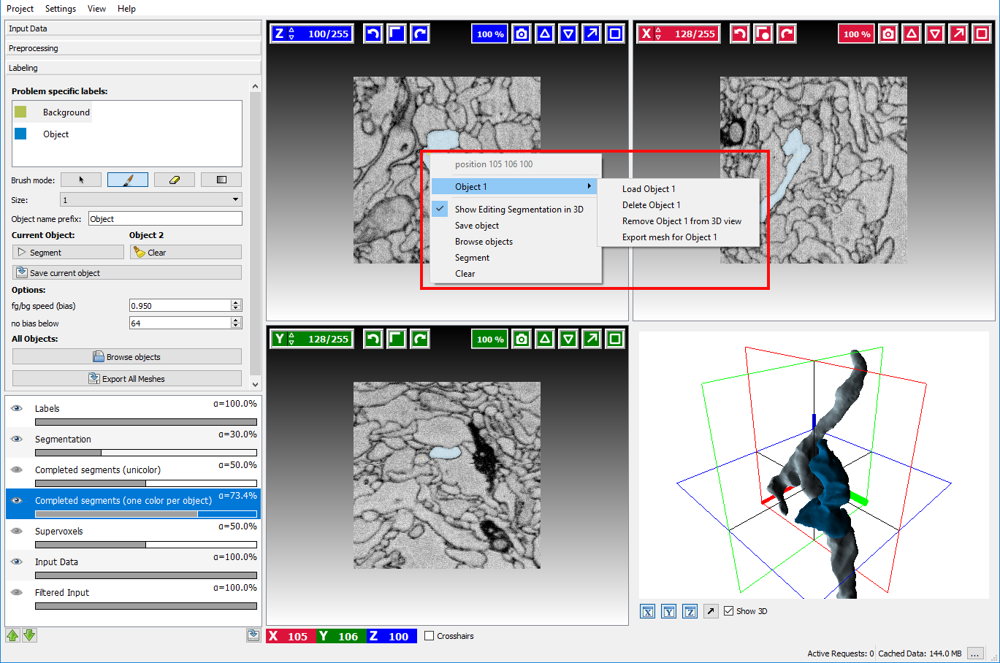

# Carving

## Carving Demo (4 minutes)

<iframe width="560" height="315" src="https://www.youtube.com/embed/xGyTriPQXHI" frameborder="0" allowfullscreen></iframe>

## How it works, what it can and cannot do

The seeded watershed algorithm is an image segmentation algorithm for
interactive object extraction from image data. The algorithm input is user-defined
object markers (see example below) for the inside (green) and outside (red) of
an object. From these markers, an initial segmentation is calculated that can
be refined interactively. The seeded watershed relies on discernible object
boundaries in the image data and not on the inner appearance of an object like for
example the classification workflow.
      

While the
[Classification module]({{site.baseurl}}/documentation/pixelclassification/pixelclassification.html)
is useful for segmenting objects with discernible brightness, color
or textural differences in comparison to their surroundings, the carving
module's purpose is to aid in the extraction of objects from images that are
only separable by their boundary - i.e. objects that do not differ from the
rest of the image by their internal appearance.

      
From the two images displayed to the right, the left image is clearly
more suitable for the classification module since the cell cores have a
strong red color component in comparison to their surrounding. The right
image, on the other hand, is a good example for the applicability of the
seeded watershed segmentation (the problem setting is the segmentation of
a single cell from electron microscopy image of neural tissue) since the
neural cells have similar color distributions but can be
separated by the dark cell membranes dividing them. (NOTE: the seeded
watershed **could** also be applied to segment individual cell cores
in the left image interactively, but in such a case where there is a
clear visible difference between the objects of interest and their
surrounding the classification module is a better choice.)

The algorithm is applicable to a wide range of segmentation problems that
fulfill these properties. In the case of data where the boundaries are not
clearly visible or in the case of very noisy data, a boundary detection filter
can be applied to improve results - this is the topic of the following section.

**Example Data:** In the following sections, we use a volume of mouse retina EM data courtesy of Winfried Denk, et al.  
The data can be found on the [downloads page]({{site.baseurl}}/download.html) or download it directly [here](http://data.ilastik.org/helmstaedter.zip).

## Constructing a good boundary map

Assuming the user has already created or loaded an existing
ilastik project and added a dataset, the first step is to switch to the **Preprocessing Applet**
where the filter selection and computation are performed.

Here the user can select how boundaries are represented in the image.
* Bright lines
* Dark lines
* Step edges: if the boundaries in the image appear as a transition from a bright to a dark region.
* Original image: if the loaded image is already a boundary map, where bright pixels correspond to an image boundary.
* Inverted Original image: if the loaded image is already a boundary map, where dark pixels correspond to an image boundary.

In the example image above, a good boundary choice would clearly be **Dark lines**.

To check if the computed boundaries visually correspond with the edges in the image the visibility of the **Filtered Data** layer
can be toggled by clicking on the small eye in that layer:

If the boundary map looks too noisy or overly smooth the size of the smoothing kernel needs to be changed with the **sigma** option.
The **Filtered Data** layer is updated when the user changes the size of the smoothing kernel. This setting should be changed
until a satisfactory boundary map is obtained.

When everything looks fine, the user can click on the **Run Preprocessing button** to calculate a sparse supervoxel graph of 
the image and boundary map which will speed up segmentation times.
      
**Note:** The preprocessing may take a long time depending on the
size of the dataset. On a i7 2.4GHz computer a 500*500*500 3D dataset requires
15 minutes of preprocessing.

## Interactive Segmentation

After the necessary preprocessing the interactive segmentation of objects in the **labeling** applet is the next step.

Two different types of seeds exist, **Object seeds** and **Background seeds** - per default the background seed receives a higher priority such that the background seed is preferred in the case of ambiguous boundaries.

After marking the objects of interest with an object seed and the outside
with a background seed the button **Segment** can be clicked to obtain a seeded
watershed segmentation starting from the seeds.

The seeds can be refined by drawing markers, the currently active seed type can be selected 
on the left side by clicking on the corresponding seed.
To erase erroneous markers, the **Brush mode** (below the seeds) needs to be changed to the eraser to switch back to drawing mode 
the paint brush item has to be activated again.
 
Additional available interactions include:

- **Updating the segmentation:** Left click on button **Segment**
- **Erasing a brush stroke:** Change brush mode to eraser by clicking on the eraser button
- **Changing the active seed type:** Left Mouse click on seed in the left-hand side seed list.
- **Changing the color of a seed type:** Right Mouse click on the corresponding seed in the seed list and select **Change Color**.
- **Erasing all markers:** Click on the  **Clear**.button next to the segment button.
- **Exporting the current segmentation:** Right click on the **Segmentation Overlay** in the overlay widget and select **Export**.
      
To learn more about how to navigate the data (**scroll, change slice,
enable/disable overlays, change overlay capacity etc. **) please read the
[Navigation guide]({{site.baseurl}}/documentation/basics/navigation.html).

## Advanced Options

The seeded watershed algorithm of the module has some advanced options which
can be changed to obtain improved segmentations when the default settings are
not sufficient.

These additional options described below can be displayed by scrolling down
in the labeling applet on the left side.

- **BG priority** The bias is a parameter the affects how much the background is
  preferred in comparison to the other labels. A value smaller than 1.0 will
  lower the detected boundaries for the background seeds. Since the normal
  seeds still work on the original boundaries the background is preferred in
  case of ambiguity. Usually, a value of around 0.95 yields good results, but
  sometimes playing with the parameter is a good way to improve segmentation
  without additional seeds.
- **No bias below** The threshold is a value that affects when the **BG priority**
  for the background will be applied. Normally the background seed is only
  preferred when the boundaries are sufficiently strong, i.e. > 64 (the
  boundaries in the image have values between 0 and 255). Usually, it is not
  necessary to change this parameter.
  

## Saving and loading segmented objects

Once the user has successfully segmented an object, the result
can be stored by clicking on the **Save As** button. A dialog will pop up that
asks for the object name, by default autogenerated name will be provided based on value of **Object name prefix** field:

After saving an object, all existing markers will be removed to allow segmenting a new
object from scratch. To see which objects have already been segmented and saved the **Completed Segments** overlay
can be enabled by clicking on the little eye in that layer:

already segmented (and saved) objects will be highlighted to prevent segmenting something twice.

Sometimes it is necessary to refine the segmentation of an already saved object. To do so, click
on the **Browse objects** button and load the corresponding object. 

Right-clicking on the highlighted object in **Completed segments** overlay and navigating to a submenu with object name (in this case it's "Object 1")
provides the following options:

- Load _ObjectName_
- Delete _ObjectName_
- Show 3D _ObjectName_ -- will display object in 3D view
- Export mesh for _ObjectName_ -- will export mesh of the selected object

## Post-processing
Wonderful users of ilastik have created these tools to post-process carving results and made them available for all:

1. [Neuromorph](http://cvlab.epfl.ch/NeuroMorph), for measuring and analyzing the segmented object properties. Featured in  
A. Jorstad, B. Nigro, C. Cali, M. Wawrzyniak, P. Fua, G. Knott.  "NeuroMorph: A Toolset for the Morphometric Analysis and Visualization of 3D Models Derived from Electron Microscopy Image Stacks." Neuroinformatics, 2014.
2. [StackObjectCombiner](http://wiki.imagej.net/StackObjectCombiner), for glueing together objects from datasets, which were carved blockwise.
