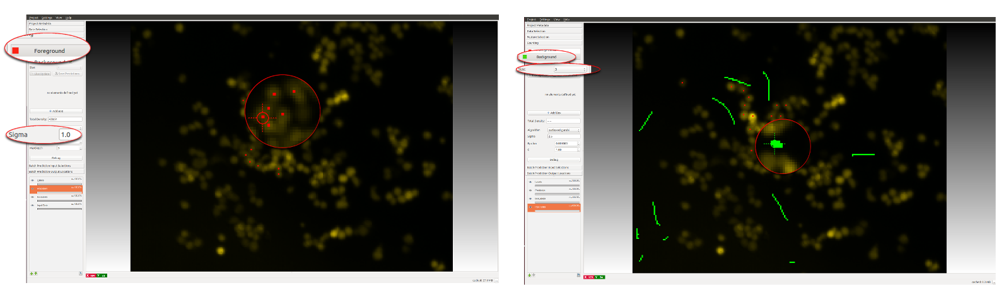
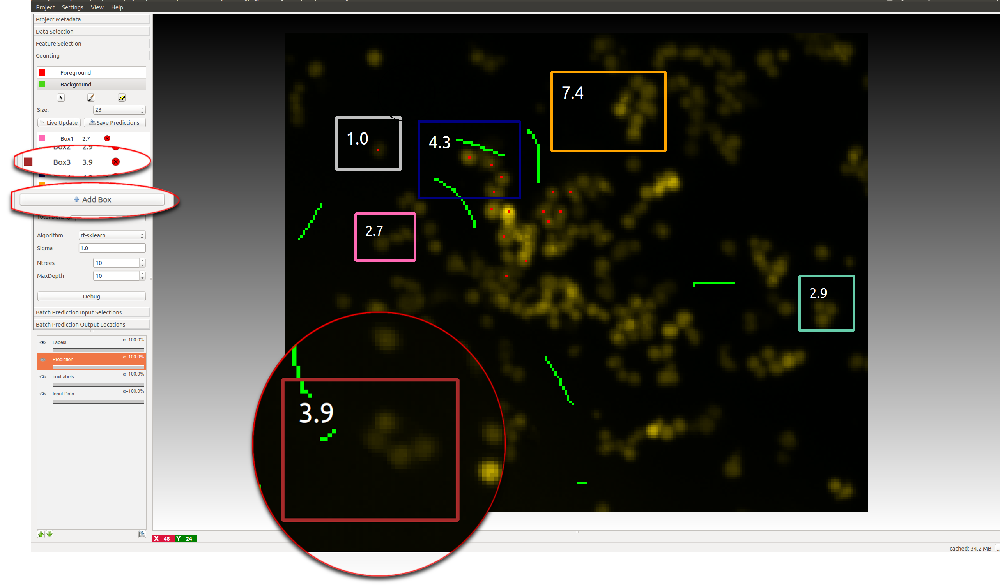

# Interactive Object Counting
## Overview, what it can and cannot do

The purpose of this workflow is to enable the counting of the number of objects in crowded scene such as cells in a microscopic image.
If the density of objects in the image is low and the objects are well separated one to the other it possible to count objects by segmenting isolated individuals as in the [Object Classification workflow](../objectClassification). However, as the density of the objects increases the latter approach underestimates the true counts due to under-segmentation errors.

This workflow offers a supervised learning strategy to object counting that is robust to overlapping instances. It is appropriate for counting **blob-like overlapping objects with similar appearance (size, intensity, texture, etc..)** that are homogeneously distributed over an uniform background. On the one hand, the left image in the figure below contains large **non-overlapping** objects with high variability in size and appearance (red nuclei and mitotic yellow nuclei) and therefore is best suited for the [Object Classification workflow](../objectClassification) that will first segment the image and then count the number of foreground connected components. On the other hand, the right images in the figure below contain small overlapping objects that are difficult to segment. The objects in each image have similar appearance and have roughly the same size, therefore these two images are appropriate for the [Counting workflow](./counting.html). This workflow will estimate the density of objects in the image and infer the number objects without requiring segmentation.

## How does it works, what do should you annotate
In order to avoid the difficult task of segmenting individual objects, this workflow implements a supervised object counting strategy called **density counting**. The algorithm learns from user annotations a real valued **object density** whose integral over any **large** image region gives an estimate of the  **number of objects** in that region. In the following figure, note that the integral of the smooth density is a real number close to the true number of cells in the image.

<!-- The annotations are provided by the user as **dots** for the centers of few training objects and as **brush-strokes** strokes for regions of background.
Further details are provided in the section [**interactive counting**](#sec_interactive_counting).
 -->

It is important to note that the object density is an approximate estimator of the true integer count. The estimates are close to the true count when are integrated over sufficiently large regions of the image and when enough training data is provided. Also contaminations of the image such as debris or other spurious objects may invalidate the estimated density.

Please refer to the [**references**](#sec_reference) for further details.

The workflow input are user given markers (see example below) in the form of **dots (Red)** for the objects centers and **brush-strokes (Green)** for irrelevant background. A pixel-wise mapping between local texture features and the object density is learned from these markers. This workflow offers the possibility to interactively refine the learned density by:

* Placing more annotations for the foreground and background
* Monitoring the object counts in image regions
* Constraining the number of objects in image regions

<a id="sec_input_data">&nbsp;</a>
## 1. Input Data
Similarly to other ilastik workflow, the user can provide either images (e.g. \*.png, \*.jpg and \*.tif) directly or pass hdf5 datasets. The image import procedure is detailed in **LINKME**.Please note that the current version of the Counting module is limited to handling **2D data only**, for this reason hdf5-datasets with a z-axis or a temporal axis are not accepted. Only the training images requiring manual labeling have to be added in this way, the full prediction on a large dataset can be done via Batch Processing LINKME.

<a id="sec_feature_selection">&nbsp;</a>
## 2. Feature Selection
Feature selection is similar to the [Pixel Classification Workflow](../pixelClassification).
Assuming the user has already created or loaded an existing ilastik project and added a dataset, the first step is to define the some features. Empirically we found that the same features of the pixel classification workflow (in particular Texture, Edge and Color) provide good performance in case of blob like objects such as cells.

It is appropriate to match the scale of the object with the size of the features. For further details please refer to LINKME.

<a id="sec_interactive_counting">&nbsp;</a>
## 3. Interactive counting
Annotations are are done by painting while looking at the raw data and the result of the algorithm can be interactively refined while being in **live-update** mode. However, unlike the [Pixel Classification Workflow](../pixelClassification), where only user brushes are the only interaction supported, in the Counting workflow the user has the possibility to:

* **Dotting** the object instances and **Brushing** over the background
* **Boxing** image regions

<a id="sec_brushing_interaction_mode">&nbsp;</a>
### Dotting/Brushing Interaction Mode
This is typically the first interaction with the core of the workflow. The purpose of this interaction model is to provide the classifier with examples for the object density values and examples for the background.

To begin placing a dot just click on the red **Foreground** label. Objects instances have to be marked by user dots which have to be placed close to the center of the objects. Given the user dotted annotations, a smooth training density is derived by placing a Gaussian at the location of each annotation. The size of the Gaussian is a user parameter **Sigma** which should roughly match the object size. To help deciding an appropriate value for this parameter you will see the that the size of the **crosshair-cursor** changes accordingly to the chosen sigma.NOTE: Large values for sigma can heavily impact the required computation time: consider a to use a different approach, such as the [Object Classification workflow](../objectClassification) if this parameter has to be chosen larger than 5.

IMAGE: Good sigma/dot, bad sigma/dot

Background labeling happens exactly as in the [Pixel Classification workflow](../pixelClassification). To activate this interaction click on the green **Background** label and give broad strokes, marking unimportant areas or regions where the predicted density should be close to 0. You can set the size of the brush from the dialog shown in the figure below.

IMAGE: Showing different controls for labeling with the brush

<a id="sec_boxing_interaction_mode">&nbsp;</a>
### Boxing Interaction Mode
This interaction takes place typically after that the user has trained a classifier giving examples of foreground and background. Boxes are used to **measure the predicted object count** over an image region and get a general feeling for the quality of the prediction.
**Advanced usage** of the boxes is explained in the Support Vector Regression section.

After that the prediction has been computed for the first time the **Prediction Layer** should appear in the layerstack and the **predicted total density** of the image should be updated.

The user can start placing boxes by clicking on the **add Boxes** button and drawing the box region on the image. The new box will be added automatically to the **Box List**.
Boxes show the object count for the region on the upper right corner and on the right of the box name in the Box List.
Boxes can be:
* **Selected and Moved**: to select a particular box you can hoover over the box with the mouse or select the box row in the Box List. The box will change color once selected. To move a box, drag the object in a different position while pressing the `Ctrl` key .
* **Resized**: when selecting a box it will show 2 resize handles at its borders.
* **Deleted**: to delete a box either click on the delete button on the Box List or press `Del` while selecting the box
* **Configured**: you can configure the appearance (color, fontsize, fontcolor etc.. ) of each individual box by clicking at the row of the box and opening the Box Interaction Dialog.

<a id="sec_algorithms">&nbsp;</a>
## 3. Algorithms
**Two different regression algorithms** are currently supported by the Counting workflow depending on the availability of CPLEX on the machine where ilastik is installed. We expose the most important and well-known parameters for our algorithms to the advanced user, details are given below.

<a id="sec_rf">&nbsp;</a>
### Random Forest
This approach uses a Random Regression Forest as regression algorithm.
In general it requires more labels to give correct results over several images, however it is more robust to inhomogeneous background.

The implementation of the random regression forest is based on <a href = "http://scikit-learn.org/stable/"> sklearn</a>.

<a id="sec_rf_advanced">&nbsp;</a>
#### Advanced parameters
The forest parameters exposed to the user are:
* **Ntrees** Number of trees in the forest
* **MaxDepth** maximum depth of each individual tree.

IMAGE: Effect of different parameters

<a id="sec_svr">&nbsp;</a>
### Support Vector Regression
Requires Gurobi
Slower
Better generalization
Can offer additional type of label via Box constraints
-Box constraints not strict
#### Box Constraints
Box constraints offer an easy way to provide counts for a region, while not having to label every instance individually.

<a id="sec_advanced_svr">&nbsp;</a>
#### Advanced parameters
C: How much impact should individual and box errors do compared to w itself, this will likely only change results if you set C to low values.
epsilon: The amount of error that will be tolerated for individual pixels, this regularizes the result.
though the defaults should already create good results.

<a id="sec_exporting">&nbsp;</a>
## 4. Exporting results
Possible to save the regressors. Will be loaded again, can do prediction directly if parameters and labels untouched
Can also save prediction itself. If you want to export the results for a single image, use exportLayerDialog.

<a id="sec_batch">&nbsp;</a>
## 5. Batch Processing
For large-scale prediction, first train regressors, then add input images, then press export all.

<a id="sec_reference">&nbsp;</a>
## 6. References
FIXME: reference
