# Interactive Density Counting
## Overview, what it can and cannot do

The purpose of this workflow is to enable **counting the number of objects** in crowded scenes such as cells in microscopy images. Counting is performed by directly estimating the density of objects in the image without performing segmentation or object detection.

When the density of objects in the image is low and the objects are well separated from each other, it is possible to count objects by first
segmenting the foreground and then collecting the connected components as it is done in the
[Object Classification workflow]({{site.baseurl}}/documentation/objects/objects.html).
However, as the density of the objects increases, the latter approach
underestimates the number of objects due to under-segmentation errors.

This workflow offers a supervised learning strategy to object counting that is robust to overlapping instances.
It is appropriate for counting many **blob-like overlapping objects with similar appearance (size, intensity, texture, etc..)** that may overlap in the image plane. Let's discuss three examples.

The left image in the figure below contains large **non-overlapping** objects with high variability in size and appearance (red nuclei and mitotic yellow nuclei) . Therefore it is best suited for the
[Object Classification workflow]({{site.baseurl}}/documentation/objects/objects.html). The two right images in the figure below contain small overlapping objects that are difficult to segment individually. The objects in each of these images have similar appearance and similar same size,
therefore these two images are appropriate for the Density Counting workflow.

This workflow will estimate directly the **density of objects** in the image and infer the number of objects without requiring segmentation.

<a href="fig/whichdata2.jpg" data-toggle="lightbox">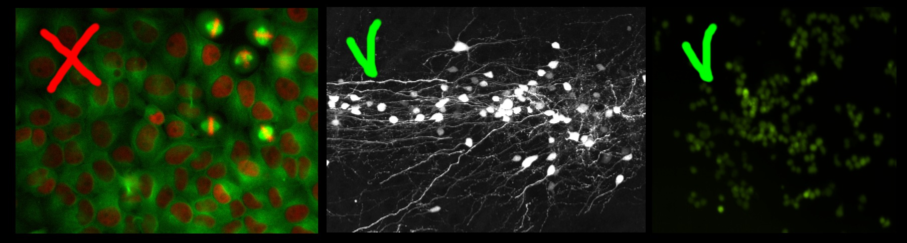</a>

## How does it work, what should you annotate
In order to avoid the difficult task of segmenting each object individually, this workflow implements a supervised object counting strategy called **density counting**. The algorithm learns from the user annotations a real valued **object density**. Integrating over a **sufficiently large** image region yields an estimate of the  **number of objects** in that region.
The density is approximated by a normalized Gaussian function placed on the center of each object.

In the following figure, note that the integral of the smooth density is a real number close to the true number of cells in the image.

<!-- The annotations are provided by the user as **dots** for the centers of few training objects and as **brush-strokes** strokes for regions of background.
Further details are provided in the section [**interactive counting**](#sec_interactive_counting).
 -->

It is important to note that the object density is an approximate estimator of the true integer count. The estimates are close to the true count when integrated over sufficiently large regions of the image
and when enough training data is provided.

NOTE that also contaminations of the image such as debris or other spurious objects may invalidate the estimated density.

Please refer to the [**references**](#sec_reference) for further details.

<a href="fig/density_scheme2.png" data-toggle="lightbox">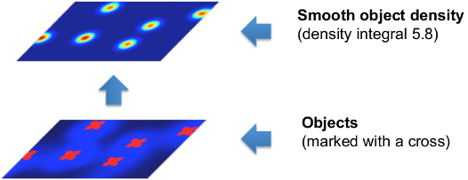</a>

The user gives annotations (see tutorial below) in the form of **dots (red)** for the object centers and **brush-strokes (green)** for the irrelevant background. A pixel-wise mapping between local features and the object density is learned directly from these annotations.

This workflow offers the possibility to interactively refine the learned density by:

* placing more annotations for the foreground and background
* monitoring the object counts over sub-image regions
* constraining the number of objects in sub-image regions (requires CPLEX or GUROBI)

## Interactive Counting Tutorial {#sec_input_data}

Let's warm up with a small tutorial.

### 1. Input Data
Similarly to other ilastik workflows, you can provide either images (e.g. \*.png, \*.jpg and \*.tif) directly or pass hdf5 datasets.
The image import procedure is detailed in [Data Selection]({{site.baseurl}}/documentation/basics/dataselection.html).
Please note that the current version of the Counting module is limited to handling **2D data only**, for this reason hdf5-datasets with a z-axis or a temporal axis will not be accepted.  Only the training images required for the  manual labeling have to be added in this way, the full prediction on a large dataset can be done via Batch Processing 
[Data Selection]({{site.baseurl}}/documentation/basics/batch.html#batchprocessing_unseen_images).
In the following tutorial we will use a dataset of microscopic
cell images generated with <a href = "http://www.cs.tut.fi/sgn/csb/simcep/tool.html">SIMCEP</a>.
This dataset is publicly available at the following <a href = "http://www.robots.ox.ac.uk/~vgg/research/counting/">link</a>.

In this tutorial we have already imported some of the images in the file `counting-tutorial.ilp`, that can be found in the tutorials folder.
As a first step, let us just load this project. You should be able to start from the window below.

<a href="fig/blue_totorial0.jpg" data-toggle="lightbox">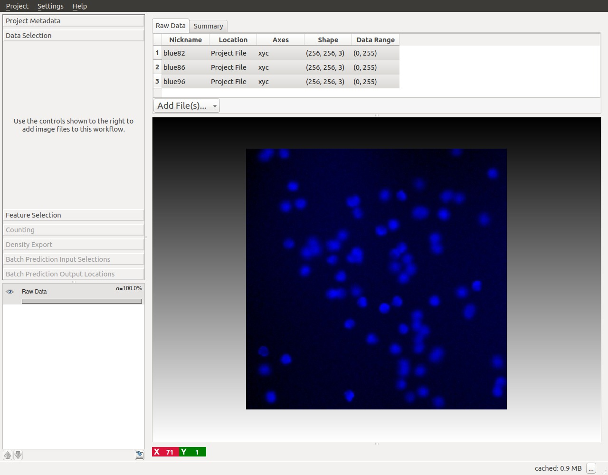</a>

<a id="sec_feature_selection">&nbsp;</a>
### 2. Feature Selection
The second step is to define some features. Feature selection is similar to the
[Pixel Classification Workflow]({{site.baseurl}}/documentation/pixelclassification/pixelclassification.html).

The image below shows an example of feature selection. In particular, blob-detectors like the *Laplacian of Gaussians* or line-detectors like the *Hessian of Gaussians* are appropriate for blob like structure such as cells.
The figure below shows the response of the *Laplacian of Gaussians* filter.

<a href="fig/blue_totorial_features2-red.jpg" data-toggle="lightbox">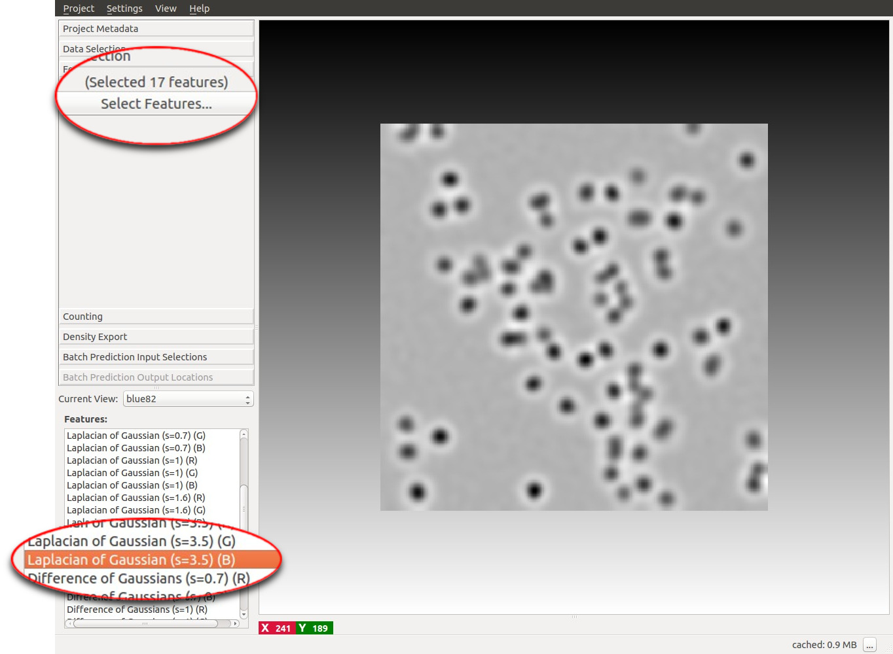</a>

It is appropriate to match the size of the object and of the cluster of objects with the scale of the features as shown in the figure below.
For further details on feature selection please refer to [How to select good
features]({{site.baseurl}}/documentation/pixelclassification/pixelclassification.html#selecting_good_features).

<a href="fig/blue_totorial_features.jpg" data-toggle="lightbox">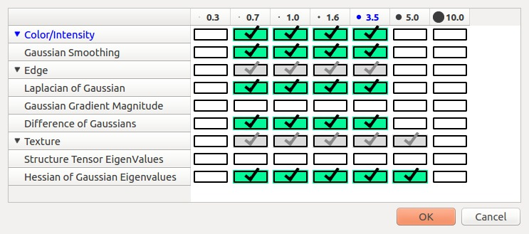</a>

<a id="sec_interactive_counting">&nbsp;</a>
### 3. Interactive counting
Annotations are done by painting while looking at the raw data and at the intermediate results of the algorithm.
The result of this algorithm can be interactively refined while being in **Live-Update** mode.
The overall workflow resembles the
[Pixel Classification Workflow]({{site.baseurl}}/documentation/pixelclassification/pixelclassification.html).
The main difference is that the Density Counting workflow gives the user the possibility to:

* add **dots** for the object instances
* add **brush strokes** over the background
* add **boxes** to monitor the count in sub-image regions.

These list of interactions is typically performed in sequence.
This idea is reflected in the **layout of the left control panel** that is typically used from **top to bottom**.

<a id="sec_brushing_interaction_mode">&nbsp;</a>
#### 3.1 Dotting
This is  the first interaction with the core of this workflow. The purpose of this interaction is to provide the classifier with training examples for the object centers and training examples for the background.

To begin placing dot annotation select the red **Foreground** label and then on click on the image. The annotation has to be placed close to the center of an object (cell) as in the figure below.

Given the dotted annotations, a smooth training density is computed by placing a normalized Gaussian function centered at the location of each dot. The scale of the Gaussian is a user parameter **Sigma** which should roughly match the object size. To help deciding an appropriate value for this parameter you will see the that the size of the **crosshair-cursor** changes accordingly to the chosen sigma (in the left panel). In addition, the density which is used during training is saved in the **LabelPreview** layer as shown in the figure below.

<a href="fig/blue_totorial4-red.jpg" data-toggle="lightbox">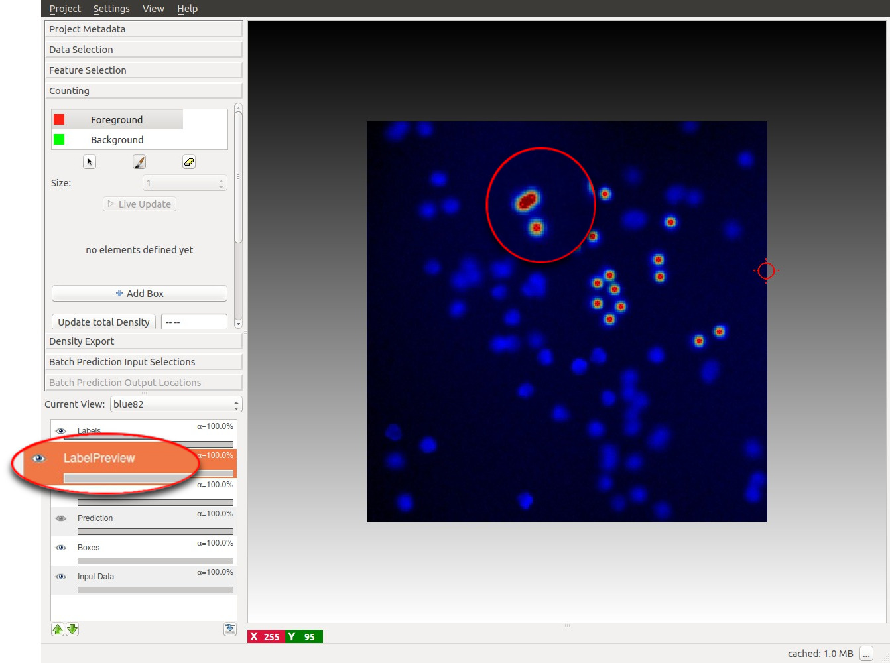</a>

<!-- IMAGE: Good sigma/dot, bad sigma/dot -->
Different choices for the parameter **Sigma** are shown below. On the left image, the value of sigma is
chose too small, while on the right the value of sigma is too large. The center image shows a well chosen sigma.

<a href="fig/different-sigmas2.jpg" data-toggle="lightbox">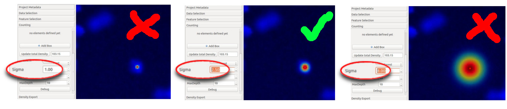</a>

**NOTE**: Large values for sigma can impact the required computation time: consider using a different counting approach, such as the
[Object Classification workflow]({{site.baseurl}}/documentation/objects/objects.html) if this parameter has to be chosen larger than 5.

#### 3.2 Brushing
After a few dots have been placed (say around 10 - 20 depending on the data) we can add training examples for the *background*.

Background labeling works the same as in the
[Pixel Classification Workflow]({{site.baseurl}}/documentation/pixelclassification/pixelclassification.html).

To activate this interaction select the green **Background** label and give broad strokes on the image, as in the figure below, marking unimportant areas or regions where the predicted density should be 0.

<a href="fig/blue_totorial6.jpg" data-toggle="lightbox">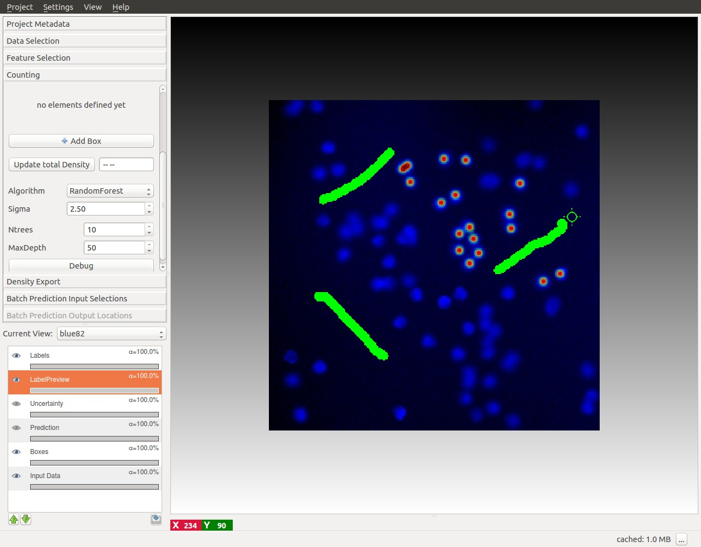</a>

<a id="sec_brushing_interaction_mode">&nbsp;</a>
### 4 Live Update Mode
After some labels for the objects and the background have been given, switch the **Live-Update** on
(using the *Live Update* button), this will trigger a first prediction, displayed in the **Prediction-Layer**.

<a href="fig/blue_totorial7-red.jpg" data-toggle="lightbox">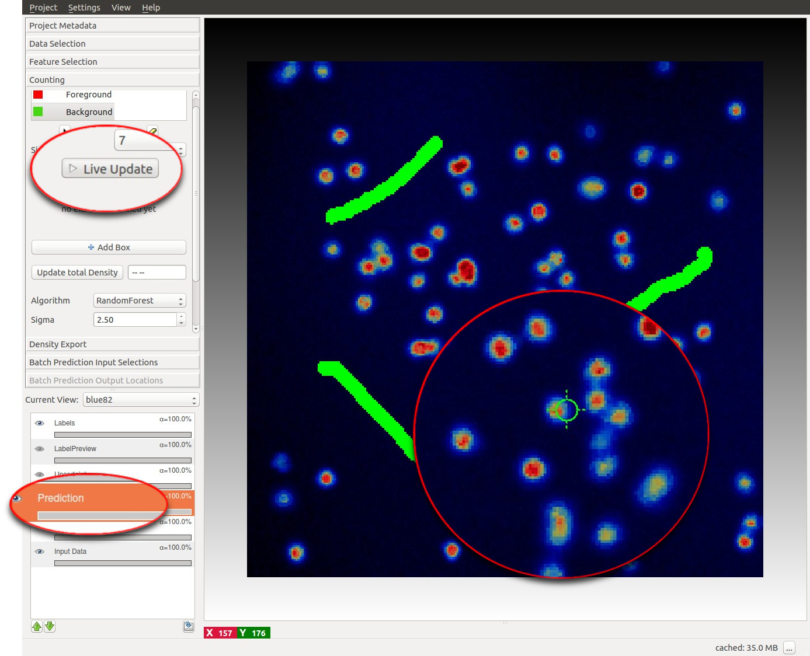</a>

If the Live Update Mode is active, every single change in the training data (e.g. placing new labels or changing parameters)
causes a new prediction - thus it may be faster to toggle it OFF again when you plan extensive modifications.

**How do we get from the density to the number of objects?**

This is explained in the next section.

<a id="sec_boxing_interaction_mode">&nbsp;</a>
### 5 Box Interaction Mode
This interaction takes place **after** we have pressed the *Live Update* Button for the first time. The boxes are operator windows that integrate the density over a certain image region. Therefore they provide the predicted
counts for the objects in that region.

Boxes can also be used to annotate the counts over image regions. This **advanced usage** of the boxes is explained in
the [**Support Vector Regression section**](#sec_svr).

<!-- 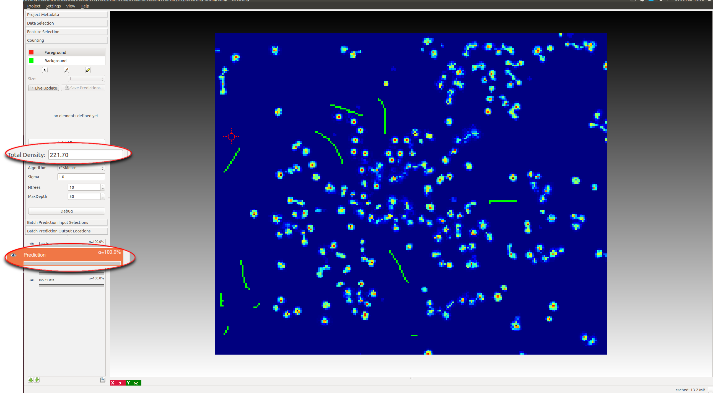 -->

You can start placing boxes by selecting the **Add Box** button and drawing a rectangular region on the image from the top left to the bottom right.
The new box will be added automatically to the **Box List**.
Boxes show the object count for the region on the upper right corner and beside the box name in the Box List as it is shown in the
next figure.

<a href="fig/blue_totorial8-red.jpg" data-toggle="lightbox">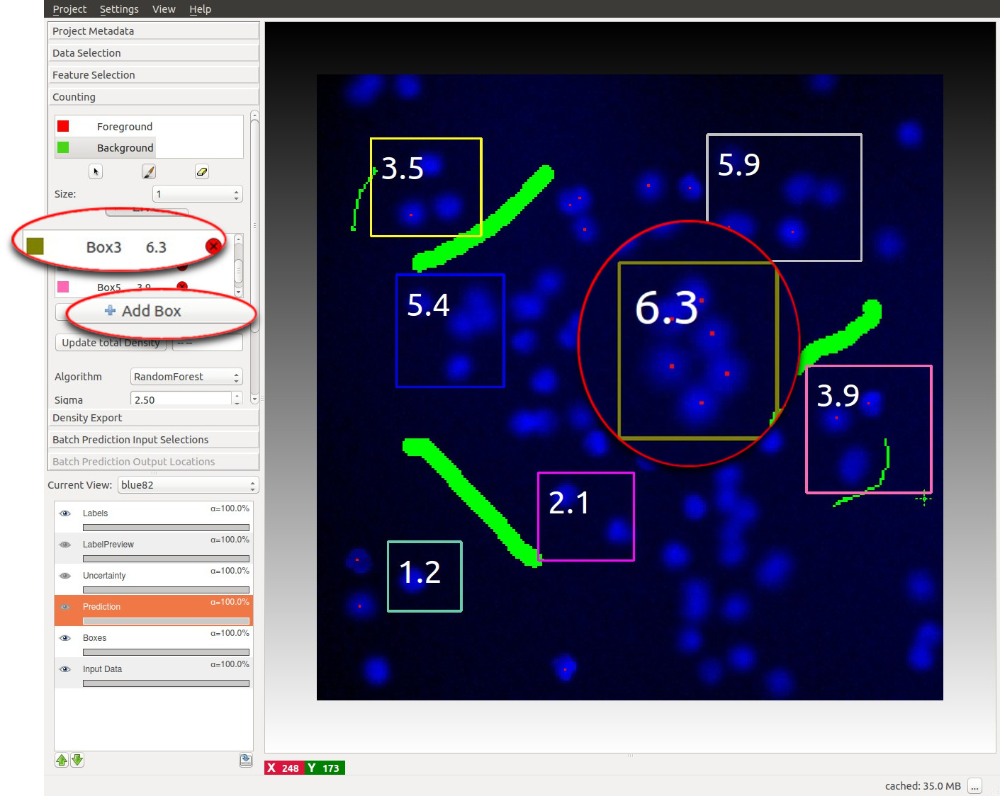</a>

Boxes can be:

* **Selected and Moved**: to select a particular you can select its name the Box List or just pass over it with your mouse. Note that
when you pass over a particular box with the mouse, its name in the BoxList is highlighted. The box will change color once selected.
You can now drag the box in a different position by clicking and moving the mouse while pressing the `Ctrl` key.

* **Resized**: when selecting a box it will show 2 resize handles at its right and bottom borders.

* **Deleted**: to delete a box either click on the delete button (a red cross) on the BoxList or press `Del` while selecting the box

* **Configured**: you can configure the appearance (color, fontsize, fontcolor etc...) of each individual box (or of all boxes at the same time), by clicking on the colored rectangle in the BoxList. The interaction dialog for the box properties is shown below.

You can continue adding boxes and provide new annotations (dots or brushes) for object centers and background until you are satisfied of the counting results as shown by the boxes.

<a href="fig/box_dialog.jpg" data-toggle="lightbox">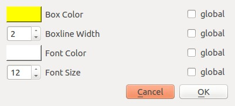</a>

### 6 Counting the entire image
Le us switch to another image by using the **Current View** menu on the left. As is shown in the image below, this image is free from annotations and the prediction of the density is not yet computed. However, the algorithm is already trained and therefore we are ready to compute the density for this new image. As before, it is possible to start the prediction by toggling the Live Update button and monitor the results with a box. However, let us press the **Update total density button** on the left. This button estimates the predicted count **for the entire image**.

If the training labels are sufficient, we should obtain a count similar to what is shown in the image below that matches the number of objects in the images.

**Note**: In a real world scenario, you may need to distribute several annotations across many images to obtain accurate counts for all the images in the dataset.

<a href="fig/blue_totorial12-red.jpg" data-toggle="lightbox">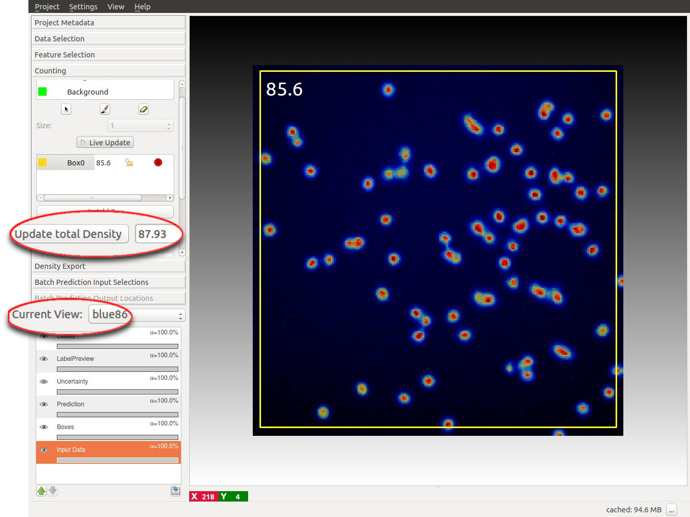</a>

**You are now ready to use the workflow on your data!**
Please continue to read if you want to know some advanced features.

<a id="sec_algorithms">&nbsp;</a>
## The Algorithms
**Two different regression algorithms** are currently supported by the Density Counting workflow depending on the
availability of CPLEX (or GUROBI) on the machine where ilastik is installed. Note that for copyright reason we cannot
provide the license (free for academic use) to this software that can be installed separately following the procedure
described in
[**Advanced Installation**](#sec_advanced_installation).

The most important parameters for our algorithms can be set by an advanced user with the menu on the left; details are given below.

<a id="sec_rf">&nbsp;</a>
### Random Forest
This approach uses a *Random Regression Forest* as regression algorithm.
In general it requires more labels to give correct results over several images. However it is more robust to inhomogeneous background.

The implementation of the random regression forest is based on <a href="http://scikit-learn.org/stable/">sklearn</a>.

<a id="sec_rf_advanced">&nbsp;</a>
#### Advanced parameters
The forest parameters exposed to the user are:
* **Ntrees** number of trees in the forest
* **MaxDepth** maximum depth of each individual tree.

**Both of these parameters influence the smoothness of the prediction and may affect performance**. On the one side, too few and too shallow trees can cause under-fitting of the density. On the other side, too many and too deep trees may also lower performance due to over-fitting and slow down the algorithm computation. This workflow gives the user the possibility to manually tune these parameters.

<a href="fig/rf-algo.jpg" data-toggle="lightbox">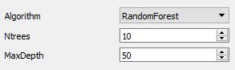</a>

<a id="sec_svr">&nbsp;</a>
### Support Vector Regression
* Requires an installation of CPLEX on the system
* Maybe slower but more robust and better generalization
* Can offer additional type of label via *Box constraints* not strict
* The density inside of a box now be approximately fixed to a real number, providing additional training information
#### Box Constraints
<a href="fig/boxes2.png" data-toggle="lightbox">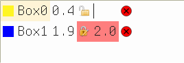</a>
* By clicking on the little lock icon you can easily provide counts for a region (highlighted in red),
which will be taken into account for the training.
* Note that this value only poses a *soft contraint*, so the prediction may slightly differ to better adher to the dot labels.

<a id="sec_advanced_svr">&nbsp;</a>
#### Advanced parameters
C: How much impact should individual and box errors do compared to w itself, this will likely only change results if you set C to low values.
epsilon: The amount of error that will be tolerated for individual pixels, this regularizes the result,
though the defaults should already create good results.

<a id="sec_exporting">&nbsp;</a>
## 4. Exporting results
We can export the results for all the images that were added to the project.
This processing follows a standard ilastik procedure that is demonstrated [here]({{site.baseurl}}/documentation/basics/export.html).

<a id="sec_batch">&nbsp;</a>
## 5. Batch Processing unseen images
For large-scale prediction of unseen images, the procedure is to first interactively train the regressors on a representative subset of the images. Then, use batch processing for the rest of the data. The batch processing follows a standard ilastik procedure that is demonstrated [here]({{site.baseurl}}/documentation/basics/batch.html).

This workflow supports the hdf5 format to store the density for the batch processed images. The density for the batch processed image is stored as a dataset of the hdf5 file, which is easily readable with Matlab or Python. The density can then be integrated to retrieve the count of objects in the image.

**NOTE:** the density can be exported also as a normal grayscale image (\*.png, \*.tiff, etc..). However, due to normalization, the intensity value of the image do not correspond anymore to the predicted density values (originally between 0,1).

<a id="sec_advanced_installation">&nbsp;</a>
## 6. Installation of the 3rd-party plugins
For the additional functionality of the [Support Vector Regression](#sec_rf_advanced), it is required to install the CPLEX-libraries.
We provide simple [Instructions]({{site.baseurl}}/installation/installation.html) on doing so, note
that it this is not required for the basic functionality of this workflow. 

<a id="sec_reference">&nbsp;</a>
## 7. References
\[1\] L Fiaschi, R. Nair, U. Koethe and F. A. Hamprecht.
**Learning to Count with Regression Forest and Structured Labels.**
*Proceedings of the International Conference on Pattern Recognition (ICPR 2012)*, Tsukuba, Japan, November, 2012.
