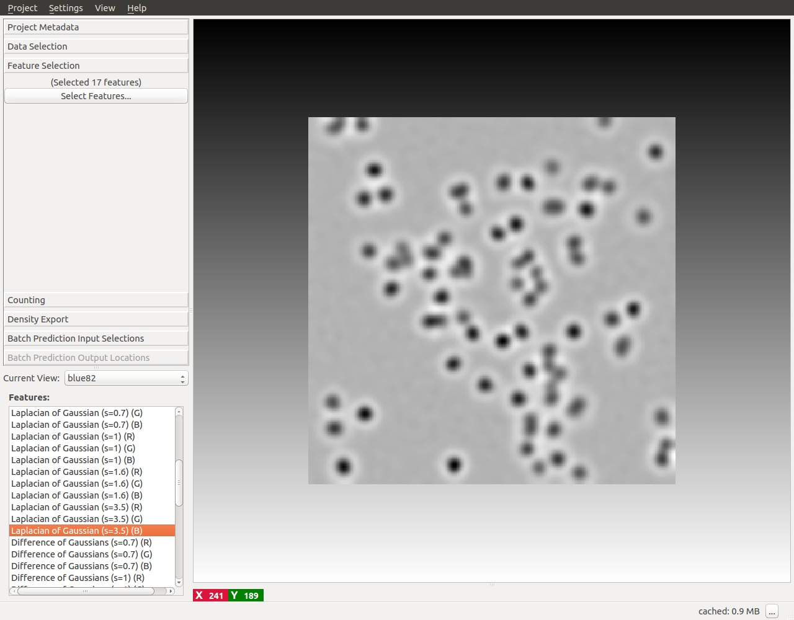
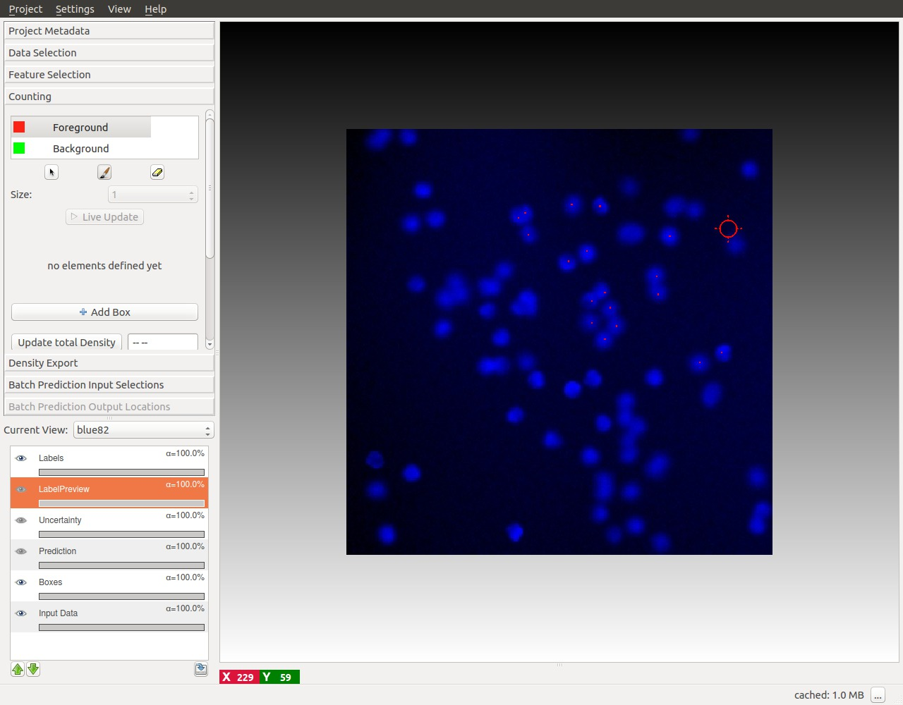
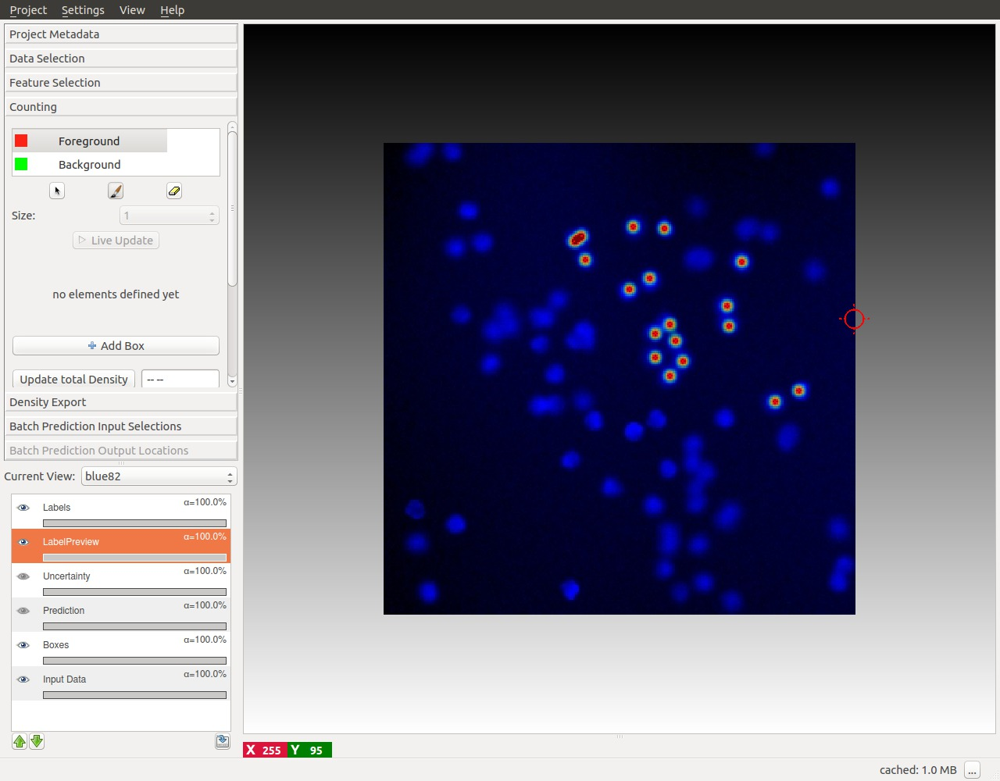
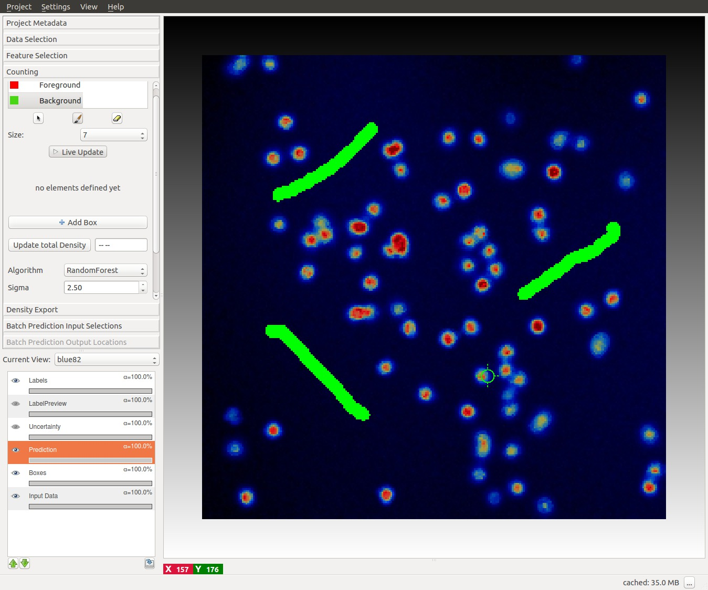
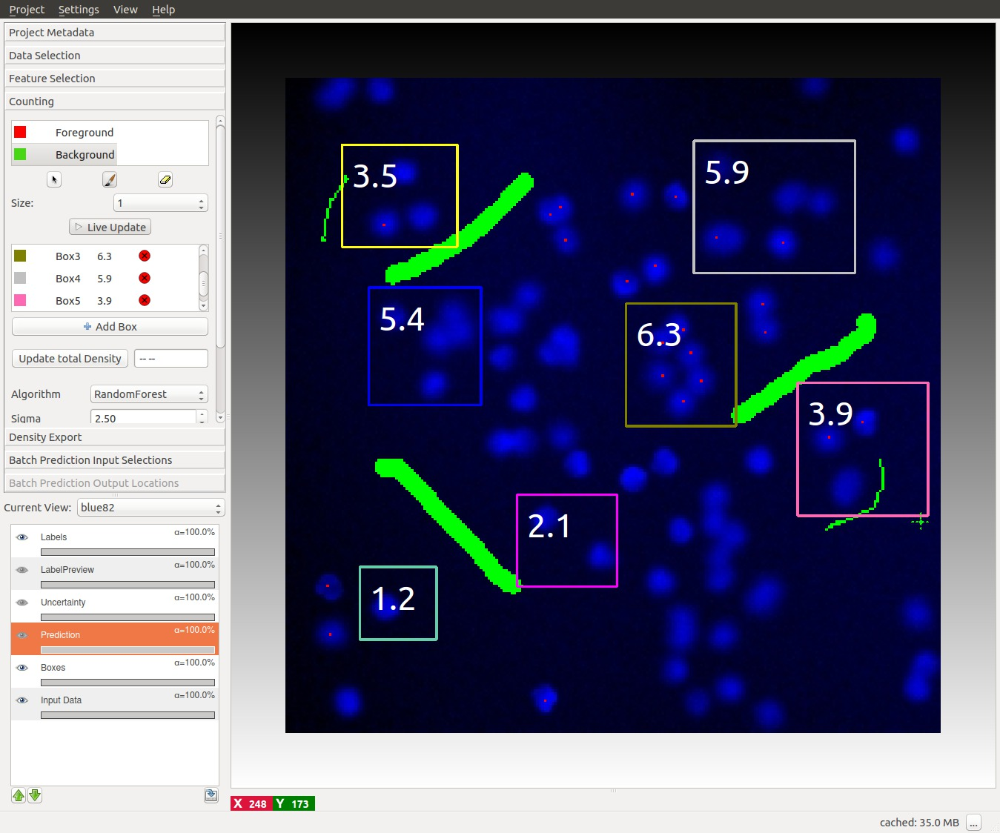
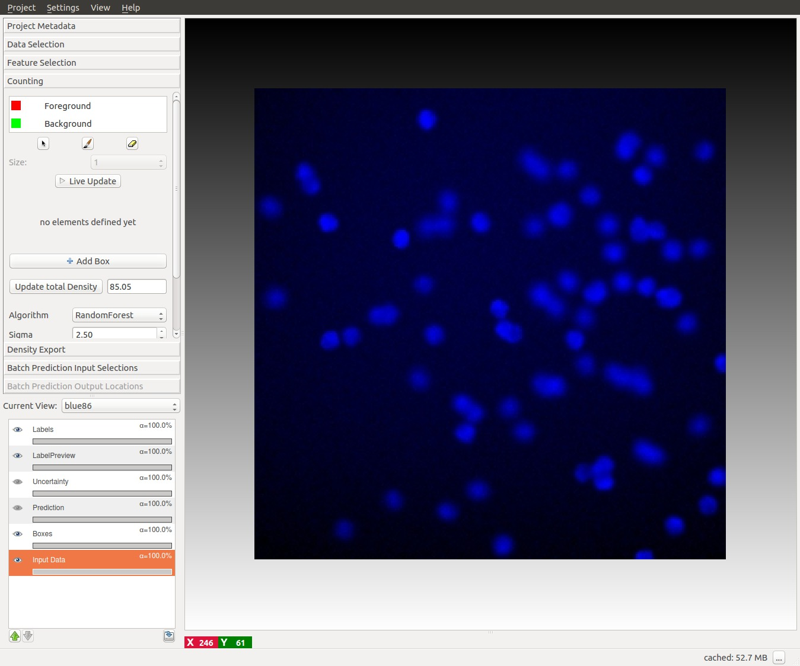

# Interactive Object Counting
## Overview, what it can and cannot do

The purpose of this workflow is to enable the counting of the number of objects in crowded scenes such as cells in microscopy images.

When the density of objects in the image is low and the objects are well separated one from the other it possible to count objects by first
segmenting the foreground and then collecting the connected components as it is done in the
[Object Classification workflow](../objectClassification). However, as the density of the objects increases the latter approach
underestimates the true counts due to under-segmentation errors.

This workflow offers a supervised learning strategy to object counting that is robust to overlapping instances.
It is appropriate for counting **blob-like overlapping objects with similar appearance (size, intensity, texture, etc..)**. Let's make two examples.
The left image in the figure below contains large **non-overlapping** objects with high variability in size and appearance (red nuclei and mitotic yellow nuclei) . Therefore it is best suited for the [Object Classification workflow](../objectClassification).  The two right images in the figure
below contain small overlapping objects that are difficult to segment individually.
The objects in each one of these images have similar appearance and have roughly the same size,
therefore these two images are appropriate for the [Counting workflow](./counting.html).

This workflow will estimate directly the **density of objects** in the image and infer the number objects without requiring segmentation.

## How does it works, what should you annotate
In order to avoid the difficult task of segmenting each object individually, this workflow implements a supervised object counting strategy called **density counting**. The algorithm learns from the user annotations a real valued **object density** whose integral over a
**sufficiently large** image region gives an estimate of the  **number of objects** in that region.

In the following figure, note that the integral of the smooth density is a real number close to the true number of cells in the image.

<!-- The annotations are provided by the user as **dots** for the centers of few training objects and as **brush-strokes** strokes for regions of background.
Further details are provided in the section [**interactive counting**](#sec_interactive_counting).
 -->

It is important to note that the object density is an approximate estimator of the true integer count.
The estimates are close to the true count when are integrated over sufficiently large regions of the image
and when enough training data is provided.

NOTE that also contaminations of the image such as debris or other spurious objects may invalidate the estimated density.

Please refer to the [**references**](#sec_reference) for further details.

The user gives markers (see tutorial below) in the form of **dots (Red)** for the objects centers and **brush-strokes (Green)** for irrelevant background. A pixel-wise mapping between local features and the object density is learned directly from these markers.
This workflow offers the possibility to interactively refine the learned density by:

* Placing more annotations for the foreground and background
* Monitoring the object counts in image regions
* Constraining the number of objects in image regions (requires CPLEX or GUROBI)

<a id="sec_input_data">&nbsp;</a>
## Interactive Counting Tutorial

Let's warm up with a small tutorial.

### 1. Input Data
Similarly to other ilastik workflows, you can provide either images (e.g. \*.png, \*.jpg and \*.tif) directly or pass hdf5 datasets.
The image import procedure is detailed in **LINKME**.
Please note that the current version of the Counting module is limited to handling **2D data only**, for this reason hdf5-datasets with a z-axis or a temporal axis will not be accepted.  Only the training images required for the  manual labeling have to be added in this way, the full prediction on a large dataset can be done via Batch Processing LINKME.
In the following tutorial we will use a dataset of microscopic
cell images generated with <a href = "http://www.cs.tut.fi/sgn/csb/simcep/tool.html"> SIMCEP</a>.
In this tutorial we have already imported the images in the file `counting-tutorial.ilp`,
therefore as the first thing let us just load this project. You should be able to start from the window below.

<a id="sec_feature_selection">&nbsp;</a>
### 2. Feature Selection
The first step is to define the some features. Feature selection is similar to the [Pixel Classification Workflow](../pixelClassification).
In the image below we show how you can choose the features. In particular, blob-detectors like the `Laplacian of Gaussians` or line-detectors like the `Hessian of Gaussians` are appropriate for blob like structure such as cells. In the figure below it is shown the response of the `Laplacian of Gaussians` for the cells in the image.

It is also appropriate to match the scale of the objects and of the cluster of objects with the size of the features as shown in the figure below.
For further details please refer to LINKME.

<a id="sec_interactive_counting">&nbsp;</a>
### 3. Interactive counting
Annotations are are done by painting while looking at the raw data.
The result of this algorithm can be interactively refined while being in **Live-Update** mode.
The overall workflow resemble the [Pixel Classification Workflow](../pixelClassification).
The main difference is that the  Counting workflow gives the user the possibility to:

* Add **dots** for the the object instances
* Add **brush strokes** over the background
* Add **Boxes** to monitor image regions

These list of interactions is typically performed in sequence.
This idea is reflected in the layout of the control panel on the left, which is typically used from **top to bottom**.

<a id="sec_brushing_interaction_mode">&nbsp;</a>
#### 3.1 Dotting
This is  the first interaction with the core of the workflow. The purpose of this interaction mode is to provide
the classifier with examples for the object centers and examples for the background.

To begin placing dots just click on the red **Foreground** label and then on the image.
The dot has to be placed close to the center of each object as in the figure below.

Given the dotted annotations, a smooth training density is computed by placing a Gaussian at the location
of each dot. The size of the Gaussian is a user parameter **Sigma** which should roughly match the object size.
To help deciding an appropriate value for this parameter you will see the that the size of the **crosshair-cursor**
 changes accordingly to the chosen sigma. In addition,
 the density which is used during training is saved in the labelPreview layer as shown in the figure below.

NOTE: Large values for sigma can impact the required computation time: consider using a different counting approach,
such as the [Object Classification workflow](../objectClassification) if this parameter has to be chosen larger than 5.

FIXME IMAGE: Showing different sigmas

#### 3.2 Brushing
After that a few dots are placed (say from 10 - 20 ) we can add training examples for the background.

Background labeling happens exactly as in the [Pixel Classification workflow](../pixelClassification).
To activate this interaction click on the green **Background** label and give broad strokes, as in the figure below,
marking unimportant areas or regions where the predicted density should be 0.

<!-- IMAGE: Good sigma/dot, bad sigma/dot -->

<a id="sec_brushing_interaction_mode">&nbsp;</a>
### 4 Live Update Mode
After that the some labels for the dot and for the background has been given, switch on the **Live-Update**
button and observe the predicted density.
After that the prediction has been computed for the first time the **Prediction-Layer**.

Live Update Mode allows to observe the results of the prediction while
giving new labels. However it is often faster to toggle this mode ON and OFF  while labeling.

**How do we pass from the density to the number of objects?**

This is explained in the next section.

<a id="sec_boxing_interaction_mode">&nbsp;</a>
### 5 Box Interaction Mode
This interaction takes place after that the you have pressed the LiveUpdate Button for the first time.
The boxes are windows that integrates the density over a certain image region and therefore provide the predicted
counts for the objects in that region.
**Advanced usage** of the boxes is explained in the Support Vector Regression section.

<!--  -->

You can start placing boxes by clicking on the **add Boxes** button and drawing the box region on the image.
The new box will be added automatically to the **Box List**.
Boxes show the object count for the region on the upper right corner and beside the box name in the Box List as it is shown in the
next figure.

Boxes can be:
* **Selected and Moved around**: to select a particular you can select its name the Box List or just pass over it with your mouse. Note that
when you pass with your mouse over a particular box, its name in the BoxList is highlighted. The box will change color once selected.
You can now drag the box in a different position while pressing the `Ctrl` key .
* **Resized**: when selecting a box it will show 2 resize handles at its borders.
* **Deleted**: to delete a box either click on the delete button ( a red cross) on the BoxList or press `Del` while selecting the box
* **Configured**: you can configure the appearance (color, fontsize, fontcolor etc.. ) of each individual box (or of all boxes at the same time), by clicking on the colored rectangle in the BoxList. The interaction dialog for the box properties is show below.

You can continue adding boxes and provide labels for objects centers and background until you are satisfied of the results.

### 6 Counting the entire image
Le us switch to another image by using the  appropriate menu on the left. As it is shown in the image below,
this image will be free from labels and the prediction of the density will not  be yet computed.

It is possible to start the prediction by toggling the Live Update button.
However, let us press the **Update total density button** on the left.

This button estimates the density and provides the predicted count **for the entire image**.
If the training labels are sufficient, we should obtain a count similar to what is shown in the image below.

**You are now ready to use the workflow on your data!**
Please continue to read if you want to know some advanced features.

<a id="sec_algorithms">&nbsp;</a>
## The Algorithms
**Two different regression algorithms** are currently supported by the Counting workflow depending on the availability of CPLEX on the machine where ilastik is installed. We expose the most important and well-known parameters for our algorithms to the advanced user, details are given below.

<a id="sec_rf">&nbsp;</a>
### Random Forest
This approach uses a Random Regression Forest as regression algorithm.
In general it requires more labels to give correct results over several images, however it is more robust to inhomogeneous background.

The implementation of the random regression forest is based on <a href = "http://scikit-learn.org/stable/"> sklearn</a>.

<a id="sec_rf_advanced">&nbsp;</a>
#### Advanced parameters
The forest parameters exposed to the user are:
* **Ntrees** Number of trees in the forest
* **MaxDepth** maximum depth of each individual tree.

FIXME IMAGE: Effect of different parameters

<a id="sec_svr">&nbsp;</a>
### Support Vector Regression
Requires Gurobi
Slower
Better generalization
Can offer additional type of label via Box constraints
-Box constraints not strict
#### Box Constraints
Box constraints offer an easy way to provide counts for a region, while not having to label every instance individually.

<a id="sec_advanced_svr">&nbsp;</a>
#### Advanced parameters
C: How much impact should individual and box errors do compared to w itself, this will likely only change results if you set C to low values.
epsilon: The amount of error that will be tolerated for individual pixels, this regularizes the result.
though the defaults should already create good results.

<a id="sec_exporting">&nbsp;</a>
## 4. Exporting results
BUOTE - Can also save prediction itself. If you want to export the results for a single image, use exportLayerDialog.

<a id="sec_batch">&nbsp;</a>
## 5. Batch Processing
BUOTE - For large-scale prediction, first train regressors, then add input images, then press export all.

<a id="sec_reference">&nbsp;</a>
## 6. References
FIXME: reference
