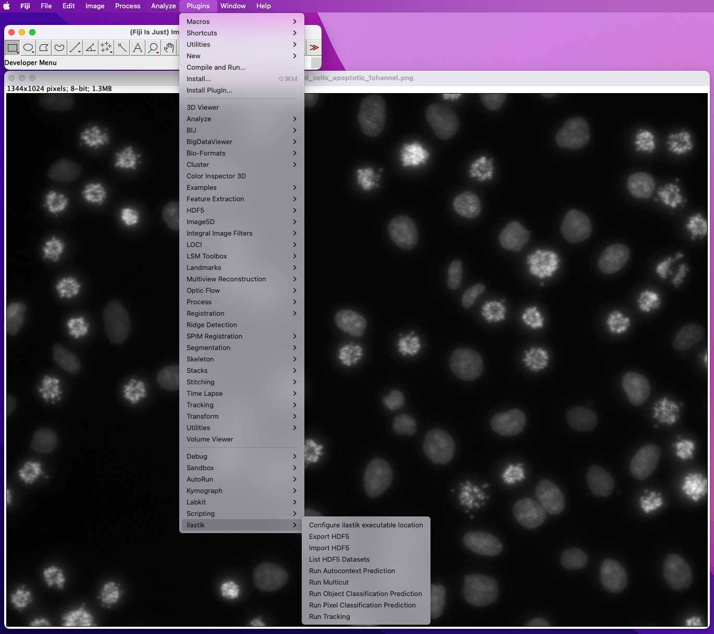

# ilastik Fiji plugin

This plugin allows you integrate ilastik with Fiji.
The main functionality of the plugin is [import][docs-import]/[export][docs-export] to HDF5 format and running trained ilastik workflows from within Fiji.

HDF5 is a format that allows ilastik efficient block-wise processing of data.
You will get the best performance in ilastik using this format.
While the conversion to HDF5 is beneficial for any large dataset, we especially recommend it for _multipage tiffs_.

ilastik workflows currently supported by the plugin are [Pixel Classification, Autocontext][docs-pc-ac], [Object Classification][docs-oc], [Multicut][docs-mc], and [Tracking][docs-tr] Workflows. 

All features the plugin provides can be automated via Fiji macros (see [our examples][docs-examples].)

## Installation

In FIJI, go to _Help->Update..._ In the dialog that appears, click the "Manage update sites" button. In the list of update sites, select "ilastik".
You should now see `ilastik4ij.jar` in your updater window.

 

After restarting Fiji you should see an _ilastik_ entry in the _Plugins_ menu:

Please visit the [plugin documentation][docs] if you want to know more about the plugin usage.

[docs]: https://github.com/ilastik/ilastik4ij#ilastik-imagej-modules
[docs-import]: https://github.com/ilastik/ilastik4ij#import
[docs-export]: https://github.com/ilastik/ilastik4ij#export
[docs-pc-ac]: https://github.com/ilastik/ilastik4ij#pixel-classification-and-autocontext
[docs-oc]: https://github.com/ilastik/ilastik4ij#object-classification
[docs-mc]: https://github.com/ilastik/ilastik4ij#boundary-based-segmentation-with-multicut
[docs-tr]: https://github.com/ilastik/ilastik4ij#tracking
[docs-examples]: https://github.com/ilastik/ilastik4ij/tree/main/examples
