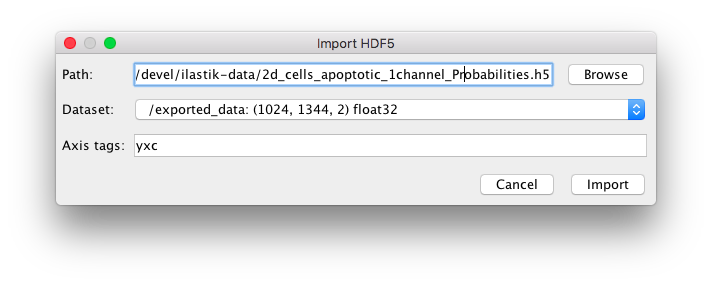

# ilastik Import Export plugin in FIJI
This plugin allows you to save images opened in FIJI directly to the hdf5 format preferred by ilastik. While this conversion is beneficial for any large dataset, we especially recommend it for _multipage tiffs_. After you save the file and process it with ilastik, you can use the same plugin to load the results for further post-processing in FIJI.

## Installation
In FIJI, go to _Help->Update..._ In the dialog that appears, click the "Manage update sites" button. In the list of update sites, select "ilastik". You should now see ilastik4ij.jar in your updater window.

 

## From FIJI to ilastik

 

 

This is how you find the right export option from within FIJI (<em>Plugins->ilastik->Export HDF5</em>).
It will warn you to be careful with the axes order, but don't worry, if you get it wrong you can still correct it on import in ilastik.

## ilastik

Open the file as usual. If the axis order is wrong, as shown in this figure (tzyxc instead of txyzc), change it in this dialog.

Train the classifier in ilastik as you usually would (see [Pixel Classification workflow]({{site.baseurl}}/documentation/pixelclassification/pixelclassification.html) docs if you are not sure how to proceed). Once you are happy with the results, switch to the export applet. 

 

Depending on your post-processing, export <b>Probabilities</b> or <b>Simple Segmentation</b>. You can control the export source by the "Source" drop-down menu. For probability maps you can either leave all settings at default, or, if you need to save space, convert the results to unsigned int 8-bit and rescale them from [0.0, 1.0] interval to [0, 255].

## From ilastik to FIJI

Using the same plugin, you can now load your results into FIJI by selecting "import HDF5" in the <em>Plugins->ilastik</em> menu.

For <b>Segmentation/Label images</b>, you should select a suitable lookup-table in Fiji (e.g. glasbey) after importing the data: <em>Image->Lookup Tables->glasbey</em>.

If you load Probabilities, you should see something like the left image. For Simple Segmentation with a lookup-table you should see the right image.

