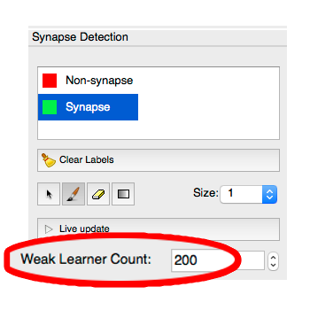
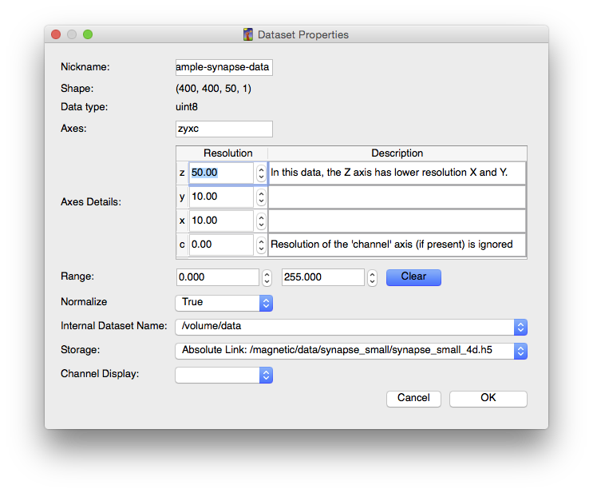

# IIBoost Synapse Detection

The **IIBoost Synapse Detection** workflow is a specialized variant of the generic **[Pixel Classification Workflow][]** aimed at detecting synapses in EM data from mammalian neuropil.

[Pixel Classification Workflow]: {{site.baseurl}}/documentation/pixelclassification/pixelclassification.html

Instead of using a random forest classifier with arbitrary label classes, it uses the [IIBoost][] classifier for identifying mammalian synapses in EM data.
The classification technique is described in [*Learning Context Cues for Synapse Segmentation*][1]\[1\].

[IIBoost]: http://github.com/cbecker/iiboost

The interface for the **IIBoost Synapse Detection** workflow has the following differences from the Pixel Classification Workflow:

- On the **Feature Selection** page, the set of recommendend features is already selected for you.  You can change them if you wish.

- On the **Synapse Detection** (a.k.a. Training) page, you cannot customize the label classes.  They are hard-coded as **Synapse** and **Non-synapse**.

- You may adjust the accuracy (and speed) of the classifier by changing the **Weak Learner Count** as shown below.

- You can (and should) enter your dataset resolution via the **Input Data** page.  Do this by right-clicking on your dataset name and selecting **Edit Properties**.  Enter the resolution details in the window as shown below.  (If your data is anisotropic, IIBoost uses the ratio between the Z resolution and the X/Y resolution to aid its predictions.)

\[1\]: C. J. Becker, K. Ali, G. Knott and P. Fua. [*Learning Context Cues for Synapse Segmentation*][1], in IEEE Transactions on Medical Imaging, vol. 32, num. 10, p. 1864--1877, 2013. 

[1]: http://infoscience.epfl.ch/record/183638?ln=en
