# Manual Tracking

## Overview and Scope
While the
<a href="../chaingraphTracking/">automated Tracking workflow</a>
is used to track multiple (dividing) objects in presumably big datasets, the purpose of the Manual Tracking
workflow is to track objects manually from previously detected objects. 
This may be useful for high-quality tracking of small datasets or 
ground truth acquisition. To speed up this process, sub-tracks may be generated automatically for trivial
assignments such that the user only has to link objects where the tracking is ambiguous.

The Manual Tracking workflow builds on the results of the
<a href="../pixelClassification/">Pixel Classification workflow</a>. 
From the objects detected in this workflow, the user creates track (objects linked over time)
in a semi-automated fashion, 
optionally allowing for object divisions
(e.g. cell mitosis). While undetected objects may not be recovered to date, the user can correct for 
the following kinds of undersegmentation errors: Merging (objects merge into one detection and later split again),
and misdetections (false positive detections due to speckles or low contrast).

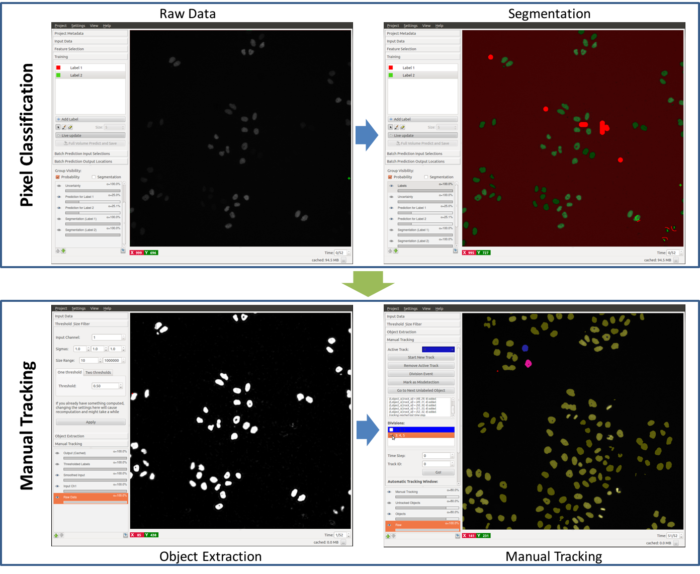

Just as in the Pixel Classification, both 2D(+time) and 3D(+time) data may be processed. 
To learn about how to navigate in temporal data ( *scroll through space or time, 
enable/disable overlays, change overlay capacity, etc.* ) please read the <a
href="../navigation/">Navigation guide.</a>

We will now step through a tutorial how to manually track proliferating cells both in 2D+time
and 3D+time data, which are both provided in the 
<a href="../../Download/">Download</a> section.

## Workflow Components

To date, this workflow expects the image sequence to be loaded as a dataset
in a hdf5 files with the axis order `txy(z)c` (time, space, channel). 
The workflow will soon also support image sequences such as 
tif or png.

Before starting the Manual Tracking workflow, the data has the be segmented into fore- and 
background. The tutorial uses the dataset 
`mitocheck_94570_2D+t_01-53.h5` kindly provided by the
<a href="http://www.mitocheck.org">Mitocheck project</a>,
which is available in the <a href="../../Download/">Download</a> section. 

### 0. Segmentation:
The workflow is based on the results of the 
<a href="../pixelClassification">Pixel Classification workflow</a>, where the
user segments foreground objects (e.g. cells) from background by defining two
labels and providing examples through brush strokes. 
Please find a detailed
description of this workflow 
<a href="../pixelClassification">here</a>. 
In this example, we paint some background
pixels with Label 1 (red by default) and cell nuclei are marked with Label 2 
(green by default). When happy with the live segmentation, the user applies
the learned model to the entire dataset by choosing the time sequence as batch 
processing input and exporting the results to 
`mitocheck_94570_2D+t_01-53_results.h5`. 
To directly showcase the Manual 
Tracking workflow, we provide this file with the data.

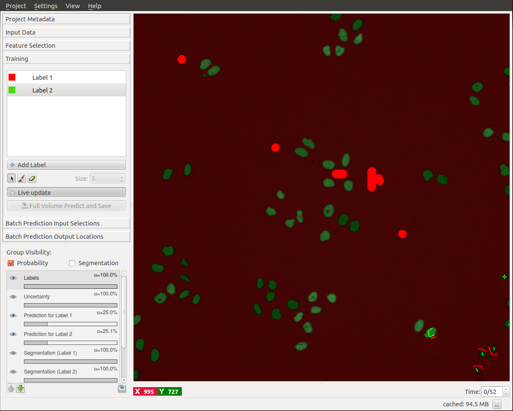

Now, the Manual Tracking workflow can be launched from the start screen of ilastik
by creating a new project.

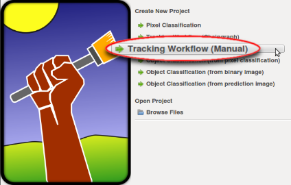

This workflow comprises the following applets:

### 1. Input Data:
To begin, the raw data and the prediction maps (from the Pixel Classification workflow) 
need to be specified in the respective tab. In particular, the file 
`mitocheck_94570_2D+t_01-53.h5` 
is added as **Raw Data** and the dataset in
`mitocheck_94570_2D+t_01-53_results.h5`
is loaded as **Prediction Maps**.

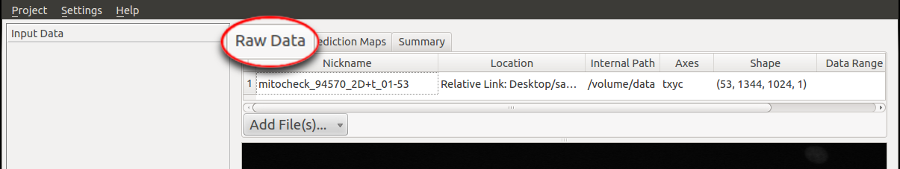

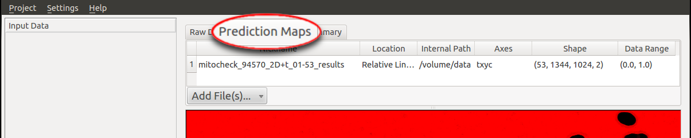

After specifying the raw data and its prediction maps, the latter will be smoothed
and thresholded in order to get a binary segmentation, 
which is done in the **Thresholding and Size Filter** applet.

### 2. Thresholding and Size Filter:
First, the channel of the prediction maps which contains the foreground 
predictions has to be specified. 
For instance, if in the Pixel Classification workflow,
the user chose Label 1 (red by default) to mark foreground, **Channel** will be 0, 
otherwise, if Label 2 (green by default) was taken as the foreground label, then Channel
takes value 1. Thus, we choose the Input Channel to be 1 in this tutorial. If the correct 
channel was selected, the foreground objects appear in white after pressing **Apply**:

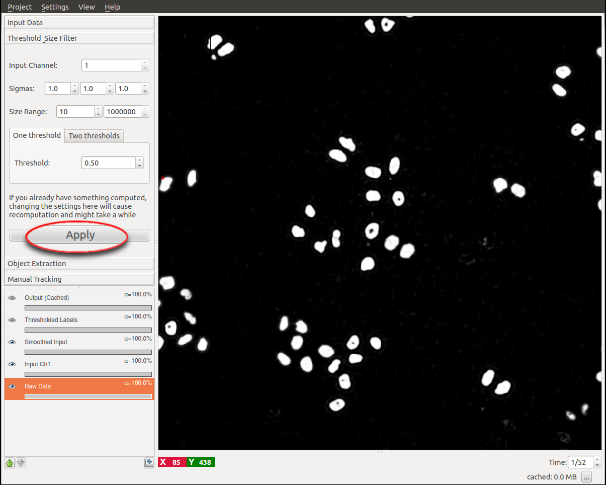

The prediction maps are now storing a probability for each single pixel/voxel to be foreground. 
These probabilities may be smoothed over the neighboring probabilities with a Gaussian filter,
specified by the **Sigma** values (allowing for anisotropic filtering).
The resulting probabilities are finally **thresholded** at the value specified. The default
values for the smoothing and thresholding should be fine in most of the cases. 
Please consult the documentation of the
<a href="../objectClassification">Object Classification workflow</a>
for a more detailed description of this applet, including an explanation of the **Two thresholds** 
option.

Finally, objects outside the given **Size** bound are filtered out for this and the following
steps.

***Please note that all of the following computations and the manual tracking will 
be invalid (and deleted) when parameters in this step are changed.***

In the following applets, connected groups of pixels will be treated as individual objects.

### 3. Object Extraction:
This is the most computation intensive step of the workflow. Note that dependent on
the size of the datasets, this step might take minutes to hours.

All the user has to do here is to press the **Calculate Features** button. Neighboring
pixels/voxels are then grouped (in 2D or 3D, respectively) to define individual objects,
those objects are assigned independent and unique identities (indicated by distinct colors
in the **LabelImage** overlay), and features of the objects (e.g. region centers)
are computed.

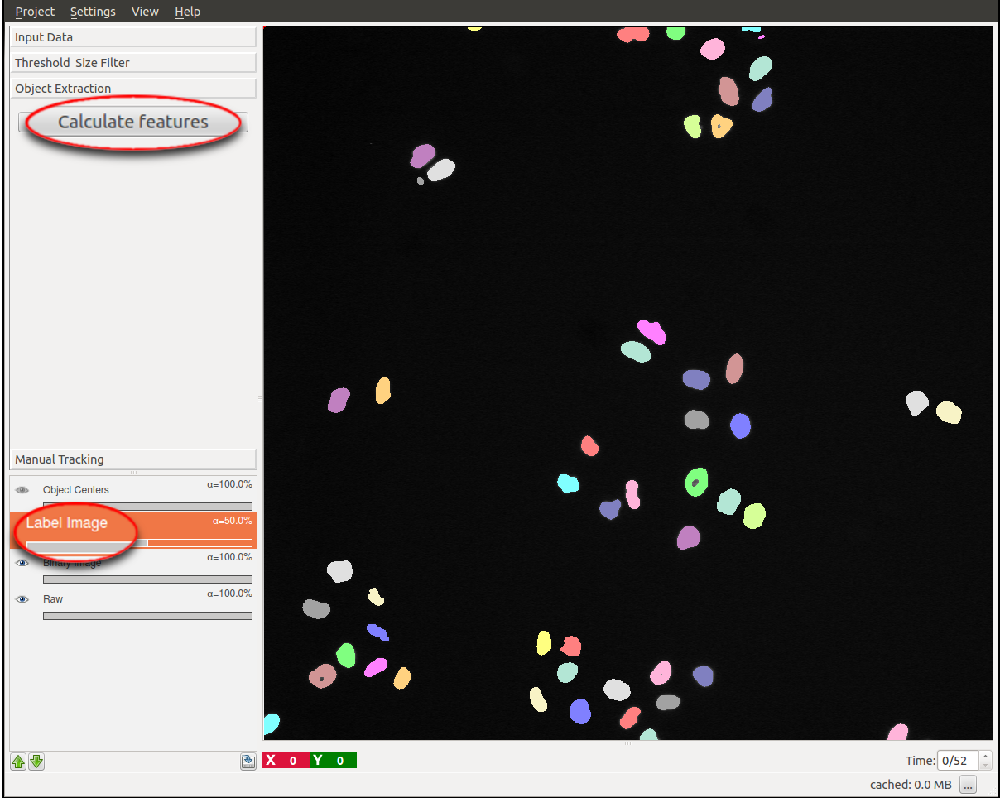

When the computation was successful, the user can start with the actual tracking
of the detected objects.

### 4. Manual Tracking:

The purpose of this workflow is to manually link detected objects in consecutive time steps
to create tracks (trajectories/lineages) for multiple (possibly dividing) objects. All
objects detected in the previous steps are indicated by a yellow color.

Note that -- as in every workflow in ilastik -- displaying and updating the data is much faster when
zooming into the region of interest.

#### Tracking by Clicking or by Automatic Procedure
To **start a new track**, the respective button is pressed and the track ID
with its associated color (blue in the example below) is displayed as **Active Track**. Then,
each object which is (left-) clicked, is marked with this color and assigned to the current track.
Note that the next time step is automatically loaded after adding an object to the track 
and the logging box displays the successful assignment to the active track.
Typically, we start with an arbitrary object in time step 0, but any order is fine.

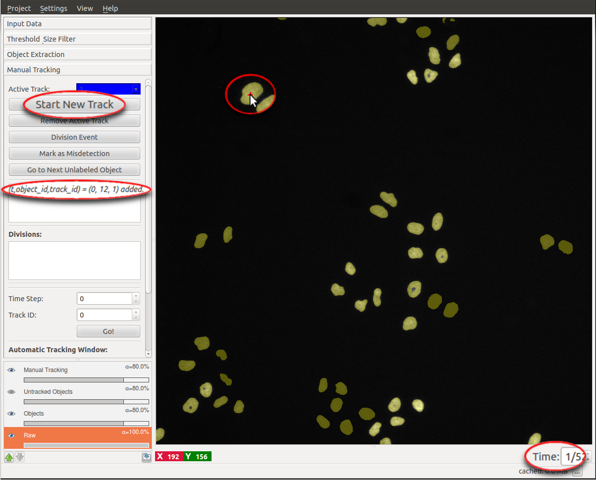

In theory, one could now proceed as described and click on each and every object in the following
time steps which belongs to this track. However, this might be rather cumbersome for the user, especially
when dealing with a long image sequence. Instead, the user may use an automatic procedure for the
trivial assignments, i.e. assignments where two objects in successive time frames distinctly overlap in space.
This **automatic tracking** procedure can be started by right-clicking on the object of interest:

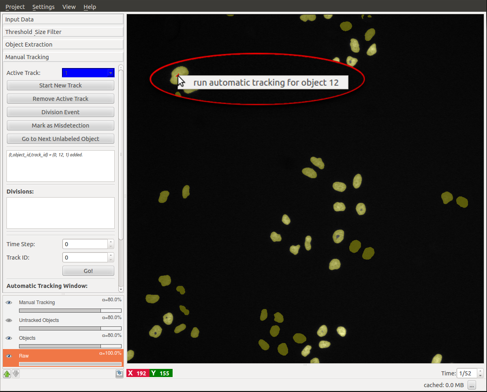

The automatic tracking will continue assigning objects to the active track until a point is reached
where the assignment is ambiguous. Then, the user has to decide manually which object to add to the
active track, by repeating the manual or automatic assignments described above.
The track is complete when the final time step is reached. 
To start a new track, one navigates back to the first timestep (either by entering `0` in the time
navigation box in the lower right corner of ilastik, or by using `Shift` + `Scroll Up`).
Then, the next track may be recorded by pressing **Start New Track**.

#### Divisions
In case the user is tracking **dividing objects**, e.g. proliferating cells as in this tutorial,
divisions have to be assigned manually (the automatic tracking will stop at these points). To do so,
the user clicks the button **Division Event**, and then -- in this order -- clicks on the 
parent object (mother cell) followed by clicks on the children objects (daughter cells) *in the next
time step* (here: green and red). As a result, a new track is created for each child. The connection between the parent 
track and the two children tracks is displayed in the **Divisions** list, colored by
the parent object's color (here: blue).

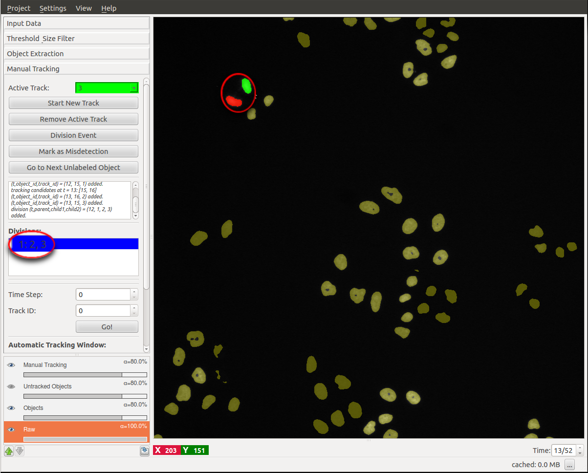

Now, the first sub-lineage may be followed (which possibly divides again, etc.), and when
finished, the user can go back to the division event to follow the second sub-lineage (the respective
track ID must be selected as **Active Track**). To do so, double clicking on the
particular event in the division list navigates to the parent object (mother cell).
It is useful to check its box in order to indicate already processed divisions.
Note that these sub-lineages may more efficiently be tracked with the *automatic tracking* procedure 
described above.

#### Supported Track Topology

The following track structure is supported:

- **One object per track per time step**: Each track ID may only appear at most once per time step. To track
another object, the user has to start a new track. 
- **Merging objects**: Due to possible occlusions or undersegmentation resulting
from the Pixel Classification workflow (i.e. two or
more objects are detected as only one object), it is possible to assign multiple track IDs to
one object. For instance, two distinct cells in previous time steps are merging into one detection and 
later splitting again. Then -- in the sequence where the two cells are occluding each other -- the detections
are treated as *Mergers* of two tracks, and the tracks are recovered after the occlusion.
It should be noted that the object is marked with a color randomly chosen from the track IDs of the comprised
objects. By right-clicking on the object, the user may check which track IDs it is assigned to.
- **Misdetections**: It may happen that background is falsely detected as foreground objects. For reasons of
clarity, the user may
mark those objects explicitly as false detections with black color
by pressing **Mark as Misdetection** followed by a click
on the object. Note, however, that untracked objects later would not be exported anyway.
- **Appearance/Disappearance of objects**: Due to low contrast or limited field of view, objects may appear
or disappear. If an object does not have an ancestor or successor in the directly adjacent timesteps, an
appearance or disappearance event, respectively, is evoked. 

#### Advanced Features

Further features in the Manual Tracking applet are:

- **Go to next unlabeled object**: Although the objects may be tracked in an arbitrary order, it is sometimes
useful to automatically jump to the next untracked object, particularly if only few objects are left to track.
The user may then either track the suggested object or mark it as misdetection to get another suggestion for an
object to track next.
- **Window size**: These parameters define the size of the window in which the automatic tracker searches for
overlapping between objects of consecutive time steps. Note that the tracking is faster for smaller window sizes,
however, longer sub-tracks may be achieved by bigger window sizes. For the example datasets, we choose a window
size of 40 pixels along each dimension.
- **Inappropriate track colors**: If the color of the next active track is inapproriate (e.g. it has low contrast
on the user's screen, it may be mixed up with other colors in the proximity of the object of interest, or it
is some already reserved color), the user may just leave this track empty and start another track.
- **Delete label**: False assignments of track IDs can be deleted by right-clicking on the respective object.
The user then has the option, to (i) delete the respective track label from this single object, (ii) delete
the track label in the current and all later time steps, or (iii) delete the track label in the current
and all earlier time steps:
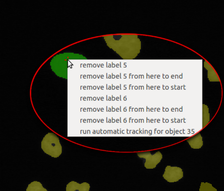

#### Export
To export the manual tracking, the user may choose between the following three options, allowing for maximal
flexibility to adopt the results to the format needed for the next step in the user's process:

1. **Export as tif**: By pressing the **Export Results as tif...** button, an image sequence is created where 
each **lineage** has the same label, i.e. starting with unique IDs in the first time step for each object (pixelwise),
each successor
as well as possible sub-lineages (e.g. daughter cells) are indicated with the same ID. Note, however,
that *Mergers* get only one of their comprised track IDs assigned.

2. **Export as h5**: Another option is to export the manual tracking as a set of hdf5 files, one for 
each time step, containing pairwise events between consecutive frames (appearance, disappearance, move,
division, merger). Please find a detailed explanation of these datasets in 
the user documentation for the 
<a href="../chaingraphTracking/">automatic Tracking workflow</a> or in the attributes of the 
generated hdf5 files.

3. **Process the content of the project file**: The ilastik project file (.ilp) may be opened with any hdf5 dataset viewer/reader, 
e.g. with `hdfview`. Here, in the Manual Tracking folder, there are the folders `Labels` and `Divisions`. The `Labels`
folder contains for each time step a list of objects, each of which holds a list of the track IDs which were assigned by the
user. The `Divisions` dataset contains the list of divisions in the format

        track_id_parent track_id_child1 track_id_child2 time_parent

## Manual Tracking in 3D+time Data

One strength of this manual tracking workflow compared to similar programs available on the web is that 
manual tracking in 3D+time (`txyz`) data is completely analogous to the manual tracking in 2D+time (`txy`) data
described above. The data may be inspected in a 3D orthoview and a click on a pixel of the object is 
accepted in any orthoview. Readily tracked objects are colored in 3D space, i.e. colored in all
orthoviews with the respective track color. 

To get started with 3D+time data, we provide example data in the
<a href="../../Download/">Download</a> section. The file 
`300-349_demo.h5` shows 50 time steps of a small excerpt of a developing *Drosophila* embryo, kindly
provided by the 
<a href="http://www.embl.de/research/units/cbb/hufnagel/">Hufnagel Group at EMBL Heidelberg</a>.
A sample segmentation of cell nuclei in this dataset is available in `300-349_demo_results.h5`.

For a manual tracking, the steps of the 2D+time tutorial above may be followed analogously.

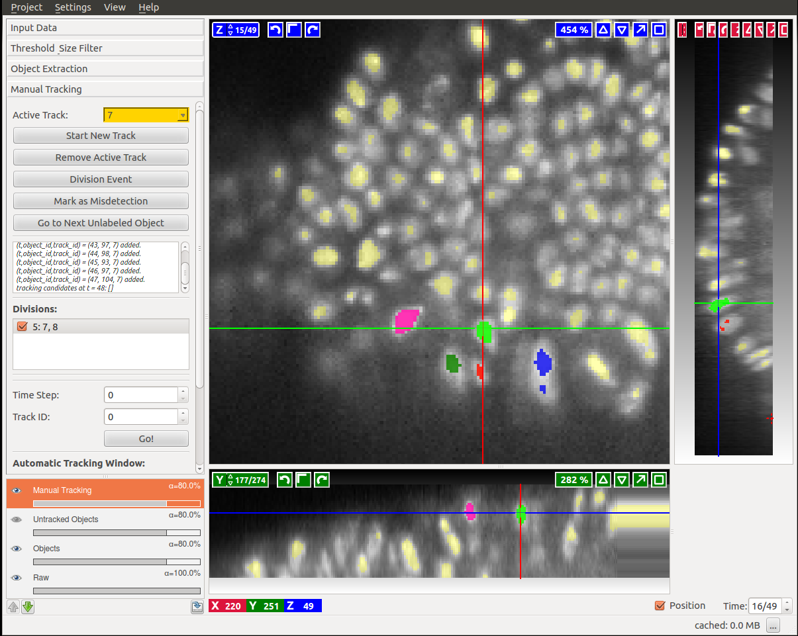

