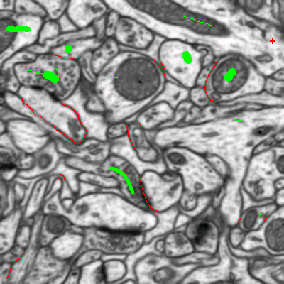
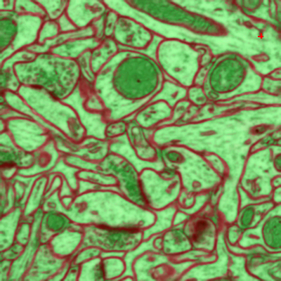
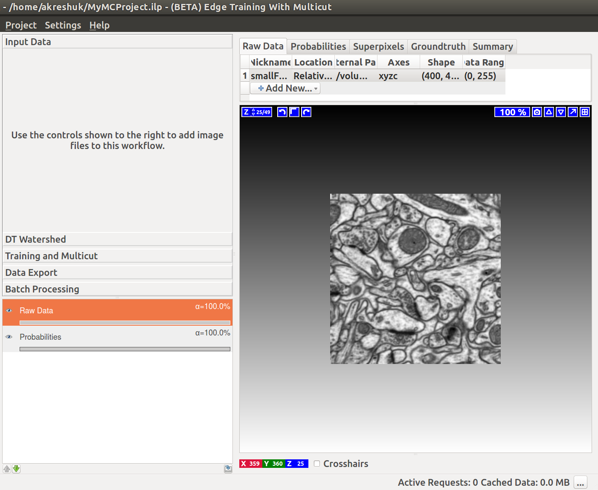
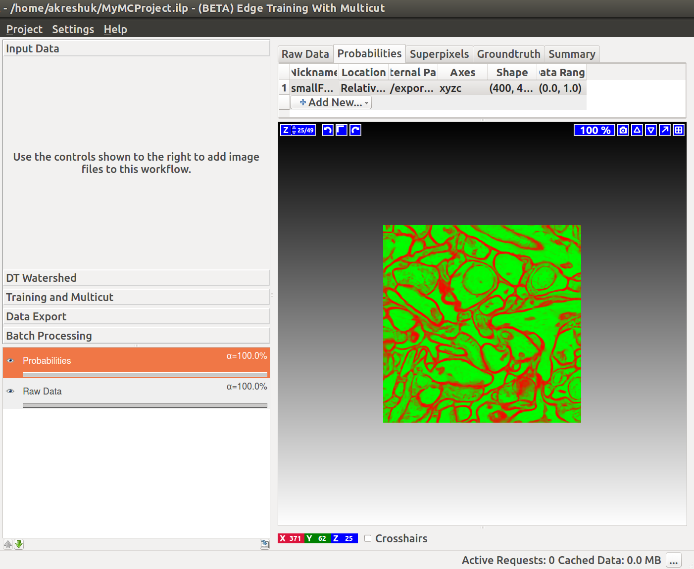
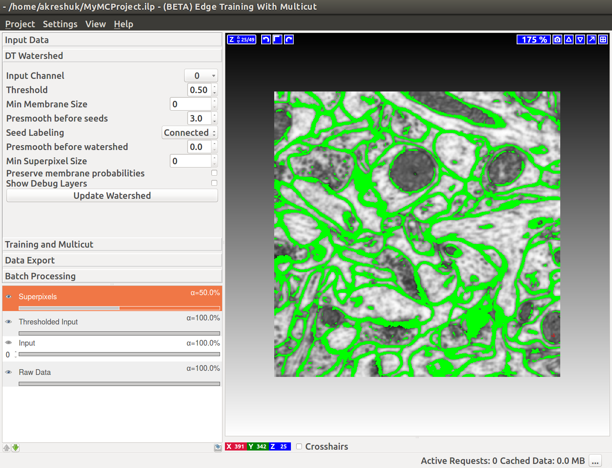

# Boundary-based segmentation with Multicut

## What it is and why you need it

This workflow allows you to segment images based on boundary information. Given a boundary probability map, it breaks the image up into superpixels and then merges them to recover segments limited by closed surfaces (no dangling edges). The main algorithm, known as multicut or correlation clustering, was presented in [this paper](http://ieeexplore.ieee.org/document/6126550/) by B. Andres. Its applications to biological image analysis can be found in, for example, [connectomics data](http://link.springer.com/chapter/10.1007%2F978-3-642-33712-3_56) or [bright field and phase contrast images](http://link.springer.com/chapter/10.1007/978-3-319-10404-1_2). 

## How to use it

### Boundary evidence
Start by creating a boundary probability map. This can be done with ilastik's [Pixel Classification workflow]({{site.baseurl}}/documentation/pixelclassification/pixelclassification.html) or by an outside program. The images below illustrate the boundary map creation in ilastik for a very small stack of electron microscopy images of a mouse brain (data from Graham Knott's lab, EPFL). 

 

    
    
Pixel Classification: labels

    

        
        
Pixel Classification: predictions

### Load the data
If we now start the Multicut workflow and load the raw data and this probability map, you'll see something like this:

If you have already computed **superpixels** on your data, you can also load them in the corresponding tab and skip the superpixel creation step described below. If you also have a **groundtruth** segmentation, load it as well and the method will use it for training instead of interactively provided labels. The trained workflow can, as usual, be applied to other datasets in batch or headless mode.

### Superpixels -- DT Watershed
We compute superpixels by the watershed algorithm, running it on the distance transform of the boundary probability map. Our approach is described in the Supplementary materials of [this publication](http://www.nature.com/nmeth/journal/v14/n2/full/nmeth.4151.html). The seeds are computed from the local maxima of the distance transform (each maximum then gives rise to a separate superpixel).

Let's go throught the controls of this applet from top to bottom:

1. **Input Channel** -- which channel of the probability map data contains the boundary probability? You can view different channels by enabling the "Probability Map" layer in the lower left corner. Thresholding of the current channel is displayed by default (here in green), just choose a different value in the combobox if a wrong channel is shown.

2. **Threshold** -- threshold for the probability map. Pixel with values above the threshold belong to the boundary, the rest belong to the background. You can see the results of the thresholding operation in the "Thresholded input" layer (on by default, as shown on the left).

3. **Min Membrane Size** -- size filter get rid of single pixel noise. 

