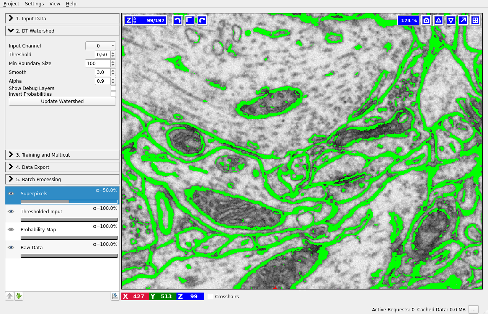

# Boundary-based segmentation with Multicut

## What it is and why you need it

This workflow allows you to segment images based on boundary information. Given a boundary probability map, it breaks the image up into superpixels and then merges them to recover segments limited by closed surfaces (no dangling edges). The main algorithm, known as multicut or correlation clustering, was presented in [this paper](http://ieeexplore.ieee.org/document/6126550/) by B. Andres. Its applications to biological image analysis can be found in, for example, [connectomics data](http://link.springer.com/chapter/10.1007%2F978-3-642-33712-3_56) or [bright field and phase contrast images](http://link.springer.com/chapter/10.1007/978-3-319-10404-1_2) or any other kind of imaging which uses membrane staining.  

## How to use it

### Boundary evidence
Start by creating a boundary probability map. This can be done with ilastik's [Pixel Classification workflow]({{site.baseurl}}/documentation/pixelclassification/pixelclassification.html) or by an outside program. The images below illustrate the boundary map creation in ilastik for a very small stack of electron microscopy images of a mouse brain (data from Graham Knott's lab, EPFL). 

 

    
    
Pixel Classification: labels

    

        
        
Pixel Classification: predictions

### Load the data
If we now start the Multicut workflow and load the raw data and this probability map, you'll see something like this:

 
If you have already computed **superpixels** on your data, you can also load them in the corresponding tab and skip the superpixel creation step described below. If you also have a **groundtruth** segmentation, load it as well and the method will use it for training instead of interactively provided labels. The trained workflow can, as usual, be applied to other datasets in batch or headless mode.

### Superpixels -- DT Watershed
We compute superpixels by the watershed algorithm, running it on the distance transform of the boundary probability map. The seeds are computed from the local maxima of the distance transform (each maximum then gives rise to a separate superpixel). The motivation for this approach is as follows:
Commonly used superpixel algorithms, for example [SLIC](http://ieeexplore.ieee.org/document/6205760/), group pixels based
on their similarity in brightness. This is, however, not desired here since it would result in superpixels which lie on the boundaries rather then be separated by them. Instead, for our use case, superpixels should group pixels based on which object they belong to. To achieve this, the high-contrast boundaries can be used. Here, the technique of choice is a *watershed*. 

The most common approach is to calculate the watershed directly on the boundary prediction.  However, this only works if the boundary prediction perfectly separates each object from its neighbors.  The smallest hole in the prediction can lead to merging different objects into the same superpixel. Obtaining a perfect edge prediction is hard in itself and is often further complicated by boundary gaps due to errors in the sample preparation procedure. Consequently, we would prefer an algorithm which is robust to boundary holes.

This  can  be  achieved  by  performing  the  watershed  on  the  distance  transformation of the boundary prediction.  Similar concepts have been used for a long time to deal with missing edge information in other applications 
(for example in [here](https://www.researchgate.net/publication/230837870_The_morphological_approach_to_segmentation_The_watershed_transformation)). Performing the
watershed on the distance transformation ensures that all gaps smaller than the object diameter are closed by the superpixels. In practice this is almost always the case, therefore high quality segmentations can be obtained  even  for  a  low  number  of
superpixels.

Our approach is further described in the Supplementary materials of [this publication](http://www.nature.com/nmeth/journal/v14/n2/full/nmeth.4151.html) and, in great detail, in [this Master thesis](http://hciweb.iwr.uni-heidelberg.de/node/6029). 

Let's go throught the controls of this applet from top to bottom:

1. **Input Channel** -- which channel of the probability map data contains the boundary probability? You can view different channels by enabling the "Probability Map" layer in the lower left corner. Thresholding of the current channel is displayed by default (here in green), just choose a different value in the combobox if a wrong channel is shown.

2. **Threshold** -- threshold for the probability map. Pixel with values above the threshold belong to the boundary, the rest belong to the background. You can see the results of the thresholding operation in the "Thresholded input" layer (on by default, as shown on the left).

3. **Min Boundary Size** -- size filter to get rid of single pixel noise or tiny fake boundary pieces.

4. **Presmooth before Seeds** -- how much to smooth the distance transform map before computing the seeds. The more you smooth, the less seeds you will have. With less seeds you get less superpixels, but they are bigger.

