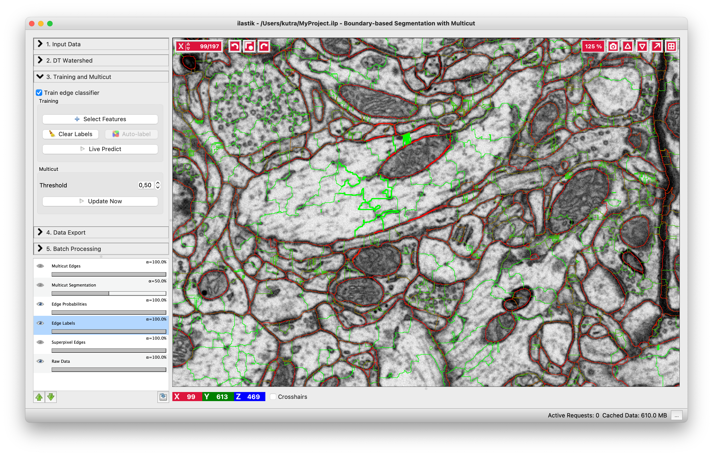

# Boundary-based segmentation with Multicut

## What it is and why you need it

This workflow allows you to segment images based on boundary information. Given a boundary probability map, it breaks the image up into superpixels and then merges them to recover segments limited by closed surfaces (no dangling edges). The main algorithm, known as multicut or correlation clustering, was presented in [this paper](https://ieeexplore.ieee.org/document/6126550/) by B. Andres. Its applications to biological image analysis can be found in, for example, [connectomics data](https://link.springer.com/chapter/10.1007%2F978-3-642-33712-3_56), [bright field and phase contrast images](https://link.springer.com/chapter/10.1007/978-3-319-10404-1_2), [light microscopy tissue images](https://elifesciences.org/articles/57613) or any other kind of imaging which uses membrane staining.  

## Boundary evidence
Start by creating a boundary probability map.
This can be done with
  * ilastik's [Pixel Classification workflow]({{site.baseurl}}/documentation/pixelclassification/pixelclassification.html),
  * [Autocontext Workflow]({{site.baseurl}}/documentation/autocontext/autocontext.html),
  * [Neural Network Classification Workflow]({{site.baseurl}}/documentation/nn/nn.html) with an appropriate pre-trained network,
  * or by an external program.

The images below illustrate the boundary map creation in ilastik for a very small stack of electron microscopy images of a mouse brain (data from Graham Knott's lab, EPFL).

 

    
    
Pixel Classification: labels

    

        
        
Pixel Classification: predictions

### Load the data
If we now start the Multicut workflow and load the raw data and this probability map, you'll see something like this:

 
If you have already computed **superpixels** on your data, you can also load them in the corresponding tab and skip the superpixel creation step described below. If you also have a **groundtruth** segmentation, load it as well and the method will use it for training instead of interactively provided labels. The trained workflow can, as usual, be applied to other datasets in batch or headless mode.

## Superpixels -- DT Watershed
We compute superpixels by the watershed algorithm, running it on the distance transform of the boundary probability map. The seeds are computed from the local maxima of the distance transform (each maximum then gives rise to a separate superpixel). The motivation for this approach is as follows:
Commonly used superpixel algorithms, for example [SLIC](https://ieeexplore.ieee.org/document/6205760/), group pixels based
on their similarity in brightness. This is, however, not desired here since it would result in superpixels which lie on the boundaries rather then be separated by them. Instead, for our use case, superpixels should group pixels based on which object they belong to. To achieve this, the high-contrast boundaries can be used. Here, the technique of choice is a *watershed*. 

The most common approach is to calculate the watershed directly on the boundary prediction.  However, this only works if the boundary prediction perfectly separates each object from its neighbors.  The smallest hole in the prediction can lead to merging different objects into the same superpixel. Obtaining a perfect edge prediction is hard in itself and is often further complicated by boundary gaps due to noise or errors in the sample preparation procedure. Consequently, we would prefer an algorithm which is robust to boundary holes.

This  can  be  achieved  by  performing  the  watershed  on  the  distance  transform of the boundary prediction.  Similar concepts have been used for a long time to deal with missing edge information in other applications 
(for example in [here](https://www.researchgate.net/publication/230837870_The_morphological_approach_to_segmentation_The_watershed_transformation)). Performing the
watershed on the distance transform ensures that all gaps smaller than the object diameter are closed by the superpixels. In practice this is almost always the case, therefore high quality segmentations can be obtained  even  for  a  low  number  of
superpixels.

Our approach is further described in the Supplementary materials of [this publication](https://www.nature.com/nmeth/journal/v14/n2/full/nmeth.4151.html) and, in great detail, in [this Master thesis](https://hciweb.iwr.uni-heidelberg.de/node/6029). 

Let's go throught the controls of this applet from top to bottom:

1. **Input Channel** -- which channel of the probability map data contains the boundary probability? You can view different channels by enabling the "Probability Map" layer in the lower left corner. Thresholding of the current channel is displayed by default (here in green), just choose a different value in the combobox if a wrong channel is shown.

2. **Threshold** -- threshold for the probability map. Pixel with values above the threshold belong to the boundary, the rest belong to the background. You can see the results of the thresholding operation in the "Thresholded input" layer (on by default, as shown on the left).

3. **Min Boundary Size** -- size filter to get rid of single pixel noise or tiny fake boundary pieces.

4. **Smooth** -- how much to smooth the distance transform map before computing the seeds - specify the sigma. The more you smooth, the less seeds you will have. With less seeds you get less superpixels, but they are bigger.

5. **Alpha** -- distance transform and boundary prediction are combined with this weight to serve as boundary strength indicator.

6. **Show Debug Layers** -- show intermediate layers of superpixel computation. This setting is useful if you want to understand the algorithm in detail, but it's not necessary for casual use.

## Training and multicut
Now that we have superpixels, we can combine them into objects. If your boundary probability maps are of high quality (e.g. they come from a neural network that was trained on very similar data), you can apply the Multicut partitioning directly on the maps. For this case, leave the "Train edge classifier" checkbox unchecked.
If you are not fully satisfied with your boundary predictions, we can further improve them by training a Random Forest to predict good and bad edges. The general approach we use was first described in [this publication](https://link.springer.com/chapter/10.1007%2F978-3-642-33712-3_56). Briefly, given the superpixels computed in the previous step, we now compute features on the edges of adjacent superpixels.
These features include the shape of the superpixel boundaries, and intensity statistics computed on the superpixel area/volume as well as along the boundaries.
"Select Features" button brings up a dialog which lets you choose features.
After the features are computed, we predict -- for every edge independently -- if this edge should be dropped or preserved to achieve a correct segmentation. The "naive" way to proceed would be to then only take the edges which are classified as "to preserve" and use those as the final segmentation. This, however, would lead to an inconsistent segmentation with dangling edges inside the objects. Instead, we formulate a so-called multicut problem, where special constraints ensure no dangling edges are present and all segmented objects are closed surfaces, while following the classifier preferences for which edges to keep. This problem is NP-hard in general, but this applet uses excellent approximate solvers to deliver a solution quickly.

### Training
If you already have a groundtruth segmentation, you can load it in the "Input Data" applet and then it will be used here as labels if you click the "Auto-label" button. If not, you can label interactively, as described below.  

You can do it in this applet by clicking on the edges between superpixels. Left click, making edge green, corresponds to edges which should be dropped and right click, making edges red, corresponds to true segmentation edges which should be preserved. The initial view is shown on the left, while on the right you can see the same image with some edges labeled. To label multiple edges in one sweep, brush across them with either mouse button pressed.

As usual in ilastik, pressing "Live Predict" will show you the edge probabilities and update them live as you click more edges (left figure).
Now let's apply the multicut and get a consistent segmentation.

#### Multicut

The multicut algorithm uses boundary evidence to connect superpixels in to larger objects - the multicut segmentation.
Whether the boundary evidence is taken directly from the boundary probability map, or from a trained Random Forest, it will indicate strength of evidence with values between 0.0 (weak) and 1.0 (strong).

**Threshold** - threshold boundary evidence for the multicut algorithm.
You can try lowering this parameter if you find that too many edges are dropped from the multicut solution (undersegmentation).
Similarly, if you see too many edges remaining in your multicut solution (oversegmentation), you can try setting the threshold to a higher value.

<!--
**Beta** - this parameter controls the under- or over-segmentation preference. With lower beta, the algorithm merges more aggressively. The default of 0.5 should handle most common situations correctly.
**Solver** - the final segmentation is the result of solving an integer linear program (ILP). The available solvers are listed in this dropdown menu, the exact entries depend on whether some outside libraries are installed on your machine. The *Nifty_FmGreedy* solver is the most basic of them and should be available in all ilastik installations.
As of ilastik `1.3.2`, this is the only available solver.
If you have CPLEX or Gurobi installed (see [installation instructions]({{site.baseurl}}/documentation/basics/installation) for more details), you will see other solvers as well. Intersection-based approximate solvers have always worked very well for us in practice. The optimality gap is can not usually be noticed in the final results, but just in case we also provide an exact solver which solves the problem to global optimality.
-->

The above image shows the result of the multicut.
Edges of the final segmentation are shown in blue.
If you find that the segmentation can be improved, you can try to train a better Random Forest classifier by adding additional annotations, or changing the threshold and rerunning the multicut

Once you are happy with the segmentation, export it and/or use the classifier you trained in the Batch Processing applet or in headless mode. 
