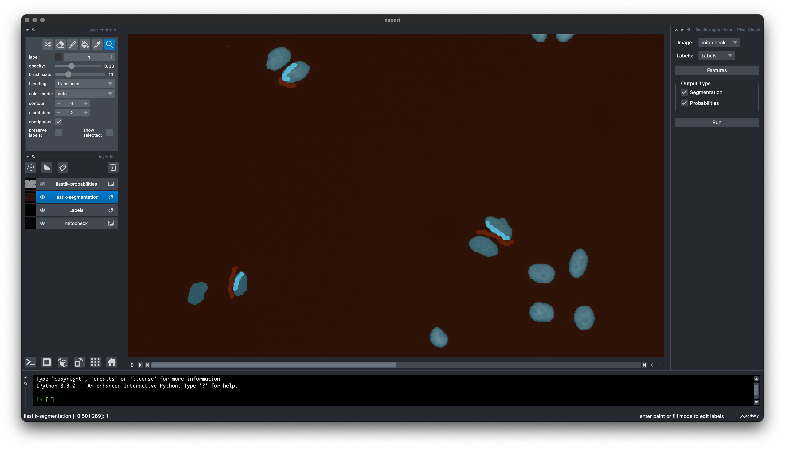

  

    <h3 class="panel-title">Experimenal Software</h3>
  

  

    This plugin is not stable yet.
    The look and feel is expected to change.
  

Please refer to [README][readme] for further instructions.

[readme]: https://github.com/ilastik/ilastik-napari#readme
