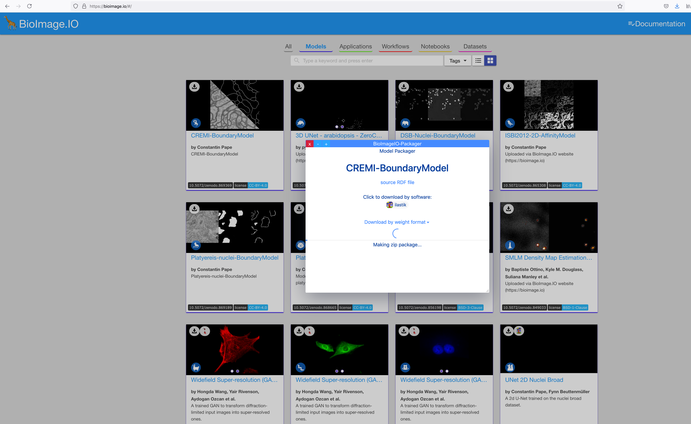

# Neural Network Classification

This is the newest workflow of ilastik, which is still, in many ways, work in progress. However, we chose to rather release it early and profit from your feedback, building the documentation as we go. 

This workflow allows one to execute (run inference) for pre-trained convolutional neural networks (CNNs) on the data loaded into ilastik. Training of CNNs is also being developed and is now available in debug mode, with absolutely no guarantees of working at all. Inference is fully released, please complain if it doesn't work!

## The Model Zoo
How do you find the pre-trained models? Together with community partners, we have already put some in the [ilastik Model Zoo at BioImage.IO](https://bioimage.io/#/?partner=ilastik). We will keep updating it with our networks, the format is also open so please get in touch with us if you want to contribute models.
The first step of using the Neural Network workflow is to find a network you would like to use in the Zoo. The best way is to put keywords into the search and visually check if any of the networks that come up do the task you need - we always show before/after images in the model preview cards.  
If you found a model you like, click the Download icon in the top left corner. A new window will appear, looking similar to this one: 
To download a model for use in ilastik, click the  

## Pre-requisites for running the workflow
Unlike other ilastik workflows, the Neural Network workflow runs the back-end separately from the desktop application. The reason for this separation is to enable the use of GPUs which are usually not found on the user laptop. The back-end application where the neural network operations are running is called TikTorch. You have to install it at the server where you have the GPUs or ask your IT or facility administrators to install it for you. Luckily, the installation process is not difficult, just follow the instructions in the [github repo](https://github.com/ilastik/tiktorch). Concerning permissions, you need to be able to ssh to the machine where TikTorch will run. Of course, you can also install TikTorch on your powerful local desktop, then nothing needs to be done remotely.

##Workflow step by step
