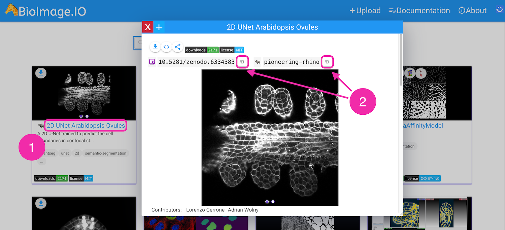
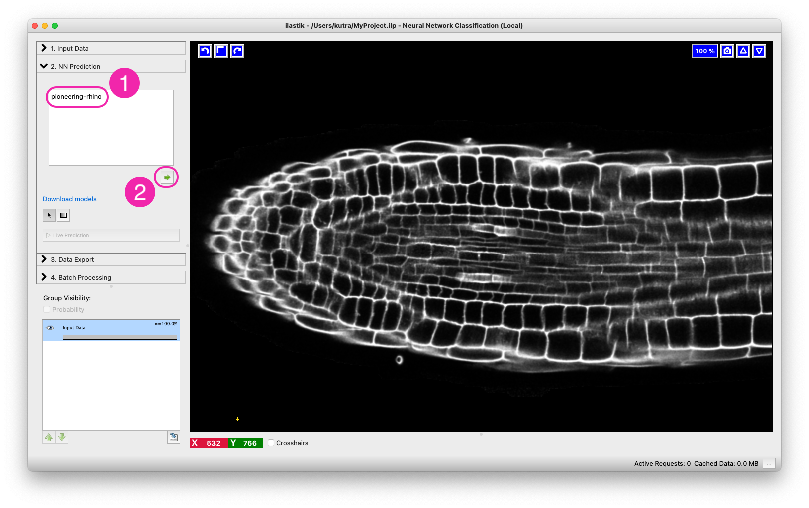

# Neural Network Classification

This workflow allows one to execute (run inference for) pre-trained convolutional neural networks (CNNs) on the data loaded into ilastik.

## Prerequisites: Running locally or remotely

Unlike other ilastik workflows, the Neural Network workflow provides the possibility to run the computations on a different machine (presumably, on a remote machine with GPUs).
If you only want to run locally, on the CPUs or GPUs of the machine where ilastik is installed, you don't need anything else, just skip to the next section. 

If you want to execute the neural network predictions on a different machine, you need to install a special back-end called TikTorch (for ilastik+PyTorch).
You have to install it on the server where you have the GPUs or ask your IT or facility administrators to install it for you.
Luckily, the installation process is not difficult, just follow the instructions in the [github repo](https://github.com/ilastik/tiktorch).
Concerning permissions, you need to be able to ssh to the machine where TikTorch will run. 

## _Neural Network Classification (local)_ - step by step

To run the local workflow, start up ilastik as you usually would.

### 0. Create Your Project

After starting up ilastik click on _Neural Network Classification (local)_ and save the project file.

### 1. Load Your Data

Load your raw data into ilastik as usual in the [Data Selection applet]({{site.baseurl}}/documentation/basics/dataselection):

### 2. Load a Pre-trained Neural Network

Proceed to the next applet (NN Prediction).
Pre-trained models can be found in the [ilastik Model Zoo at BioImage.IO](https://bioimage.io/#/?partner=ilastik).

#### The Bioimage Model Zoo

Together with community partners, we have already put some in the [ilastik Model Zoo at BioImage.IO](https://bioimage.io/#/?partner=ilastik). We will keep updating it with our networks, the format is also open so please get in touch with us if you want to contribute models.
The first step of using the Neural Network workflow is to find a network you would like to use in the Zoo. The best way is to put keywords into the search and visually check if any of the networks that come up do the task you need - we always show before/after images in the model preview cards. 

If you found a model you like, there are multiple ways to get it into ilastik.

The easiest way to load a model from the model zoo in ilastik is to click on the model title (1) to open the detail view of the model card and copy either the doi, or the nickname (2) of the model.

Then in ilastik, paste the doi, or nickname to the model text field (1) and press the arrow-button (2).
This will initiate the download and initialization of the network.

Alternatively, you can download a zip archive of the model by clicking on "Download (format)".
The server will then package the model with the correct weight format for ilastik consumption.  
Once the file is downloaded you can either drag and drop the model zip file from your file explorer window into the text field, or click the arrow button while the text field is empty to bring up a load file dialog.

### 3. Run the Network

Only one thing left to do: press the "Live Predict" button to make the network predict:

If you prefer a different color for the display of the predictions you can right click on the corresponding layer [in the layerstack]({{site.baseurl}}/documentation/basics/layers) and select _Change color_.

### 4. Export the Result

If you like the results, proceed to export them in the [Data Export applet]({{site.baseurl}}/documentation/basics/export). If you don't, try out another model. You can do so by first pressing the red cross below the text box to unload the model, and then the red cross inside the text box to clear your previously selected model.

## _Neural Network Classification (remote)_

When running remotely, the heavy lifting of neural network computations will happen on a remote machine, while you are loading the data and selecting the network on your local machine.

### On the remote machine

1. Make sure the tiktorch server and neural network framework you want to run are installed via mamba.
   Installation instructions can be found [in the tiktorch github repository](https://github.com/ilastik/tiktorch#installation).
2. Activate the tiktorch environment and start the server giving the `--addr 0.0.0.0` flag to make it accessible.
3. Take note of the ip/hostname of the remote machine, and the port (watch out for the `Starting server on 0.0.0.0:<port>` output).

### On your local machine/laptop

The steps are similar to the ones of the local workflow, except:

0. Create Your Project with the _Neural Network Classification (remote)_ workflow.
1. Connect to the server.
   In the _Server Configuration_ applet, enter the address in the form `<ip/hostname>:<port>`, e.g. `myserver.mydomain.edu:5567` and give it a descriptive name.
   Click on _Get Devices_ and select the device you want to run on (often you will have the choice between _cpu_ or _cuda_ devices, if the server has a gpu).
   Click on _save_ to finish the configuration.
2. From here on you can proceed to load the data and go through the rest of the workflow like in the local variant.
