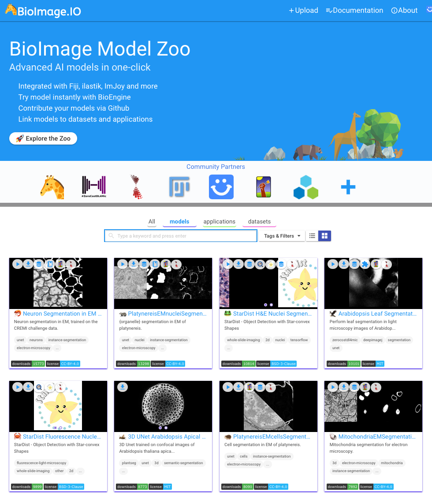
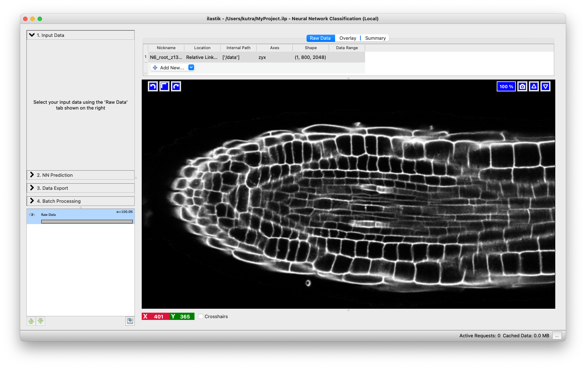
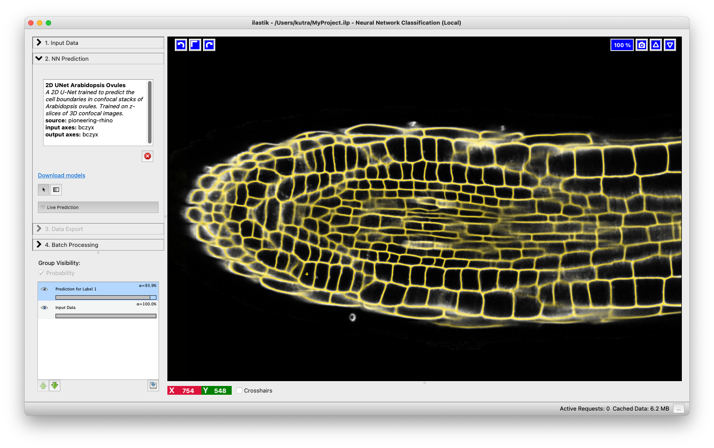

# Neural Network Classification

This is the newest workflow of ilastik, which is still, in many ways, work in progress. However, we chose to rather release it early and profit from your feedback, building the documentation as we go. 

This workflow allows one to execute (run inference) for pre-trained convolutional neural networks (CNNs) on the data loaded into ilastik. Training of CNNs is also being developed and is now available in debug mode, with absolutely no guarantees of working at all. Inference is fully released, please complain if it doesn't work!

## The Model Zoo
How do you find the pre-trained models? Together with community partners, we have already put some in the [ilastik Model Zoo at BioImage.IO](https://bioimage.io/#/?partner=ilastik). We will keep updating it with our networks, the format is also open so please get in touch with us if you want to contribute models.
The first step of using the Neural Network workflow is to find a network you would like to use in the Zoo. The best way is to put keywords into the search and visually check if any of the networks that come up do the task you need - we always show before/after images in the model preview cards. 

If you found a model you like, click the ilastik icon in the top left corner. A new window will appear, looking similar to this one: 

Click on "Download (format)". The server will then package the model with the correct weight format for ilastik consumption.  

## Running locally or remotely
Unlike other ilastik workflows, the Neural Network workflow provides the possibility to run the computations on a different machine (presumably, on a remote machine with GPUs). If you only want to run locally, on the CPUs or GPUs of the machine were ilastik is installed, you don't need anything else, just skip to the next section. 

If you want to execute the neural network predictions on a different machine, you need to install a special back-end called TikTorch (for ilastik+PyTorch). You have to install it on the server where you have the GPUs or ask your IT or facility administrators to install it for you. Luckily, the installation process is not difficult, just follow the instructions in the [github repo](https://github.com/ilastik/tiktorch). Concerning permissions, you need to be able to ssh to the machine where TikTorch will run. 

## Workflow step by step
### Running locally
1. Load your raw data into ilastik as usual in the [Data Selection applet]({{site.baseurl}}/documentation/basics/dataselection):

2. Proceed to the next applet and press the "Load Model" button:

Select the .zip file that you downloaded from the BioImage Model Zoo. Once it loads, its name will replace the text on the "Load Model" button.

3. Only one thing left to do: press the "Live Predict" button to make the network predict:

4. If you like the results, proceed to export them in the [Data Export applet]({{site.baseurl}}/documentation/basics/export). If you don't, unload this model by pressing the red cross and try out another one. 

