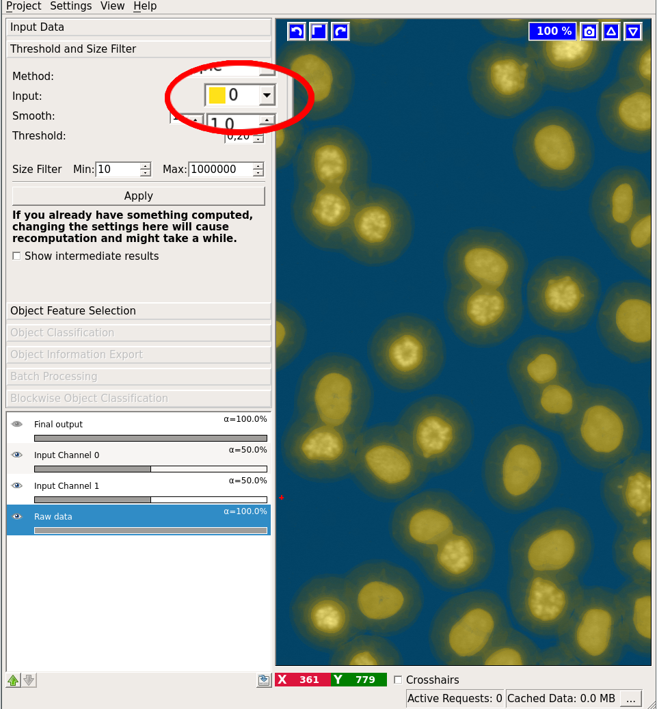

#Object Classification Workflow
##Input

As the name suggests, object classification workflow aims to classify full *objects*, based on object-level features and user annotations. 
In order to do so, the workflow needs *segmentation* images besides the usual raw image data. Depending on the availability of these 
segmentation images, the user can choose between three flavors of object classification workflow, which differ by their input data:

* Object Classification (from pixel classification)
This is a combined workflow, which lets you start from the raw data, perform pixel classification as described 
in <a href="/kategorien/20_Documentation/dateien/ilastik_carving_documentation/">Classification
module</a> and then thresholding the probability maps to obtain a segmentation. 

If you have pre-computed probability maps, you can also use

* Object Classification (from prediciton image)
The data input applet of this workflow expects you to load the probability maps:

* Object Classification (from binary image)
This workflow should be used, if you already have a binary segmentation image. 
The image should be loaded in the data input applet:

##From pixels to objects - thresholding
If you already have binary segmentation images, skip this section.

Suppose we have a probability map for a 2-class classification, which looks like this:

There are two ways to transform a probability map into a segmentation in ilastik and both are covered by the thresholding applet. To see the results of changing the parameter settings in this applet, press the "Apply" button.

First, specify which channel of the probability map you want to threshold (we choose channel 1, as it corresponds to object rather than background probability). The "Selected input channel" layer will show you the channel you selected in the corresponding label color:

After selecting the channel, choose a sigma to smooth the probability map with a Gaussian. The Gaussian can be anisotropic, i.e. sigmas for all dimensions can be different. If you do not want to smooth, just select a very small sigma (like 0.6). You can check the results of the smoothing operation by first activating the "Show intermediate results" checkbox and then looking at the "Smoothed input" layer:

Now, two options are available for the actual thresholding, as shown in the little tab widget "One Threshold/Two Thresholds".

The **"One Threshold"** tab performs regular thresholding, followed by the size filter. For debugging purposes, we also provide a view on the thresholded objects before size filtering. This layer is activated by checking the "Show intermediate results" checkbox.

The **"Two Thresholds"** tab performs hysteresis thresholding with two thresholds: high and low. The high threshold is applied first and the resulting objects are filtered by size. For the remaining objects the segmentation is then relaxed to the level of low threshold. The two levels of thresholding allow to separate the criteria for detection and segmentation of objects and select only objects of very high probability while better preserving their shape. As for the single threshold case, we provide a view on the intermediate results after the application of the high threshold, the size filter and the low threshold. The image below shows the results of the high (detection) threshold in multiple colors overlayed with the results of the low (segmentation) threshold in white:

The last parameter of this applet is the size filter, for which you can specify the minimum and maximum value. For both thresholding methods the end result is shown in the "Final output" layer.

Now that we have obtained a segmentation, we are ready to procede to the "Object Feature Computation" applet.

