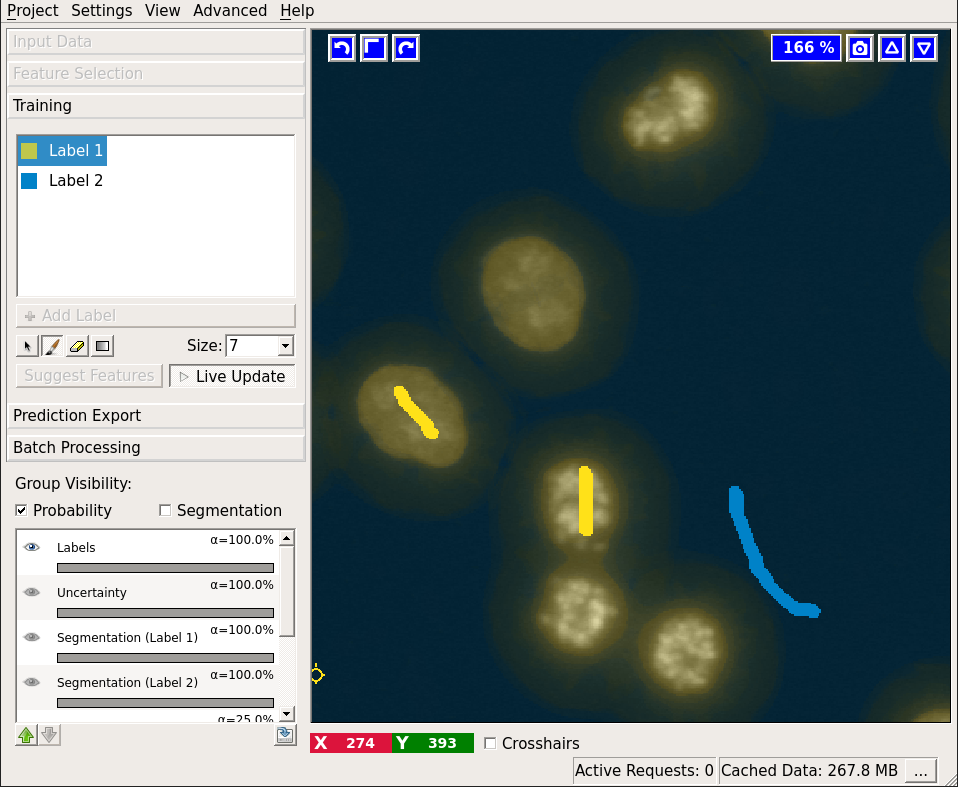

# Object Classification

## Object Classification Demo (3 minutes)

<iframe width="560" height="315" src="https://www.youtube.com/embed/SQeRGvHeT3o?cc_load_policy=1&rel=0" frameborder="0" allow="accelerometer; autoplay; encrypted-media; gyroscope; picture-in-picture" allowfullscreen></iframe>


## How it works, what it can do

As the name suggests, the object classification workflow aims to classify full *objects*, based on object-level features and user annotations.
An *object* in this context is a set of pixels that belong to the same instance.
In order to do so, the workflow needs *segmentation* images besides the usual raw image data, that can e.g. be generated with the [Pixel Classification Workflow].
Depending on the availability of these segmentation images, the user can choose between three flavors of object classification workflow, which differ by their input data:

* Pixel Classification + Object Classification
* Object Classification [Inputs: Raw Data, Pixel Prediction Map]
* Object Classification [Inputs: Raw Data, Segmentation]

**Size Limitations:**

In the current version of ilastik, computations on the **training** images are not performed lazily -- the entire image is processed at once.  
This means you can't use enormous images for training the object classifier.  
However, once you have created a satisfactory classifier using one or more small images, you can use the "Blockwise Object Classification" 
feature to run object classification on much larger images (prediction only -- no training.)

<a href="figs/ilastik_start_screen.png" data-toggle="lightbox"></a>

### Pixel Classification + Object Classification
This is a combined workflow, which lets you start from the raw data, perform pixel classification as described 
in the
[Pixel Classification workflow docs]({{site.baseurl}}/documentation/pixelclassification/pixelclassification.html)
and then thresholding the probability maps to obtain a segmentation that you then use in Object Classification.
This workflow is primarily meant for demo purposes.
For serious projects, we recommend to use the two workflows, [Pixel Classification]({{site.baseurl}}/documentation/pixelclassification/pixelclassification.html) and Object Classification separately using the generated output form the former as an additional input in the latter one.

<a href="figs/input_pixel_class.png" data-toggle="lightbox"></a>

### Object Classification [Inputs: Raw Data, Pixel Prediction Map]
You should choose this workflow if you have pre-computed probability
maps.
The data input applet of this workflow expects you to load the probability maps in addition to the raw data:

<a href="figs/input_prediction_image.png" data-toggle="lightbox"></a>

### Object Classification [Inputs: Raw Data, Segmentation]
This workflow should be used if you already have a binary segmentation image. 
The image should be loaded in the data input applet:

<a href="figs/input_segmentation_image.png" data-toggle="lightbox"></a>

## From probabilities to a segmentation - "Threshold and Size Filter" applet
If you already have binary segmentation images, skip this section.

Suppose we have a probability map for a 2-class classification, which looks like this:
<a href="figs/pixel_results.png" data-toggle="lightbox"></a>

The basic idea of thresholding is to answer a question for _every pixel_ in an image:
is the pixel value larger than the _threshold value_ or not?
In ilastik probability maps (result of [Pixel Classification][Pixel Classification Workflow]) pixel values are in the continuous range from `0.0` to `1.0` in each channel and describe the probability that a pixel belongs into a class.
In this applet this continuous range is transferred into a binary one, containing only `0`s and `1`s (so no values in between) by comparing it to a set threshold.

**Note:** To see the results of changing the parameter settings in this applet, press the "Apply" button.

There are two algorithms you can choose from to threshold your data: _Simple_ and _Hysteresis_, which can be selected using the "Method" drop down.

Both methods share the following parameters:
 * _Input_ Channel(s): Select which channel of the probability map contains the objects
 * _Smooth_: Configure sigmas for smoothing the probability map in order to reduce noise.
   The Gaussian can be anisotropic, i.e. sigmas for all dimensions can be different. This setting is important for very anisotropic data where we recommend not to smooth across the low-resolution axis at all.
   If you do not want to smooth, just select a very small sigma (like 0.6).
  * _Threshold_ value(s): Value to check each pixel/voxel against.
  * Size filter: specify the minimum and maximum value (in terms of pixel/voxel counts for 2D/3D, respectively).

For both thresholding methods the end result is shown in the "Final output" layer.


### Simple Thresholding

Selecting **"Simple"** in the _Method_ dropdown will perform regular thresholding at one level, followed by the size filter.

You begin by selecting a channel with the _Input_ dropdown:

<a href="figs/thresholding_channel.png" data-toggle="lightbox"></a>

Next, you can configure your sigmas for smoothing the probability image.
You can check the results of the smoothing operation by first activating the "Show intermediate results" checkbox and then looking at the "Smoothed input" layer:

<a href="figs/thresholding_sigmas.png" data-toggle="lightbox"></a>

We also provide a view on the thresholded objects before size filtering.
This layer is activated by checking the _Show intermediate results_ checkbox.
In the example below, the result before size filter is shown in white.
After application of the size filter, only the colored objects remain.

<a href="figs/thresholding_before_size_filter.png" data-toggle="lightbox"></a>


### Hysteresis Thresholding

By selecting **Hystersis** in the method drop-down thresholding is performed at two levels: _core, or high threshold_, and _final, or low threshold_.
The high threshold is applied first and the resulting objects are filtered by size.
These high probability areas act as seeds:
For the remaining objects the segmentation is then relaxed to the level of low threshold starting from the seeds.
The two levels of thresholding allow to separate the criteria for detection and segmentation of objects and select only objects of very high probability while better preserving their shape.
As for the single threshold case, we provide a view on the intermediate results after the application of the high threshold, the size filter and the low threshold.
The image below shows the results of the high (detection) threshold after size filter in pink (<span style="color:#ff0aff">&#9679;</span>) overlayed on the final results of the low (segmentation) threshold multiple colors:

<a href="figs/thresholding_two_thresholds.png" data-toggle="lightbox"></a>

An additional setting is available with Hysteresis Thresholding:
Two (or more) seeds (determined by the "core" threshold) might result in the same object when the segmentation is relaxed.
With the _Don't merge objects_ checkbox, you can control this behavior:
Checking it, will preserve one object per detection.
This is indicated with the red ellipse in the above image:
The pink and the yellow object would be merged without checking the _Don't merge objects_ checkbox.

Now that we have obtained a segmentation, we are ready to proceed to the "Object Feature Selection" applet.

## From segmentation to objects - "Object Feature Selection" applet

This applet finds the connected components (objects) in the provided binary segmentation image and computes user-defined features for each object. If you want to inspect the connected components, activate the "Objects (connected components) layer. If you select any object features, connected component analysis will be performed automatically.

<a href="figs/object_extraction_cc.png" data-toggle="lightbox"></a>

The following dialog will appear if you press the "Select features" button:

<a href="figs/object_extraction_selection_dialog.png" data-toggle="lightbox"></a>

The object feature calculation is plugin-based.
Per default ilastik comes with 3 feature plugins: "Standard Object Features", "Skeleton Feautures" (2D only), and "Convex Hull Features".
Those features are computed by the [vigra library](https://ukoethe.github.io/vigra/doc-release/vigra/group__FeatureAccumulators.html).
The features are subdivided into three groups: "Location", "Shape", and "Intensity Distribution".
Location-based features take into account _absolute coordinate positions_ in the image.
These are only useful in special cases when the position of the object in the image can be used to infer the object type. 
Shape-based features extract shape descriptors from the object masks.
Lastly, "Intensity Distribution" features operate on image value statistics.
You will also notice features, which can be computed "in the neighborhood".
In that case, the _neighborhood_ of the object (specified by the user at the bottom of the dialog) is found by distance transform and the feature is computed for the object itself and for the neighborhood including and excluding the object.

<a href="figs/object_extraction_selection_dialog_neigh.png" data-toggle="lightbox"></a>

Need more features?
Object features are plugin-based and very easy to extend if you know a little Python.
A detailed example of a user-defined plugin can be found in the $ILASTIK/examples directory, while [this page](https://ilastik.github.io/ilastik/applet_library.html#object-extraction) contains a higher-level description of the few functions you'd have to implement.

Once you have selected the features you like, the applet will proceed to compute them. For large 3D datasets this step can take quite a while. However, keep in mind that most of the time selecting more features at this step is not more expensive computationally. We therefore recommend that you select all features you think you might try for classification and then choose a subset of these features in the next applet.


## Prediction for objects - "Object Classification" applet
This applet allows you to label the objects and classify them based on the features, computed in the previous applet.
If you want to choose a subset of features, press the "Subset features" button.
Adding labels and changing their color is done the same way as in the
[Pixel Classification workflow]({{site.baseurl}}/documentation/pixelclassification/pixelclassification.html).
For a particular example, let us examine the data more closely by activating only the "Raw data" layer (tip: you can toggle between the currently visible layers and only showing the "Raw data" layer by pressing `i`):

<a href="figs/oc_raw.png" data-toggle="lightbox"></a>

Clearly, two classes of cells are present in the image: one more bright but variable, the other darker and more homogeneous. Hopefully, the two classes can be separated by the grayscale mean and variance in the objects. Let us select these two features.
Two labels are already added to the workflow by default.
If you need more labels you can click on "Add Label" to do so.

<a href="figs/oc_subset.png" data-toggle="lightbox"></a>

Note, that the list of features now only contains the few features that were selected in the previous applet. To label objects, either simply left-click on them or right-click and select the corresponding option. Right-clicking also allows you to print the object properties in the terminal. To trigger classification, press the "Live Update" button.

<a href="figs/oc_live_upd_labeled.png" data-toggle="lightbox"></a>

If the "Live Update" mode is activated, the prediction is interactive and you can receive immediate feedback on your labels. Let us examine the prediction results:

<a href="figs/oc_prediction1.png" data-toggle="lightbox"></a>

In the low right corner we see a cell (shown by the red ellipse), which was classified as "blue", while it is most probably "yellow". Let's label it "yellow" and check the results again:

<a href="figs/oc_prediction2.png" data-toggle="lightbox"></a>

All cells seem to be classified correctly, except one segmentation error, where two cells were erroneously merged (shown by the red ellipse). How could we correct that? We'd have to go back to the thresholding applet, where we performed the segmentation. In the best case, you would have caught this error by examining the thresholding output at the first step. The problem with correcting the segmentation now is that with different thresholds the objects will most probably change shape and thus their features. Besides, some objects might disappear completely, while others appear from the background.
Currently, all labels are lost when the threshold is changed!

<!-- This has been deactivated for quite a while (at 1.3.3b1 now). Uncomment the following paragraph, once transfer-labels is back!-->
<!-- ilastik will try to transfer your object labels from the old to the new segmentation, but it will fail in case of disappearance or object division, which is why it's recommended to not change the segmentation after labels are added. Nevertheless, let us try it for demonstration purposes:

<a href="figs/thresholding_final2.png" data-toggle="lightbox"></a>

After a slight change in the segmentation (lower) threshold the objects indeed become separated. And the two independent objects are predicted correctly:

<a href="figs/oc_prediction3.png" data-toggle="lightbox"></a>
-->
## Uncertainty Layer
Uncertainty Layer displays how uncertain prediction for an object is. Applying the minimum number of labels for classifying objects containing up to three cells we have a very uncertain classification:

<a href="figs/uncertainty_01.png" data-toggle="lightbox"></a>

Adding a few more labels we get a much better uncertainty estimate:

<a href="figs/uncertainty_02.png" data-toggle="lightbox"></a>

Assuming our labels were correct this will lead to a good object classification:
<a href="figs/uncertainty_03.png" data-toggle="lightbox"></a>

## Export

In the [Export Applet][] you can export the following images: "Object Predictions", "Object Probabilities" "Blockwise Object Predictions".
In addition to the image export, it is also possible to generate a table that encompasses all information about the objects used during classification.
Table configuration can be accessed with the _Configure Feature Table Export_ button.
In this new window there are three vertical tabs:

 * _General_: Choose Filename and Format.
 Note on formats: `csv` will export a table that can be read with common tools like LibreOffice, or Microsoft Excel.
 Exporting a table to `h5` is most suitable for more involved post-processing, e.g. with Python.
 In addition to the table data, images of the respective objects can be included in the `h5` file, see _Settings_.
 * _Features_: Select the features to be included in the exported table.
 * _Settings_: Only applicable for `h5` export.
 Per default only the bounding box of each object is exported.
 A margin can be configured to include context around this bounding box (size in pixels/voxels).
 Alternatively, it is also possible to include the whole image instead of the individual object images.

## HDF5 export format

[HDF5](https://www.hdfgroup.org/) is a flexible cross platform binary data format. Using Python, you can access the data inside the `h5` files using the [h5py](https://www.h5py.org/) library.

The `h5` file contains two items at the root level, `images` and `table`. Using h5py, you can access them like a python dictionary:

```python
import h5py
data = h5py.File("path/to/data.h5", "r")
data.keys()
# <KeysViewHDF5 ['images', 'table']>
```

In the `images` group you will find a subgroup for each object (identifiable by `object_id`) which contains two datasets:
`labeling` (cutout of the segmentation showing the object) and `raw` (cutout of the raw data showing the object).

The `table` is saved as a [numpy structured array](https://numpy.org/doc/stable/user/basics.rec.html?highlight=structured#module-numpy.doc.structured_arrays) and holds the selected feature values for each object.
The "columns" are saved as dtypes (you can see all column names in your table:

```python
data['table'].dtype.names
#('object_id', 'timestep', 'Predicted Class' ...)
```

Individual fields can be accessed by name:

```python
data['table']['Mean Intensity']
# array([1551.2393, 1420.5,...], dtype=float32)
```
Returning a numpy array of all the detected objects. You can access an individual object's measurements using an index:

```python
data['table']['Mean Intensity'][0]
# 1551.2393
```
Returning the `Mean Intensity` of the first object.

## Preparing for large scale prediction - Blockwise Object Classification applet

Segmentation and connected components analysis in the applets above is performed on the *whole dataset* simultaneously.
While these operations and especially the hysteresis thresholding require a lot of RAM, *whole image* processing is sufficient for most 2D images.
However, for large 3D image volumes we have to resort to a different strategy:
Traning the classifier on a cutout of the whole image and subsequent blockwise processing of the whole dataset in batch mode.
In blockwise processing, the whole dataset is automatically subdivided in a number of blocks that are processed independently.
Two parameters control the total size of the blocks:

 * _block size_: Defines size of the block in pixels/voxels in the respective spacial direction.
   The larger this size, the more RAM will be needed for computation but the image will be subdivided into a smaller number of blocks.
 * _halo size_: Objects might be cut off at the edges of the blocks such that the algorithm does not see the complete object.
   Mis-classifications are likely in this situation.
   The _halo_, with it's size given in pixels/voxels defines the area/volume around the block that is taken into account in addition to the current block.
   Choose this parameter to be in the order of the size of the objects.


The Blockwise Object Classification applet allows you to experiment with different _block_ and _halo sizes_ on the data you used in the interactive object prediction.
By comparing the "whole image" interactive prediction and blockwise prediction, you can find the optimal parameters for your data.
The following example illustrates the process.

<a href="figs/block_oc_pred.png" data-toggle="lightbox"></a>
In the upper right corner, an object is shown for which the blockwise object classification clearly failed. This object, however, will be predicted correctly if we choose a more reasonable block and halo size. Supposing we found such sizes, let us proceed to batch prediction itself

## Processing new images in batch mode
After having trained the classifier on one, or a few datasets you can apply it conveniently to a large number of images in the Batch Processing Applet.
Note, that for each of the images there, the same export options are applied that are configured in the Export Applet (make sure to use the “magic” placeholders in your output filename there, in order to generate a new result file for every input).
Details on all export options can be found [on this page]({{site.baseurl}}/documentation/basics/export.html)
These two applets have the same interface and parameters as batch prediction in
[Pixel Classification workflow][].
The only difference is that you started the object classification workflow from binary images or prediction images, you'll have to provide these additional images here as well:

<a href="figs/batch.png" data-toggle="lightbox"></a>

[Pixel Classification Workflow]: {{site.baseurl}}/documentation/pixelclassification/pixelclassification.html
[Export Applet]: {{site.baseurl}}/documentation/basics/export.html

Alternatively you call ilastik without the graphical user interface in [headless mode]({{site.baseurl}}/documentation/basics/headless.html#headless-mode-for-object-classification) in order to process large numbers of files.
