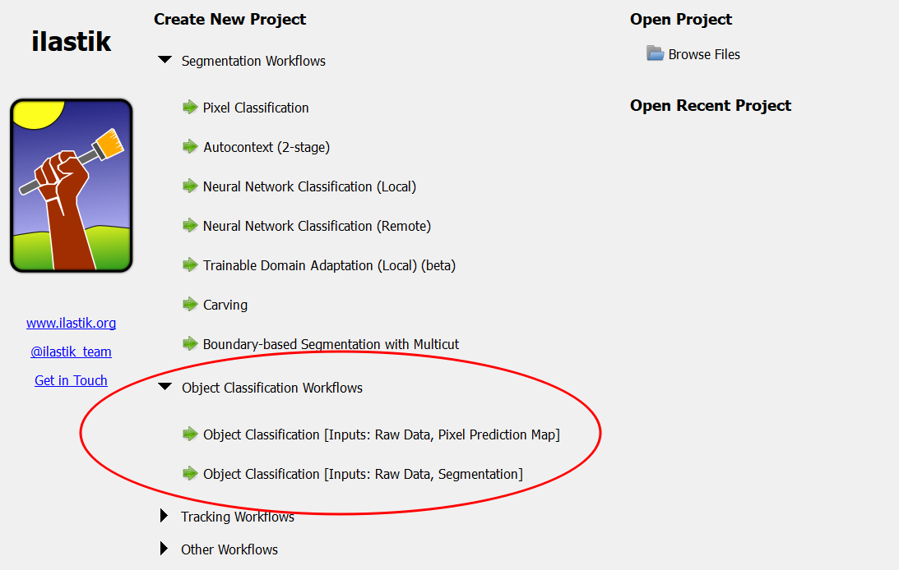
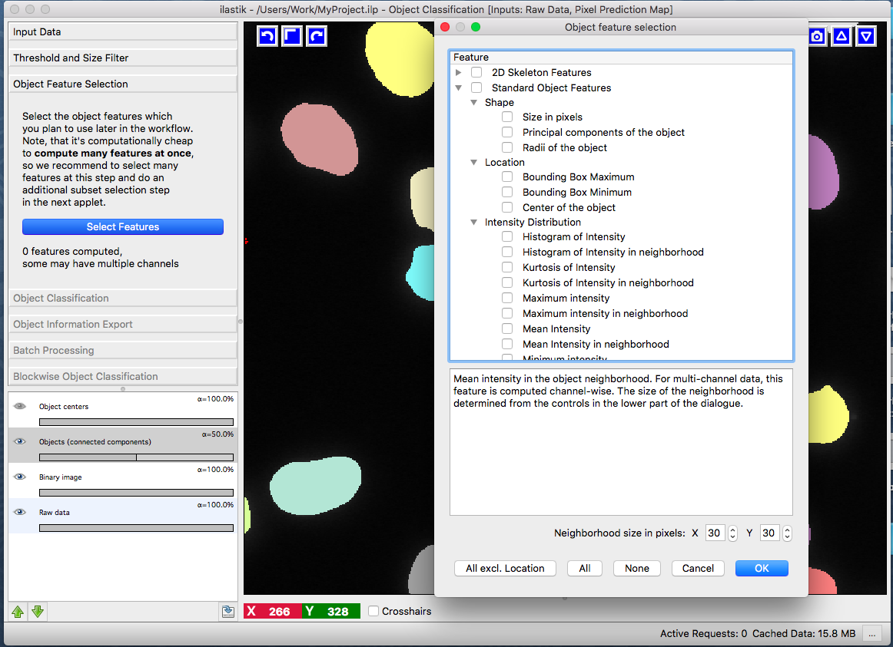

#Object Classification Workflow
##Input

As the name suggests, object classification workflow aims to classify full *objects*, based on object-level features and user annotations. 
In order to do so, the workflow needs *segmentation* images besides the usual raw image data. Depending on the availability of these 
segmentation images, the user can choose between three flavors of object classification workflow, which differ by their input data:

* Object Classification (from pixel classification)
This is a combined workflow, which lets you start from the raw data, perform pixel classification as described 
in <a href="../pixelClassification/">Pixel Classification workflow</a> and then thresholding the probability maps to obtain a segmentation. 

If you have pre-computed probability maps, you can also use

* Object Classification (from prediciton image)
The data input applet of this workflow expects you to load the probability maps:

* Object Classification (from binary image)
This workflow should be used, if you already have a binary segmentation image. 
The image should be loaded in the data input applet:

##From probabilities to a segmentation - "Threshold and Size Filter" applet
If you already have binary segmentation images, skip this section.

Suppose we have a probability map for a 2-class classification, which looks like this:

There are two ways to transform a probability map into a segmentation in ilastik and both are covered by the thresholding applet. To see the results of changing the parameter settings in this applet, press the "Apply" button.

First, specify which channel of the probability map you want to threshold (we choose channel 1, as it corresponds to object rather than background probability). The "Selected input channel" layer will show you the channel you selected in the corresponding label color:

After selecting the channel, choose a sigma to smooth the probability map with a Gaussian. The Gaussian can be anisotropic, i.e. sigmas for all dimensions can be different. If you do not want to smooth, just select a very small sigma (like 0.6). You can check the results of the smoothing operation by first activating the "Show intermediate results" checkbox and then looking at the "Smoothed input" layer:

Now, two options are available for the actual thresholding, as shown in the little tab widget "One Threshold/Two Thresholds".

The **"One Threshold"** tab performs regular thresholding, followed by the size filter. For debugging purposes, we also provide a view on the thresholded objects before size filtering. This layer is activated by checking the "Show intermediate results" checkbox.

The **"Two Thresholds"** tab performs hysteresis thresholding with two thresholds: high and low. The high threshold is applied first and the resulting objects are filtered by size. For the remaining objects the segmentation is then relaxed to the level of low threshold. The two levels of thresholding allow to separate the criteria for detection and segmentation of objects and select only objects of very high probability while better preserving their shape. As for the single threshold case, we provide a view on the intermediate results after the application of the high threshold, the size filter and the low threshold. The image below shows the results of the high (detection) threshold in multiple colors overlayed with the results of the low (segmentation) threshold in white:

The last parameter of this applet is the size filter, for which you can specify the minimum and maximum value. For both thresholding methods the end result is shown in the "Final output" layer.

Now that we have obtained a segmentation, we are ready to procede to the "Object Feature Selection" applet.

##From segmentation to objects - "Object Feature Selection" applet
This applet finds the connected components (objects) in the provided binary segmentation image and computes user-defined features for each object. If you want to inspect the connected components, activate the "Objects (connected components) layer. If you select any object features, connected component analysis will be performed automatically.

The following dialog will appear if you press the "Select features" button:

The "Standard Object Features" refer to the built-in ilastik features, computed by the [vigra library](http://hci.iwr.uni-heidelberg.de/vigra/doc/vigra/group__FeatureAccumulators.html). Unless otherwise specified by the "Coord" prefix, the features are computed on the grayscale values of the pixels that belong to the object. You will also notice features, which can be computed "in the neighborhood". In that case, the neighborhood of the object ( specified by the user at the bottom of the dialog) is found by distance transform and the feature is computed for the object itself and for the neighborhood including and excluding the object.

Once you have selected the features you like, the applet will proceed to compute them. For large 3D datasets this step can take quite a while. However, keep in mind that most of the time selecting more features at this step is not more expensive computationally. We therefore recommend that you select all features you think you might try for classification and then choose a subset of these features in the next applet.

##Prediction for objects - "Object Classification" applet
This applet allows you to label the objects and classify them based on the features, computed in the previous applet. If you want to choose a subset of features, press the "Subset features" button. Adding labels and changing their color is done the same way as in the <a href="../pixelClassification/">Pixel Classification workflow</a>. For a particular example, let us examine the data more closely by activating only the "Raw data" layer:

Clearly, two classes of cells are present in the image: one more bright but variable, the other darker and more homogenous. Hopefully, the two classes can be separated by the grayscale mean and variance in the objects. Let us select these two features and add two labels. 

Note, that the list of features now only contains the few features that were selected in the previous applet. To label objects, either simply left-click on them or right-click and select the corresponding option. Right-clicking also allows you to print the object properties in the terminal. To trigger classification, check the "Live Update" checkbox.

If the "Live Update" checkbox is activated, the prediction is interactive and you can receive immediate feedback on your labels. Let us examine the prediction results:

In the low right corner we see a cell (shown by the red ellipse), which was classified as "green", while it is most probably "red". Let's label it "red" and check the results again:

All cells seem to be classified correctly, except one segmentation error, where two cells were erroneously merged (shown by the red ellipse).

 

