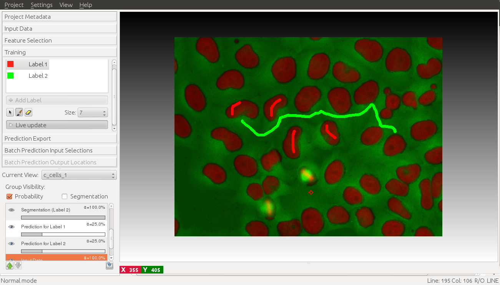
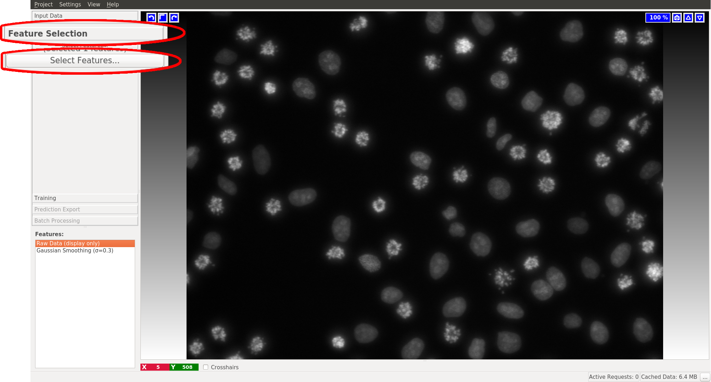
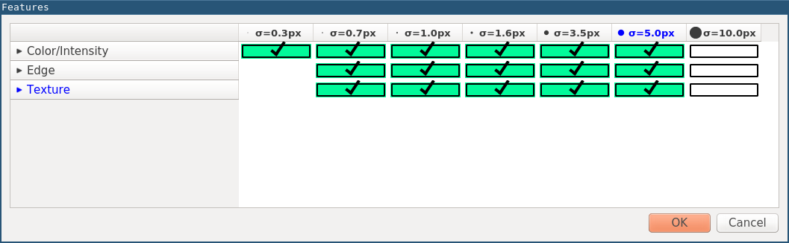
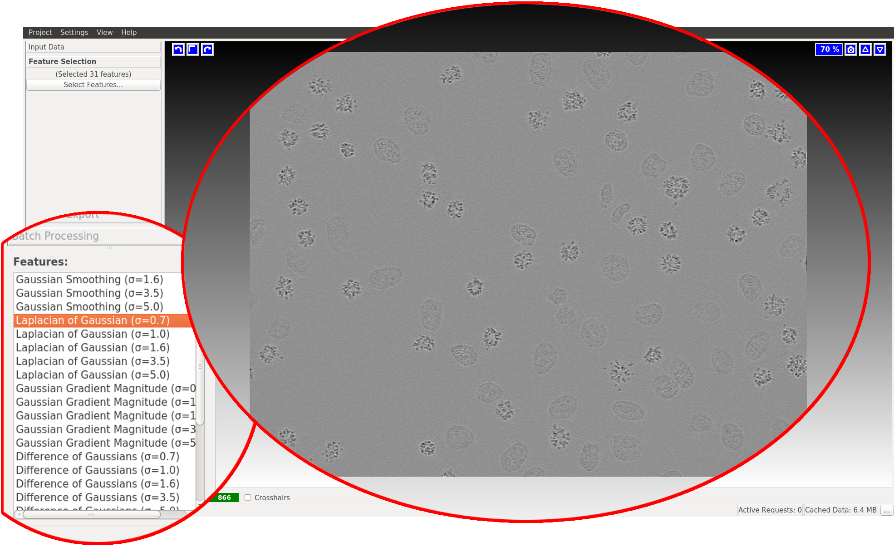
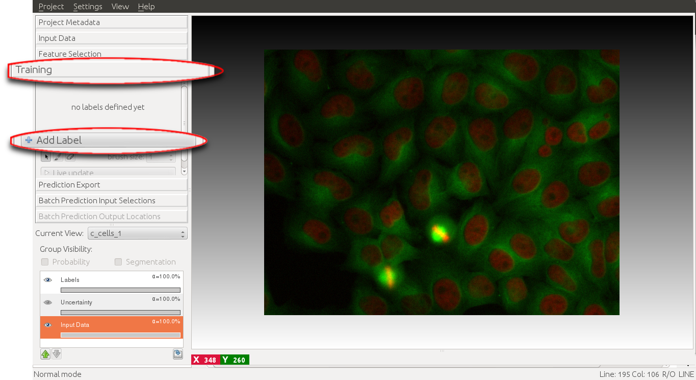
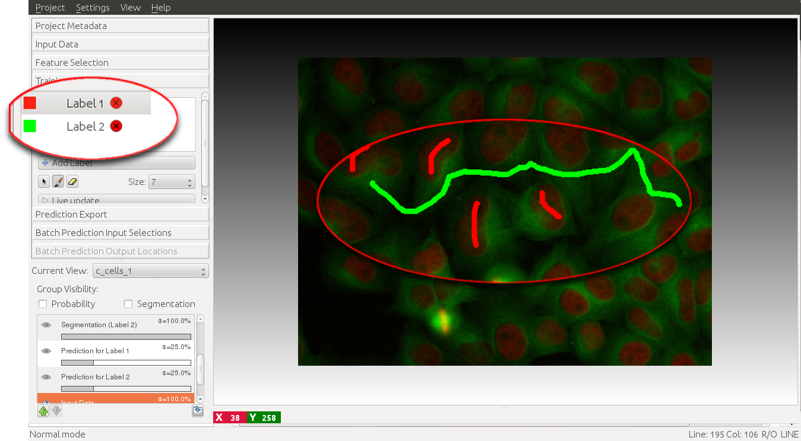
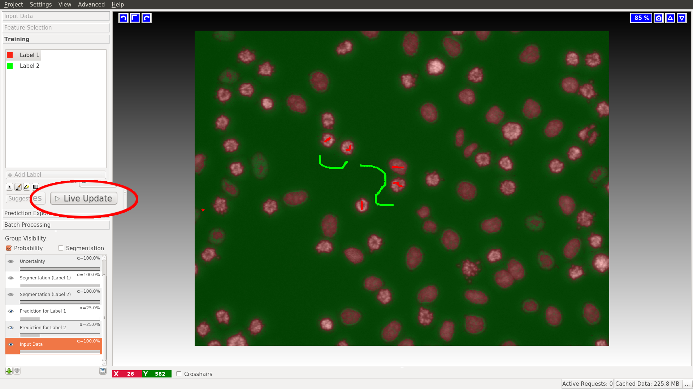
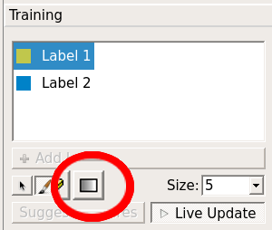

# Pixel Classification
## How it works, what it can do

The pixel classification workflow can classify the pixels of an image given
user annotations. The classification of the image pixels can be used to segment
the image into different objects, such as for example individual cells.
The workflow is especially suited if the objects of interests are visually (brightness, color, texture) distinct from their sorrounding. The algorithm is applicable for a wide range of segmentation problems that
fulfill these properties.

A typical cell segmentation use case is depicted below.

Nice properties of the algorithm and workflow are
- Interactive mode: the user gets immediate feedback after giving additional annotations.
- Batch mode: the trained classifier can be applied to previously unseen images. Results are written to disk.
- Uncertainty guidance: the user can view an uncertainty map, this indicates areas where the classifier is unsure about the results. Additional annotations in these regions help most.

## Selecting good features

Assuming the user has already created or loaded an existing
ilastik project and added a dataset, the first step is to switch to the **Feature Selection Applet**
where the filter selection and computation are performed.
The selected features and scales will be used later on for the training of a classifier.
The selected features and scales should roughly correspond to the visual attributes that separate the
objects and the background.
A click on the **Select features** button brings up a feature selection dialog.

Here the user can select from several different feature types and scales.
- Color/Intensity: these features should be selected if the color or brightness can be used to discern objects
- Edge: should be selected if brightness or color gradients can be used to discern objects.
- Texture: this might be an important feature if the objects in the image have a special textural appearance.

All of these features can be selected on different scales. The scales correspond to the pixel diameter
that is used to calculate the respective feature. I.e. if a typical textural pattern has a pixel size of 4, this should be selected as the scale.

In general we advise to initially select a wide range of feature types and scales. Later on, this selection
can always be refined. The selected features can be inspected in the bottom left after clicking **OK** in the feature selection dialog.

## Training the classifier
The next step in the pixel classification is the training of a classifier
that can separate the object classes. This training is done in an iterative fashion,
the user gives some labels, evaluates the interactive prediction and then gives additional labels to correct
eventual mistakes.
To begin with the training of the classifier, we switch to the **Training** applet and add some labels.

Each added label should correspond to a object type that we want to separate.
In the simpelest case, we add one label for the object class (in this example the object class would be cell)
and an additional label fore the background class.

After adding at least two labels, the user can begin to mark the objects and the background.
To mark an object, the label corresponding to the object class has to be selected, then the user
can draw a scribble over the image.
The background can be annotated in the same way after selecting the background class label on the left.

The user can select the size of the brush, and switch between drawing and erasing mode just below the label list on the left.

To visualize the results of the classification, the **Live update** mode can now be switched on.
The pixel classification result is displayed as an overlay on the image.
Now classification errors can be corrected by giving additional annotations. The updated classification results will be displayed immediately in the main window.

To display the hard classification results, i.e. the final class assignment the **Segmentation** overlays
can be turned on by clicking on the **Segmentation** checkbox.

## Window Leveling
If labeling grayscale images the **Training** applet has an additional option: **Window Leveling**.  This option can facilitate the labeling process but has no impact on the training process itself. It can be used to adjust the data range used for visualization and thus helps to bring out small difference in contrast which might be usefull when placing the labels. Pressing the left mouse button while moving the mouse back and forth changes the window width (data range) used for display. Moving the mouse in the left-right plane changes the window level, i.e. the center of the window. Of course, combinations of back-forth and left-right movements are possible to find just the right contrast needed. Pressing the right mouse button leads to an automatic range adjustment based on the intensity values currently displayed. To activate this feature either press the button outlined in the image below or use its keyboard shortcut (default 't').

Note: if you can not see the button, you are either not working with grayscale images or you did not set the **Channel Display** to **Grayscale** in the **Dataset Properties** of your **Raw Data**.

## Batchprocessing unseen images
When the classifier is trained it can be applied to unseen images as batch processing. This follows a general procedure in ilastik and is demonstrated [here]({{site.baseurl}}/documentation/basics/batch.html)

The result of these worklfow (probability maps and segmentations) can be exported as images (*.tiff, *.png , etc.. ) or *.h5 files. When exporting the results as *.h5 files, it contains the resulting prediction as a multidimensional image. The images have the same shape as the input image, but a different number of channels. Each channel contains the probability of the corresponding label. Example: channel 0 contains at each position the probability of that pixel having label class 1. Channel 1 contains the probabilities of label class 2 etc..

<!-- After the training step the generated classifier can be used to classify and segment other images.
The first step in batch prediction is the selection of the input files.

When clicking on the **Add files** button, the user can choose between adding
single or multiple files from the File selection dialog, or adding files matching a pattern from a directory (last option). This is especially useful when large amounts of images have to be processed.

The next step is the actual batch processing itself. In the **Batch Prediction output location** applet, the
user can configure the output format using the **Choose Settings** button.
For novice users the default settings should be fine.

After clicking on the **Export all** button, ilastik begins batch processing all images, and writes
the resulting classification result to the specified output files. When the default settings are used, the output files are stored as hdf5 files in the same directory where the input file is located.
The exported files have the same name with a "export.h5" suffix.

The exported .h5 files, contain the resulting prediction as a multidimensional image. The images have the same
shape as the input image, but a different number of channels. Each channel contains the probability of the corresponding label. Example: channel 0 contains at each position the probability of that pixel having label class 1. Channel 1 contains the probabilities of label class 2 etc..
 -->

