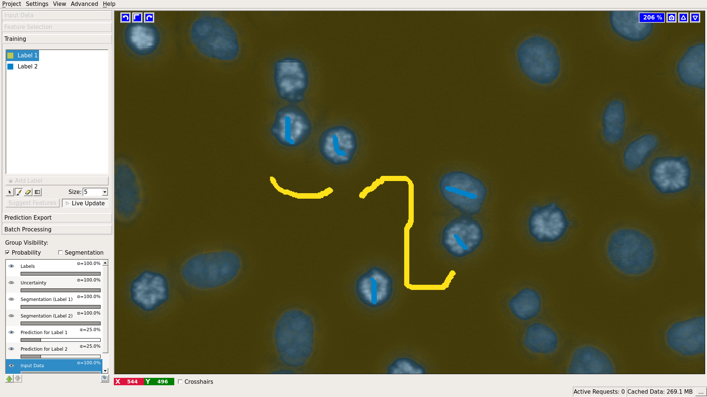

# Pixel Classification

## Pixel Classification Demo (3 minutes)

<iframe width="560" height="315" src="https://www.youtube.com/embed/5N0XYW9gRZY" frameborder="0" allowfullscreen></iframe>

## How it works, what it can do

The Pixel Classification workflow assigns labels to pixels based on pixel features and user annotations.
The workflow offers a choice of generic pixel features, such as smoothed pixel intensity, edge filters and 
texture descriptors. Once the features are selected, a Random Forest classifier is trained from user annotations
interactively. The Random Forest is known for its excellent generalization properties, the overall workflow is
applicable to a wide range of segmentation problems. Note that this workflow performs semantic, rather than 
instance, segmentation and returns a probability map of each class, not individual objects. The probability map
can be transformed into individual objects by a variety of methods. The simplest is, perhaps, thresholding and 
connected component analysis which is provided in the ilastik [Object Classification Workflow]({{site.baseurl}}/documentation/objects/objects.html). Other alternatives include more sophisticated thresholding, watershed and agglomeration algorithms in Fiji and other popular image analysis tools. 

In order to follow this tutorial, you can download the used example project <a href="http://data.ilastik.org/pixelClassification_2dcells.zip">here</a>.
Used image data is courtesy of Daniel Gerlich.

A typical cell segmentation use case is depicted below.

Nice properties of the algorithm and workflow are

- Interactive mode: the user gets immediate feedback after giving additional annotations.
- Batch mode: the trained classifier can be applied to previously unseen images. Results are written to disk.
- Uncertainty guidance: the user can view an uncertainty map, this indicates areas where the classifier is unsure about the results. Additional annotations in these regions help most.

## Selecting good features

As usual, start by loading the data as described [in the basics]({{site.baseurl}}/documentation/basics/dataselection.html). 
After the data is loaded, switch to the next applet **Feature Selection**.
Here you will select the pixel features and their scales which in the next step will be used to discriminate between the different classes of pixels. 

A click on the **Select features** button brings up a feature selection dialog.

For 3D data the features can be computed either in 2D or 3D. 2D can be useful if data has thick slices and the information from a slice is not so relevant for the neighbors. It is also the only way to compute large-scale filters in think stacks. The following image shows the switch between 2D and 3D computation in the Feature Selection dialog.

We provide the following feature types:
- Color/Intensity: these features should be selected if the color or brightness can be used to discern objects
- Edge: should be selected if brightness or color gradients can be used to discern objects.
- Texture: this might be an important feature if the objects in the image have a special textural appearance.

All of these features can be selected on different scales. The scales correspond to the sigma of the Gaussian which is used to smooth the image before application of the filter. Filters with larger sigmas can thus pull in information from larger neighborhoods, but average out the fine details. If you feel that a certain value of the sigma would be particularly well suited to your data, you can also add your own sigmas in the last column, as shown above in red. The following image provides an example of the edge filter computed with 3 different sigma values. Note how the filter fits to the smallest edges at the very low sigma value and only finds the rough cell outlines at a high sigma.

In general we advise to initially select a wide range of feature types and scales. In fact, for not-too-big 2D data where computation time is not a concern, one can simply select all. In the next step, after you start annotating the image, we can suggest you the most helpful features based on your labels. The selected features can be inspected in the bottom left after clicking **OK** in the feature selection dialog.

## Training the classifier
The next step in the pixel classification is the training of a classifier
that can separate the object classes. This training is done in an iterative fashion,
the user gives some labels, evaluates the interactive prediction and then gives additional labels to correct
eventual mistakes.
To begin with the training of the classifier, we switch to the **Training** applet and add some labels.

Each added label should correspond to a object type that we want to separate.
In the simplest case, we add one label for the object class (in this example the object class would be cell)
and an additional label fore the background class.

After adding at least two labels, the user can begin to mark the objects and the background.
To mark an object, the label corresponding to the object class has to be selected, then the user
can draw a scribble over the image.
The background can be annotated in the same way after selecting the background class label on the left.

The user can select the size of the brush, and switch between drawing and erasing mode just below the label list on the left.

To visualize the results of the classification, the **Live update** mode can now be switched on.
The pixel classification result is displayed as an overlay on the image.
Now classification errors can be corrected by giving additional annotations. The updated classification results will be displayed immediately in the main window.

To display the hard classification results, i.e. the final class assignment the **Segmentation** overlays
can be turned on by clicking on the **Segmentation** checkbox.

## How to import labels from an external file {#import}
To access the "Import Labels" feature in the GUI, do the following:

1. Create N label classes (click "Add Label" N times).

2. Right-click on the list item in the lower left-hand corner titled "Labels".  (See screenshot.) That will open up a window to allow you to import labels.
 
3. If your label image is the same size as your input data, and the label image pixels already have consecutive values 1..N, then the default settings may suffice.  Otherwise, you can modify the settings in that window to specify how to offset the label image relative to your input data, and also how to map label image pixel values to the label values ilastik needs (1..N).

## Window Leveling {#window}

If labeling grayscale images the **Training** applet has an additional option: **Window Leveling**.  This option can facilitate the labeling but has no impact on the training process itself. It can be used to adjust the data range used for visualization and thus helps to bring out small difference in contrast which might be useful when placing the labels. Pressing the left mouse button while moving the mouse back and forth changes the window width (data range) used for display. Moving the mouse in the left-right plane changes the window level, i.e. the center of the window. Of course, combinations of back-forth and left-right movements are possible to find just the right contrast needed. Pressing the right mouse button leads to an automatic range adjustment based on the intensity values currently displayed. To activate this feature either press the button outlined in the image below or use its keyboard shortcut (default 't').

Note: if you can not see the button, you are either not working with grayscale images or you did not set the **Channel Display** to **Grayscale** in the **Dataset Properties** of your **Raw Data**.
  

## Processing new images in batch mode
After the classifier is trained, it can be applied to unseen images as batch processing (without further training). This follows a general procedure in ilastik and is demonstrated [here]({{site.baseurl}}/documentation/basics/batch.html).  
The results of this workflow (probability maps or segmentations) can be exported as images (.tiff, .png , etc.. ) or .h5 files. Details on all export options can be found [on this page]({{site.baseurl}}/documentation/basics/export.html). In case you select to export a probability map (this is the default), it will be saved as a multichannel image, where each channel corresponds to a class you defined during training. For example, if you are performing binary classification into foreground/background, the probability map at pixel (px, py) will have the value of the foreground probability in the first channel and the value of the background probability in the second channel. If you choose to save a simple segmentation, the result will be a label image, where pixels are assigned the value of the most probable class. For example, suppose you are performing classification with three classes and the classifier output (probability map) for pixel (px, py) is 0.3, 0.3, 0.4 for classes 0, 1, 2 respectively. In the simple segmentation image ilastik exports, pixel (px, py) will then have value 2. 

### Processing new images in headless mode
Actually, after the classifier is trained, you don't need the GUI anymore. If you'd rather run without it, ilastik has a special [headless]({{site.baseurl}}/documentation/basics/headless.html) mode. This can be convenient for running on a cluster or on a remote machine.

<!-- After the training step the generated classifier can be used to classify and segment other images.
The first step in batch prediction is the selection of the input files.

When clicking on the **Add files** button, the user can choose between adding
single or multiple files from the File selection dialog, or adding files matching a pattern from a directory (last option). This is especially useful when large amounts of images have to be processed.

The next step is the actual batch processing itself. In the **Batch Prediction output location** applet, the
user can configure the output format using the **Choose Settings** button.
For novice users the default settings should be fine.

After clicking on the **Export all** button, ilastik begins batch processing all images, and writes
the resulting classification result to the specified output files. When the default settings are used, the output files are stored as hdf5 files in the same directory where the input file is located.
The exported files have the same name with a "export.h5" suffix.

The exported .h5 files, contain the resulting prediction as a multidimensional image. The images have the same
shape as the input image, but a different number of channels. Each channel contains the probability of the corresponding label. Example: channel 0 contains at each position the probability of that pixel having label class 1. Channel 1 contains the probabilities of label class 2 etc..
 -->

