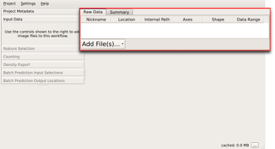

# Data selection dialog

The first step in any Ilastik workflow is to load the data into the
project. It is possible to import data in various forms and formats. The
data can be in a single file or a stack of files which form a
new dimension.

After creating a new project, you'll be presented with the main Ilastik
window. The left panel of this window is populated with steps of the
workflow and the overlay selection box. The right panel contains different
data views based on the active workflow step selected on the left. The data
selection box is shown at the top of the right panel when the `Input Data`
item on the left is active.

The data selection box can be used to add data to the project and modify
various properties, such as transforming coordinates if necessary.

### Add File button

In order to import new data, the `Add
File(s)...` button clearly visible
The add file 

## Loading data from a single file

If your data is in a single file, this can be added easily using the `Add
File(s)...` button clearly visible at the lower border of the data
selection box.

Clicking this button will present a standard file open dialog, where the
desired input file can be selected. This dialog also allows selecting
multiple files. Note that multiple files will be added as if the dialog was
used once for each of these. See the following section for instructions on
how to interpret multiple files as a new dimension in the
data.

## Loading image stacks

If one dimension of the data is separated into different files, such as a
stack of 2D images to form a 3D image or a sequence of 2D images for each
frame in a movie, this option can be used to form a new dimension based on
a list of files.

`Add Volume from Stack...`

## Using a file name pattern to specify multiple files

`Add Many by Pattern...`

  This option allows loading several files by specifying a file name
  pattern. Note that the files loaded in this step are not interpreted as a
  new dimension. This is similar to using the multiple file selection
  option of the `Add File(s)...` item.

Same number of channels

## File properties

- Nickname
- Shape
- Data type
- Axes
- Range
- Normalize
- Internal
