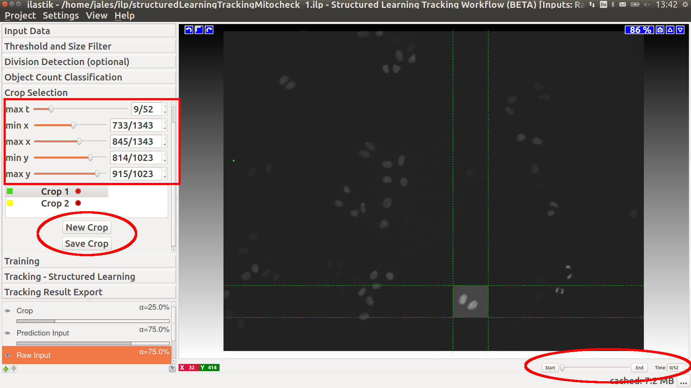
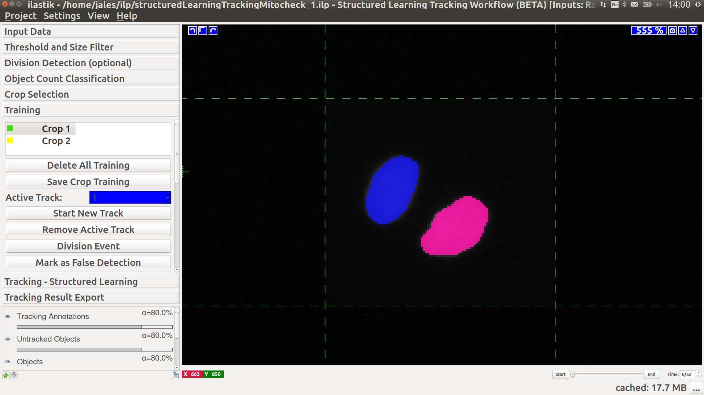

# Tracking with Parameters Learned from Tracking Training

## 1. Overview and Scope

**Note: this tutorial assumes you are familiar with the [_automatic tracking workflow_]({{site.baseurl}}/documentation/tracking/tracking#sec_automatic) already!**

The [**Tracking with Learning**](#sec_structured_learning_tracking) workflow allows to learn the remaining parameters in the [**automatic tracking workflow**]({{site.baseurl}}/documentation/tracking/tracking#sec_automatic) from user annotations in the form of tracks.
To achieve that, the [**tracking with learning**](#sec_structured_learning_tracking) workflow combines building blocks from both, 
manual/semi-automatic and automatic tracking.
Manual/semi-automatic tracking is used to generate tracking training on a set of crops in the original dataset.
Machine learning is used to obtain the optimal weights for the automatic tracking applet based on these small training sets.

**Please note that the _structured learning_ tracking workflow only works on machines where CPLEX is installed
additional to ilastik. Instructions on how to install CPLEX are given 
[here]({{site.baseurl}}/documentation/basics/installation.html).**

The structured learning tracking, manual tracking, and automatic tracking workflows all build on the results of the
[Pixel Classification workflow]({{site.baseurl}}/documentation/pixelclassification/pixelclassification.html).
From the objects detected in pixel classification workflow, 
tracks (object identities linked over time) are either created by the user
in a semi-automatic fashion, by the automatic tracking algorithm using a set of user defined weights, 
or by the structured learning algorithm where these weights
are learned from a small tracking training set, respectively,
optionally allowing for object divisions
(e.g. cell mitosis). 

Structured learning workflow uses manual tracking for training on a small subset of the data,
then learns optimal weights for the given training points, 
and finally it uses these weight in the automatic tracking prediction.

Structured learning tracking uses the following pipeline:

- segmentation/thresholding
- division classifier
- object count classifier
- crop selection
- tracking training
- learn tracking weights
- automatic tracking

Just as in the Pixel Classification, both 2D(+time) and 3D(+time) data may be processed. 
To learn about how to navigate in temporal data ( *scroll through space or time, 
enable/disable overlays, change overlay capacity, etc.* ) please read the
[Navigation guide]({{site.baseurl}}/documentation/basics/navigation.html).

We will now step through a tutorial how to track proliferating cells both in 2D+time
and 3D+time data, which are both provided in the 
[Download]({{site.baseurl}}/download.html)
section. 
The user has to decide already on the startup of ilastik whether he/she wants to *manually* track
objects, use the *automatic* tracking for objects, or use *structured learning tracking*. 

Before starting the tracking workflows, the data has to be segmented into fore- and 
background. The tutorial uses the dataset 
`mitocheck_94570_2D+t_01-53.h5` kindly provided by the
<a href="http://www.mitocheck.org">Mitocheck project</a>,
which is available in the <a href="../../download.html">Download</a> section. 

We refer the user to the first three sections of the tracking documentation: 
Segmentation, 
Input data, and
Thresholding.

**TODO: to start a tracking with learning workflow, select it at startup of ilastik!**

## 2. Providing Tracking Annotations:
The remainder of this tutorial first discusses the training for tracking, 
and then reviews the structured learning tracking applet of the [**structured learning tracking workflow**](#sec_structured_learning_tracking).

Structured learning tracking workflow can process 2D+time (`txy`) as well as 3D+time (`txyz`) datasets. This
tutorial guides through a 2D+time example, an example for a 3D+time dataset can be found at in the documentation for the [**automatic tracking workflow**]({{site.baseurl}}/documentation/tracking/tracking.html#sec_3d).

### 2.1 Crop Selection:
Tracking training only needs to be done on a small subset of the dataset.
The user can select the crops he/she wants to annotate.
Gui lines/corner and slider buttons can be used for resizing the crop, 
which needs to be saved using "Save Crop" button.
To create a new crop use "New Crop" button.

### 2.2 Training for Tracking:

The purpose of this applet is to manually link detected objects in consecutive time steps
to create tracks (trajectories/lineages) for multiple (possibly dividing) objects 
in a small number of small crops of the original data. 
All objects detected in the previous steps are indicated by a yellow color.
While undetected objects may not be recovered to date, the user can correct for the following 
kinds of undersegmentation errors: Merging (objects merge into one detection and later split again), 
and misdetections (false positive detections due to speckles or low contrast).
Currently, the tracking model can only handle all cells in a merger appearing (or disappearing) in the same time frame.

First choose the crop you would like to train for tracking in the list of all crops.
At the end of crop training you have to save the training by pressing "Save Crop Training" button.

Note that -- as in every workflow in ilastik -- displaying and updating the data is much faster when
zooming into the region of interest.

#### Tracking by Clicking or by Semi-Automatic Procedure
To **start a new track**, the respective button is pressed and the track ID
with its associated color (blue in the example below) is displayed as **Active Track**. Then,
each object which is (left-) clicked, is marked with this color and assigned to the current track.
Note that the next time step is automatically loaded after adding an object to the track 
and the logging box displays the successful assignment to the active track.
Typically, we start with an arbitrary object in time step 0, but any order is fine.

In theory, one could now proceed as described and click on each and every object in the following
time steps which belongs to this track. However, this might be rather cumbersome for the user, especially
when dealing with a long image sequence. Instead, the user may use a semi-automatic procedure for the
trivial assignments, i.e. assignments where two objects in successive time frames distinctly overlap in space.
This **semi-automatic tracking** procedure can be started by right-clicking on the object of interest:

The semi-automatic tracking will continue assigning objects to the active track until a point is reached
where the assignment is ambiguous. Then, the user has to decide manually which object to add to the
active track, by repeating the manual or semi-automatic assignments described above.
The track is complete when the final time step is reached. 
To start a new track, one navigates back to the first timestep (either by entering `0` in the time
navigation box in the lower right corner of ilastik, or by using `Shift` + `Scroll Up`).
Then, the next track may be recorded by pressing **Start New Track**.

#### Divisions
In case the user is tracking **dividing objects**, e.g. proliferating cells as in this tutorial,
divisions have to be assigned manually (the semi-automatic tracking will typically stop at these points). To do so,
the user clicks the button **Division Event**, and then -- in this order -- clicks on the 
parent object (mother cell) followed by clicks on the two children objects (daughter cells) *in the next
time step* (here: green and red). As a result, a new track is created for each child. The connection between the parent 
track and the two children tracks is displayed in the **Divisions** list, colored by
the parent object's color (here: blue).

Now, the first sub-lineage may be followed (which possibly divides again, etc.), and when
finished, the user can go back to the division event to follow the second sub-lineage (the respective
track ID must be selected as **Active Track**). To do so, double clicking on the
particular event in the division list navigates to the parent object (mother cell).
It is useful to check its box in order to indicate already processed divisions.
Note that these sub-lineages may again more efficiently be tracked with the *semi-automatic tracking* procedure 
described above.

An example of two annotated divisions is given in the following diagram with four consecutive time frames.

#### Supported Track Topology

The following track structure is supported:

- **One object per track per time step**: Each track ID may only appear at most once per time step. To track
another object, the user has to start a new track. 
- **Merging objects**: Due to possible occlusions or undersegmentation resulting
from the Pixel Classification workflow (i.e. two or
more objects are detected as only one object), it is possible to assign multiple track IDs to
one object. For instance, two distinct cells in previous time steps are merging into one detection and 
later splitting again. Then -- in the sequence where the two cells are occluding each other -- the detections
are treated as *Mergers* of two tracks, and the tracks are recovered after the occlusion.
It should be noted that the object is marked with a color randomly chosen from the track IDs of the comprised
objects. By right-clicking on the object, the user may check which track IDs it is assigned to.
Note, that a track can not start (or end) at a merger unless all tracks in this merger start (or end) at this merger.
- **Misdetections**: It may happen that background is falsely detected as foreground objects. 
The user may mark those objects explicitly as false detections with black color
by pressing **Mark as Misdetection** followed by a click
on the object. Internally, these false detections get assigned the track ID `-1` (corresponds to `65535` in the exported dataset, see below.).
- **Appearance/Disappearance of objects**: Due to low contrast or limited field of view, objects may appear
or disappear. If an object does not have an ancestor or successor in the directly adjacent timesteps, an
appearance or disappearance event, respectively, is evoked. 

#### Advanced Features

Further features in the Manual Tracking applet are:

- **Go to next unlabeled object**: Although the objects may be tracked in an arbitrary order, it is sometimes
useful to automatically jump to the next untracked object, particularly if only few objects are left to track.
The user may then either track the suggested object or mark it as misdetection to get another suggestion for an
object to track next.
- **Window size**: These parameters define the size of the window in which the automatic tracker searches for
overlap between objects of consecutive time steps. Note that the tracking is faster for smaller window sizes,
however, longer sub-tracks may be achieved by bigger window sizes. For the example datasets, we choose a window
size of 40 pixels along each dimension.
- **Inappropriate track colors**: If the color of the next active track is inappropriate (e.g. it has low contrast
on the user's screen, it may be mixed up with other colors in the proximity of the object of interest, or it
is some already reserved color), the user may just leave this track empty and start another track.
- **Delete label**: False assignments of track IDs can be deleted by right-clicking on the respective object.
The user then has the option, to (i) delete the respective track label from this single object, (ii) delete
the track label in the current and all later time steps, or (iii) delete the track label in the current
and all earlier time steps:

Remember that at the end of crop training you have to save the training by pressing "Save Crop Training" button.

#### Export
To export the manual tracking annotations, follow the instructions in the [**export**]({{site.baseurl}}/documentation/tracking/tracking#sec_export) section of the **automated tracking workflow**, since this procedure is similar to the export of the fully automatic tracking.

#### Shortcuts
To most efficiently use the features described above, there are multiple shortcuts available:

| Shortcut       | Description   
|:--------------:| :-----------------------------
| `Shift + Scroll` | Scroll image through time
| `Ctrl + Scroll`| Zoom
| `k`            | Go to next timeframe
| `j`            | Go to previous timeframe
| `s`            | Start new track
| `d`            | Mark division event
| `f`            | Mark false detection
| `q`            | Increment active track ID
| `a`            | Decrement active track ID
| `g`            | Go to next unlabeled object
| `e`            | Toggle manual tracking layer visibility
| `r`            | Toggle objects layer visibility

## 3. Structured Learning:
Automatic tracking uses a set of weights associated with detections, transitions, divisions, appearances, and disappearances to balance the components of the energy function optimized.
Default weights can be used or they can be user specified. In structured learning we use the training annotations and all the classifiers to calculate optimal weights 
for the given data and training - press the "Calculate Weights" button.
To obtain a tracking solution press "Track!" button, which works exactly as in the [**automatic tracking workflow**]({{site.baseurl}}/documentation/tracking/tracking#sec_automatic).
The user can also input weights obtained from other similar data sets and by pass the learning procedure.   

The following two diagrams show the difference of automatic tracking using the default weights and weights obtained by structured learning.
Example areas of change are circled in red.

 
To export the tracking result for further analysis, the user can choose between different options as described in the [**export**]({{site.baseurl}}/documentation/tracking/tracking#sec_export) section of the **automated tracking workflow**.

