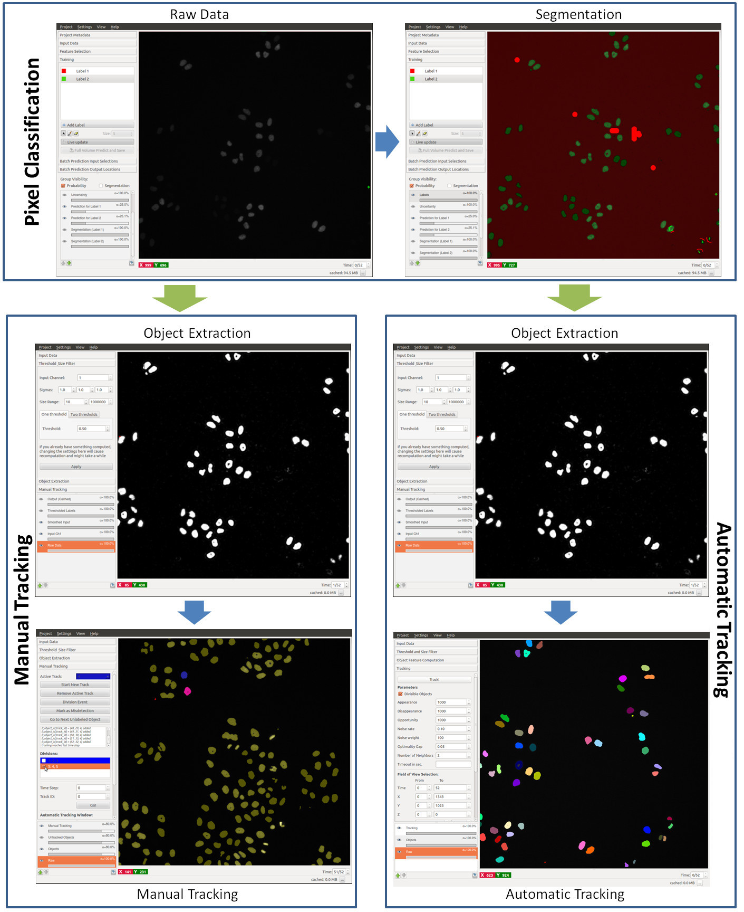
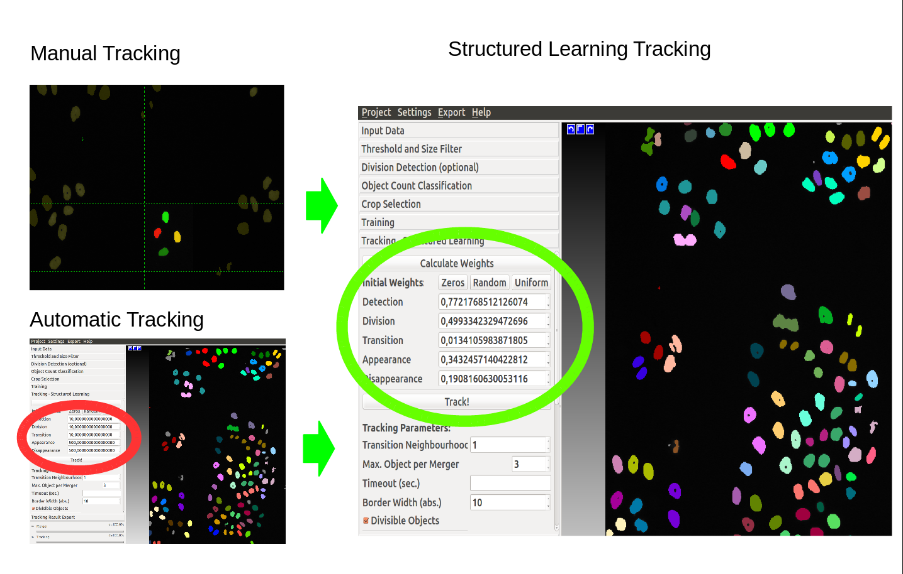
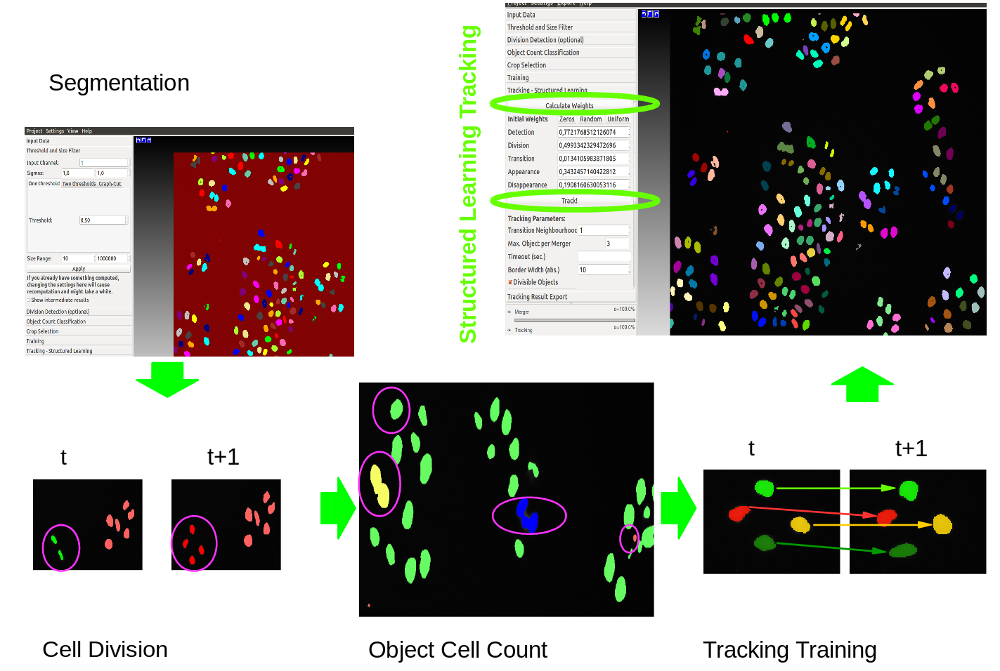
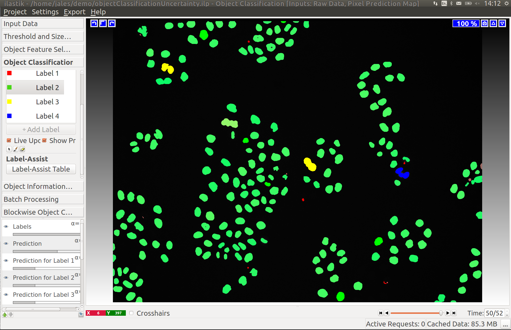
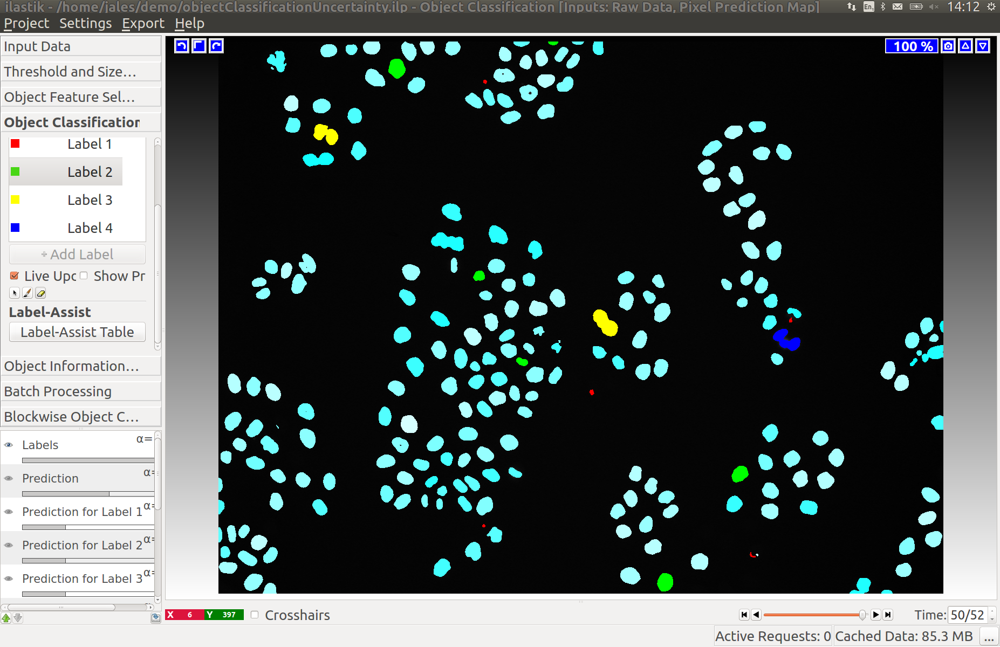
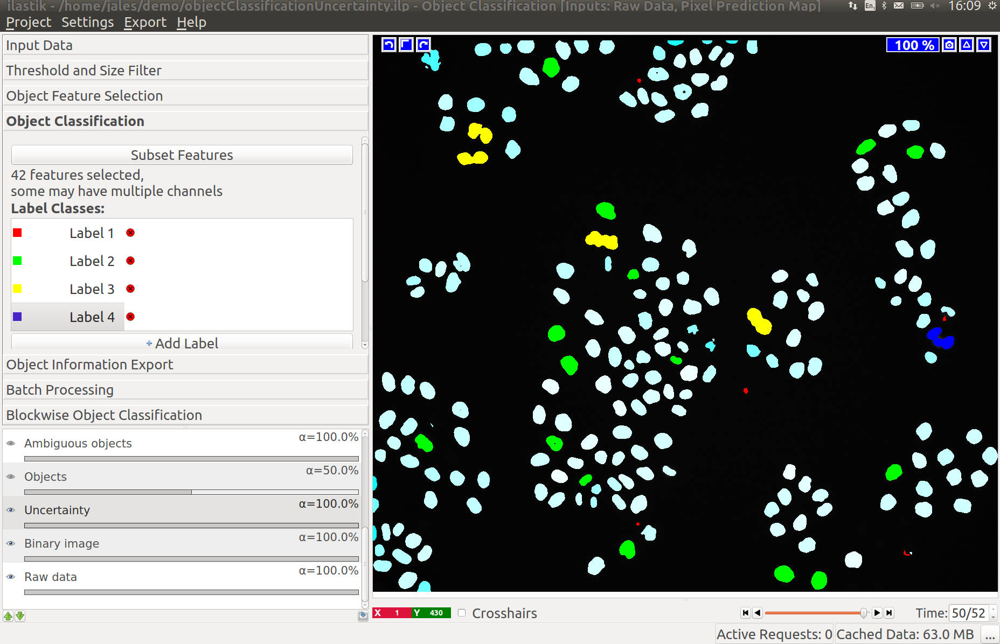
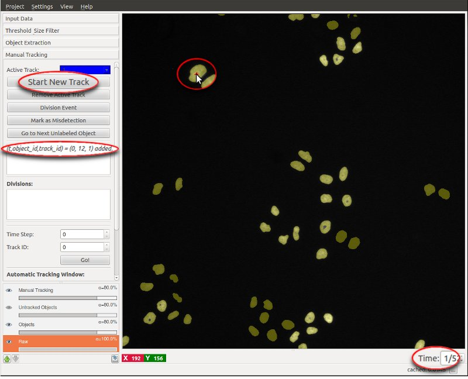
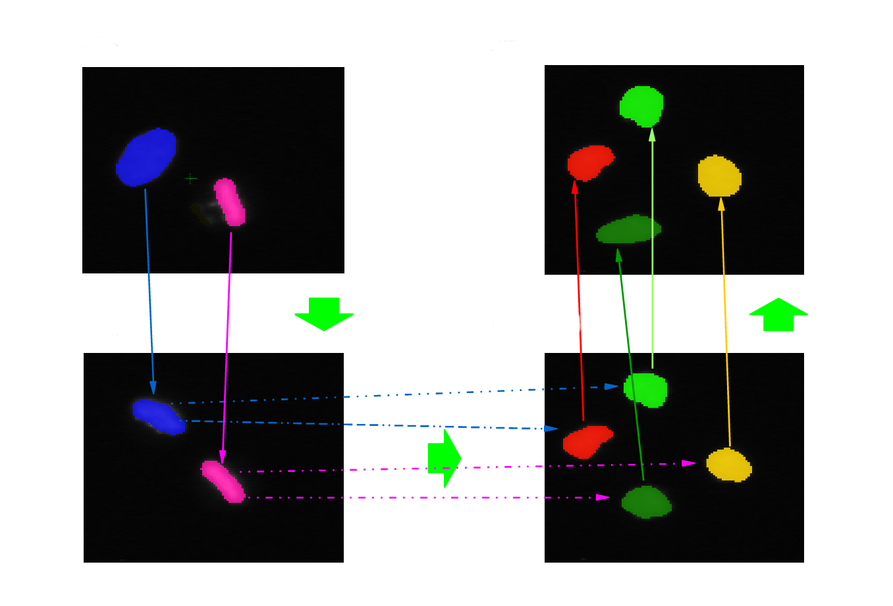
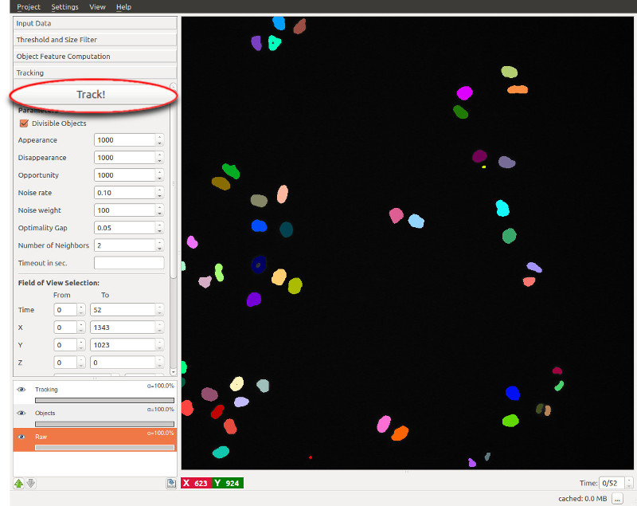

# Structured Learning Tracking with Tracking Training

## Overview and Scope

Ilastik provides three different tracking workflows, the manual/semi-automatic tracking, the automatic tracking, 
and the structured learning tracking.

While the [**automatic tracking workflow**](#sec_automatic)
is used to track multiple (dividing) objects in presumably big datasets, the purpose of the [**manual tracking
workflow**](#sec_manual) is to track objects *manually* from previously detected objects. 
The latter may be useful for high-quality tracking of small datasets or 
ground truth acquisition. To speed up this process, sub-tracks may be generated automatically for trivial
assignments such that the user only has to link objects where the tracking is ambiguous.
[**Structured learning tracking**](#sec_structured_learning_tracking) builds on applets from both, 
manual/semi-automatic and automatic tracking.
Manual/semi-automatic tracking is used to generate tracking training on a set of crops in the original dataset.
Structured learning is used on this small training set to generate weights used for the automatic tracking applet.

Although they are different workflows, structured learing, automatic and manual tracking share a few 
components (*applets*) for preprocessing the dataset.

It is assumed that the user first reads the preceeding section on [**tracking**](#sec_tracking).

**Please note that the _structured learning_ tracking workflow only works on machines where CPLEX is installed
additional to ilastik. Instructions on how to install CPLEX are given 
[here]({{site.baseurl}}/documentation/basics/installation.html).**

The structured learning tracking, manual tracking, and automatic tracking workflows all build on the results of the
[Pixel Classification workflow]({{site.baseurl}}/documentation/pixelclassification/pixelclassification.html).
From the objects detected in pixel classification workflow, 
tracks (object identities linked over time) are either created by the user
in a semi-automatic fashion, by the automatic tracking algorithm using a set of user defined weights, 
or by the structured learning algorithm where these weights
are learned from a small tracking training set, respectively,
optionally allowing for object divisions
(e.g. cell mitosis). 

Structured learning workflow uses manual tracking for training on a small subset of the data,
then learns optimal weights for the given training points, 
and finally it uses these weights in the automatic tracking prediction.

Structured learning tracking uses the following pipeline:

- segmentation/thresholding
- division classifier
- object count classifier
- crop selection
- tracking training
- learn tracking weights
- automatic tracking

Just as in the Pixel Classification, both 2D(+time) and 3D(+time) data may be processed. 
To learn about how to navigate in temporal data ( *scroll through space or time, 
enable/disable overlays, change overlay capacity, etc.* ) please read the
[Navigation guide]({{site.baseurl}}/documentation/basics/navigation.html).

We will now step through a tutorial how to track proliferating cells both in 2D+time
and 3D+time data, which are both provided in the 
[Download]({{site.baseurl}}/download.html)
section. 
The user has to decide already on the startup of ilastik whether he/she wants to *manually* track
objects, use the *automatic* tracking for objects, or use *structured learning tracking*. 

Before starting the tracking workflows, the data has to be segmented into fore- and 
background. The tutorial uses the dataset 
`mitocheck_94570_2D+t_01-53.h5` kindly provided by the
<a href="http://www.mitocheck.org">Mitocheck project</a>,
which is available in the <a href="../../download.html">Download</a> section. 

We refer the user to the first three sections of the tracking documentation: 
Segmentation, 
Input data, and
Thresholding.

## 0. Segmentation:
The tracking workflows are based on the results of the 
[Pixel Classification workflow]({{site.baseurl}}/documentation/pixelclassification/pixelclassification.html),
where the
user segments foreground objects (e.g. cells) from background by defining two
labels and providing examples through brush strokes. 
Please find a detailed
description of this workflow 
[here]({{site.baseurl}}/documentation/pixelclassification/pixelclassification.html)
and hints on how to load time-series datasets are provided <a href="../basics/dataselection.html">here</a>.

In this example, we paint some background
pixels with Label 1 (red by default) and cell nuclei are marked with Label 2 
(green by default). When happy with the live segmentation, the user applies
the learned model to the entire dataset by exporting the results in the **Prediction Export** applet 
to (preferably) an hdf5 file such as  
`mitocheck_94570_2D+t_01-53_export.h5`. 
To directly showcase the tracking workflows, we provide this file with the data.

Now, one of the tracking workflows: Manual Tracking, Automatic Tracking, or structured Learning Tracking, if 
[CPLEX is installed]({{site.baseurl}}/documentation/basics/installation.html) 
can be launched from the start screen of ilastik
by creating a new project.

Structured learning tracking workflow uses the following applets:

## 1. Input Data:
To begin, the raw data and the prediction maps (the results from the Pixel Classification workflow or segmented images from
other sources) 
need to be specified in the respective tab (in this case we choose the workflow with **Prediction Map** as input rather than
binary image). In particular, the file 
`mitocheck_94570_2D+t_01-53.h5` 
is added as **Raw Data** and the dataset in
`mitocheck_94570_2D+t_01-53_export.h5`
is loaded as **Prediction Maps**.

The tracking workflows expect the image sequence to be loaded as a time-series data containing a time axis;
if the time axis is not automatically detected (as in hdf5-files), the axes tags may be modified in a dialog 
when loading the data (e.g. the `z` axis may be interpreted as `t` axis by replacing `z` by `t` in this dialog). 
Please read the <a href="../basics/dataselection.html">Data selection guide</a> for further tricks how to load images as time-series
data.

After specifying the raw data and its prediction maps, the latter will be smoothed
and thresholded in order to get a binary segmentation, 
which is done in the **Thresholding and Size Filter** applet:

## 2. Thresholding and Object Classification:
If the user chose a to start the workflow with prediction maps as input (rather than binary images,
in which case this applet will not appear), 
the user first has to threshold these prediction maps.
First, the channel of the prediction maps which contains the foreground 
predictions has to be specified. 
For instance, if in the Pixel Classification workflow,
the user chose Label 1 (red by default) to mark foreground, **Input Channel** will be 0, 
otherwise, if Label 2 (green by default) was taken as the foreground label, then Channel
takes value 1. Thus, we choose the Input Channel to be 1 in this tutorial. If the correct 
channel was selected, the foreground objects appear in distinct colors after pressing **Apply**:

The prediction maps are storing a probability for each single pixel/voxel to be foreground. 
These probabilities may be smoothed over the neighboring probabilities with a Gaussian filter,
specified by the **Sigma** values (allowing for anisotropic filtering).
The resulting probabilities are finally **thresholded** at the value specified. The default
values for the smoothing and thresholding should be fine in most of the cases.

## 2. Object Classification:
Please consult the documentation of the
[Object Classification workflow]({{site.baseurl}}/documentation/objects/objects.html)
for a more detailed description of this applet, including an explanation of the **Two thresholds** 
option.

## 2.1 Uncertainty Layer
While a correct segmanetation is enough for segmentation purposes,
tracking workflows benefit from a segmentation with small objects' uncertainties,
steering the tracking algorithm in using the classified object count in the final solution.
In the example presented, segmentation is already satisfactory.

However, examining the uncertainty layer, we see a high level of uncertainty.

Adding a few more labels we get a much better uncertainty estimate:

with the corresponding segmentation:

The same should be done for the Division Classifier if divisions are being tracked.

Note that, although the tracking workflows usually expect prediction maps as input files, nothing prevents
the user from loading (binary) segmentation images instead. In this case, we recommend to disable
the smoothing filter by setting all **Sigmas** to 0 and the user should choose a **Threshold** of 0. 
For performance reasons, it is, however, recommended to start the appropriate workflow when 
the user has already a binary image.

Finally, objects outside the given **Size Range** are filtered out for this and the following
steps.

***Please note that changing any of the following computations and the tracking will 
be invalid (and deleted) when parameters in this step are changed.***

In the following applets, connected groups of pixels will be treated as individual objects.

## 3. Tracking:
The remainder of this tutorial first discusses the training for tracking, 
and then reviews the structured learning tracking applet of the [**structured learning tracking workflow**](#sec_structured_learning_tracking).

Structured learning tracking workflow can process 2D+time (`txy`) as well as 3D+time (`txyz`) datasets. This
tutorial guides through a 2D+time example, and a 3D+time example dataset is provided and discussed
[at the end of the tutorial](#sec_3d_slt).

### 3.1 Training Subset Selection:
Tracking training only needs to be done on a small subset of the dataset that is not necessarily connected.
Algorithm prunes objects that are not included in the training.
Tracks must be continuous.

### 3.2 Training for Tracking:

The purpose of this applet is to manually link detected objects in consecutive time steps
to create tracks (trajectories/lineages) for multiple (possibly dividing) objects 
in a small subset of the original data.
All objects detected in the previous steps are indicated by a yellow color.
While undetected objects may not be recovered to date, the user can correct for the following 
kinds of undersegmentation errors: Merging (objects merge into one detection and later split again), 
and misdetections (false positive detections due to speckles or low contrast).
Currently, the tracking model can only handle all cells in a merger appearing (or disappearing) in the same time frame.

Note that -- as in every workflow in ilastik -- displaying and updating the data is much faster when
zooming into the region of interest.

#### Tracking by Clicking or by Semi-Automatic Procedure
To **start a new track**, the respective button is pressed and the track ID
with its associated color (blue in the example below) is displayed as **Active Track**. Then,
each object which is (left-) clicked, is marked with this color and assigned to the current track.
Note that the next time step is automatically loaded after adding an object to the track 
and the logging box displays the successful assignment to the active track.
Typically, we start with an arbitrary object in time step 0, but any order is fine.

In theory, one could now proceed as described and click on each and every object in the following
time steps which belongs to this track. However, this might be rather cumbersome for the user, especially
when dealing with a long image sequence. Instead, the user may use a semi-automatic procedure for the
trivial assignments, i.e. assignments where two objects in successive time frames distinctly overlap in space.
This **semi-automatic tracking** procedure can be started by right-clicking on the object of interest:

The semi-automatic tracking will continue assigning objects to the active track until a point is reached
where the assignment is ambiguous. Then, the user has to decide manually which object to add to the
active track, by repeating the manual or semi-automatic assignments described above.
The track is complete when the final time step is reached. 
To start a new track, one navigates back to the first timestep (either by entering `0` in the time
navigation box in the lower right corner of ilastik, or by using `Shift` + `Scroll Up`).
Then, the next track may be recorded by pressing **Start New Track**.

#### Divisions
In case the user is tracking **dividing objects**, e.g. proliferating cells as in this tutorial,
divisions have to be assigned manually (the semi-automatic tracking will typically stop at these points). To do so,
the user clicks the button **Division Event**, and then -- in this order -- clicks on the 
parent object (mother cell) followed by clicks on the two children objects (daughter cells) *in the next
time step* (here: green and red). As a result, a new track is created for each child. The connection between the parent 
track and the two children tracks is displayed in the **Divisions** list, colored by
the parent object's color (here: blue).

Now, the first sub-lineage may be followed (which possibly divides again, etc.), and when
finished, the user can go back to the division event to follow the second sub-lineage (the respective
track ID must be selected as **Active Track**). To do so, double clicking on the
particular event in the division list navigates to the parent object (mother cell).
It is useful to check its box in order to indicate already processed divisions.
Note that these sub-lineages may again more efficiently be tracked with the *semi-automatic tracking* procedure 
described above.

An example of two annotated divisions is given in the following diagram with four consecutive time frames.

#### Supported Track Topology

The following track structure is supported:

- **One object per track per time step**: Each track ID may only appear at most once per time step. To track
another object, the user has to start a new track. 
- **Merging objects**: Due to possible occlusions or undersegmentation resulting
from the Pixel Classification workflow (i.e. two or
more objects are detected as only one object), it is possible to assign multiple track IDs to
one object. For instance, two distinct cells in previous time steps are merging into one detection and 
later splitting again. Then -- in the sequence where the two cells are occluding each other -- the detections
are treated as *Mergers* of two tracks, and the tracks are recovered after the occlusion.
It should be noted that the object is marked with a color randomly chosen from the track IDs of the comprised
objects. By right-clicking on the object, the user may check which track IDs it is assigned to.
Note, that a track can not start (or end) at a merger unless all tracks in this merger start (or end) at this merger.
- **Misdetections**: It may happen that background is falsely detected as foreground objects. 
The user may mark those objects explicitly as false detections with black color
by pressing **Mark as Misdetection** followed by a click
on the object. Internally, these false detections get assigned the track ID `-1` (corresponds to `65535` in the exported dataset, see below.).
- **Appearance/Disappearance of objects**: Due to low contrast or limited field of view, objects may appear
or disappear. If an object does not have an ancestor or successor in the directly adjacent timesteps, an
appearance or disappearance event, respectively, is evoked. 

#### Advanced Features

Further features in the Manual Tracking applet are:

- **Go to next unlabeled object**: Although the objects may be tracked in an arbitrary order, it is sometimes
useful to automatically jump to the next untracked object, particularly if only few objects are left to track.
The user may then either track the suggested object or mark it as misdetection to get another suggestion for an
object to track next.
- **Window size**: These parameters define the size of the window in which the automatic tracker searches for
overlap between objects of consecutive time steps. Note that the tracking is faster for smaller window sizes,
however, longer sub-tracks may be achieved by bigger window sizes. For the example datasets, we choose a window
size of 40 pixels along each dimension.
- **Inappropriate track colors**: If the color of the next active track is inappropriate (e.g. it has low contrast
on the user's screen, it may be mixed up with other colors in the proximity of the object of interest, or it
is some already reserved color), the user may just leave this track empty and start another track.
- **Delete label**: False assignments of track IDs can be deleted by right-clicking on the respective object.
The user then has the option, to (i) delete the respective track label from this single object, (ii) delete
the track label in the current and all later time steps, or (iii) delete the track label in the current
and all earlier time steps:

Remember that at the end of crop training you have to save the training by pressing "Save Crop Training" button.

#### Export
To export the manual tracking annotations, follow the instructions [at the end of this tutorial](#sec_export), since 
this procedure is similar to the export of the fully automatic tracking.

#### Shortcuts
To most efficiently use the features described above, there are multiple shortcuts available:

| Shortcut       | Description   
|:--------------:| :-----------------------------
| `Shift + Scroll` | Scroll image through time
| `Ctrl + Scroll`| Zoom
| `s`            | Start new track
| `d`            | Mark division event
| `f`            | Mark false detection
| `q`            | Increment active track ID
| `a`            | Decrement active track ID
| `g`            | Go to next unlabeled object
| `e`            | Toggle manual tracking layer visibility
| `r`            | Toggle objects layer visibility

### 3.3 Automatic Tracking (Conservation Tracking):

If 
[CPLEX is installed]({{site.baseurl}}/documentation/basics/installation.html), it is possible to launch the **automatic tracking workflow (Conservation Tracking)** 
and -- after the same preprocessing steps as described above -- the user arrives at the automatic tracking applet.

This automatic tracking applet implements the algorithm described in [\[1\]](#ref_conservation). The algorithm aims to
link all (possibly dividing) objects over time, where objects may be automatically marked as false positive detections 
(misdetections due to speckles or low contrast) by the
algorithm. Note that -- as of the time of writing -- this algorithm cannot recover missing objects, i.e. objects which 
have not been detected by the previous segmentation step. 

As a preprocessing for tracking, it is recommended to train object classifiers as described in the
[Object Classification user documentation]({{site.baseurl}}/documentation/objects/objects.html).
In the **Division Detection** applet, a object must be labeled as *dividing*, if it is dividing between the current and next timestep into
two objects. Other objects must be labeled as *not dividing*. The user should label enough objects until the *live prediction* yields
satisfying results on unlabeled objects.

It furthermore is recommended to train an **Object Count Classifier**. Here, some examples for actually false positive detections are labeled
red, and examples for 1, 2,... objects (=mergers) are labeled with the respective color. This classifier is trained sufficiently if it returns 
the right class for most of the objects in *live prediction* mode. 

Now, we can finally proceed to the tracking applet.
To track the objects detected in the preprocessing steps over all time steps, it is enough to press the **Track** button
(after having checked whether the objects are divisible such as cells or not). After successful tracking, each object (and 
its children in case of divisions) should be marked over time in a distinct random color.

The algorithm internally formulates a graphical
model comprising all potential objects with relations to objects in their spatial neighborhood in the following time step.
To these objects and relations, costs are assigned defined by the given parameters and an optimizer is called to find
the most probable tracking solution for the model constructed, i.e. it tries to minimize the computed costs.

Although the tracking result should usually be already sufficient with the default values, we now briefly give explanations
for the **parameters** our tracking algorithm uses (see [\[1\]](#ref_conservation) for more details). 

| Parameter       | Description
|:---------------| :-------------------------
| Divisible Objects | Check if the objects may divide over time, e.g. when tracking proliferating cells
| Appearance      | Costs to allow one object to appear, i.e. to start a new track other than at the beginning of the time range or the borders of the field of view. High values (&ge;1000) forbid object appearances if possible.
| Disappearance   | Costs to allow one object to disappear, i.e. to terminate an existing track other than at the end of the time range or the borders of the field of view. High values (&ge;1000) forbid object disappearances if possible.
| Opportunity     | Costs for the lost opportunity to explain more of the data, i.e. the costs for not tracking one object and treating it as false detections. High values (&ge;1000) lead to more tracks (but could also include the tracking of noise objects).
| Noise rate      | The estimated rate of false detections coming from the segmentation step. Small values (&asymp;0.01) treat every detected object as a true detection, if possible.
| Noise weight    | The costs to balance a detected object against transitions. High values (&ge;100) treat most objects as true detections if the noise rate is set to a small value (&asymp;0.01).
| Optimality Gap  | The guaranteed upper bound for a solution to deviate from the exact solution of the tracking model. Low values (&le;0.05) lead to better solutions but may lead to long optimization times. Higher values (&ge;0.1) speed up optimization time but lead to approximate solutions only.
| Number of Neighbors | Number of neighbors to be considered as potential association candidates. Less neighbors speed up optimization time, but might have negative impact on tracking results. A reasonable value might be 2 or 3.
| Timeout in sec.  | Timeout in seconds for the optimization. Leave empty for not specifying a timeout (then, the best solution will be found no matter how long it takes).

Furthermore, a **Field of View** may be specified for the tracking. Restricting the field of view to less time steps 
or a smaller volume may lead to significant speed-ups of the tracking. Moreover, a **Size** range can be set to filter out objects which are smaller or larger than the number of pixels specified.

In **Data Scales**, the scales of the dimensions may be configured. For instance, if the resolution of the 
pixels is (dx,dy,dz) = (1&mu;m,0.8&mu;m,0.5&mu;m), then the scales to enter are (x,y,z)=(1,1.25,2).

## 4. Structured Learning:
Automatic tracking uses a set of weights associated with detections, transitions, divisions, appearances, and disappearances to balance the components of the energy function optimized.
Default weights can be used or they can be user specified. In structured learning we use the training annotations and all the classifiers to calculate optimal weights 
for the given data and training - press the "Calculate Weights" button.
To obtain a tracking solution press "Track!" button.
The user can also input weights obtained from other similar data sets and by pass the learning procedure.   

The following two diagrams show the difference of automatic tracking using the default weights and weights obtained by structured learning.
Example areas of change are circled in red.

 
To export the tracking result for further analysis, the user can choose between different options described next.

## 5. Export:

To export the tracking results (either of manual tracking or automatic tracking), the **Tracking Result Export** applet
provides the same functionality as for other ilastik workflows. It exports the color-coded image from the *Tracking applet*
as image/hdf-file/etc. 
Recall that all objects get assigned random IDs (visualized as random colors) at the first frame of the image sequence
and all descendants in the same track (also children objects such as daughter cells) inherit this ID/color.
In other words, each **lineage** has the same label over time starting with unique IDs in the first time step for 
each object.

In addition to the export applet, we provide further 
useful export functionality in the **Manual Tracking** applet. We distinguish between `track_id` which corresponds
to the **Active track** ID chosen earlier, and `object_id` which stands for the identifier each object has in the **Objects** layer.
The `object_ids` can be exported separately by right-clicking on the **Objects** layer control.

* **Export Divisions as csv**: By pressing the **Export Divisions as csv ...** button in the **Manual Tracking** applet,
   the list of dividing cells is exported as a csv file. Its content is in the following format: `timestep_parent,track_id_parent,track_id_child1,track_id_child2`

* **Export Mergers as csv**: As mentioned above, mergers are only assigned one of their comprised track IDs. 
   Thus, it may be useful to separately export the list of mergers with all comprised track IDs to file.
   In the **Manual Tracking** applet, the button **Export Mergers as csv ...** will write out such a csv-file
   where the content has the following format: `timestep,object_id,track_ids`, where the `track_ids` contained in the
   merged object are concatenated using semicolons. 
   Here, the `object_id` corresponds to the unique identifier the object has in the **Objects layer** which can be 
   exported separately by right clicking on the **Objects** layer control.

* **Export as h5**: Another option is to export the manual tracking as a set of hdf5 files, one for 
   each time step, containing pairwise events between consecutive frames (appearance, disappearance, move,
   division, merger). In each of these hdf5 files (except the one for the first time step), detected events
   between object identifiers (stored in the volume `/segmentation/labels`) are stored in the following format:

| Event      | Dataset Name | Object IDs 
|:----------|:------------| :-------------------------
| Move      | `/tracking/Moves` | `from (previous timestep), to (current timestep)`
| Division | `/tracking/Splits` | `ancestor (prev. timestep), descendant (cur. timestep), descendant (cur. timestep)`
| Appearance | `/tracking/Appearances` | `object_id appeared in current timestep`
| Disappearance | `/tracking/Disappearances` | `object_id disappeared in current timestep`
| Merger | `/tracking/Mergers` | `object_id, number_of_contained_objects` 

We would recommend to use the methods described above, but additionally, the results of the manual **and** automatic tracking may also 
be accessed via the ilastik project file:

* **Process the content of the project file**: The ilastik project file (.ilp) may be opened with any hdf5 dataset viewer/reader, 
   e.g. with `hdfview`:

   * *Manual Tracking*: In the Manual Tracking folder, there are the folders `Labels` and `Divisions`. The `Labels`
   folder contains for each time step a list of objects, each of which holds a list of the track IDs which were assigned by the
   user. The `Divisions` dataset contains the list of divisions in the format

           track_id_parent track_id_child1 track_id_child2 time_parent

   * *Automatic Tracking*: In the Conservation Tracking folder, the events are stored as described in the table above.

## Tracking in 3D+time Data

One strength of the tracking workflows compared to similar programs available on the web is that 
tracking in 3D+time (`txyz`) data is completely analogous to the tracking in 2D+time (`txy`) data
described above. The data may be inspected in a 3D orthoview and, in the case of manual/semi-automatic tracking,
a click on one pixel of the object is 
accepted in any orthoview. Tracked objects are colored in 3D space, i.e. colored in all
orthoviews with the respective track color. 

To get started with 3D+time data, we provide example data in the
[Download]({{site.baseurl}}/download.html)
section. The file 
`drosophila_00-49.h5` shows 50 time steps of a small excerpt of a developing *Drosophila* embryo, kindly
provided by the 
<a href="http://www.embl.de/research/units/cbb/hufnagel/">Hufnagel Group at EMBL Heidelberg</a>.
A sample segmentation of cell nuclei in this dataset is available in `drosophila_00-49_export.h5`.

For both manual and automatic tracking, the steps of the 2D+time tutorial above may be followed analogously.

## References

\[1\] M. Schiegg, P. Hanslovsky, B. X. Kausler, L. Hufnagel, F. A. Hamprecht. 
**Conservation Tracking.**
*Proceedings of the IEEE International Conference on Computer Vision (ICCV 2013)*, 2013.
