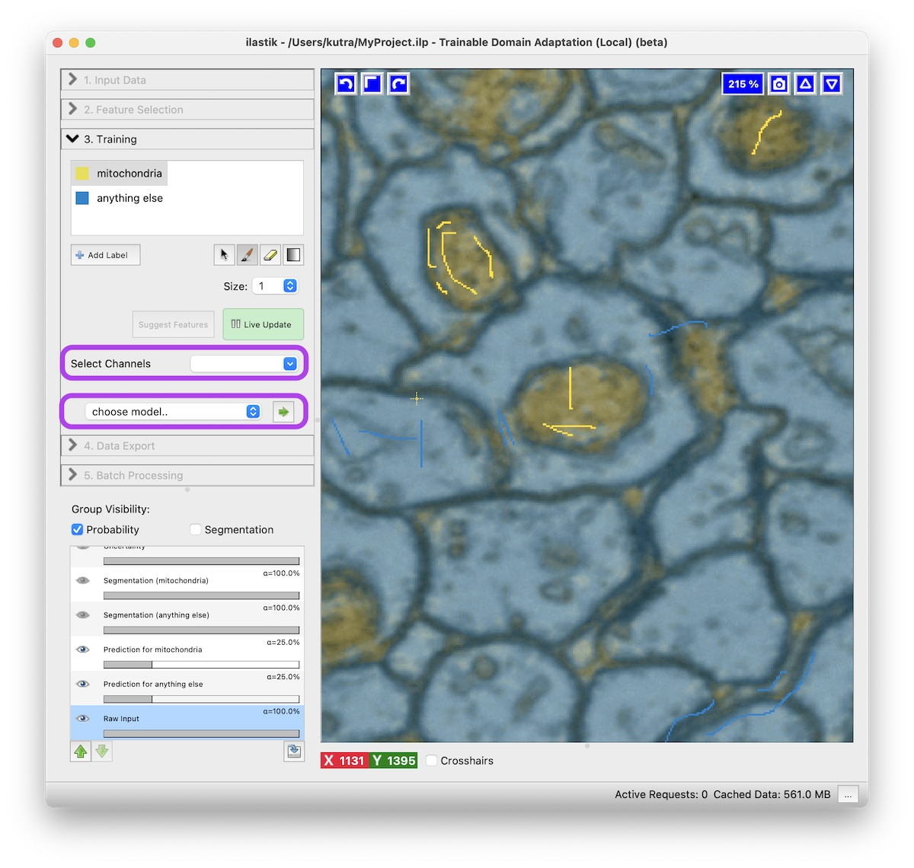
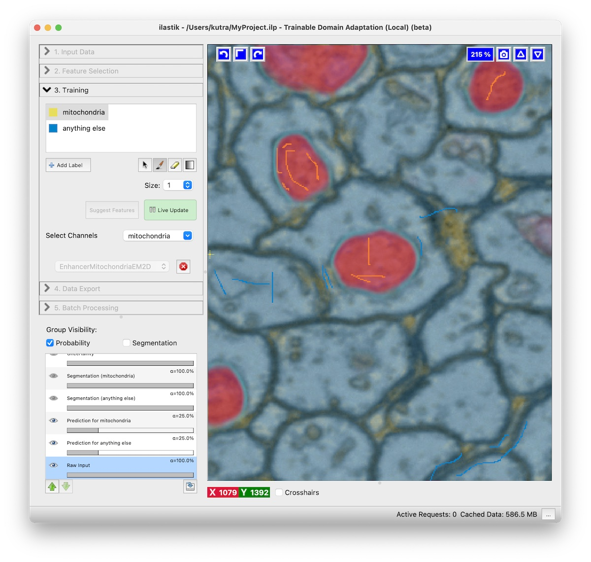

# Trainable Domain Adaptation

This workflow allows you to combine the [Pixel Classification][pixelclass] approach with pre-trained convolutional neural networks (CNNs) for specific tasks.
The workflow is available starting from ilastik version `1.4.1b1`.

The core idea is the following:
Neural Networks have been pushing the limits of what is possible in image analysis for a while, but training these networks requires a lot of expertise and annotated ground truth data.
With the [BioImage Model Zoo][bioimageio], there are many networks available that have been trained on a specific task and on specific data.
This can work very well on your data, if your data is sufficiently similar to the one used in training of the neural network and the network has been trained well.
In microscopy the variation of the image data is high compared to natural images so it is hard to train a network that works out of the box on many different datasets.
While [Pixel Classification][pixelclass] might not get you all the way for complex image segmentation tasks, it can be trained to your particular dataset very rapidly and interactively given sparse brush annotations.
In the Trainable Domain Adaptation workflow, we combine the strength of the Pixel Classification approach with the strength of neural networks that have learned higher order features for a specific task.
We provide special networks that have been trained to correct the mistakes that might be made by Pixel Classification.

A description of the ilastik Trainable Domain Adaptation workflow has been published: [Alex Matskevych et al. - From Shallow to Deep: Exploiting Feature-Based Classifiers for Domain Adaptation in Semantic Segmentation. In Frontiers in Computer Science 2022 (vol. 4)][fullpaper] (link to [preprint][preprint]).

## How to use the workflow

Before you start, you should be aware, that you can only work on tasks that have a pre-trained network available.
Currently pre-trained networks for the following tasks are available:

 * Mitochondria segmentation in 2D and 3D electron microscopy (EM) images
 * General boundary enhancement for EM images in 3D

 But we will add more!

The user interactions are very similar to the ones in Pixel Classification

1. You start by [**loading your data**][dataselection]
2. Continue to [**select features**][featureselection]
3. [**Train the pixel classifier**][training] for the specific task.
   Usually two classes should be enough, with one being the structure you want to segment, e.g. Mitochondria, and the second class is anything else.
   Remember to turn on _live update_.
4. **Select the channel** of the structure you're interested in (e.g. Mitochondria) in the _Select Channels_ drop down.
5. **Choose a model** from the drop down.
   After pressing the green arrow button, the network is downloaded from the model zoo.
   New _NN Prediction_ layers will appear.
   Depending on your hardware prediction with the neural network might take some time.
   An NVidia GPU helps immensely here, when a GPU-enabled ilastik binary is used.
   
6. **Refine the result** by adding more annotations.
   While _live update_ is activated, you can interactively improve the result by adding more annotations.
   Add annotations where the predictions of the neural network are incorrect.
   

[bioimageio]: https://bioimage.io
[pixelclass]: {{site.baseurl}}/documentation/pixelclassification/pixelclassification.html
[dataselection]: {{site.baseurl}}/documentation/basics/dataselection.html
[featureselection]: {{site.baseurl}}/documentation/pixelclassification/pixelclassification.html#selecting-good-features
[training]: {{site.baseurl}}/documentation/pixelclassification/pixelclassification.html#training-the-classifier
[fullpaper]: https://www.frontiersin.org/articles/10.3389/fcomp.2022.805166/full
[preprint]: https://www.biorxiv.org/content/10.1101/2021.11.09.467925v1
