# Tracking

## Overview and Scope

Ilastik provides different tracking workflows, marked with a specific color. Each workflow share a few components (*applets*) for
preprocessing the data, described in this tutorial. 

<ul>
<li> Manual Tracking Workflow &#9679; </li>
<li> Automatic Tracking Workflow (most general, for dividing objects) &#9679; </li>
<li> Animal Tracking Workflow (for animals or other non-dividing objects) &#9679; </li>
<li> Tracking with Learning Worfklow (automatic tracking with more flexible parameters) &#9679; </li>
</ul>

The colored dots will guide you to the documentation sections for the workflow you need. The workflow has to selected at the start of ilastik.
Depending on this choice, this tutorial will diverge later.

<a href="./fig/ilastik_overview.png" data-toggle="lightbox">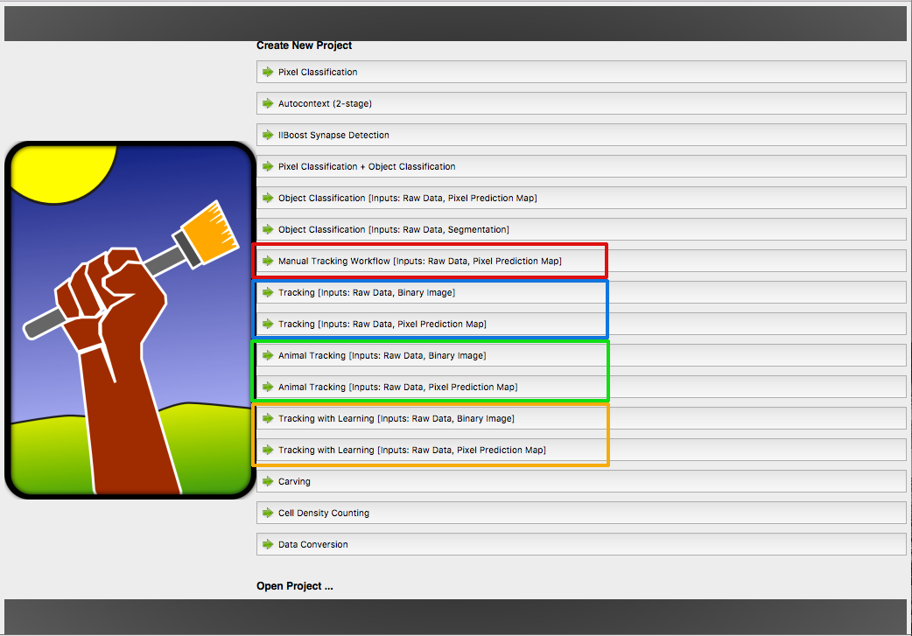</a>

<!-- Ilastik provides two different tracking workflows, the manual/semi-automatic tracking and the automatic tracking.
While the fully [**automatic tracking workflow**](#sec_automatic)
is used to track multiple (dividing) objects in presumably big datasets, the purpose of the [**manual tracking
workflow**](#sec_manual) is to track objects *manually* from previously detected objects. 
The latter may be useful for high-quality tracking of small datasets or 
ground truth acquisition. To speed up this process, sub-tracks may be generated automatically for trivial
assignments such that the user only has to link objects where the tracking is ambiguous.

Although they are different workflows, automatic and manual tracking share a few 
components (*applets*) for preprocessing the dataset.
This tutorial describes those shared applets for both workflows simultaneously before providing documentation for the
specific manual/semi-automatic or (fully) automatic tracking applets. -->

All tracking in ilastik is done as "tracking-by-assignment", i.e. on pre-detected objects. The detection (segmentation) itself can be done in ilastik (Pixel Classification workflow) 
or in another tool of your choice. If the segmentation is not perfect and some of the objects get merged, ilastik tracking workflows can resolve merges of reasonable size.

The fully [**automatic tracking workflow**](#sec_automatic)
is used to track multiple (dividing) objects in presumably big datasets, while the purpose of the [**manual tracking workflow**](#sec_manual) is to track *manually* or rather semi-automatically. The latter may be useful for high-quality tracking of small datasets or for
ground truth acquisition. To speed up this process, sub-tracks can be generated automatically for trivial
assignments such that the user only has to link objects where the tracking is ambiguous. 
[**Tracking with learning**](#sec_structured_learning) is an even more advanced version of the automatic tracking. It allows you to provide short ground truth sub-tracks to automatically adjust the parameters of automatic tracking using a structured learning approach as described [here](https://papers.nips.cc/paper/4484-structured-learning-for-cell-tracking) and [here](https://arxiv.org/abs/1206.6421). The ground truth sub-tracks are provided using the applets from the manual tracking workflow, while the rest of the training is performed as in the automatic tracking.
Finally, [**animal tracking**](#sec_animal) workflow is the tool for tracking non-dividing objects.

**Please note that the _tracking with learning_ workflow only works on machines where CPLEX or GUROBI is installed
additional to ilastik. Instructions on how to install CPLEX are given 
[here]({{site.baseurl}}/documentation/basics/installation.html#cplex-setup).**

<!-- The manual tracking and automatic tracking workflows both build on the results of the
[Pixel Classification workflow]({{site.baseurl}}/documentation/pixelclassification/pixelclassification.html).
From the objects detected in this workflow, tracks (object identities linked over time) are either created by the user
in a semi-automatic fashion or by the automatic tracking algorithm, respectively,
optionally allowing for object divisions
(e.g. cell mitosis).  -->

<!-- <a href="./fig/00_overview.jpg" data-toggle="lightbox">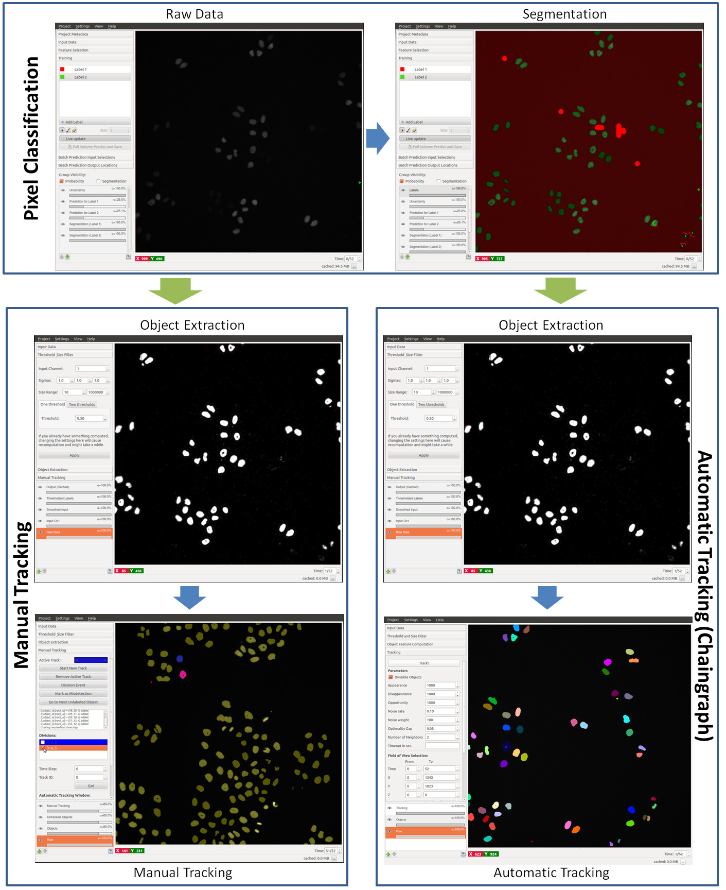</a> -->

Just as in the Pixel Classification, both 2D(+time) and 3D(+time) data may be processed. 
To learn about how to navigate in temporal data ( *scroll through space or time, 
enable/disable overlays, change overlay capacity, etc.* ) please read the
[Navigation guide]({{site.baseurl}}/documentation/basics/navigation.html).

We will now step through the tutorial on how to track proliferating cells both in 2D+time
and 3D+time datasets, which are both provided in the 
[Download]({{site.baseurl}}/download.html)
section. 

Before starting the tracking workflows, the objects to be tracked need to be segmented. To fully illustrate ilastik capabilities,
we will walk through the common parts of the workflows with both cell and animal data. We use the mitocheck dataset, 
`mitocheck_94570_2D+t_01-53.h5` kindly provided by the
<a href="https://www.mitocheck.org">Mitocheck project</a>,
which is available in the <a href="../../download.html">Download</a> section, and a video of fruitflies in a bowl, kindly provided by the 
Branson Lab at HHMI Janelia Research Campus. 

## 0. Segmentation: &#9679;&#9679;&#9679;&#9679;
The tracking workflows are based on the results of the 
[Pixel Classification workflow]({{site.baseurl}}/documentation/pixelclassification/pixelclassification.html),
where the
user segments foreground objects (e.g. cells) from background by defining two
labels and providing examples through brush strokes. 
Please find a detailed
description of this workflow 
[here]({{site.baseurl}}/documentation/pixelclassification/pixelclassification.html)
and hints on how to load time-series datasets <a href="../basics/dataselection.html">here</a>.

For the cells data (on the left), we label background as Label 1 (red by default) and foreground (cell nuclei) as Label 2 (green by default). In the fly bowl data,
we do the opposite and label background green and the flies are red. When segmenting, keep an eye on the closely located objects in the later, more crowded, time frames. 
Try to get the objects as well separated as possible. While ilastik 
tracking can resolve some merges after tracking, it's always better to push the segmentation as far as you can. 

 

<a href="fig/02_training_widescreen.png" data-toggle="lightbox">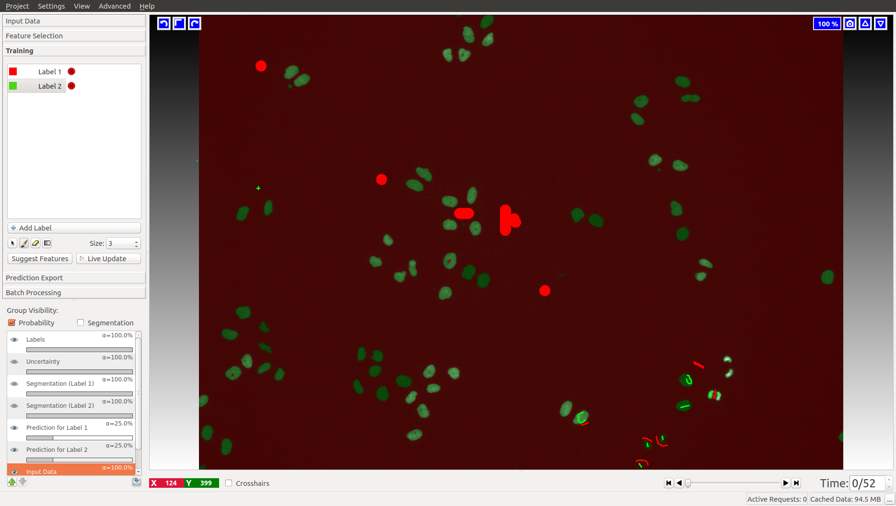</a>

<a href="../animalTracking/fig/trainingSegmentation.png" data-toggle="lightbox">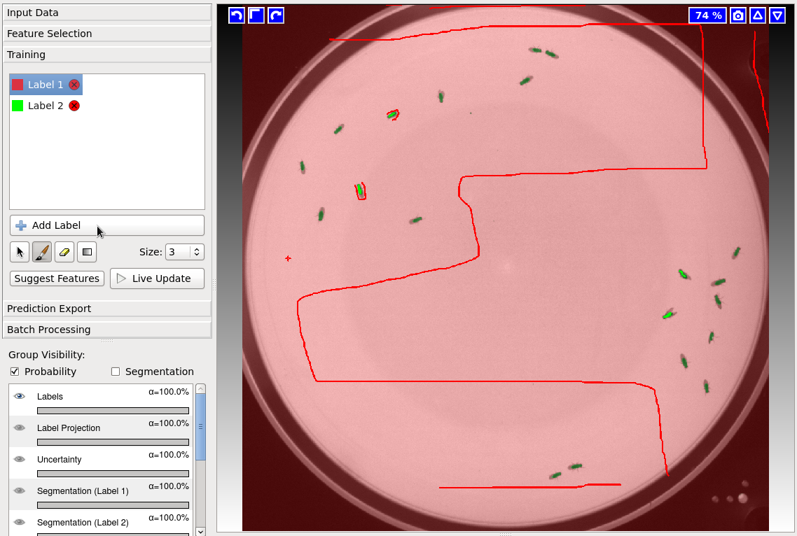</a>

When happy with the live prediction, apply
the classifier to the entire dataset by exporting the results in the **Prediction Export** applet 
to (preferably) an hdf5 file such as `mitocheck_94570_2D+t_01-53_export.h5`. If you export probability maps, you can threshold them later in the tracking workflows.
To directly showcase the tracking workflows, we provide this file with the data.

 

<a href="fig/Export_PC.png" data-toggle="lightbox">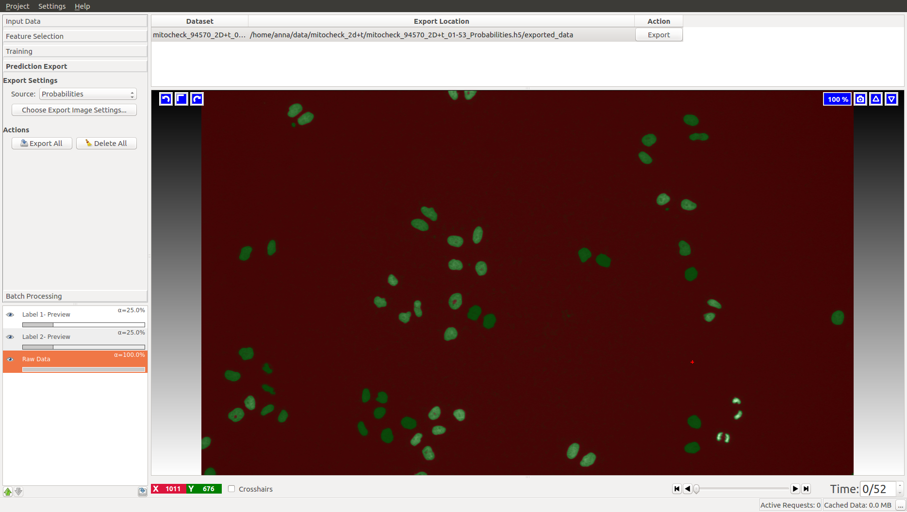</a>

<a href="../animalTracking/fig/exportSegmentation.png" data-toggle="lightbox">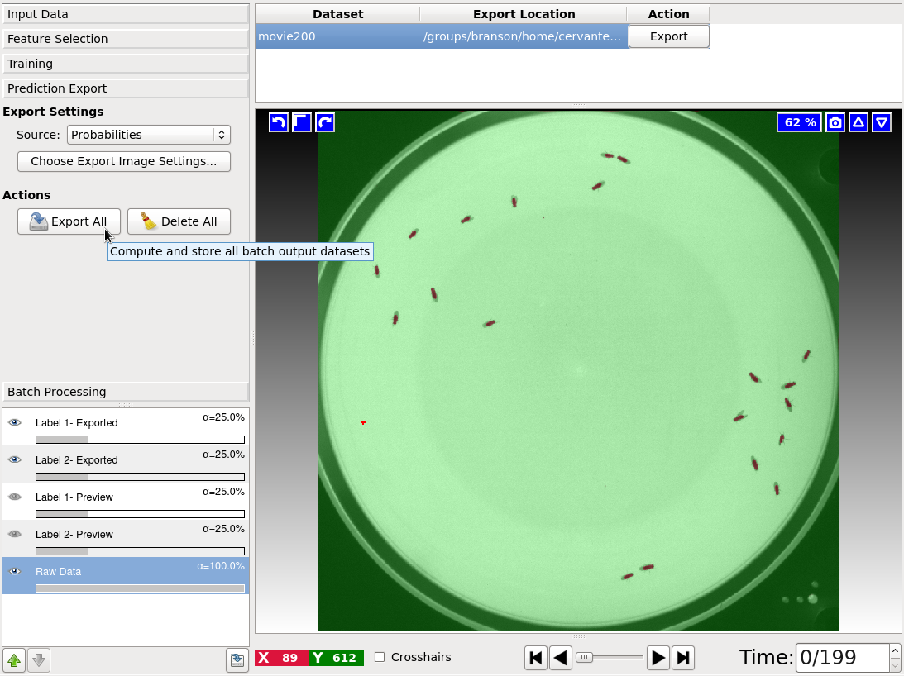</a>

Now, one of the tracking workflows can be launched from the start screen of ilastik by creating a new project.

Let's go through the applets of the tracking workflows one by one. Remember, that the color codes correspond to workflows where the applets are present.

## 1. Input Data: &#9679;&#9679;&#9679;&#9679;
To begin, the raw data and the prediction maps (the results from the Pixel Classification workflow or segmented images from
other sources) need to be specified in the respective tab (in this case we choose the workflow with **Pixel Prediction Map** as input rather than
binary image). In particular, the file 
`mitocheck_94570_2D+t_01-53.h5` is added as **Raw Data** and the dataset in `mitocheck_94570_2D+t_01-53_export.h5`
is loaded as **Prediction Maps**.

The tracking workflow expects the image sequence to be loaded as a time-series data containing a time axis;
if the time axis is not automatically detected (as in hdf5-files), the axes tags may be modified in a dialog 
when loading the data (e.g. the `z` axis may be interpreted as `t` axis by replacing `z` by `t` in this dialog). 
Please read the <a href="../basics/dataselection.html">Data selection guide</a> for further tricks how to load images as time-series
data.

<a href="./fig/06_load-predictions.png" data-toggle="lightbox">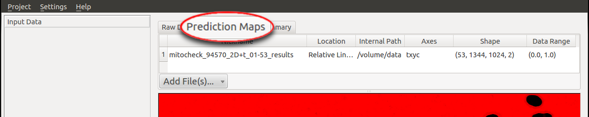</a>

After specifying the raw data and its prediction maps, the latter will be smoothed
and thresholded in order to get a binary segmentation, 
which is done in the **Thresholding and Size Filter** applet:

## 2. Thresholding and Size Filter: &#9679;&#9679;&#9679;&#9679;
If you choose to start the workflow with pixel prediction maps as input (rather than binary images,
in which case this applet will not appear), you first has to threshold these prediction maps. The pixel prediction maps 
store the per-pixel probability of the foreground and background classes. The **Sigma** value allows you to smooth the probability maps,
with potentially different sigma values along different axis (which comes in very useful for anisotropic data). The smoothed
probabilities are **thresholded** at the specified value, here 0.5. Depending on the quality of your pixel prediction map, you may want
to change the thresholding value to be bigger or smaller. The applet can also perform hysteresis thresholding, see the documentation
of the [Object Classification workflow]({{site.baseurl}}/documentation/objects/objects.html) for more details on that. 
Finally, objects outside the given **Size Range** are filtered out for this and the following steps.

First, the channel of the prediction maps which contains the foreground 
predictions has to be specified. 
For instance, in the left image the green channel holds the foreground (cells), while in the right image the red channel holds the foreground (flies). 
If the correct channel was selected, the foreground objects appear in distinct colors after pressing **Apply**:

 

<a href="fig/07_thresholding-01.png" data-toggle="lightbox">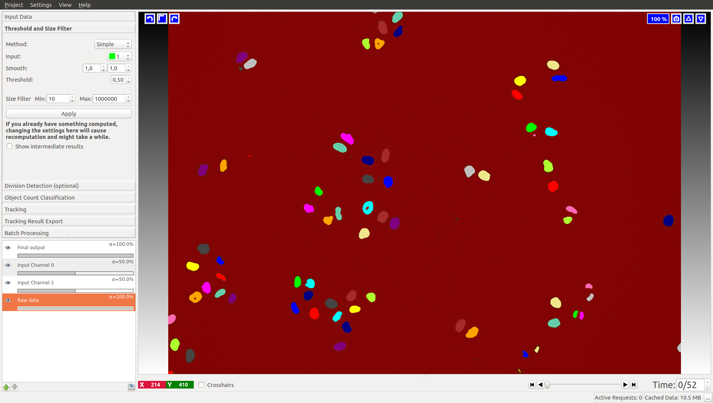</a>

<a href="../animalTracking/fig/thresholdTracking.png" data-toggle="lightbox">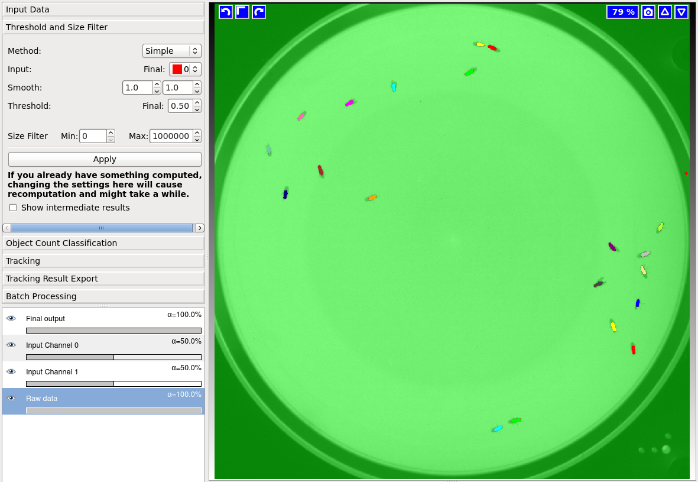</a>

Note that, although the tracking workflows usually expect prediction maps as input files, nothing prevents
the user from loading (binary) segmentation images instead. In this case, we recommend to disable
the smoothing filter by setting all **Sigmas** to 0 and the user should choose a **Threshold** of 0. 
For performance reasons, it is, however, recommended to start the appropriate workflow when 
the user has already a binary image.

***Please note that all of the following computations and the tracking will 
be invalid (and deleted) when parameters in this step are changed.***

Now that we have extracted objects from pixels, let's proceed with classification and then tracking.

## 3. Division and Object Count classifiers
To set the tracking problem up correctly, you need to train ilastik to recognize divisions and object mergers.
The two applets responsible for that are just [object classification]({{site.baseurl}}/documentation/objects/objects.html) applets, where we have already selected
the most relevant object features. 

### 3.1 Division detection &#9679;&#9679;
This applet does not appear in the animal tracking worklfow, so we will only illustrate it with cell data. Two classes are already
added for you, "Dividing" and "Not dividing". To mark a division, click on the _last frame where the dividing object is still one_. Then advance
one time frame and label the daughter cells as "Not dividing". In the Mitocheck dataset, let's look at frame 10, where a division happens in upper left corner.

 

<a href="fig/division_class_label_div.png" data-toggle="lightbox">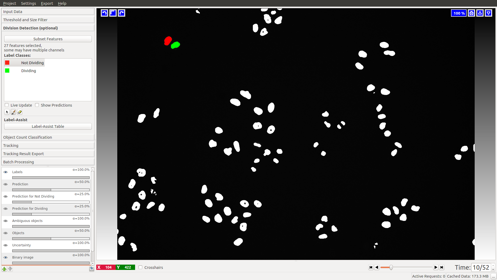</a>

<a href="fig/division_class_label_not_div.png" data-toggle="lightbox">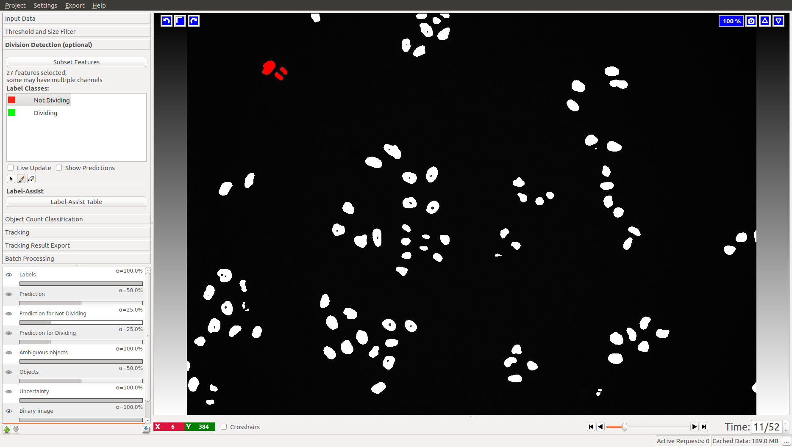</a>

Obviously, you have to label more than one division to train the classifier. The Uncertainty layer, described below, should help you get to the right amount of
training annotations.

### 3.2 Object Count classification &#9679;&#9679;&#9679;

As you add labels to this classification applet, you will see "False Detection", "1 object", "2 objects", etc. 

 

<a href="fig/object_count_mito.png" data-toggle="lightbox">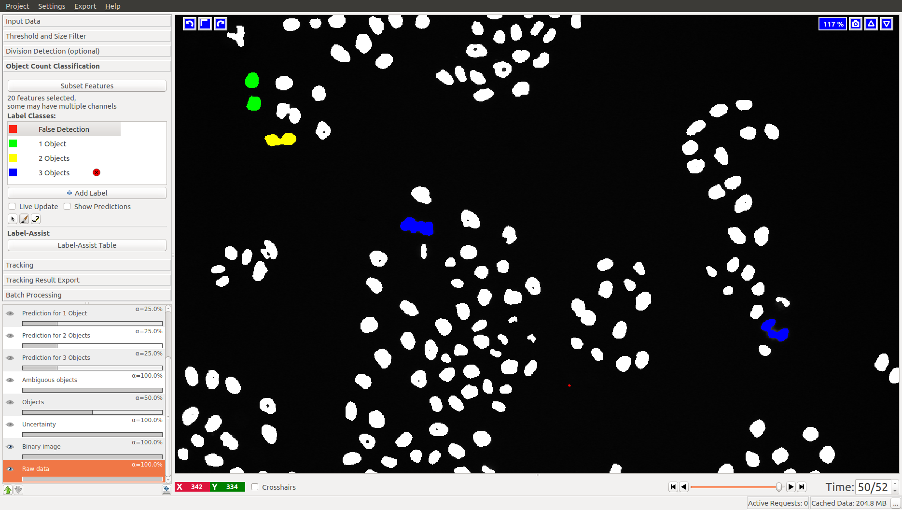</a>

<a href="../animalTracking/fig/countClassifierTracking.png" data-toggle="lightbox">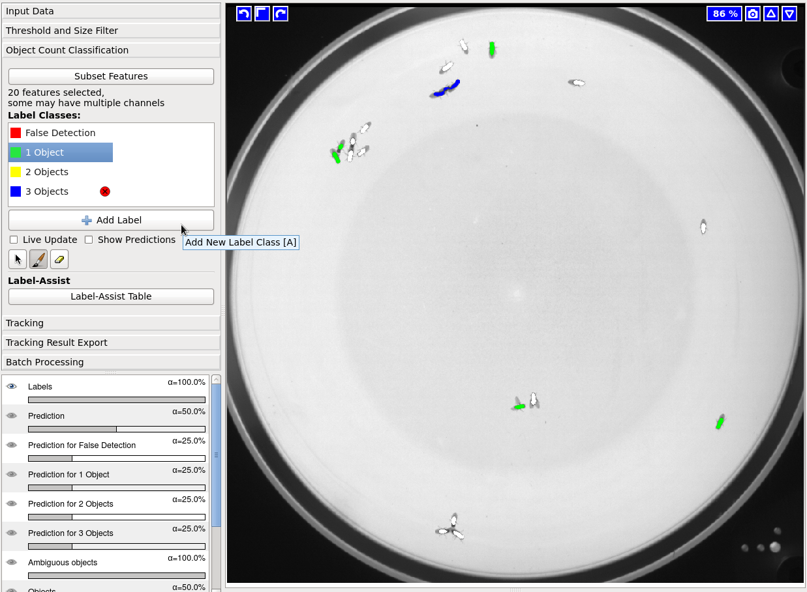</a>

 

To help you find the big clusters of objects, we have added a <strong>Label-Assist Table</strong>, which computes the object sizes across the frames and shows you where the biggest and smallest ones 
are located. To get that info, click on the <strong>Compute Object Info</strong> button and wait a while. The biggest objects most likely correspond to mergers of multiple objects, while the smallest objects
probably represent false detections.

 

<a href="../animalTracking/fig/labelAssistTracking.png" data-toggle="lightbox">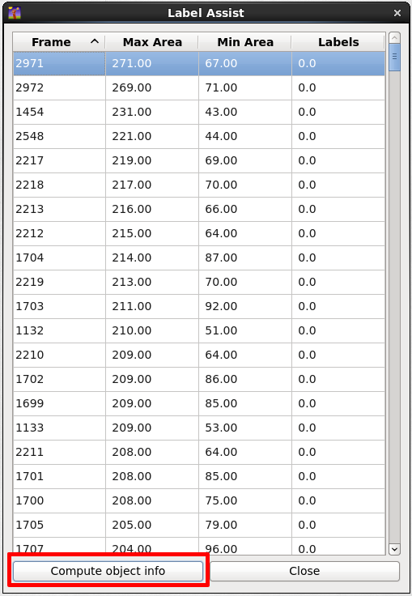</a>

### 3.3 Improving divisions and object counts - Uncertainty layer &#9679;&#9679;&#9679;
While a few annotated objects can already produce a good classification into dividing/not dividing classes or for the object count,
our tracking algorithm really benefits if the classifiers are certain of their predictions. The reason for this is that the
graphical model used for tracking takes the object class probabilities into account, not just the most probable class assignments.
To help you examine the current uncertainty of the classifier you trained, we added an uncertainty layer to our applets.

 

In the left image you can see the predictions of the classifier, in the right - the uncertainty, which is still fairly high.

After adding a few more labels we get a much better uncertainty estimate:

 

 

Division detection classifier should be treated in the same way.

## 4. Tracking: &#9679;&#9679;&#9679;&#9679;
And finally, we are getting to track! Here we will first describe the **automatic tracking workflow** and then show
how the [**manual tracking workflow**](#sec_manual) could be used to either create ground-truth or to power the extension of the automatic
tracking - the [**tracking with learning workflow**](#sec_structured_learning).

All tracking workflows can process 2D+time (`txy`) as well as 3D+time (`txyz`) datasets. This
tutorial guides through a 2D+time example, and a 3D+time example dataset is provided and discussed
[at the end of the tutorial](#sec_3d).

## 4.1 Automatic Tracking (Conservation Tracking): &#9679;&#9679;&#9679; {#sec_automatic}

The tracking applet implements the algorithm described in [\[1\]](#ref_conservation). The algorithm aims to
link all (possibly dividing) objects over time, where objects may be automatically marked as false positive detections 
(misdetections due to speckles or low contrast) by the
algorithm. Note that -- as of the time of writing -- this algorithm cannot recover missing objects, i.e. objects which 
have not been detected by the previous segmentation step. 

To track the objects detected in the preprocessing steps over all time steps, it is enough to press the **Track** button
(after having checked whether the objects are divisible such as cells or not). After successful tracking, each object (and 
its children in case of divisions) should be marked over time in a distinct random color.

<a href="./fig/tracking_result.png" data-toggle="lightbox">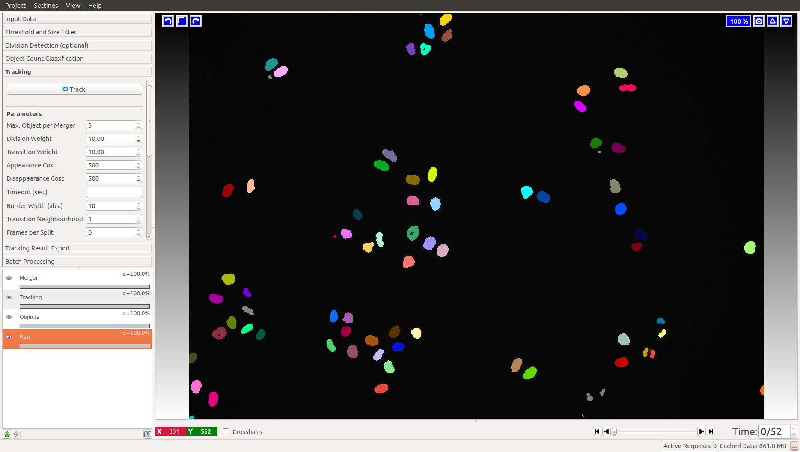</a>

The algorithm internally formulates a graphical
model comprising all potential objects with relations to objects in their spatial neighborhood in the following time step.
To these objects and relations, costs are assigned defined by the given parameters and an optimizer is called to find
the most probable tracking solution for the model constructed, i.e. it tries to minimize the computed costs.

Although the tracking result should usually be already sufficient with the default values, we now briefly give explanations
for the **parameters** our tracking algorithm uses (see [\[1\]](#ref_conservation) for more details). 

| Parameter       | Description
|:---------------| :-------------------------
| Max. Object per Merger | Defines how many objects could be contained in a single cluster. Should correspond to the max label in the Object Count applet.
| Division weight | Cost to allow one object to divide
| Transition weight | Costs to allow one object to be assigned to another
| Appearance cost  | Costs to allow one object to appear, i.e. to start a new track other than at the beginning of the time range or the borders of the field of view. High values (&ge;1000) forbid object appearances if possible.
| Disappearance cost  | Costs to allow one object to disappear, i.e. to terminate an existing track other than at the end of the time range or the borders of the field of view. High values (&ge;1000) forbid object disappearances if possible.
| Timeout in sec.  | Timeout in seconds for the optimization. Leave empty for not specifying a timeout (then, the best solution will be found no matter how long it takes).
| Border width | The border pixels have to be treated in a special way for appearance/disappearance
| Transition neighborhood | How far can an object move
| Frames per split | By default (0) the tracking is done globally over the whole time range. By specifying a non-zero number here, you break your video up into pieces of this length and then solve hierarchically and in parallel. This is much faster than no splitting for long videos
| Solver | Flow-based, as described [here](https://link.springer.com/chapter/10.1007/978-3-319-46478-7_35) or ILP, which requires commercial solvers. Flow-based gives excellent tracking solutions and is much faster than ILP, which we keep for consistency with older projects
| Divisible Objects | Check if the objects may divide over time, e.g. when tracking proliferating cells. Consider using the animal tracking workflow if they don't.

Furthermore, a **Field of View** may be specified for the tracking. Restricting the field of view to less time steps 
or a smaller volume may lead to significant speed-ups of the tracking. Moreover, a **Size** range can be set to filter out objects which are smaller or larger than the number of pixels specified.

In **Data Scales**, the scales of the dimensions may be configured. For instance, if the resolution of the 
pixels is (dx,dy,dz) = (1&mu;m,0.8&mu;m,0.5&mu;m), then the scales to enter are (x,y,z)=(1,1.25,2).

To export the tracking result for further analysis, you can choose between different options described in [this section](#sec_export).
To find the best possible values of the parameters above for your particular tracking problem, read on and use the [tracking with learning](#sec_structured_learning)

## 4.2 Manual Tracking: &#9679;&#9679; {#sec_manual}

The purpose of this workflow is to manually link detected objects in consecutive time steps
to create tracks (trajectories/lineages) for multiple (possibly dividing) objects. All
objects detected in the previous steps are indicated by a yellow color.
While undetected objects may not be recovered to date, the user can correct for the following 
kinds of undersegmentation errors: Merging (objects merge into one detection and later split again), 
and misdetections (false positive detections due to speckles or low contrast).

The use cases include manual annotation of small datasets, creation of ground truth for automated methods and, most importantly,
training of the [**tracking with learning workflow**](#sec_structured_learning).

Note that -- as in every workflow in ilastik -- displaying and updating the data is much faster when
zooming into the region of interest.

#### Tracking by Clicking or by Semi-Automatic Procedure
To **start a new track**, the respective button is pressed and the track ID
with its associated color (blue in the example below) is displayed as **Active Track**. Then,
each object which is (left-) clicked, is marked with this color and assigned to the current track.
Note that the next time step is automatically loaded after adding an object to the track 
and the logging box displays the successful assignment to the active track.
Typically, we start with an arbitrary object in time step 0, but any order is fine.

In theory, one could now proceed as described and click on each and every object in the following
time steps which belongs to this track. However, this might be rather cumbersome for the user, especially
when dealing with a long image sequence. Instead, the user may use a semi-automatic procedure for the
trivial assignments, i.e. assignments where two objects in successive time frames distinctly overlap in space.
This **semi-automatic tracking** procedure can be started by right-clicking on the object of interest:

The semi-automatic tracking will continue assigning objects to the active track until a point is reached
where the assignment is ambiguous. Then, the user has to decide manually which object to add to the
active track, by repeating the manual or semi-automatic assignments described above.
The track is complete when the final time step is reached. 
To start a new track, one navigates back to the first timestep (either by entering `0` in the time
navigation box in the lower right corner of ilastik, or by using `Shift` + `Scroll Up`).
Then, the next track may be recorded by pressing **Start New Track**.

#### Divisions
In case the user is tracking **dividing objects**, e.g. proliferating cells as in this tutorial,
divisions have to be assigned manually (the semi-automatic tracking will typically stop at these points). To do so,
the user clicks the button **Division Event**, and then -- in this order -- clicks on the 
parent object (mother cell) followed by clicks on the two children objects (daughter cells) *in the next
time step* (here: green and red). As a result, a new track is created for each child. The connection between the parent 
track and the two children tracks is displayed in the **Divisions** list, colored by
the parent object's color (here: blue).

<a href="./fig/16_manual-tracking-division4.jpg" data-toggle="lightbox">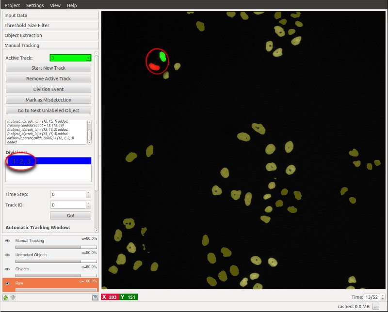</a>

Now, the first sub-lineage may be followed (which possibly divides again, etc.), and when
finished, the user can go back to the division event to follow the second sub-lineage (the respective
track ID must be selected as **Active Track**). To do so, double clicking on the
particular event in the division list navigates to the parent object (mother cell).
It is useful to check its box in order to indicate already processed divisions.
Note that these sub-lineages may again more efficiently be tracked with the *semi-automatic tracking* procedure 
described above.

#### Supported Track Topology

The following track structure is supported:

- **One object per track per time step**: Each track ID may only appear at most once per time step. To track
another object, the user has to start a new track. 
- **Merging objects**: Due to possible occlusions or undersegmentation resulting
from the Pixel Classification workflow (i.e. two or
more objects are detected as only one object), it is possible to assign multiple track IDs to
one object. For instance, two distinct cells in previous time steps are merging into one detection and 
later splitting again. Then -- in the sequence where the two cells are occluding each other -- the detections
are treated as *Mergers* of two tracks, and the tracks are recovered after the occlusion.
It should be noted that the object is marked with a color randomly chosen from the track IDs of the comprised
objects. By right-clicking on the object, the user may check which track IDs it is assigned to.
- **Misdetections**: It may happen that background is falsely detected as foreground objects. 
The user may mark those objects explicitly as false detections with black color
by pressing **Mark as Misdetection** followed by a click
on the object. Internally, these false detections get assigned the track ID `-1` (corresponds to `65535` in the exported dataset, see below.).
- **Appearance/Disappearance of objects**: Due to low contrast or limited field of view, objects may appear
or disappear. If an object does not have an ancestor or successor in the directly adjacent timesteps, an
appearance or disappearance event, respectively, is evoked. 

#### Advanced Features

Further features in the Manual Tracking applet are:

- **Go to next unlabeled object**: Although the objects may be tracked in an arbitrary order, it is sometimes
useful to automatically jump to the next untracked object, particularly if only few objects are left to track.
The user may then either track the suggested object or mark it as misdetection to get another suggestion for an
object to track next.
- **Window size**: These parameters define the size of the window in which the automatic tracker searches for
overlap between objects of consecutive time steps. Note that the tracking is faster for smaller window sizes,
however, longer sub-tracks may be achieved by bigger window sizes. For the example datasets, we choose a window
size of 40 pixels along each dimension.
- **Inappropriate track colors**: If the color of the next active track is inappropriate (e.g. it has low contrast
on the user's screen, it may be mixed up with other colors in the proximity of the object of interest, or it
is some already reserved color), the user may just leave this track empty and start another track.
- **Delete label**: False assignments of track IDs can be deleted by right-clicking on the respective object.
The user then has the option, to (i) delete the respective track label from this single object, (ii) delete
the track label in the current and all later time steps, or (iii) delete the track label in the current
and all earlier time steps:
<a href="./fig/22_manual-tracking-right-click-menu.jpg" data-toggle="lightbox">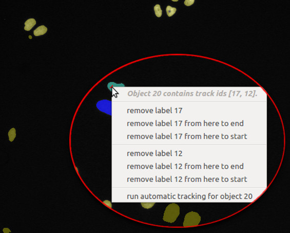</a>

#### Export
To export the manual tracking annotations, follow the instructions [at the end of this tutorial](#sec_export), since 
this procedure is similar to the export of the fully automatic tracking.

#### Shortcuts
To most efficiently use the features described above, there are multiple shortcuts available:

| Shortcut       | Description   
|:--------------:| :-----------------------------
| `Shift + Scroll` | Scroll image through time
| `Ctrl + Scroll`| Zoom
| `s`            | Start new track
| `d`            | Mark division event
| `f`            | Mark false detection
| `q`            | Increment active track ID
| `a`            | Decrement active track ID
| `g`            | Go to next unlabeled object
| `e`            | Toggle manual tracking layer visibility
| `r`            | Toggle objects layer visibility

## 4.3 Structured Learning: &#9679; {#sec_structured_learning}

Automatic tracking uses a set of weights associated with detections, transitions, divisions, appearances, and disappearances to balance the components of the energy function optimized.
Default weights can be used or they can be specified by the user. In structured learning we use the training annotations and all the classifiers to calculate optimal weights 
for the given data and training. In order to be able to compute the weights, you have to show the algorithm what tracks look like - annotate a few short sub-tracks, using (almost) 
the same applet as the [**manual tracking**](#sec_manual). Let's take a look at the applet:

<a href="fig/tracking_with_learning_train.png" data-toggle="lightbox">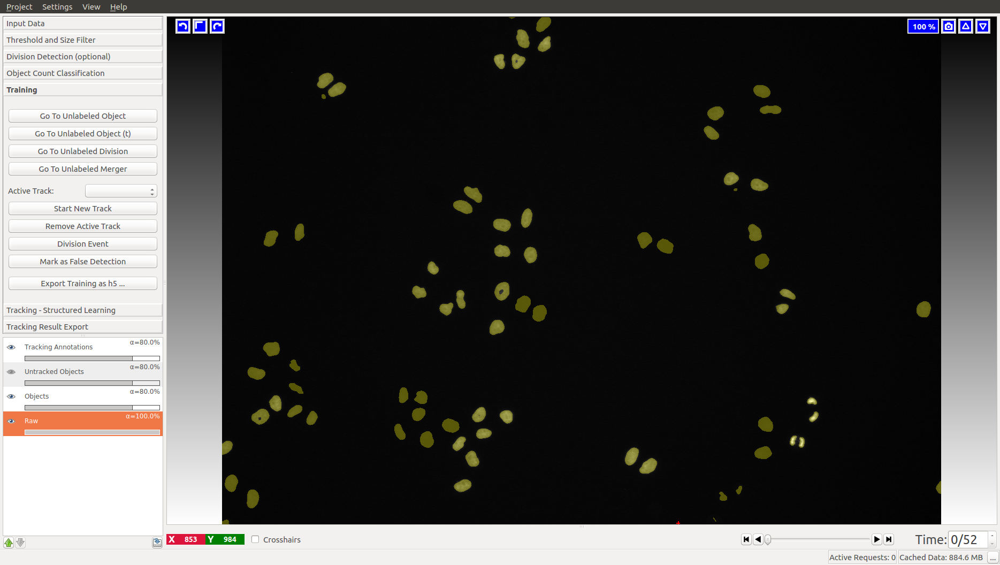</a>

You see the same buttons for starting a new track, marking a division, etc. However, above these buttons we have placed other buttons to help you track: they can take you
to the places in the data you would annotate for best training results. 

Once you are happy with the training, go the next applet and press the "Calculate Tracking Weights" button.
To obtain a tracking solution press "Track!" button.

<a href="fig/tracking_with_learning_track_top.png" data-toggle="lightbox">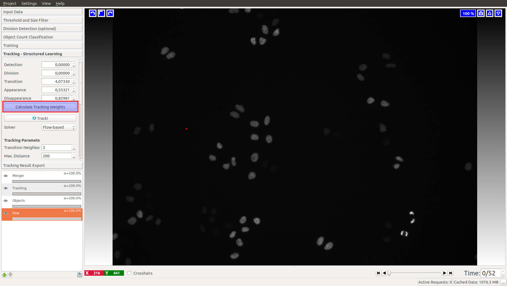</a>

You can also directly input weights obtained from other similar datasets and bypass the learning procedure.

The following two diagrams show the difference of automatic tracking using the default weights and weights obtained by structured learning.
Example areas of change are circled in red.

 

<a href="./fig/slt_compare_automatic_circled.png" data-toggle="lightbox">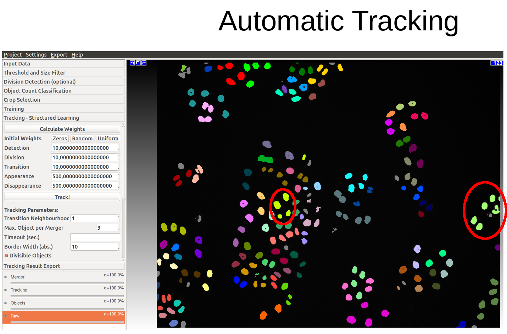</a>

 

<a href="./fig/slt_compare_slt_circled.png" data-toggle="lightbox">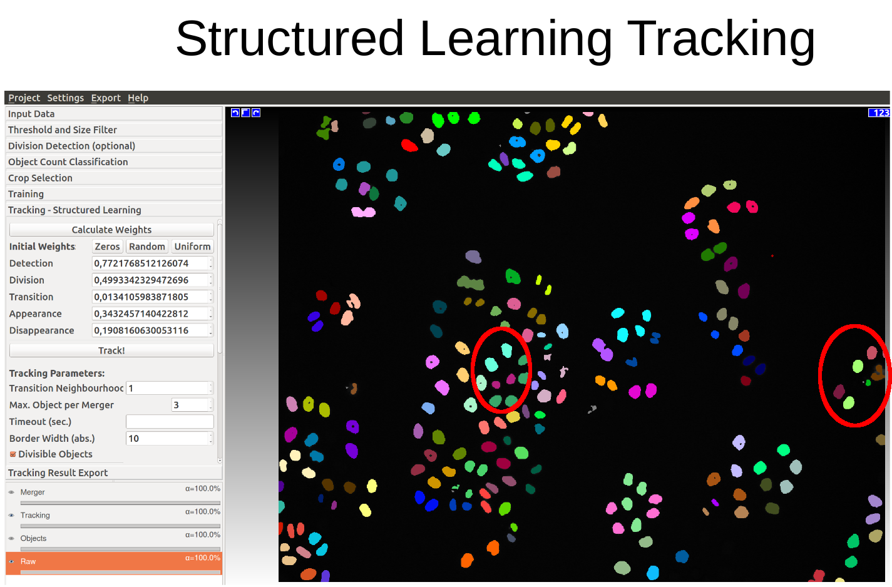</a>

 
To export the tracking result for further analysis, the user can choose between different options described next.

## 5.1 Export - Manual Tracking: &#9679; {#sec_export}

To export the tracking results for manual tracking, the **Tracking Result Export** applet
provides the same functionality as for other ilastik workflows. It exports the color-coded image from the *Tracking applet*
as image/hdf-file/etc. 
Recall that all objects get assigned random IDs (visualized as random colors) at the first frame of the image sequence
and all descendants in the same track (also children objects such as daughter cells) inherit this ID/color.
In other words, each **lineage** has the same label over time starting with unique IDs in the first time step for 
each object.

In addition to the export applet, we provide further 
useful export functionality in the **Manual Tracking** applet. We distinguish between `track_id` which corresponds
to the **Active track** ID chosen earlier, and `object_id` which stands for the identifier each object has in the **Objects** layer.
The `object_ids` can be exported separately by right-clicking on the **Objects** layer control.

* **Export Divisions as csv**: By pressing the **Export Divisions as csv ...** button in the **Manual Tracking** applet,
   the list of dividing cells is exported as a csv file. Its content is in the following format: `timestep_parent,track_id_parent,track_id_child1,track_id_child2`

* **Export Mergers as csv**: As mentioned above, mergers are only assigned one of their comprised track IDs. 
   Thus, it may be useful to separately export the list of mergers with all comprised track IDs to file.
   In the **Manual Tracking** applet, the button **Export Mergers as csv ...** will write out such a csv-file
   where the content has the following format: `timestep,object_id,track_ids`, where the `track_ids` contained in the
   merged object are concatenated using semicolons. 
   Here, the `object_id` corresponds to the unique identifier the object has in the **Objects layer** which can be 
   exported separately by right clicking on the **Objects** layer control.

* **Export as h5**: Another option is to export the manual tracking as a set of hdf5 files, one for 
   each time step, containing pairwise events between consecutive frames (appearance, disappearance, move,
   division, merger). In each of these hdf5 files (except the one for the first time step), detected events
   between object identifiers (stored in the volume `/segmentation/labels`) are stored in the following format:

| Event      | Dataset Name | Object IDs 
|:----------|:------------| :-------------------------
| Move      | `/tracking/Moves` | `from (previous timestep), to (current timestep)`
| Division | `/tracking/Splits` | `ancestor (prev. timestep), descendant (cur. timestep), descendant (cur. timestep)`
| Appearance | `/tracking/Appearances` | `object_id appeared in current timestep`
| Disappearance | `/tracking/Disappearances` | `object_id disappeared in current timestep`
| Merger | `/tracking/Mergers` | `object_id, number_of_contained_objects` 

We would recommend to use the methods described above, but additionally, the results of the manual **and** automatic tracking may also 
be accessed via the ilastik project file:

* **Process the content of the project file**: The ilastik project file (.ilp) may be opened with any hdf5 dataset viewer/reader, 
   e.g. with `hdfview`:

   * *Manual Tracking*: In the Manual Tracking folder, there are the folders `Labels` and `Divisions`. The `Labels`
   folder contains for each time step a list of objects, each of which holds a list of the track IDs which were assigned by the
   user. The `Divisions` dataset contains the list of divisions in the format

           track_id_parent track_id_child1 track_id_child2 time_parent

   * *Automatic Tracking*: In the Conservation Tracking folder, the events are stored as described in the table above.

## 5.2 Export - Tracking: &#9679;&#9679;&#9679; {#sec_Plugin}

All export options can be found in the **Tracking Result Export** applet. The export settings will bring up extra dialogs which allows to transform the image, cutout subregions and select the image file type. To dispatch the actual export, click on "Export All". The Source drop down menu lets the user decide which export functionality he/she wants to use: 

**Object-Identities**: Exports the unique object-IDs of every object as image file.

**Tracking-Results**: Saves the tracking results as images where each object is assigned a gray value corresponding to its lineage ID. It is also possible to transform and select subregions. 

**Merger-Results**: Will export only the detections where the optimization decided that it contains more than one object.

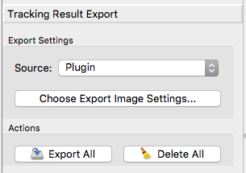

**Plugin**: When choosing Plugin as Source in the Export Settings, it is possible to export it in formats, which can be read by external plugins.
A full list and detailed information about the plugin is available when pressing "Choose Export Image Settings".

* **Contours**: Plugin to export the ilastik tracking results as contours for branson and Zlatics Lab in Janelia HHMI.

* **Contours with head**: Plugin to export the ilastik tracking results as contours with the head location for Branson and Zlatics Lab in Janelia HHMI.

* **CSV Table**: Plugin to export the ilastik tracking results to a CSV (comma seperated value) table. This format is most common for spreadsheets and databases.

* **CellTrackingChallenge**: Format used in the ISBI Cell Tracking Challenge. Images will be saved as tiff and the additionaly information as txt. For more details see 

* **H5-Event Sequence** Plugin to export the ilastik tracking results as H5 event sequence. Detailed description in [Export Manual Tracking](#sec_export).

* **JSON**: JSON export for use of some tracking analysis tools developed by the ilastik tracking guys. 

* **Fiji/Mamut**: Splits the result in XML and hdf5 so it can be used by the MaMut plugin in Fiji/ImageJ.
	The XML file contains the tracking information for every cell, the hdf5 files the image-data used. Both files needs to be in the same folder when opened with MaMut. 

* **Multi Worm Tracker**: Plugin to export the ilastik tracking results in the Multi-Worm Tracker format for Branson and Zlatics Lab in Janelia HHMI.

## Tracking in 3D+time Data &#9679;&#9679;&#9679;&#9679; {#sec_3d}

One strength of the tracking workflows compared to similar programs available on the web is that 
tracking in 3D+time (`txyz`) data is completely analogous to the tracking in 2D+time (`txy`) data
described above. The data may be inspected in a 3D orthoview and, in the case of manual/semi-automatic tracking,
a click on one pixel of the object is 
accepted in any orthoview. Tracked objects are colored in 3D space, i.e. colored in all
orthoviews with the respective track color. 

To get started with 3D+time data, we provide example data in the
[Download]({{site.baseurl}}/download.html)
section. The file 
`drosophila_00-49.h5` shows 50 time steps of a small excerpt of a developing *Drosophila* embryo, kindly
provided by the 
<a href="https://www.embl.de/research/units/cbb/hufnagel/">Hufnagel Group at EMBL Heidelberg</a>.
A sample segmentation of cell nuclei in this dataset is available in `drosophila_00-49_export.h5`.

For both manual and automatic tracking, the steps of the 2D+time tutorial above may be followed analogously.

## References &#9679;&#9679;&#9679;&#9679;

\[1\] M. Schiegg, P. Hanslovsky, B. X. Kausler, L. Hufnagel, F. A. Hamprecht. 
**Conservation Tracking.**
*Proceedings of the IEEE International Conference on Computer Vision (ICCV 2013)*, 2013.
