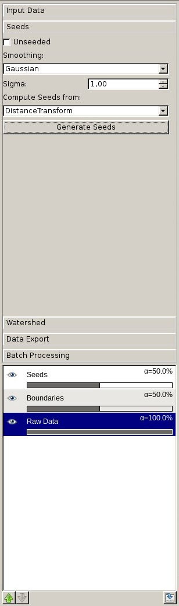
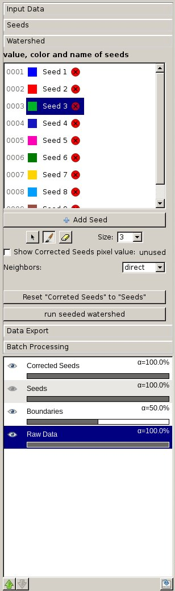
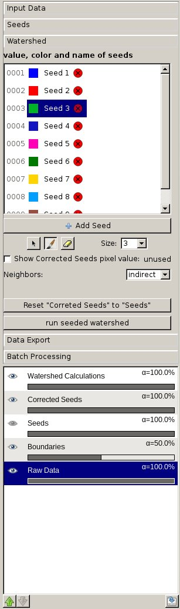

# Watershed

## How it works, what it can and cannot do

"It is important to clarify that
small changes in the seeds can have a huge impact on the outcome of the watershed.
Therefore it is important to have an interactive graphical interface which allows the user
to directly see the new outcome of any changes made on the seeds. The topic of this
thesis is the expansion of this software with a new watershed workflow.
The workflow needs to be able to handle the following use cases where the following data
can be supplied:
1.) Seeds (Nuclei) and/or 2.) Boundaries

• Seeded Watershed:
1. only seeds: pointless to do a seeded watershed with seeds only.
2. boundaries and seeds: use a seeded watershed on boundaries where the seeds
are the seeds. The seeds can be changed, removed or new seeds can be drawn
manually.
3. only boundaries: generate seeds out of the boundaries and label them. Carry
out the use case where the seeds and the boundaries are supplied.

• Unseeded Watershed should still be possible when only using the boundaries.

In ilastik a workflow is made up of several applets that are connected with each other.
The seeds applet contains the functionality of generating seeds and sets the watershed
algorithm to seeded or unseeded. It is possible to manipulate, create or delete seeds
manually in the watershed applet. The watersheds of the boundaries with the given seeds
can be computed and visualized. Any change to the seeds and their impacts on the
watersheds are visible immediately. In the end the resulting data can be exported.
" **cited from [chapter 1. Introduction] Andreas Haller, Master Thesis, "Interactive Watershed Based Segmentation For Biological Images", March 2017, Heidelberg University**

      

## Generate Seeds 
"In the seeds applet the user can view all provided inputs, generate new seeds constructing
them on the given boundaries or decide whether the following watershed should be carried
out unseeded independently of given/generated seeds.

**Usage**

• Unseeded:
if checked, the watershed algorithm will be an unseeded Union Find algorithm

• Smoothing:
a selection of smoothing methods can be chosen

• Sigma:
the smoothing parameter that describes the intensity of smoothing

• Compute Method:
a selection of methods that can be chosen to compute the generated seeds

• Generate Seeds Button:
needs to be clicked to generate seeds and override any provided seeds with generated
ones

Seeds are generated by:
1. smoothing the boundaries with the given smoothing method and the given sigma
2. computing seeds on the basis of the smoothed image with the selected compute
method

" **cited from [chapter 3.2.2 Seeds Applet] Andreas Haller, Master Thesis, "Interactive Watershed Based Segmentation For Biological Images", March 2017, Heidelberg University**

If the image of the supplied seeds is binary, this image is automatically labeled where 0 is background.

## Interactive Watershed Segmentation with manipulation of Seeds 

"In the watershed applet the user can execute a watershed algorithm. This algorithm
depends on the watershed method that is passed on by the seeds applet. Additionally,
the user can manually modify, delete and create new seeds. It is possible to reset any
changes to the supplied seeds. The impact of these changes on the results of the watershed
algorithm can be directly seen.

• Neighbors:
specify the number of pixel that are taken into account
* direct: 2D means 4 neighbors &
	3D means 8 neighbors
* indirect: 2D means 6 neighbors &
	3D means 26 neighbors
	
• Show “Corrected Seeds” pixel value:
shows the pixel value of the “Corrected Seeds” layer where the cursor points to

• Reset “Corrected Seeds” to “Seeds”:
remove all changes on the seeds that are done manually (that are displayed in the
“Corrected Seeds” layer), so that they are identical to the “Seeds” layer, which
displays the originally input seeds

• Drawing/deleting/changing labels:
– drawing:
select a given seed, click on the brush icon and draw into the image
– deleting:
click on the red circle with a cross inside to delete the label from the label list
and its associated pixels from the ”Corrected Seeds“ image
– clearing:
right click on a label and click ”clear Label“ to remove all pixels with this value
from the seeds image. This label isn’t removed from the label list and can be
used later on
– ”Add Seed“ button:
add an additional label (limit: 254 labels)
– rubber:
reset everything under the cursor to 0

• run seeded watershed:
execute the watershed algorithm on the boundaries. If seeded, then use the ”Corrected Seeds“ as seeds

" **cited from [chapter 3.2.3 Watershed Applet] Andreas Haller, Master Thesis, "Interactive Watershed Based Segmentation For Biological Images", March 2017, Heidelberg University**

