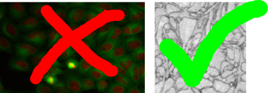
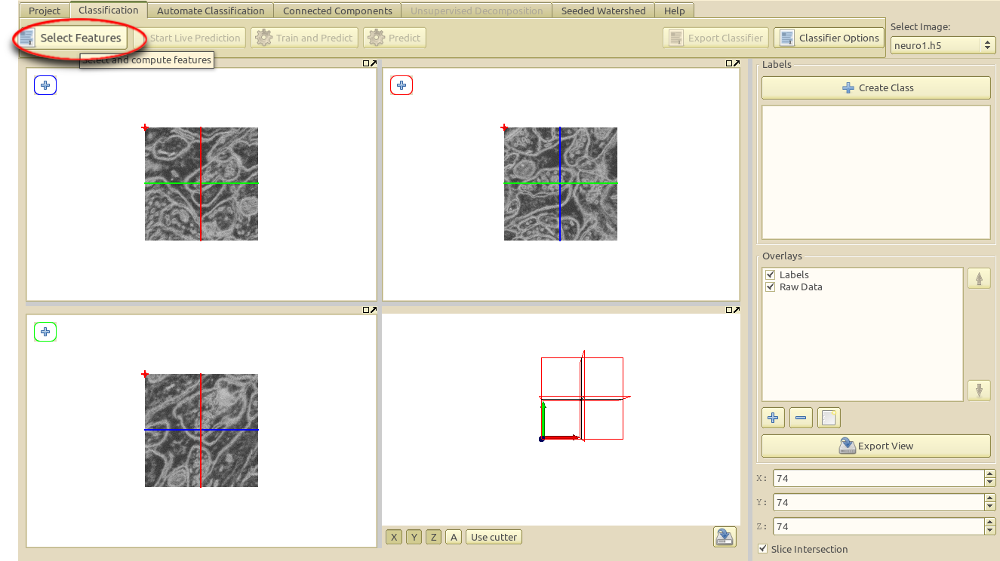
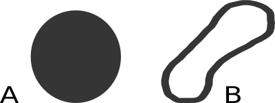
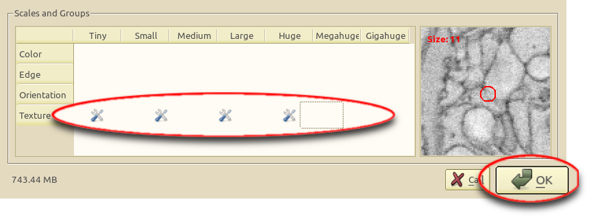
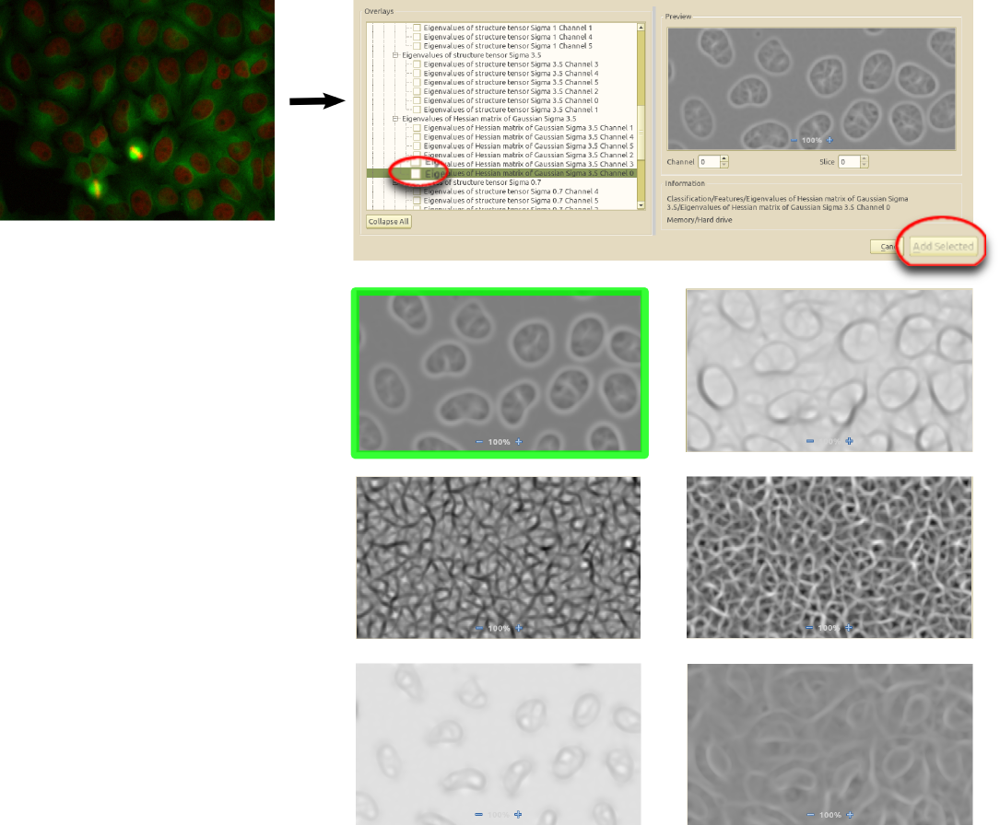
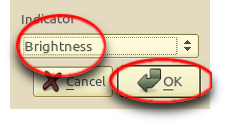
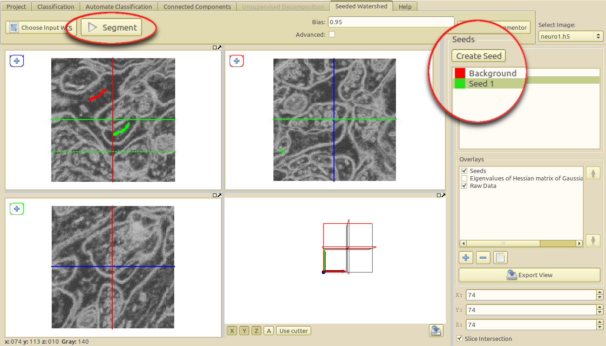
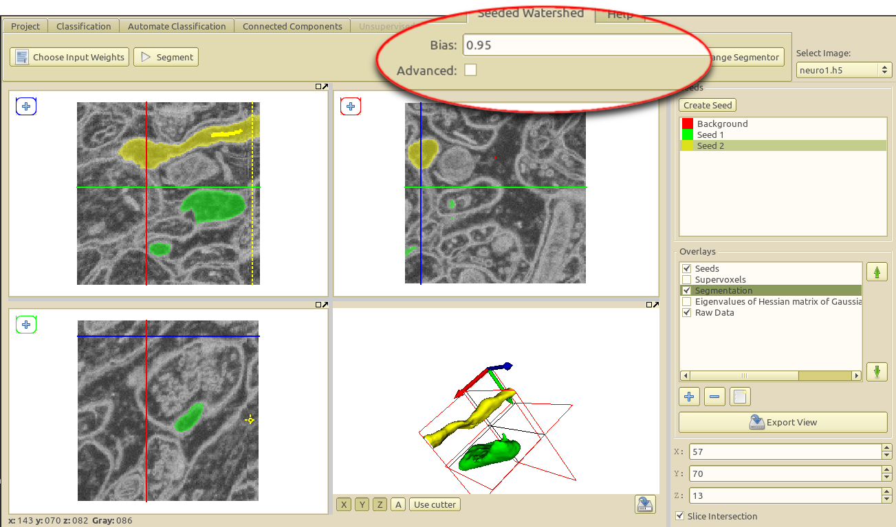

## How it works, what it can and cannot do

The seeded watershed algorithm is an image segmentation algorithm for
interactive object carving from image data. The algorithm input are user given
object markers (see example below) for the inside (green) and outside (red) of
an object.  From these markers an initial segmentation is calculated that can
be refined interactively. The seeded watershed relies on discernible object
boundaries in the image data and not on inner appearance of an object like for
example the classification workflow.
      

While the
<a href="/kategorien/20_Documentation/dateien/ilastik_carving_documentation/">Classification
module</a> is useful for segmenting objects with discernible brightness, color
or textural differences in comparison to their surroundings, the carving
module's purpose is to aid in the extraction of objects from images that are
only separable by their boundary - i.e. objects that do not differ from the
rest of the image by their internal appearance.

      
From the two images displayed to the right, the left image is clearly
more suitable for the classification module since the cell cores have a
strong red color component in comparison to their surrounding. The right
image on the other hand is a good example for the applicability of the
seeded watershed segmentation (the problem setting is the segmentation of
a single cell from electron microscopy image of neural tissue) since the
neural nerveous cells have similar color distributions but can be
separated by the dark cell membranes dividing them. (NOTE: the seeded
watershed **could** also be applied to segment individual cell cores
in the left image interactively, but in such a case where there is a
clear visible difference between the objects of interest and their
surrounding the classification module is a better choice.)

The algorithm is applicable for a wide range of segmentation problems that
fulfill these properties. In the case of data where the boundaries are not
clearly visible or in the case of very noisy data, a boundary detection filter
can be applied to improve results - this is the topic of the following section.

## Constructing a good boundary map: case studies

Assuming the user has already created or loaded an existing
ilastik project, the first step is to switch to the **Classificaton Tab**
where the filter selection and computation are performed.

After clicking on the **Select Features** button, the feature computation dialog will pop up and allow to compute
several different image filters.

### Boundary type

For interactive segmentation purposes the type of filter is an important
choice. Two different types of object boundaries can be found and require a
different type of filter.  For boundaries of type **A** (step-boundaries) the
Eigenvalues of the Structure Tensor contained in the **Texture Filter**
category are especially suited.  For type **B** boundaries (line boundaries)
the Eigenvalues of the Hessian Matrix, also contained in the **Texture**
category provide useful boundary indications.
      
## Scale

Since good line and step boundary filters are both contained in the **Texture
Filter** category, only the right scale for the filter must be chosen. Thus,
for new images it is recommended to compute the features on a wide range of
scales as shown in the screen-shot above and to visually pick the correct scale
later on in the process.
      
To speed up the interactive segmentation process itself, and to allow quick
response to user input a **Supervoxel representation** of the image will be
computed after switching to the **Seeded Watershed Tab** (this happens only
once for each interactive segmentation session).
      

The **Input weights** can be chosen from the features that have been computed
in the classification tab.  Depending on the feature category that was computed
different choices are available. When calculating features from the texture
category as recommended the following two choices are available

- Eigenvalues of Structure Tensor (Boundary type A)
- Eigenvalues of Hessian Matrix (Boundary type B)

The above choices are available for all the scales that were selected during
the feature computation, depending on the dimension of the image (2D/3D) and
depending on the number of image channels (gray value image: 1 channel, RGB
image: channels) a different number of eigenvalues is computed.

The naming convention in the input weight selection widget follows the convention

    [Feature Name][Sigma][Feature Channel]</tt>, for example <tt>Eigenvalues of Hessian Matrix Sigma 0.7 Channel 1

(please resize the window if the sigma or channel part of the name is not
immediately visible).

      
For segmentation with the seeded watershed in general the **Channel 0** of the
**Eigenvalues of the Hessian Matrix** provides a good starting point.

Above: example of the influence of the scale (tiny, small, normal, large, huge,
..) on the calculated boundary weights for the Eigenvalues of the Hessian
matrix. In the example several images of the **Eigenvalues of the Hessian
Matrix** are shown at different scales as they are shown in the input weight
selection dialog. It is easily visible that the Sigma 0.3 and Sigma 0.7 weights
are too noisy in this example and the Sigma 3.5 weights miss important details
of the boundaries. In this case the correct choice as input for the interactive
segmentation would be the Eigenvalues of the Hessian Matrix at Sigma 1.7 (Large
- highlighted in green).
      

Above: example of the influence of the selected channel of the Hessian
Eigenvalue. Since the input image is a 2D RGB (3-channel) image 6 different
Eigenvalues of the Hessian Matrix are computed (2 Eigenvalues for each color
channel = 6). To find suitable edge weight inputs it is often best to visually
look at the computed eigenvalues and select the channel and scale that best
represents the desired boundaries. From visual inspection it is relatively
obvious that a segmentation of the cell cores is best carried out with the
channel 0 Eigenvalue of the Hessian Matrix (highlighted in green, it
corresponds to the first Eigenvalue of the red color channel).

From the above two example we conclude: selecting good input weights for the
seeded watershed is simple and straightforward: **<u>the feature that visually
corresponds best with the desired object boundaries is in general also the
right choice as Input Weight</u>**.
      
When selecting and adding the input weights
it is important to remember whether the desired objects boundaries are visible either as bright or as dark lines (in the above example the edges are visible as bright lines) - this depends on
the type of input image and on the chosen filter and will be important in the next step.

After selecting the input weight the gray value of the selected edge map must
be configured. Depending on whether the edges in the edge map are visible as
dark or bright lines, the indicator should be set accordingly.
      
**Note:** The supervoxel computation may take a long time depending on the the
size of the dataset. On a i7 2.4GHz computer a 500*500*500 3D dataset requires
15 minutes of preprocessing.

## Interactive Segmentation

After the necessary preprocessing (keep an eye on the shell output for progress
indication) the interactive segmentation of objects is the next step.

Two different types of seeds exist, **Foreground seeds** and **Background
seeds** - per default the background seed receives a higher priority such that
the background seed is preferred in the case of ambiguous boundaries.

New foreground seeds for additional objects can be added by clicking on
**Create Seed**.

After marking the objects of interest with a foreground seed and the outside
with a background seed the button **Segment** can be clicked to obtain a seeded
watershed segmentation starting from the seeds.

The seeds can be refined by drawing or erasing (`Shift` + drawing) additional markers, the currently active seed type can be selected 
on the right side by clicking on the corresponding item.

Additional available interactions include:

- **Updating the segmentation:** Left click on button **Segment**
- **Erasing a brush stroke:** <tt>Shift</tt> + drawing
- **Creating a new seed type:** Left click on button **Create Seed** on the right-hand side
- **Changing the active seed type:** Left Mouseclick on seed in the right-hand side seed list.
- **Changing the color of a seed type:** Right Mouseclick on the corresponding seed in the seed list and select **Change Color**.
- **Erasing a seed type including all its markers:** Right click on the corresponding seed in the right-hand seed list and select **Remove**.
- **Exporting the current segmentation:** Right click on the **Segmentation Overlay** in the overlay widget and select **Export**.
- **3D display of current segmentation:** Right click on the **Segmentation Overlay** in the overlay widget and select **Display 3D**.
      
To learn more about how to navigate the data (**scroll, change slice,
enable/disable overlays, change overlay capacity etc. **) please read the <a
href="/kategorien/20_Documentation/dateien/ilastik_carving_documentation/">Navigation
guide for ilastik 0.5</a>

## Advanced Options

The seeded watershed algrorithm of the module has some advanced options which
can be changed to obtain improved segmentations when the default settings are
not sufficient.

These additional options described below can be displayed and changed by
checking the **advanced** checkbox in the upper right region of the tool-bar.

- **Bias** The bias is a parameter the affects how much the background is
  preferred in comparison to the other labels. A value smaller then 1.0 will
  lower the detected boundaries for the background seeds. Since the normal
  seeds still work on the original boundaries the background is preferred in
  case of ambigouity. Usually a value of around 0.95 yields good results, but
  sometimes playing with the parameter is a good way to improve segmentations
  without additional seeds.
- **Bias threshold** The threshold is a value that affects when the **Bias**
  for the background will be applied. Normally the background seed is only
  preferred when the boundaries are sufficiently strong, i.e. > 64 (the
  boundaries in the image have values between 0 and 255). Usually it is not
  neccessary to change this parameter.
- **Biased label** This settings affects which seed type is preferred with the
  above settings vs. the other seed types. The default value is 1, which is the
  background seed. Any other seed number can be entered (the seed types are
  numbered from top to bottom in the seed list on the right). Usually it is not
  necessary to change this value.
      

